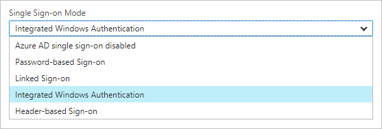

# How does Azure AD Application Proxy provide single sign-on?

Single sign-on is a key element of Azure AD Application Proxy.  It provides the best user experience because your users only have to sign in to Azure Active Directory in the cloud. Once they authenticate to Azure Active Directory, the Application Proxy connector handles the authentication to the on-premises application. The backend application can't tell the difference between a remote user signing in through Application Proxy and a regular use on a domain-joined device. 

To use Azure Active Directory for single sign-on to your applications, you need to select **Azure Active Directory** as the pre-authentication method. If you select **Passthrough** then your users don't authenticate to Azure Active Directory at all, but are directed straight to the application. You can configure this setting when you first publish an application, or navigate to your application in the Azure portal and edit the Application Proxy settings. 

To see your single sign-on options, follow these steps:

1. Sign in to the [Azure portal](https://portal.azure.com).
2. Navigate to **Azure Active Directory** > **Enterprise applications** > **All applications**.
3. Select the app whose single sign-on options you want to manage.
4. Select **Single sign-on**.

   

The dropdown menu shows five options for single sign-on to your application:

* Azure AD single sign-on disabled
* Password-based sign-on
* Linked sign-on
* Integrated Windows Authentication
* Header-based sign-on

## Azure AD single sign-on disabled

If you don't want to use Azure Active Directory integration for single sign-on to your application, choose **Azure AD single sign-on disabled**. With this option selected, your users may authenticate twice. First, they authenticate to Azure Active Directory and then sign in to the application itself. 

This option is a good choice if your on-premises application doesn't require users to authenticate, but you want to add Azure Active Directory as a layer of security for remote access. 

## Password-based sign-on

If you want to use Azure Active Directory as a password vault for your on-premises applications, choose **Password-based sign-on**. This option is a good choice if your application authenticates with a username/password combo instead of access tokens or headers. With password-based sign-on, your users need to sign in to the application the first time they access it. After that, Azure Active Directory supplies the username and password on behalf of the user. 

For information about setting up password-based sign-on, see [Password vaulting for single sign-on with Application Proxy](application-proxy-sso-azure-portal.md).

## Linked sign-on

If you already have a single sign-on solution set up for your on-premises identities, choose **Linked sign-on**. This option enables Azure Active Directory to leverage existing SSO solutions, but still gives your users remote access to the application. 

For information about linked sign-on (formally known as existing single sign-on), see [What is application access and single sign-on with Azure Active Directory?](active-directory-appssoaccess-whatis.md#how-does-single-sign-on-with-azure-active-directory-work).

## Integrated Windows Authentication

If your on-premises applications use Integrated Windows Authentication(IWA) or if you want to use Kerberos Constrained Delegation (KCD) for single sign-on, choose **Integrated Windows Authentication**. With this option, your users only need to authenticate to Azure Active Directory, and then the Application Proxy connector impersonates the user to get a Kerberos token and sign in to the application. 

For information about setting up Integrated Windows Authentication, see [Kerberos Constrained Delegation for single sign-on with Application Proxy](active-directory-application-proxy-sso-using-kcd.md).

## Header-based sign-on 

If your applications use headers for authentication, choose **Header-based sign-on**. With this option, your users only need to authentication the Azure Active Directory. Microsoft partners with a third-party authentication service called PingAccess, which translated the Azure Active Directory access token into a header format for the application. 

For information about setting up header-based authentication, see [Header-based authentication for single sign-on with Application Proxy](application-proxy-ping-access.md).

## Next steps

- [Password vaulting for single sign-on with Application Proxy](application-proxy-sso-azure-portal.md)
- [Kerberos Constrained Delegation for single sign-on with Application Proxy](active-directory-application-proxy-sso-using-kcd.md)
- [Header-based authentication for single sign-on with Application Proxy](application-proxy-ping-access.md) 
