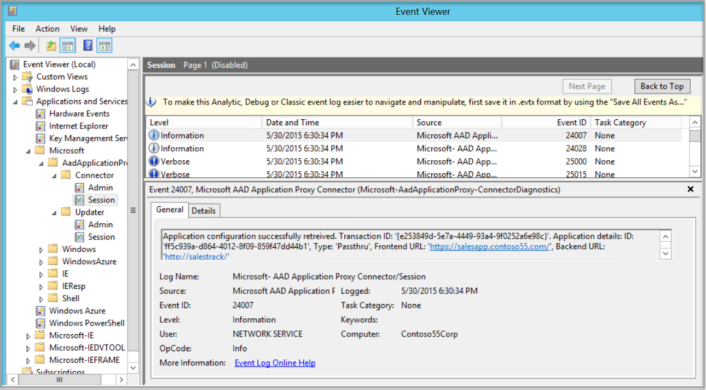

# Understand Azure AD Application Proxy connectors

This article discusses connectors, which are the secret sauce of Azure AD Application Proxy. They are simple, easy to deploy and maintain, and super powerful.

> [!NOTE]
> Application Proxy is a feature that is available only if you upgraded to the Premium or Basic edition of Azure Active Directory. For more information, see [Azure Active Directory editions](active-directory-editions.md).
> 
> 

## What are Azure AD Application Proxy connectors?
Application Proxy works after you install the Windows Server service, called a connector, on your network. You can install connectors based on your high availability and scalability needs. Start with one and add more as needed. Each time a connector is installed, it is added to the pool of connectors that serves your tenant.

We recommend that you do not to install the connectors on the application servers themselves; though it is possible, especially for small deployments.

There’s no need to delete connectors that you’re no longer using. When a connector is running, it remains active as it connects to the service. Connectors not being used are tagged as _inactive_ and will be removed after 10 days of inactivity. 

For information about resolving Azure AD connectivity problems, see [How to troubleshoot Azure AD Application Proxy connectivity problems](https://blogs.technet.microsoft.com/applicationproxyblog/2015/03/24/how-to-troubleshoot-azure-ad-application-proxy-connectivity-problems). 

## What are the cloud rules for connectors?
The connectors and the service take care of all the high availability tasks. They can be added or removed dynamically. Each time a new request arrives it will be routed to one of the connectors that is currently available. If a connector is temporary not available, it will therefore not respond to this traffic.

The connectors are stateless and have no configuration data on the machine, other than the connectivity to the service settings and the certificate that authenticate this connector. When they connect to the service, they pull all the required configuration data and refresh it every couple of minutes.
They also poll the server to find if there is a newer version of the connector. If one is found, the connectors update themselves.

You can monitor your connectors from the machine they are running on, using either the event log and performance counters or from the cloud using the Connector Status page, as shown below.

 

## All networking is outbound
Connectors only send outbound requests, so the connection is always initiated by the connector(s). There is no need to open inbound ports, because once a session has been established, the traffic will flow both ways.

The outbound traffic is sent to the Application Proxy service and to the published applications. The traffic to the service is sent to Azure datacenters to several different ports numbers. For more information, see [
Enable Application Proxy in the Azure portal](active-directory-application-proxy-enable.md) for more details.

As a result of having only outbound traffic, there is no need to setup load balancing between the connectors or configure inbound access through your firewalls.

For information about configuring outbound firewall rules, see [Work with existing on-premise Proxy servers](application-proxy-working-with-proxy-servers.md).

## Network security

Connectors can be installed anywhere on the network that allows them to send requests to both the service and the backend applications. They will work fine if you install them inside the corpnet, within a DMZ (demilitarized zone) or even on virtual machine that is running in the cloud that has access to apps.

DMZ deployments are usually more complicated. But, one of the reasons to deploy connectors in the DMZ is to use other infrastructure that is available to components running there e.g. backend application load balancers and/or security controls like intrusion detection systems.

## Domain joining

Connectors can run on a machine that is not domain joined. However, a domain-joined machine is required if you choose to use single sign-on (SSO) for applications that use Integrated Windows Authentication (IWA). 

In this case, the connector machines must be joined to a domain that can perform [Kerberos](https://web.mit.edu/kerberos) Constrained Delegation on behalf of the relevant users for the published applications.

Connectors can also be joined to domains or forests that have a partial trust or to read-only domain controllers (RODC).

## Connectors on hardened environments

In most cases, connector deployment is very straight forward and requires no special configuration. But, there are several unique conditions that should be taken into consideration:

* Organizations that limits the outbound traffic must follow the instructions here to open the required ports.
* FIPS compliant machines might be required to change their configuration to allow the connector service, the connector updater service and its installer to generate and store a certificate on that machine.
* Organizations that lock down their environment based on the processes that issue the networking requests have to make sure that both the connector services are enabled to access all required ports and IPs.
* In some cases, outbound forward proxies may break the two way certificate authentication and cause the communication to fail.

## All connectors are created almost equal

All connectors are assumed to be identical to each other and every incoming request may arrive to each one of the connectors. This means that all of them should have the same network connectivity and [Kerberos](https://web.mit.edu/kerberos) settings.

All connector-to-service communication is protected by a client certificate that is issued and then installed on the connector machine. For information about renewing connector certificates, see [Enable Application Proxy in the Azure portal](active-directory-application-proxy-enable.md).

## Connector authentication

In order to provide a secure service, connectors have to authenticate toward the service, and the service has to authenticate toward the connector. This is done using client and server certificates when the connectors initiate the connection. This way the administrator’s username and password are not stored on the connector machine.

The certificates used are specific to the Application Proxy service. They get created during the initial registration and automatically renewed by the connectors every couple of months. 

If a connector is not connected to the service for a period of several months, it may have outdated certificates. In this case registration is required, so you have to uninstall and reinstall the connector to trigger registration. You can run the following PowerShell commands:

```
* Import-module AppProxyPSModule
* Register-AppProxyConnector
```

## Performance and scalability

Even though scale for the online service is transparent, scale is a factor when it comes to connectors. You need to have enough connectors to handle peak traffic. Since the connectors are stateless, they are not dependent on the number of users or sessions. Instead they are dependent on the number of requests and their payload size. For the standard Web traffic, we have seen an average machine handle a couple thousand requests per second. This depends on the exact machine characteristics.

The connector performance is bound by CPU and networking. CPU performance is needed for the SSL encryption and decryption, while networking is important to get fast connectivity to the applications and to the online service in Azure. In contrast, memory is less of an issue for connectors.

For the connector service, we make an effort to offload the connectors as much as we can. The online service takes care of much of the processing and on all unauthenticated traffic. Everything that can be done in the cloud is done in the cloud.

Another factor on performance is the quality of the networking between the connectors, including:

* _The online service:_ If the connection is slow or has high latency. it will influence the service level. It is best if your organization is connected to Azure via Express Route. Otherwise, make sure that the networking team ensures that connections to Azure are handled in an efficient way.

* _The backend applications:_ In some cases, there are additional proxies between the connector and the back-end applications. It is easy to troubleshoot this by opening a browser from the connector machine and accessing these applications. If you run the connectors in Azure, and the applications are on-prem, the experience might not be as your users expect.
* _The domain controllers:_ If the connectors are performing SSO using Kerberos Constrained Delegation (KCD), they contact the domain controllers before they send the request to the backend. The connectors have a cache of Kerberos tickets but in a busy environments, the responsiveness of the domain controllers can slow the experience. This is more common for connectors that run in Azure while the domain controllers are on-prem.

##Automatic updates to the Connector

With the Connector Updater service, we offer an automated way to keep up-to-date. This way you have the continued advantage of all new features, and security and performance enhancements.

Azure AD supports automatic updates for all connectors that you deploy. As long as the Application Proxy Connector Updater service is running, your connectors will update automatically with no downtime and no manual steps required. If you don’t see the Connector Updater service on your server, you need to reinstall your connector in order to get any updates. If you want to learn more about installing connectors, see the [setup documentation](https://azure.microsoft.com/en-us/documentation/articles/active-directory-application-proxy-enable.md).

### Updater impact

_Tenants with One Connector:_ If you have only one connector, that connector will be updated as part of the latest group. Because there is no other connector to reroute traffic through, the service will be unavailable during the update. To avoid this downtime and more easily ensure high availability, we recommend you install a second connector and create a connector group. For details on how to do this, see the [documentation on connector groups](https://azure.microsoft.com/en-us/documentation/articlesactive-directory-application-proxy-connectors.md).

_Other Tenants:_ During the connector update, traffic is rerouted to your other connectors for minimal disruption. However, any transactions in progress when the update starts may be dropped. Your browser should automatically retry the operation, making this potential drop transparent to you. Otherwise you may need to refresh your page to work around this.

We know it can be painful to have even one minute of downtime, but these updates allow us to give you an even better connector with numerous improvements, which we think are worth it.

If you’d like more details about the changes in our recent Connector update, see the [latest update](https://azure.microsoft.com/en-us/updates/app-proxy-connector-12sept2016). We revise that page along with each update.

## Under the hood

We provide lots of useful tools for you in Azure. Connectors, especially, have lots of useful functionality. Because connectors are based on Windows Server Web Application Proxy, they have most of the same management tools; including the rich set of Windows Event Logs and Windows Performance counters, as shown below in the Event Viewer:

 

And the Performance Monitor:

 

The connectors have both admin and session logs. The admin logs include key events and their errors. The session logs include all the transactions and their processing details. 

In order to see them, you have to enable “show analytic and debug logs” on the Event Viewer “view” menu. Then, you have to enable them to start collecting events. These logs do not appear in Web Application Proxy in Windows Server 2012 R2, as the connectors are based on a more recent version.

 

You can examine the state of the service in the Services window. The connector is comprised of two Windows Services; one is the actual connector, and another is one that takes care of the update. Both of them are required to run all the time.

 

For information about resolving errors  the Application Proxy Connector, see [Troubleshoot Application Proxy](https://azure.microsoft.com/en-us/documentation/articles/active-directory-application-proxy-troubleshoot).

##Next steps
[Work with existing on-premises proxy servers](application-proxy-working-with-proxy-servers.md)<br>
[How to silently install the Azure AD Application Proxy Connector ](active-directory-application-proxy-silent-installation.md)

