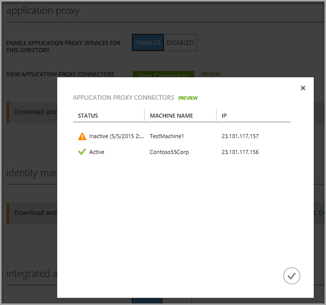

# Understand Azure AD Application Proxy connectors

Connectors are what make Azure AD Application Proxy possible. They are simple, easy to deploy and maintain, and super powerful. This article discusses what connectors are, how they work, and some best practices to get the most out of your deployment. 

## Connector deployment

Application Proxy works after you install the Windows Server service, called a connector, on your network. You can install multiple connectors based on your high availability and scalability needs. Start with one and add more as needed. Each time a connector is installed, it is added to the pool of connectors that serves your tenant.

We recommend that you do not install the connectors on the same servers that host your applications. However, you must be able to access the application from the server where you install the connector.


## Connector maintenance
The connectors and the service take care of all the high availability tasks. They can be added or removed dynamically. Each time a new request arrives it is routed to one of the connectors that is currently available. If a connector is temporary not available, it will not respond to this traffic.

The connectors are stateless and have no configuration data on the machine, other than the connectivity to the service settings and the certificate that authenticates this connector. When they connect to the service, they pull all the required configuration data and refresh it every couple of minutes.
They also poll the server to find if there is a newer version of the connector. If one is found, the connectors update themselves.

You can monitor your connectors from the machine they are running on, using either the event log and performance counters, or from the Application Proxy page of the Azure portal.

 

You don't have to manually delete connectors that are unused. When a connector is running, it remains active as it connects to the service. Connectors not being used are tagged as _inactive_ and will be removed after 10 days of inactivity. 

## Automatic updates to the Connector

With the Connector Updater service, we offer an automated way to keep up-to-date. This way you have the continued advantage of all new features, and security and performance enhancements.

Azure AD supports automatic updates for all connectors that you deploy. As long as the Application Proxy Connector Updater service is running, your connectors update automatically. If you don’t see the Connector Updater service on your server, you need to [reinstall your connector](active-directory-application-proxy-enable.md) to get any updates.

You may experience downtime when your connector updates if:

- You only have one connector. To avoid this downtime and improve high availability, we recommend you install a second connector and [create a connector group](active-directory-application-proxy-connectors-azure-portal.md).

- A connector was in the middle of a transaction when the update began. Your browser should automatically retry the operation, or you can refresh your page. When the request is resent, the traffic is routed to a backup connector.

## All networking is outbound
Connectors only send outbound requests, so the connection is always initiated by the connector. There is no need to open inbound ports, because the traffic flows both ways once a session has been established.

The outbound traffic is sent to the Application Proxy service and to the published applications. The traffic to the service is sent to Azure datacenters to several different ports numbers. For more information about which ports are used, see [Enable Application Proxy in the Azure portal](active-directory-application-proxy-enable.md).

As a result of having only outbound traffic, there is no need to set up load balancing between the connectors or configure inbound access through your firewalls.

For information about configuring outbound firewall rules, see [Work with existing on-premise Proxy servers](application-proxy-working-with-proxy-servers.md).

Use the [Azure AD Application Proxy Connector Ports Test Tool](https://aadap-portcheck.connectorporttest.msappproxy.net/) to verify that your connector can reach the Application Proxy service. At a minimum, make sure that the Central US region and the region closest to you have all green checkmarks. Beyond that, more green checkmarks means greater resiliency. 

## Network security

Connectors can be installed anywhere on the network that allows them to send requests to both the Application Proxy service and the backend applications. They work fine if you install them inside the corpnet, within a demilitarized zone (DMZ), or even on a virtual machine that runs in the cloud. What's important is that the computer running the connector also has access to your apps.

DMZ deployments are more complicated. One reason you may want to deploy connectors in a DMZ, though, is to use other infrastructure like backend application load balancers or intrusion detection systems.

## Domain joining

Connectors can run on a machine that is not domain-joined. However, if you want single sign-on (SSO) to applications that use Integrated Windows Authentication (IWA), you need a domain-joined machine. In this case, the connector machines must be joined to a domain that can perform [Kerberos](https://web.mit.edu/kerberos) Constrained Delegation on behalf of the relevant users for the published applications.

Connectors can also be joined to domains or forests that have a partial trust, or to read-only domain controllers.

## Connectors on hardened environments

Usually, connector deployment is straightforward and requires no special configuration. However, there are some unique conditions that should be considered:

* Organizations that limit the outbound traffic must [open required ports](active-directory-application-proxy-enable.md#open-your-ports).
* FIPS-compliant machines might be required to change their configuration to allow the connector service, the connector updater service, and its installer to generate and store a certificate.
* Organizations that lock down their environment based on the processes that issue the networking requests have to make sure that both connector services are enabled to access all required ports and IPs.
* In some cases, outbound forward proxies may break the two-way certificate authentication and cause the communication to fail.

## Connector authentication

To provide a secure service, connectors have to authenticate toward the service, and the service has to authenticate toward the connector. This is done using client and server certificates when the connectors initiate the connection. This way the administrator’s username and password are not stored on the connector machine.

The certificates used are specific to the Application Proxy service. They get created during the initial registration and are automatically renewed by the connectors every couple of months. 

If a connector is not connected to the service for several months, its certificates may be outdated. In this case, uninstall and reinstall the connector to trigger registration. You can run the following PowerShell commands:

```
Import-module AppProxyPSModule
Register-AppProxyConnector
```

## Performance and scalability

Even though scale for the online service is transparent, scale is a factor for the connectors. You need to have enough connectors to handle peak traffic. Since the connectors are stateless, they are not affected by the number of users or sessions. Instead they respond to the number of requests and their payload size. With standard web traffic, an average machine can handle a couple thousand requests per second. The specific capacity depends on the exact machine characteristics.

The connector performance is bound by CPU and networking. CPU performance is needed for the SSL encryption and decryption, while networking is important to get fast connectivity to the applications and to the online service in Azure. 

In contrast, memory is less of an issue for connectors. The online service takes care of much of the processing and on all unauthenticated traffic. Everything that can be done in the cloud is done in the cloud.

Another factor that affects performance is the quality of the networking between the connectors, including:

* **The online service:** Slow or high-latency connections influence the connector service. It is best if your organization is connected to Azure via Express Route. Otherwise, have your networking team ensure that connections to Azure are handled in an efficient way.  
* **The backend applications:** In some cases, there are additional proxies between the connector and the backend applications. Troubleshoot this scenario by opening a browser from the connector machine and accessing these applications. If you run the connectors in Azure, and the applications are on-premises, the experience might not be as your users expect.
* **The domain controllers:** If the connectors are performing SSO using Kerberos Constrained Delegation (KCD), they contact the domain controllers before they send the request to the backend. The connectors have a cache of Kerberos tickets, but in a busy environment the responsiveness of the domain controllers can affect the experience. This issue is more common for connectors that run in Azure while the domain controllers are on-premises.

## Under the hood

Connectors are based on Windows Server Web Application Proxy, so they have most of the same management tools including Windows Event Logs

 

and Windows performance counters. 

 

The connectors have both admin and session logs. The admin logs include key events and their errors. The session logs include all the transactions and their processing details. 

To see the logs, go to the Event Viewer, open the **View** menu, and enable **Show analytic and debug logs**. Then, enable them to start collecting events. These logs do not appear in Web Application Proxy in Windows Server 2012 R2, as the connectors are based on a more recent version.

You can examine the state of the service in the Services window. The connector comprises two Windows Services: the actual connector, and the updater. Both of them are required to run all the time.

 

## Next steps
[Troubleshoot Application Proxy and connector errors](active-directory-application-proxy-troubleshoot.md)

[Work with existing on-premises proxy servers](application-proxy-working-with-proxy-servers.md)

[How to silently install the Azure AD Application Proxy Connector](active-directory-application-proxy-silent-installation.md)

