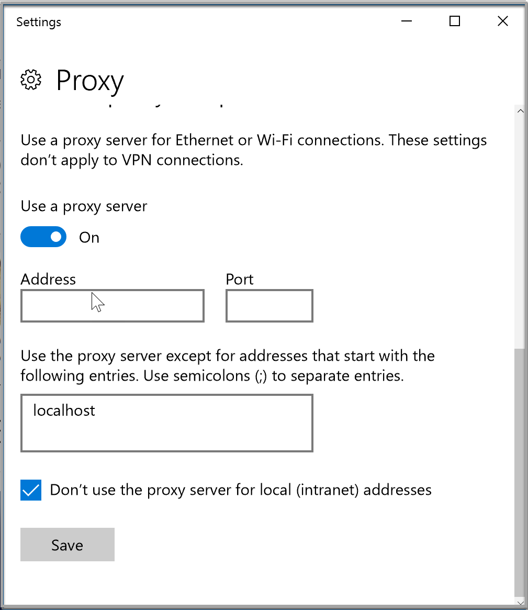
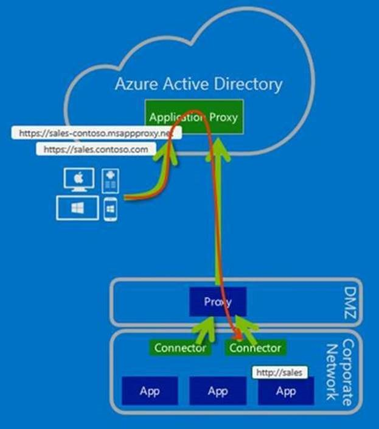
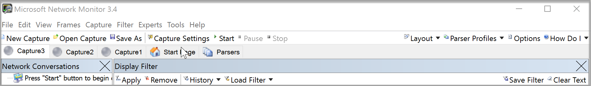

# Work with existing on-premises proxy servers

This article explains how to configure Azure Active Directory (Azure AD) Application Proxy connectors to work with outbound proxy servers. It is intended for customers with network environments that have existing proxies.

We start by looking at these main deployment scenarios:
* Configure connectors to bypass your on-premises outbound proxies.
* Configure connectors to use an outbound proxy to access Azure AD Application Proxy.

For more information about how connectors work, see [Understand Azure AD Application Proxy connectors](application-proxy-understand-connectors.md).

## Configure the outbound proxy

If you have an outbound proxy in your environment, use an account with appropriate permissions to configure the outbound proxy. Because the installer runs in the context of the user who's doing the installation, you can check the configuration by using Microsoft Edge or another Internet browser.

To configure the proxy settings in Microsoft Edge:

1. Go to **Settings** > **View Advanced Settings** > **Open Proxy Settings** > **Manual Proxy Setup**.
2. Set **Use a proxy server** to **On**, select the **Don’t use the proxy server for local (intranet) addresses** check box, and then change the address and port to reflect your local proxy server.
3. Fill in the necessary proxy settings.

   

## Bypass outbound proxies

Connectors have underlying OS components that make outbound requests. These components automatically attempt to locate a proxy server on the network. They use Web Proxy Auto-Discovery (WPAD), if it's enabled in the environment.

The OS components attempt to locate a proxy server by carrying out a DNS lookup for wpad.domainsuffix. If this resolves in DNS, an HTTP request is then made to the IP address for wpad.dat. This request becomes the proxy configuration script in your environment. The connector uses this script to select an outbound proxy server. However, connector traffic might still not go through, because of additional configuration settings needed on the proxy.

You can configure the connector to bypass your on-premises proxy to ensure that it uses direct connectivity to the Azure services. We recommend this approach (if your network policy allows for it), because it means that you have one less configuration to maintain.

To disable outbound proxy usage for the connector, edit the C:\Program Files\Microsoft AAD App Proxy Connector\ApplicationProxyConnectorService.exe.config file and add the *system.net* section shown in this code sample:

```xml
<?xml version="1.0" encoding="utf-8" ?>
<configuration>
  <system.net>
    <defaultProxy enabled="false"></defaultProxy>
  </system.net>
  <runtime>
    <gcServer enabled="true"/>
  </runtime>
  <appSettings>
    <add key="TraceFilename" value="AadAppProxyConnector.log" />
  </appSettings>
</configuration>
```
To ensure that the Connector Updater service also bypasses the proxy, make a similar change to the ApplicationProxyConnectorUpdaterService.exe.config file located at C:\Program Files\Microsoft AAD App Proxy Connector Updater.

Be sure to make copies of the original files, in case you need to revert to the default .config files.

## Use the outbound proxy server

Some environments require all outbound traffic to go through an outbound proxy, without exception. As a result, bypassing the proxy is not an option.

You can configure the connector traffic to go through the outbound proxy, as shown in the following diagram.

 

As a result of having only outbound traffic, there's no need to configure inbound access through your firewalls.

### Step 1: Configure the connector and related services to go through the outbound proxy

As covered earlier, if WPAD is enabled in the environment and configured appropriately, the connector will automatically discover the outbound proxy server and attempt to use it. However, you can explicitly configure the connector to go through an outbound proxy.

To do so, edit the C:\Program Files\Microsoft AAD App Proxy Connector\ApplicationProxyConnectorService.exe.config file and add the *system.net* section shown in this code sample. Change *proxyserver:8080* to reflect your local proxy server name or IP address, and the port that it's listening on.

```xml
<?xml version="1.0" encoding="utf-8" ?>
<configuration>
  <system.net>  
    <defaultProxy>   
      <proxy proxyaddress="http://proxyserver:8080" bypassonlocal="True" usesystemdefault="True"/>   
    </defaultProxy>  
  </system.net>
  <runtime>
    <gcServer enabled="true"/>
  </runtime>
  <appSettings>
    <add key="TraceFilename" value="AadAppProxyConnector.log" />
  </appSettings>
</configuration>
```

Next, configure the Connector Updater service to use the proxy by making a similar change to the file located at C:\Program Files\Microsoft AAD App Proxy Connector Updater\ApplicationProxyConnectorUpdaterService.exe.config.

### Step 2: Configure the proxy to allow traffic from the connector and related services to flow through

There are four aspects to consider at the outbound proxy:
* Proxy outbound rules
* Proxy authentication
* Proxy ports
* SSL inspection

#### Proxy outbound rules
Allow access to the following endpoints for connector service access:

* *.msappproxy.net
* *.servicebus.windows.net

For initial registration, allow access to the following endpoints:

* login.windows.net
* login.microsoftonline.com

The underlying Service Bus control channels that the connector service uses also require connectivity to specific IP addresses. Until Service Bus moves to an FQDN instead, there are two options:

* Allow the connector outbound access to all destinations.
* Allow the connector outbound access to [Azure datacenter IP ranges](https://www.microsoft.com/en-gb/download/details.aspx?id=41653).

>[!NOTE]
>The challenge with using the list of Azure datacenter IP ranges is that it's updated weekly. You will need to put a process in place to ensure that your access rules are updated accordingly.
>

#### Proxy authentication

Proxy authentication is not currently supported. Our current recommendation is to allow the connector anonymous access to the Internet destinations.

#### Proxy ports

The connector makes outbound SSL-based connections by using the CONNECT method. This method essentially sets up a tunnel through the outbound proxy. Some proxy servers, by default, allow outbound tunneling to only standard SSL ports such as 443. If this is the case, the proxy server must be configured to allow tunneling to additional ports.

Configure the proxy server to allow tunneling to nonstandard SSL ports 8080, 9090, 9091, and 10100-10120.

>[!NOTE]
>When Service Bus runs over HTTPS, it uses port 443. However, by default, Service Bus attempts direct TCP connections and falls back to HTTPS only if direct connectivity fails.
>

To ensure that the Service Bus traffic is also sent through the outbound proxy server, ensure that the connector cannot directly connect to the Azure services for ports 9350, 9352, and 5671.

#### SSL inspection
Do not use SSL inspection for the connector traffic, because it will cause problems for the connector traffic.

## Troubleshoot connector proxy problems and service connectivity issues
Now you should see all traffic flowing through the proxy. If you have problems, the following troubleshooting information should help.

The best way to identify and troubleshoot connector connectivity issues is to take a network capture on the connector service while starting the connector service. This can be a daunting task, so let’s look at quick tips on capturing and filtering network traces.

You can use the monitoring tool of your choice. For the purposes of this article, we used Microsoft Network Monitor 3.4. You can [download it from Microsoft](https://www.microsoft.com/download/details.aspx?id=4865).

The examples and filters that we use in the following sections are specific to Network Monitor, but the principles can be applied to any analysis tool.

### Take a capture by using Network Monitor

To start a capture:

1. Open Network Monitor and click **New Capture**.
2. Click the **Start** button.

   

After you complete a capture, click the **Stop** button to end it.

### Take a capture of connector traffic

For initial troubleshooting, perform the following steps:

1. From services.msc, stop the Azure AD Application Proxy Connector service.
2. Start the network capture.
3. Start the Azure AD Application Proxy Connector service.
4. Stop the network capture.

   

### Look at the requests from the connector to the proxy server

Now that you’ve got a network capture, you're ready to filter it. The key to looking at the trace is understanding how to filter the capture.

One filter is as follows (where 8080 is the proxy service port):

**(http.Request or http.Response) and tcp.port==8080**

If you enter this filter in the **Display Filter** window and select **Apply**, it will filter the captured traffic based on the filter.

The preceding filter will show just the HTTP requests and responses to/from the proxy port. For a connector startup where the connector is configured to use a proxy server, the filter would show something like this:

 

You're now specifically looking for the CONNECT requests that show communication with the proxy server. Upon success, you'll get an HTTP OK (200) response.

If you see other response codes, such as 407 or 502, the proxy is requiring authentication or not allowing the traffic for some other reason. At this point, you engage your proxy server support team.

### Identify failed TCP connection attempts

The other common scenario that you may be interested in is when the connector is trying to connect directly, but it's failing.

Another Network Monitor filter that helps you to easily identify this problem is:

**property.TCPSynRetransmit**

A SYN packet is the first packet sent to establish a TCP connection. If this packet doesn’t return a response, the SYN is reattempted. You can use the preceding filter to see any retransmitted SYNs. Then, you can check whether these SYNs correspond to any connector-related traffic.

The following example shows a failed connection attempt to Service Bus port 9352:

 

If you see something like the preceding response, the connector is trying to communicate directly with the Azure Service Bus service. If you expect the connector to make direct connections to the Azure services, this response is a clear indication that you have a network or firewall problem.

>[!NOTE]
>If you are configured to use a proxy server, this response might mean that Service Bus is attempting a direct TCP connection before switching to attempting a connection over HTTPS.
>

Network trace analysis is not for everyone. But it can be a valuable tool to get quick information about what's going on with your network.

If you continue to struggle with connector connectivity issues, please create a ticket with our support team. The team can assist you with further troubleshooting.

For information about resolving errors with Application Proxy Connector, see [Troubleshoot Application Proxy](https://azure.microsoft.com/documentation/articles/active-directory-application-proxy-troubleshoot).

## Next steps

[Understand Azure AD Application Proxy connectors](application-proxy-understand-connectors.md)<br>
[How to silently install the Azure AD Application Proxy Connector ](active-directory-application-proxy-silent-installation.md)
