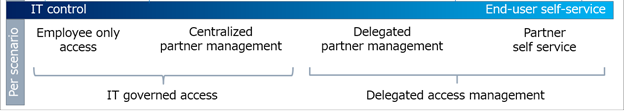

# Determine your security posture for external access with Microsoft Entra ID 

As you consider the governance of external access, assess your organization's security and collaboration needs, by scenario. You can start with the level of control the IT team has over the day-to-day collaboration of end users. Organizations in highly regulated industries might require more IT team control. For example, defense contractors can have a requirement to positively identify and document external users, their access, and access removal: all access, scenario-based, or workloads. Consulting agencies can use certain features to allow end users to determine the external users they collaborate with. 

  

   > [!NOTE]
   > A high degree of control over collaboration can lead to higher IT budgets, reduced productivity, and delayed business outcomes. When official collaboration channels are perceived as onerous, end users tend to evade official channels. An example is end users sending unsecured documents by email.

## Before you begin

This article is number 1 in a series of 10 articles. We recommend you review the articles in order. Go to the **Next steps** section to see the entire series. 

## Scenario-based planning

IT teams can delegate partner access to empower employees to collaborate with partners. This delegation can occur while maintaining sufficient security to protect intellectual property.

Compile and assess your organizations scenarios to help assess employee versus business partner access to resources. Financial institutions might have compliance standards that restrict employee access to resources such as account information. Conversely, the same institutions can enable delegated partner access for projects such as marketing campaigns.

   

### Scenario considerations

Use the following list to help measure the level of access control.

* Information sensitivity, and associated risk of its exposure
* Partner access to information about other end users
* The cost of a breach versus the overhead of centralized control and end-user friction

Organizations can start with highly managed controls to meet compliance targets, and then delegate some control to end users, over time. There can be simultaneous access-management models in an organization. 

> [!NOTE]
> Partner-managed credentials are a method to signal the termination of access to resources, when an external user loses access to resources in their own company. Learn more: [B2B collaboration overview](../external-identities/what-is-b2b.md)

## External-access security goals

The goals of IT-governed and delegated access differ. The primary goals of IT-governed access are:

* Meet governance, regulatory, and compliance (GRC) targets
* High level of control over partner access to information about end users, groups, and other partners

The primary goals of delegating access are:

* Enable business owners to determine collaboration partners, with security constraints
* Enable partners to request access, based on rules defined by business owners

### Common goals 

#### Control access to applications, data, and content

Levels of control can be accomplished through various methods, depending on your version of Microsoft Entra ID and Microsoft 365.

* [Microsoft Entra ID plans and pricing](https://www.microsoft.com/security/business/identity-access-management/azure-ad-pricing)
* [Compare Microsoft 365 Enterprise pricing](https://www.microsoft.com/microsoft-365/compare-microsoft-365-enterprise-plans)

#### Reduce attack surface

* [What is Microsoft Entra Privileged Identity Management?](../privileged-identity-management/pim-configure.md) -  manage, control, and monitor access to resources in Microsoft Entra ID, Azure, and other Microsoft Online Services such as Microsoft 365 or Microsoft Intune
* [Data loss prevention in Exchange Server](/exchange/policy-and-compliance/data-loss-prevention/data-loss-prevention?view=exchserver-2019&preserve-view=true)

#### Confirm compliance with activity and audit log reviews

IT teams can delegate access decisions to business owners through entitlement management, while access reviews help confirm continued access. You can use automated data classification with sensitivity labels to automate the encryption of sensitive content, easing compliance for end users.

## Next steps

Use the following series of articles to learn about securing external access to resources. We recommend you follow the listed order.

1. [Determine your security posture for external access with Microsoft Entra ID](1-secure-access-posture.md) (You're here)

2. [Discover the current state of external collaboration in your organization](2-secure-access-current-state.md)

3. [Create a security plan for external access to resources](3-secure-access-plan.md)

4. [Secure external access with groups in Microsoft Entra ID and Microsoft 365](4-secure-access-groups.md)

5. [Transition to governed collaboration with Microsoft Entra B2B collaboration](5-secure-access-b2b.md)

6. [Manage external access with Microsoft Entra entitlement management](6-secure-access-entitlement-managment.md)

7. [Manage external access to resources with Conditional Access policies](7-secure-access-conditional-access.md)

8. [Control external access to resources in Microsoft Entra ID with sensitivity labels](8-secure-access-sensitivity-labels.md) 

9. [Secure external access to Microsoft Teams, SharePoint, and OneDrive for Business with Microsoft Entra ID](9-secure-access-teams-sharepoint.md) 

10. [Convert local guest accounts to Microsoft Entra B2B guest accounts](10-secure-local-guest.md)
