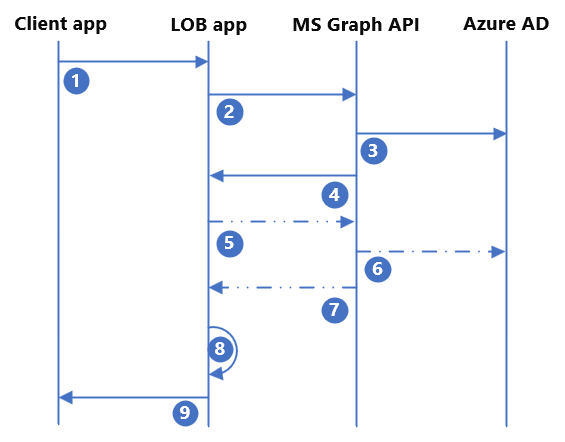

# Onboard external users to Line-of-business applications using Azure Active Directory B2B 

Application developers can use Azure Active Directory B2B (Azure AD B2B) to onboard and collaborate with external users within line-of-business (LOB) applications. Similar to the **Share** button in many Office 365 applications, application developers can create a one-click invitation experience within any LOB application that is integrated with Azure AD.  

Benefits include: 

- Simple and easy user onboarding and access to the LOB applications with users able to gain access with a few steps.

- Enables external users to bring their own identity and perform Single sign-on (SSO). 

- Automatic provisioning of external identities to Azure AD. 

- Apply Azure AD Conditional Access and cross tenant access policies to enforce authorization policies such as requiring multi-factor authentication. 

## Integration flow 

To integrate LOB applications with Azure AD B2B, follow this pattern: 



| Step | Description |
|:-------|:--------|
| 1. | The end user triggers the **invitation** within the LOB application and provides the email address of the external user. The application checks if the user already exists, and if they don’t, proceeds to [step #2](#step-2-create-and-send-invitation)|
| 2. | The application sends a POST to the Microsoft Graph API on behalf of the user. It provides the redirect URL and external user’s email that is defined in [step #1](#step-1-check-if-the-external-user-already-exists). |
| 3. | Microsoft Graph API provisions the guest user in Azure AD. |
| 4. | Microsoft Graph API returns the success/failure status of the API call. If successful, the response includes the Azure AD user object ID and the invitation link that is sent to the invited user’s email. You can optionally suppress the Microsoft email and send your own custom email. |
| 5. | (Optional) If you want to write more attributes to the invited user or add the invited user to a group, the application makes an extra API call to the Microsoft Graph API. |
| 6. | (Optional) Microsoft Graph API makes the desired updates to Azure AD.|
| 7. | (Optional) Microsoft Graph API returns the success/failure status to the application. |
| 8. | The application provisions the user to its own database/backend user directory using the user’s object ID attribute as the **immutable ID**. |
| 9. | The application presents the success/failure status to the end user. |

If assignment is required to access the LOB application, the invited guest user must also be assigned to the application with an appropriate application role. This can be done as another API call adding the invited guest to a group (steps #5-7) or by automating group membership with Azure AD dynamic groups. Using dynamic groups wouldn't require another API call by the application. However, group membership wouldn't be updated as quickly compared to adding a user to a group immediately after user invitation. 

## Step 1: Check if the external user already exists 

It's possible that the external user has previously been invited and onboarded. The LOB application should check whether the user already exists in the directory. There are many approaches, however, the simplest involves making an API call to the Microsoft Graph API and presenting the possible matches to the inviting user for them to pick from.    

For example: 

```
Application Permission: User.read.all 

GET https://graph.microsoft.com/v1.0/users?$filter=othermails/any(id:id eq 'userEmail@contoso.com')  
```
If you receive a user’s details in the response, then the user already exists. You should present the users returned to the inviting user and allow them to choose which external user they want to grant access. You should proceed to make appropriate API calls or trigger other processes to grant this user access to the application rather than proceeding with the invitation step. 

## Step 2: Create and send invitation

If the external user doesn't already exist in the directory, you can use Azure AD B2B to invite the user and onboard them to your Azure AD tenant. As an application developer, you need to determine what to include in the invitation request to Microsoft Graph API. 

At minimum, you need to:  

- Prompt the end user to provide the external user’s email address. 

- Determine the invitation URL. This URL is where the invited user gets redirected to after they authenticate and redeem the B2B invitation. The URL can be a generic landing page for the application or dynamically determined by the LOB application based on where the end user triggered the invitation. 

More flags and attributes to consider for inclusion in the invitation request: 

- Display name of the invited user. 
- Determine whether you want to use the default Microsoft invitation email or suppress the default email to create your own. 

Once the application has collected the required information and determined any other flags or information to include, the application must POST the request to the Microsoft Graph API invitation manager. Ensure the application registration has the appropriate permissions in Azure AD.  

For example: 

```
Delegated Permission: User.Invite.All 

POST https://graph.microsoft.com/v1.0/invitations  
Content-type: application/json 

{ 
"invitedUserDisplayName": "John Doe",  
"invitedUserEmailAddress": "john.doe@contoso.com",  
"sendInvitationMessage": true,  
"inviteRedirectUrl": "https://customapp.contoso.com"  
} 
```

>[!NOTE]
> To see the full list of available options for the JSON body of the invitation, check out [invitation resource type - Microsoft Graph v1.0](/graph/api/resources/invitation). 

Application developers can alternatively onboard external users using Azure AD Self-service sign-up or Entitlement management access packages. You can create your **invitation** button in your LOB application that triggers a custom email containing a predefined Self-service sign-up URL or access package URL. The invited user then self-service onboard and access the application.  

## Step 3: Write other attributes to Azure AD (optional)  

>[!IMPORTANT]
>Granting an application permission to update users in your directory is a highly privileged action. You should take steps to secure and monitor your LOB app if you grant the application these highly privileged permissions. 

Your organization or the LOB application may require to store more information for future use, such as claims emittance in tokens or granular authorization policies. Your application can make another API call to update the external user after they’ve been invited/created in Azure AD. Doing so requires your application to have extra API permissions and would require an extra call to the Microsoft Graph API.  

To update the user, you need to use the object ID of the newly created guest user received in the response from the invitation API call. This is the **ID** value in the API response from either the existence check or invitation. You can write to any standard attribute or custom extension attributes you may have created. 

For example:

``` 
Application Permission: User.ReadWrite.All

PATCH https://graph.microsoft.com/v1.0/users/<user’s object ID> 
Content-type: application/json 

{ 
"businessPhones": [ 
        "+1 234 567 8900" 
    ], 
"givenName": "John" 
"surname": "Doe", 
"extension_cf4ff515cbf947218d468c96f9dc9021_appRole": "external" 
} 
```
For more information, see [Update user - Microsoft Graph v1.0](/graph/api/user-update). 

## Step 4: Assign the invited user to a group 

>[!NOTE]
>If user assignment is not required to access the application, you may skip this step. 

If user assignment is required in Azure AD for application access and/or role assignment, the user must be assigned to the application, or else the user is unable to gain access regardless of successful authentication. To achieve this, you should make another API call to add the invited external user to a specific group. The group can be assigned to the application and mapped to a specific application role.  

For example:

Permissions: Assign the Group updater role or a custom role to the enterprise application and scope the role assignment to only the group(s) this application should be updating. Or assign the `group.readwrite.all` permission in Microsoft Graph API. 

```
POST https://graph.microsoft.com/v1.0/groups/<insert group id>/members/$ref 
Content-type: application/json 

{ 
"@odata.id": "https://graph.microsoft.com/v1.0/directoryObjects/<insert user id>" 
} 
```
For more information, see [Add members - Microsoft Graph v1.0](/graph/api/group-post-members). 
  
Alternatively, you can use Azure AD dynamic groups, which can automatically assign users to group based on the user’s attributes. However, if end-user access is time-sensitive this wouldn't be the recommended approach as dynamic groups can take up to 24 hours to populate. 

If you prefer to use dynamic groups, you don't need to add the users to a group explicitly with another API call. Create a dynamic group that automatically adds the user as a member of the group based on available attributes such as userType, email, or a custom attribute. For more information, see [Create or edit a dynamic group and get status](../enterprise-users/groups-create-rule.md). 
  
## Step 5: Provision the invited user to the application

Once the invited external user has been provisioned to Azure AD, the Microsoft Graph API returns a response with the necessary user information such as object ID and email. The LOB application can then provision the user to its own directory/database. Depending on the type of application and internal directory type the application uses, the actual implementation of this provisioning varies. 

With the external user provisioned in both Azure AD and the application, the LOB application can now notify the end user who initiated the invitation that the process has been successful. The invited user can get SSO with their own identity without the inviting organization needing to onboard and issue extra credentials. Azure AD can enforce authorization policies such as Conditional Access, Azure AD Multi-Factor Authentication, and risk-based Identity Protection. 

## Other considerations 

- Ensure proper error handling is done within the LOB application. The application should validate that each API call is successful. If unsuccessful, extra attempts and/or presenting error messages to the end user would be appropriate. 

- If you need the LOB application to update external users once they’ve been invited, consider granting a custom role that allows the application to only update users and assign the scope to a dynamic administrative unit. For example, you can create a dynamic administrative unit to contain all users where usertype = guest. Once the external user is onboarded to Azure AD, it takes some time for them to be added to the administrative unit. So, the LOB application needs to attempt to update the user after some time and it may take more than one attempt if there are delays. Despite these delays, this is the best approach available to enable the LOB application to update external users without granting it permission to update any user in the directory. 
