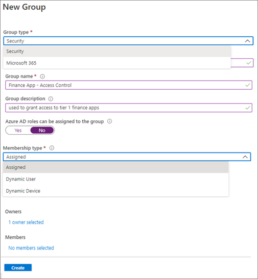

# Secure external access with groups in Microsoft Entra ID and Microsoft 365  

Groups are part of an access control strategy. You can use Microsoft Entra security groups and Microsoft 365 Groups as the basis for securing access to resources. Use groups for the following access-control mechanisms:

* Conditional Access policies
  * [What is Conditional Access?](../conditional-access/overview.md)
* Entitlement management access packages
  *  [What is entitlement management?](../governance/entitlement-management-overview.md)
* Access to Microsoft 365 resources, Microsoft Teams, and SharePoint sites

Groups have the following roles:

* **Group owners** – manage group settings and its membership
* **Members** – inherit permissions and access assigned to the group
* **Guests** – are members outside your organization

## Before you begin

This article is number 4 in a series of 10 articles. We recommend you review the articles in order. Go to the **Next steps** section to see the entire series. 

## Group strategy

To develop a group strategy to secure external access to your resources, consider the security posture that you want.

Learn more: [Determine your security posture for external access](1-secure-access-posture.md)

### Group creation 

Determine who is granted permissions to create groups: Administrators, employees, and/or external users. Consider the following scenarios:

* Tenant members can create Microsoft Entra security groups
* Internal and external users can join groups in your tenant
* Users can create Microsoft 365 Groups
* [Manage who can create Microsoft 365 Groups](/microsoft-365/solutions/manage-creation-of-groups?view=o365-worldwide&preserve-view=true) 
  * Use PowerShell to configure this setting
* [Restrict your Microsoft Entra app to a set of users in a Microsoft Entra tenant](../develop/howto-restrict-your-app-to-a-set-of-users.md)
* [Set up self-service group management in Microsoft Entra ID](../enterprise-users/groups-self-service-management.md) 
* [Troubleshoot and resolve groups issues](../enterprise-users/groups-troubleshooting.md) 

### Invitations to groups

As part of the group strategy, consider who can invite people, or add them, to groups. Group members can add other members, or group owners can add members. Decide who can be invited. By default, external users can be added to groups. 

### Assign users to groups

Users are assigned to groups manually, based on user attributes in their user object, or users are assigned based on other criteria. Users are assigned to groups dynamically based on their attributes. For example, you can assign users to groups based on:

* Job title or department
* Partner organization to which they belong 
  * Manually, or through connected organizations
* Member or guest user type
* Participation in a project 
  * Manually
* Location

Dynamic groups have users or devices, but not both. To assign users to the dynamic group, add queries based on user attributes. The following screenshot has queries that add users to the group if they are finance department members.

   

Learn more: [Create or update a dynamic group in Microsoft Entra ID](../enterprise-users/groups-create-rule.md)

### Use groups for one function

When using groups, it's important they have a single function. If a group is used to grant access to resources, don't use it for another purpose. We recommend a security-group naming convention that makes the purpose clear:

* Secure_access_finance_apps
* Team_membership_finance_team
* Location_finance_building

### Group types

You can create Microsoft Entra security groups and Microsoft 365 Groups in the Azure portal or the Microsoft 365 Admin portal. Use either group type for securing external access.

| Considerations |Manual and dynamic Microsoft Entra security groups| Microsoft 365 Groups |
| - | - | - |
| The group contains| Users Groups Service principals Devices| Users only |
| Where the group is created| Azure portal Microsoft 365 portal, if mail-enabled) PowerShell Microsoft Graph End user portal| Microsoft 365 portal Azure portal PowerShell Microsoft Graph In Microsoft 365 applications |
| Who creates, by default| Administrators  Users| Administrators Users |
| Who is added, by default| Internal users (tenant members) and guest users | Tenant members and guests from an organization |
| Access is granted to| Resources to which it's assigned.| Group-related resources: (Group mailbox, site, team, chats, and other Microsoft 365 resources) Other resources to which group is added |
| Can be used with| Conditional Access entitlement management group licensing| Conditional Access entitlement management sensitivity labels |

> [!NOTE]
> Use Microsoft 365 Groups to create and manage a set of Microsoft 365 resources, such as a Team and its associated sites and content. 

## Microsoft Entra security groups 

Microsoft Entra security groups can have users or devices. Use these groups to manage access to:

* Azure resources
  * Microsoft 365 apps
  * Custom apps
  * Software as a Service (SaaS) apps such as Dropbox ServiceNow
* Azure data and subscriptions
* Azure services

Use Microsoft Entra security groups to assign:

* Licenses for services
  * Microsoft 365
  * Dynamics 365
  * Enterprise mobility and security
  * See, [What is group-based licensing in Microsoft Entra ID?](../fundamentals/concept-group-based-licensing.md)
* Elevated permissions
  * See, [Use Microsoft Entra groups to manage role assignments](../roles/groups-concept.md)

Learn more:

* [Manage Microsoft Entra groups and group membership](../fundamentals/how-to-manage-groups.md)
* [Microsoft Entra version 2 cmdlets for group management](../enterprise-users/groups-settings-v2-cmdlets.md). 

> [!NOTE]
> Use security groups to assign up to 1,500 applications. 

   

### Mail-enabled security group

To create a mail-enabled security group, go to the [Microsoft 365 admin center](https://admin.microsoft.com/). Enable a security group for mail during creation. You can’t enable it later. You can't create the group in the Azure portal. 

### Hybrid organizations and Microsoft Entra security groups

Hybrid organizations have infrastructure for on-premises and a Microsoft Entra ID. Hybrid organizations that use Active Directory can create security groups on-premises and sync them to the cloud. Therefore, only users in the on-premises environment can be added to the security groups.

> [!IMPORTANT]
> Protect your on-premises infrastructure from compromise. See, [Protecting Microsoft 365 from on-premises attacks](./protect-m365-from-on-premises-attacks.md).

## Microsoft 365 Groups

Microsoft 365 Groups is the membership service for access across Microsoft 365. They can be created from the Azure portal, or the Microsoft 365 admin center. When you create a Microsoft 365 Group, you grant access to a group of resources for collaboration.

Learn more:

* [Overview of Microsoft 365 Groups for administrators](/microsoft-365/admin/create-groups/office-365-groups?view=o365-worldwide&preserve-view=true)
* [Create a group in the Microsoft 365 admin center](/microsoft-365/admin/create-groups/create-groups?view=o365-worldwide&preserve-view=true)
* [Microsoft Entra admin center](https://entra.microsoft.com)
* [Microsoft 365 admin center](https://admin.microsoft.com/)

### Microsoft 365 Groups roles

* **Group owners**
  * Add or remove members
  * Delete conversations from the shared inbox
  * Change group settings
  * Rename the group
  * Update the description or picture
* **Members**
  * Access everything in the group
  * Can't change group settings
  * Can invite guests to join the group
  * [Manage guest access in Microsoft 365 groups](/microsoft-365/admin/create-groups/manage-guest-access-in-groups)
* **Guests**
  * Are members from outside your organization 
  * Have some limits to functionality in Teams

### Microsoft 365 Group settings

Select email alias, privacy, and whether to enable the group for teams. 

   

After setup, add members, and configure settings for email usage, etc.

## Next steps

Use the following series of articles to learn about securing external access to resources. We recommend you follow the listed order.

1. [Determine your security posture for external access with Microsoft Entra ID](1-secure-access-posture.md)

2. [Discover the current state of external collaboration in your organization](2-secure-access-current-state.md)

3. [Create a security plan for external access to resources](3-secure-access-plan.md)

4. [Secure external access with groups in Microsoft Entra ID and Microsoft 365](4-secure-access-groups.md) (You're here)

5. [Transition to governed collaboration with Microsoft Entra B2B collaboration](5-secure-access-b2b.md)

6. [Manage external access with Microsoft Entra entitlement management](6-secure-access-entitlement-managment.md)

7. [Manage external access to resources with Conditional Access policies](7-secure-access-conditional-access.md)

8. [Control external access to resources in Microsoft Entra ID with sensitivity labels](8-secure-access-sensitivity-labels.md) 

9. [Secure external access to Microsoft Teams, SharePoint, and OneDrive for Business with Microsoft Entra ID](9-secure-access-teams-sharepoint.md) 

10. [Convert local guest accounts to Microsoft Entra B2B guest accounts](10-secure-local-guest.md)
