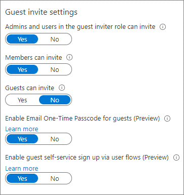
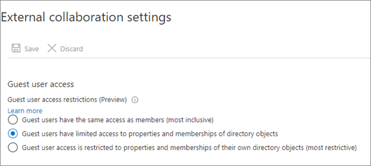

# Transition to governed collaboration with Microsoft Entra B2B collaboration

Understanding collaboration helps secure external access to your resources. Use the information in this article to move external collaboration into Microsoft Entra B2B (Microsoft Entra B2B) collaboration. 

* See, [B2B collaboration overview](../external-identities/what-is-b2b.md)
* Learn about: [External Identities in Microsoft Entra ID](../external-identities/external-identities-overview.md)

## Before you begin

This article is number 5 in a series of 10 articles. We recommend you review the articles in order. Go to the **Next steps** section to see the entire series. 

## Control collaboration 

You can limit the organizations your users collaborate with (inbound and outbound), and who in your organization can invite guests. Most organizations permit business units to decide collaboration, and delegate approval and oversight. For example, organizations in government, education, and finance often don't permit open collaboration. You can use Microsoft Entra features to control collaboration.

To control access your tenant, deploy one or more of the following solutions:

- **External collaboration settings** – restrict the email domains that invitations go to
- **Cross tenant access settings** – control application access by guests by user, group, or tenant (inbound). Control external Microsoft Entra tenant and application access for users (outbound).
- **Connected organizations** – determine what organizations can request access packages in Entitlement Management 

### Determine collaboration partners

Document the organizations you collaborate with, and organization users' domains, if needed. Domain-based restrictions might be impractical. One collaboration partner can have multiple domains, and a partner can add domains. For example, a partner with multiple business units, with separate domains, can add more domains as they configure synchronization.

If your users use Microsoft Entra B2B, you can discover the external Microsoft Entra tenants they're collaborating with, with the sign-in logs, PowerShell, or a workbook. Learn more:

* [Get MsIdCrossTenantAccessActivity](https://github.com/AzureAD/MSIdentityTools/wiki/Get-MSIDCrossTenantAccessActivity)
* [Cross-tenant access activity workbook](../reports-monitoring/workbook-cross-tenant-access-activity.md)

You can enable future collaboration with: 

-	**External organizations** - most inclusive
-	**External organizations, but not denied organizations**
-	**Specific external organizations** - most restrictive

> [!NOTE]
> If your collaboration settings are highly restrictive, your users might go outside the collaboration framework. We recommend you enable a broad collaboration that your security requirements allow. 

Limits to one domain can prevent authorized collaboration with organizations that have other, unrelated domains. For example, the initial point of contact with Contoso might be a US-based employee with email that has a `.com` domain. However if you allow only the `.com` domain, you can omit Canadian employees who have the `.ca` domain. 

You can allow specific collaboration partners for a subset of users. For example, a university might restrict student accounts from accessing external tenants, but can allow faculty to collaborate with external organizations.

### Allowlist and blocklist with external collaboration settings

You can use an allowlist or blocklist for organizations. You can use an allowlist, or a blocklist, not both.

* **Allowlist** - limit collaboration to a list of domains. Other domains are on the blocklist.
* **Blocklist** - allow collaboration with domains not on the blocklist

Learn more: [Allow or block invitations to B2B users from specific organizations](../external-identities/allow-deny-list.md) 

> [!IMPORTANT]
> Allowlists and blocklists don't apply to users in your directory. By default, they don't apply to OneDrive for Business and SharePoint allowlist or blocklists; these lists are separate. However, you can enable [SharePoint-OneDrive B2B integration](/sharepoint/sharepoint-azureb2b-integration).  

Some organizations have a blocklist of bad-actor domains from a managed security provider. For example, if the organization does business with Contoso and uses a `.com` domain, an unrelated organization can use the `.org` domain, and attempt a phishing attack. 

### Cross tenant access settings

You can control inbound and outbound access using cross tenant access settings. In addition, you can trust multi-factor authentication (MFA), a compliant device, and Microsoft Entra hybrid joined device (HAAJD) claims from external Microsoft Entra tenants. When you configure an organizational policy, it applies to the Microsoft Entra tenant and applies to users in that tenant, regardless of domain suffix. 

You can enable collaboration across Microsoft clouds, such as Microsoft Azure operated by 21Vianet or Azure Government. Determine if your collaboration partners reside in a different Microsoft cloud. 

Learn more: 

* [Microsoft Azure operated by 21Vianet](/azure/china/overview-operations)
* [Azure Government developer guide](/azure/azure-government/documentation-government-developer-guide)
* [Configure Microsoft cloud settings for B2B collaboration (Preview)](../external-identities/cross-cloud-settings.md).

You can allow inbound access to specific tenants (allowlist), and set the default policy to block access. Then, create organizational policies that allow access by user, group, or application.

You can block access to tenants (blocklist). Set the default policy to **Allow** and then create organizational policies that block access to some tenants. 

> [!NOTE]
> Cross tenant access settings, inbound access does not prevent users from sending invitations, nor prevent them from being redeemed. However, it does control application access and whether a token is issued to the guest user. If the guest can redeem an invitation, policy blocks application access.

To control external organizations users access, configure outbound access policies similarly to inbound access: allowlist and blocklist. Configure default and organization-specific policies. 

Learn more: [Configure cross-tenant access settings for B2B collaboration](../external-identities/cross-tenant-access-settings-b2b-collaboration.md)

> [!NOTE]
> Cross tenant access settings apply to Microsoft Entra tenants. To control access for partners not using Microsoft Entra ID, use external collaboration settings.

### Entitlement management and connected organizations

Use entitlement management to ensure automatic guest-lifecycle governance. Create access packages and publish them to external users or to connected organizations, which support Microsoft Entra tenants and other domains. When you create an access package, restrict access to connected organizations. 

Learn more: [What is entitlement management?](../governance/entitlement-management-overview.md)

## Control external user access

To begin collaboration, invite or enable a partner to access resources. Users gain access by:

* [Microsoft Entra B2B collaboration invitation redemption](../external-identities/redemption-experience.md) 
* [Self-service sign-up](../external-identities/self-service-sign-up-overview.md)
* [Requesting access to an access package in entitlement management](../governance/entitlement-management-request-access.md)

When you enable Microsoft Entra B2B, you can invite guest users with links and email invitations. Self-service sign-up, and publishing access packages to the My Access portal, require more configuration. 

> [!NOTE]
> Self-service sign-up enforces no allowlist or blocklist in external collaboration settings. Instead, use cross tenant access settings. You can integrate allowlists and blocklists with self-service sign-up using custom API connectors. See, [Add an API connector to a user flow](../external-identities/self-service-sign-up-add-api-connector.md).

### Guest user invitations

Determine who can invite guest users to access resources.

* Most restrictive: Allow only administrators and users with the Guest Inviter role
  * See, [Configure external collaboration settings](../external-identities/external-collaboration-settings-configure.md)
* If security requirements permit, allow all Member UserType to invite guests
* Determine if Guest UserType can invite guests
  * Guest is the default Microsoft Entra B2B user account

    

### External user information

Use Microsoft Entra entitlement management to configure questions that external users answer. The questions appear to approvers to help them make a decision. You can configure sets of questions for each access package policy, so approvers have relevant information for access they approve. For example, ask vendors for their vendor contract number. 

Learn more: [Change approval and requestor information settings for an access package in entitlement management](../governance/entitlement-management-access-package-approval-policy.md)

If you use a self-service portal, use API connectors to collect user attributes during sign-up. Use the attributes to assign access. You can create custom attributes in the Azure portal and use them in your self-service sign-up user flows. Read and write these attributes by using the Microsoft Graph API. 

Learn more:

* [Use API connectors to customize and extend self-service sign-up](../external-identities/api-connectors-overview.md)
* [Manage Azure AD B2C with Microsoft Graph](../../active-directory-b2c/microsoft-graph-operations.md)

### Troubleshoot invitation redemption to Microsoft Entra users

Invited guest users from a collaboration partner can have trouble redeeming an invitation. See the following list for mitigations.

* User domain isn't on an allowlist
* The partner’s home tenant restrictions prevent external collaboration
* The user isn't in the partner Microsoft Entra tenant. For example, users at contoso.com are in Active Directory. 
  * They can redeem invitations with the email one-time password (OTP)
  * See, [Microsoft Entra B2B collaboration invitation redemption](../external-identities/redemption-experience.md)

## External user access

Generally, there are resources you can share with external users, and some you can't. You can control what external users access. 

Learn more: [Manage external access with Entitlement Management](6-secure-access-entitlement-managment.md)

By default, guest users see information and attributes about tenant members and other partners, including group memberships. Consider limiting external user access to this information.

   

We recommend the following guest-user restrictions:

* Limit guest access to browsing groups and other properties in the directory
   * Use external collaboration settings to restrict guests from reading groups they aren't members of
* Block access to employee-only apps
   * Create a Conditional Access policy to block access to Microsoft Entra integrated applications for non-guest users
* Block access to the Azure portal
  * You can make needed exceptions 
  * Create a Conditional Access policy with all guest and external users. Implement a policy to block access.

Learn more: [Conditional Access: Cloud apps, actions, and authentication context](../conditional-access/concept-conditional-access-cloud-apps.md)

## Remove users who don't need access

Establish a process to review and remove users who don't need access. Include external users in your tenant as guests, and users with member accounts.

Learn more: [Use Microsoft Entra ID Governance to review and remove external users who no longer have resource access](../governance/access-reviews-external-users.md)

Some organizations add external users as members (vendors, partners, and contractors). Assign an attribute, or username:

* **Vendors** - v-alias@contoso.com
* **Partners** - p-alias@contoso.com
* **Contractors** - c-alias@contoso.com

Evaluate external users with member accounts to determine access. You might have guest users not invited through entitlement management or Microsoft Entra B2B.

To find these users:

* [Use Microsoft Entra ID Governance to review and remove external users who no longer have resource access](../governance/access-reviews-external-users.md)
* Use a sample PowerShell script on [access-reviews-samples/ExternalIdentityUse/](https://github.com/microsoft/access-reviews-samples/tree/master/ExternalIdentityUse)

## Transition current external users to Microsoft Entra B2B

If you don't use Microsoft Entra B2B, you likely have non-employee users in your tenant. We recommend you transition these accounts to Microsoft Entra B2B external user accounts and then change their UserType to Guest. Use Microsoft Entra ID and Microsoft 365 to handle external users. 

Include or exclude:

* Guest users in Conditional Access policies
* Guest users in access packages and access reviews
* External access to Microsoft Teams, SharePoint, and other resources

You can transition these internal users while maintaining current access, user principal name (UPN), and group memberships. 

Lear more: [Invite external users to B2B collaboration](../external-identities/invite-internal-users.md)

## Decommission collaboration methods

To complete the transition to governed collaboration, decommission unwanted collaboration methods. Decommissioning is based on the level of control to exert on collaboration, and the security posture. See, [Determine your security posture for external access](1-secure-access-posture.md).

### Microsoft Teams invitation

By default, Teams allows external access. The organization can communicate with external domains. To restrict or allow domains for Teams, use the [Teams admin center](https://admin.teams.microsoft.com/company-wide-settings/external-communications). 

### Sharing through SharePoint and OneDrive

Sharing through SharePoint and OneDrive adds users not in the entitlement management process. 

* [Secure external access to Microsoft Teams, SharePoint, and OneDrive for Business](9-secure-access-teams-sharepoint.md)
* [Block OneDrive use from Office](/office365/troubleshoot/group-policy/block-onedrive-use-from-office) 

### Emailed documents and sensitivity labels

Users send documents to external users by email. You can use sensitivity labels to restrict and encrypt access to documents. 

See, [Learn about sensitivity labels](/microsoft-365/compliance/sensitivity-labels?view=o365-worldwide&preserve-view=true).

### Unsanctioned collaboration tools

Some users likely use Google Docs, DropBox, Slack, or Zoom. You can block use of these tools from a corporate network, at the firewall level, and with mobile application management for organization-managed devices. However, this action blocks sanctioned instances and doesn't block access from unmanaged devices. Block tools you don’t want, and create policies for no unsanctioned usage. 

For more information on governing applications, see:

* [Governing connected apps](/defender-cloud-apps/governance-actions)
* [Govern discovered apps](/defender-cloud-apps/governance-discovery)

## Next steps

Use the following series of articles to learn about securing external access to resources. We recommend you follow the listed order.

1. [Determine your security posture for external access with Microsoft Entra ID](1-secure-access-posture.md)

2. [Discover the current state of external collaboration in your organization](2-secure-access-current-state.md)

3. [Create a security plan for external access to resources](3-secure-access-plan.md)

4. [Secure external access with groups in Microsoft Entra ID and Microsoft 365](4-secure-access-groups.md)

5. [Transition to governed collaboration with Microsoft Entra B2B collaboration](5-secure-access-b2b.md) (You're here) 

6. [Manage external access with Microsoft Entra entitlement management](6-secure-access-entitlement-managment.md)

7. [Manage external access to resources with Conditional Access policies](7-secure-access-conditional-access.md)

8. [Control external access to resources in Microsoft Entra ID with sensitivity labels](8-secure-access-sensitivity-labels.md) 

9. [Secure external access to Microsoft Teams, SharePoint, and OneDrive for Business with Microsoft Entra ID](9-secure-access-teams-sharepoint.md)

10. [Convert local guest accounts to Microsoft Entra B2B guest accounts](10-secure-local-guest.md)
