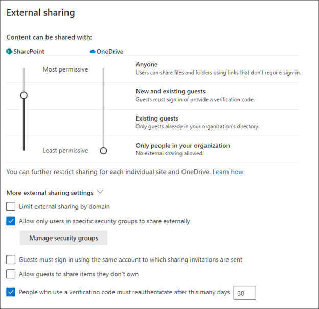

# Secure external access to Microsoft Teams, SharePoint, and OneDrive with Azure Active Directory 

Use this article to determine and configure your organization's external collaboration using Microsoft Teams, OneDrive for Business, and SharePoint. A common challenge is balancing security and ease of collaboration for end users and external users. If an approved collaboration method is perceived as restrictive and onerous, end users evade the approved method. End users might email unsecured content, or set up external processes and applications, such as a personal DropBox or OneDrive. 

## Before you begin

This article is number 9 in a series of 10 articles. We recommend you review the articles in order. Go to the **Next steps** section to see the entire series.

## External Identities settings and Azure Active Directory

Sharing in Microsoft 365 is partially governed by the **External Identities, External collaboration settings** in Azure Active Directory (Azure AD). If external sharing is disabled or restricted in Azure AD, it overrides sharing settings configured in Microsoft 365. An exception is if Azure AD B2B integration isn't enabled. You can configure SharePoint and OneDrive to support ad-hoc sharing via one-time password (OTP). The following screenshot shows the External Identities, External collaboration settings dialog. 

:::image type="content" source="media/secure-external-access/9-external-collaboration-settings-new.png" alt-text="Screenshot of options and entries under External Identities, External collaboration settings.":::

Learn more:

* [Azure portal](https://portal.azure.com/)
* [External Identities in Azure AD](../external-identities/external-identities-overview.md)

### Guest user access

Guest users are invited to have access to resources. 

1. Sign in to the **Azure portal**
1. Browse to **Azure Active Directory** > **External Identities** > **External collaboration settings**.
1. Find the **Guest user access** options. 
1. To prevent guest-user access to other guest-user details, and to prevent enumeration of group membership, select **Guest users have limited access to properties and memberships of directory objects**.

### Guest invite settings

Guest invite settings determine who invites guests and how guests are invited. The settings are enabled if the B2B integration is enabled. It's recommended that administrators and users, in the Guest Inviter role, can invite. This setting allows setup of controlled collaboration processes. For example:

* Team owner submits a ticket requesting assignment to the Guest Inviter role:
  * Responsible for guest invitations
  * Agrees to not add users to SharePoint
  * Performs regular access reviews
  * Revokes access as needed

* The IT team:
  * After training is complete, the IT team grants the Guest Inviter role
  * Ensures there are sufficient Azure AD Premium P2 licenses for the Microsoft 365 group owners who will review
  * Creates a Microsoft 365 group access review
  * Confirms access reviews occur
  * Removes users added to SharePoint

1. Select the banner for **Email one-time passcodes for guests**. 
2. For **Enable guest self-service sign up via user flows**, select **Yes**. 

### Collaboration restrictions

For the Collaboration restrictions option, the organization's business requirements dictate the choice of invitation.

* **Allow invitations to be sent to any domain (most inclusive)** - any user can be invited
* **Deny invitations to the specified domains** - any user outside those domains can be invited
* **Allow invitations only to the specified domains (most restrictive)** - any user outside those domains can't be invited 

## External users and guest users in Teams

Teams differentiates between external users (outside your organization) and guest users (guest accounts). You can manage collaboration setting in the [Microsoft Teams admin center](https://admin.teams.microsoft.com/company-wide-settings/external-communications) under Org-wide settings. Authorized account credentials are required to sign in to the Teams Admin portal.

* **External Access** - Teams allows external access by default. The organization can communicate with all external domains 
  * Use External Access setting to restrict or allow domains
* **Guest Access** - manage guest access in Teams

Learn more: [Use guest access and external access to collaborate with people outside your organization](/microsoftteams/communicate-with-users-from-other-organizations). 

The External Identities collaboration feature in Azure AD controls permissions. You can increase restrictions in Teams, but restrictions can't be lower than Azure AD settings.

Learn more:

* [Manage external meetings and chat in Microsoft Teams](/microsoftteams/manage-external-access)
* [Step 1. Determine your cloud identity model](/microsoft-365/enterprise/about-microsoft-365-identity)
* [Identity models and authentication for Microsoft Teams](/microsoftteams/identify-models-authentication)
* [Sensitivity labels for Microsoft Teams](/microsoftteams/sensitivity-labels)

## Govern access in SharePoint and OneDrive

SharePoint administrators can find organization-wide settings in the SharePoint admin center. It's recommended that your organization-wide settings are the minimum security levels. Increase security on some sites, as needed. For example, for a high-risk project, restrict users to certain domains, and disable members from inviting guests.

Learn more: 
* [SharePoint admin center](https://microsoft-admin.sharepoint.com) - access permissions are required
* [Get started with the SharePoint admin center](/sharepoint/get-started-new-admin-center)
* [External sharing overview](/sharepoint/external-sharing-overview)

### Integrating SharePoint and OneDrive with Azure AD B2B

As a part of your strategy to govern external collaboration, it's recommended you enable SharePoint and OneDrive integration with Azure AD B2B. Azure AD B2B has guest-user authentication and management. With SharePoint and OneDrive integration, use one-time passcodes for external sharing of files, folders, list items, document libraries, and sites. 

Learn more: 
* [Email one-time passcode authentication](../external-identities/one-time-passcode.md)
* [SharePoint and OneDrive integration with Azure AD B2B](/sharepoint/sharepoint-azureb2b-integration)
* [B2B collaboration overview](../external-identities/what-is-b2b.md)

If you enable Azure AD B2B integration, then SharePoint and OneDrive sharing is subject to the Azure AD organizational relationships settings, such as **Members can invite** and **Guests can invite**.

### Sharing policies in SharePoint and OneDrive

In the Azure portal, you can use the External Sharing settings for SharePoint and OneDrive to help configure sharing policies. OneDrive restrictions can't be more permissive than SharePoint settings.

Learn more: [External sharing overview](/sharepoint/external-sharing-overview)

   

#### External sharing settings recommendations

Use the guidance in this section when configuring external sharing. 

* **Anyone** - Not recommended. If enabled, regardless of integration status, no Azure policies are applied for this link type. 
  * Don't enable this functionality for governed collaboration
  * Use it for restrictions on individual sites
* **New and existing guests** - Recommended, if integration is enabled
  * Azure AD B2B integration enabled: new and current guests have an Azure AD B2B guest account you can manage with Azure AD policies
  * Azure AD B2B integration not enabled: new guests don't have an Azure AD B2B account, and can't be managed from Azure AD
  * Guests have an Azure AD B2B account, depending on how the guest was created
* **Existing guests** - Recommended, if you don't have integration enabled
  * With this option enabled, users can share with other users in your directory
* **Only people in your organization** - Not recommended with external user collaboration
  * Regardless of integration status, users can share with other users in your organization
* **Limit external sharing by domain** - By default, SharePoint allows external access. Sharing is allowed with external domains. 
  * Use this option to restrict or allow domains for SharePoint
* **Allow only users in specific security groups to share externally** - Use this setting to restrict who shares content in SharePoint and OneDrive. The setting in Azure AD applies to all applications. Use the restriction to direct users to training about secure sharing. Completion is the signal to add them to a sharing security group. If this setting is selected, and users can't become an approved sharer, they might find unapproved ways to share. 
* **Allow guests to share items they don’t own** - Not recommended. The guidance is to disable this feature.
* **People who use a verification code must reauthenticate after this many days (default is 30)** - Recommended

### Access controls

Access controls setting affect all users in your organization. Because you might not be able to control whether external users have compliant devices, the controls won't be addressed in this article. 

* **Idle session sign-out** - Recommended
  * Use this option to warn and sign out users on unmanaged devices, after a period of inactivity
  * You can configure the period of inactivity and the warning
* **Network location** - Set this control to allow access from IP addresses your organization owns. 
  * For external collaboration, set this control if your external partners access resources when in your network, or with your virtual private network (VPN).

### File and folder links

In the SharePoint admin center, you can set how file and folder links are shared. You can configure the setting for each site. 

   

With Azure AD B2B integration enabled, sharing files and folders with users outside the organization results in the creation of a B2B user.

1. For **Choose the type of link that's selected by default when users share files and folders in SharePoint and OneDrive**, select **Only people in your organization**.
2. For **Choose the permission that's selected by default for sharing links**, select **Edit**.

You can customize this setting for a per-site default.

### Anyone links

Enabling Anyone links isn't recommended. If you enable it, set an expiration, and restrict users to view permissions. If you select View only permissions for files or folders, users can't change Anyone links to include edit privileges.

Learn more:

* [External sharing overview](/sharepoint/external-sharing-overview)
* [SharePoint and OneDrive integration with Azure AD B2B](/sharepoint/sharepoint-azureb2b-integration)

## Next steps

Use the following series of articles to learn about securing external access to resources. We recommend you follow the listed order.

1. [Determine your security posture for external access with Azure AD](1-secure-access-posture.md)

2. [Discover the current state of external collaboration in your organization](2-secure-access-current-state.md)

3. [Create a security plan for external access to resources](3-secure-access-plan.md)

4. [Secure external access with groups in Azure AD and Microsoft 365](4-secure-access-groups.md) 

5. [Transition to governed collaboration with Azure AD B2B collaboration](5-secure-access-b2b.md) 

6. [Manage external access with Azure AD entitlement management](6-secure-access-entitlement-managment.md) 

7. [Manage external access to resources with Conditional Access policies](7-secure-access-conditional-access.md) 

8. [Control external access to resources in Azure AD with sensitivity labels](8-secure-access-sensitivity-labels.md)

9. [Secure external access to Microsoft Teams, SharePoint, and OneDrive for Business with Azure AD](9-secure-access-teams-sharepoint.md) (You're here)

10. [Convert local guest accounts to Azure Active Directory B2B guest accounts](10-secure-local-guest.md)
