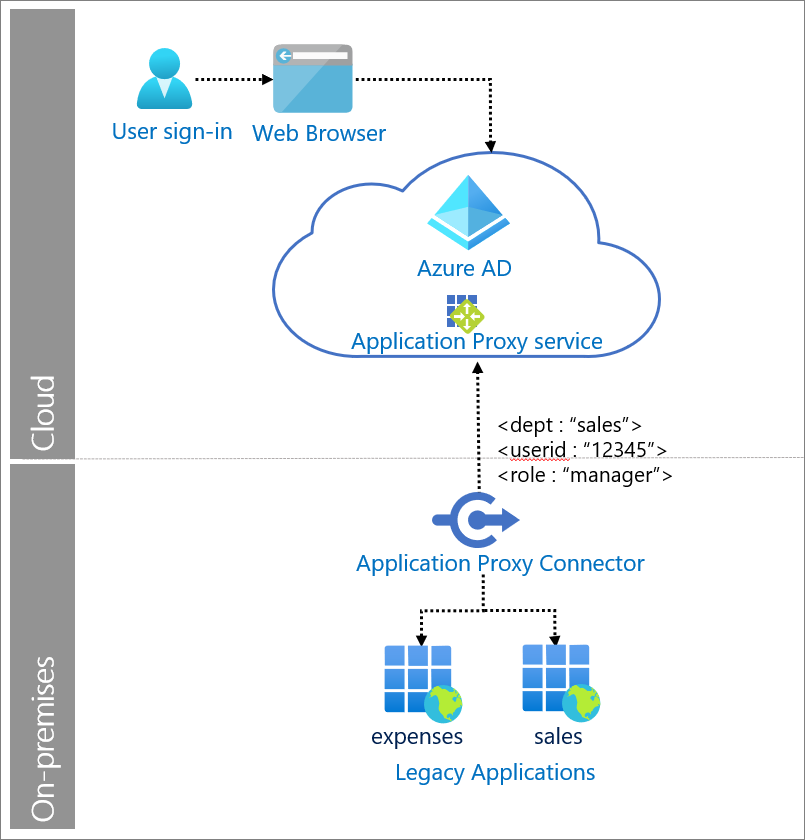

# Header-based authentication with Azure Active Directory

Legacy applications commonly use Header-based authentication. In this scenario, a user (or message originator) authenticates to an intermediary identity solution. The intermediary solution authenticates the user and propagates the required Hypertext Transfer Protocol (HTTP) headers to the destination web service. Azure Active Directory (AD) supports this pattern via its Application Proxy service, and integrations with other network controller solutions.

In our solution, Application Proxy provides remote access to the application, authenticates the user, and passes headers required by the application. 

## Use when

Remote users need to securely single sign-on (SSO) into to on-premises applications that require header-based authentication.

## Components of system

* **User**: Accesses legacy applications served by Application Proxy.

* **Web browser**: The component that the user interacts with to access the external URL of the application.

* **Azure AD**: Authenticates the user. 

* **Application Proxy service**: Acts as reverse proxy to send request from the user to the on-premises application. It resides in Azure AD and can also enforce any Conditional Access policies.

* **Application Proxy connector**: Installed on-premises on Windows servers to provide connectivity to the applications. It only uses outbound connections. Returns the response to Azure AD.

* **Legacy applications**: Applications that receive user requests from Application Proxy. The legacy application receives the required HTTP headers to set up a session and return a response. 

## Implement header-based authentication with Azure AD

* [Add an on-premises application for remote access through Application Proxy in Azure AD](../app-proxy/application-proxy-add-on-premises-application.md)  

* [Header-based authentication for single sign-on with Application Proxy and PingAccess](../app-proxy/application-proxy-configure-single-sign-on-with-headers.md) 

* [Secure legacy apps with app delivery controllers and networks](../manage-apps/secure-hybrid-access.md)
