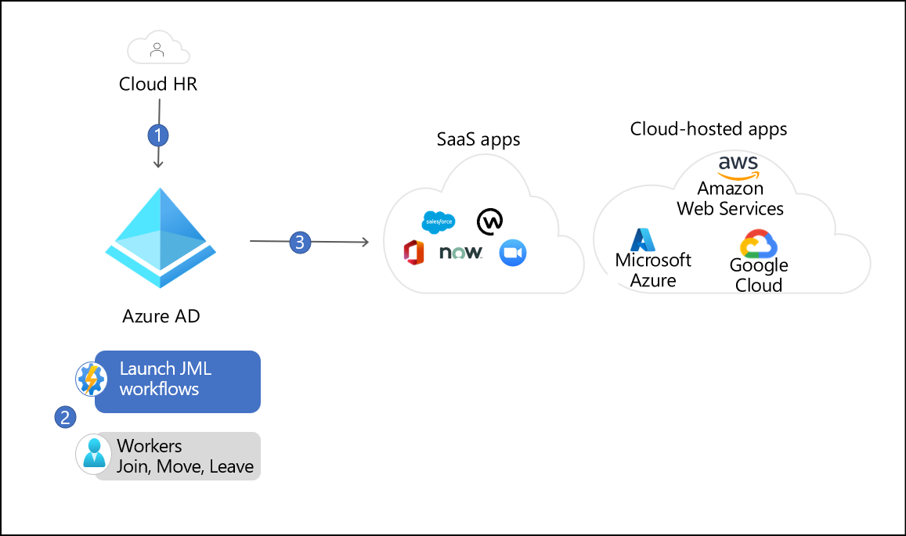
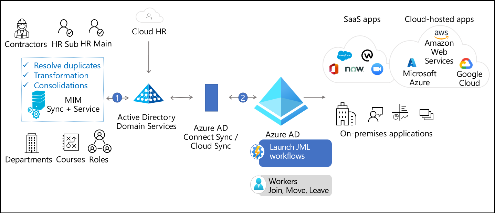

# Introduction

The article helps architects, Microsoft partners, and IT professionals with information addressing identity [provisioning](https://www.gartner.com/en/information-technology/glossary/user-provisioning) needs in their organizations, or the organizations they're working with. The content focuses on automating user provisioning for access to applications across all systems in your organization.

Employees in an organization rely on many applications to perform their work. These applications often require IT admins or application owners to provision accounts before an employee can start accessing them. Organizations also need to manage the lifecycle of these accounts and keep them up to date with the latest information and remove accounts when users don't require them anymore.

The Microsoft Entra provisioning service automates your identity lifecycle and keeps identities in sync across trusted source systems (like HR systems) and applications that users need access to. It enables you to bring users into Microsoft Entra ID and provision them into the various applications that they require. The provisioning capabilities are foundational building blocks that enable rich governance and lifecycle workflows. For [hybrid](../hybrid/whatis-hybrid-identity.md) scenarios, the Microsoft Entra agent model connects to on-premises or IaaS systems, and includes components such as the Microsoft Entra provisioning agent, Microsoft Identity Manager (MIM), and Microsoft Entra Connect.

Thousands of organizations are running Microsoft Entra cloud-hosted services, with its hybrid components delivered on-premises, for provisioning scenarios. Microsoft invests in cloud-hosted and on-premises functionality, including MIM and Microsoft Entra Connect Sync, to help organizations provision users in their connected systems and applications. This article focuses on how organizations can use Microsoft Entra ID to address their provisioning needs and make clear which technology is most right for each scenario.

 Use the following table to find content specific to your scenario. For example, if you want employee and contractor identities management from an HR system to Active Directory Domain Services (AD DS) or Microsoft Entra ID, follow the link to *Connect identities with your system of record*.

| What | From | To | Read |
| - | - | - | - |
| Employees and contractors| HR systems| AD and Microsoft Entra ID| [Connect identities with your system of record](automate-provisioning-to-applications-solutions.md) |
| Existing AD users and groups| AD DS| Microsoft Entra ID| [Synchronize identities between Microsoft Entra ID and Active Directory](automate-provisioning-to-applications-solutions.md) |
| Users, groups| Microsoft Entra ID| SaaS and on-prem apps| [Automate provisioning to non-Microsoft applications](../governance/entitlement-management-organization.md) |
| Access rights| Microsoft Entra ID Governance| SaaS and on-prem apps| [Entitlement management](../governance/entitlement-management-overview.md) |
| Existing users and groups| AD, SaaS and on-prem apps| Identity governance (so I can review them)| [Microsoft Entra access reviews](../governance/access-reviews-overview.md) |
| Non-employee users (with approval)| Other cloud directories| SaaS and on-prem apps| [Connected organizations](../governance/entitlement-management-organization.md) |
| Users, groups| Microsoft Entra ID| Managed AD domain| [Microsoft Entra Domain Services](https://azure.microsoft.com/services/active-directory-ds/) |

## Example topologies

Organizations vary greatly in the applications and infrastructure that they rely on to run their business. Some organizations have all their infrastructure in the cloud, relying solely on SaaS applications, while others have invested deeply in on-premises infrastructure over several years. The three topologies below depict how Microsoft can meet the needs of a cloud only customer, hybrid customer with basic provisioning requirements, and a hybrid customer with advanced provisioning requirements.

### Cloud only

In this example, the organization has a cloud HR system such as Workday or SuccessFactors, uses Microsoft 365 for collaboration, and SaaS apps such as ServiceNow and Zoom.

1. The Microsoft Entra provisioning service imports users from the cloud HR system and creates an account in Microsoft Entra ID, based on business rules that the organization defines.

1. The user complete sets up the suitable authentication methods, such as the authenticator app, Fast Identity Online 2 (FIDO2)/Windows Hello for Business (WHfB) keys via [Temporary Access Pass](../authentication/howto-authentication-temporary-access-pass.md) and then signs into Teams. This Temporary Access Pass was automatically generated for the user through Microsoft Entra Life Cycle Workflows.

1. The Microsoft Entra provisioning service creates accounts in the various applications that the user needs, such as ServiceNow and Zoom. The user is able to request the necessary devices they need and start chatting with their teams.

### Hybrid-basic

In this example, the organization has a mix of cloud and on-premises infrastructure. In addition to the systems mentioned above, the organization relies on SaaS applications and on-premises applications that are both AD integrated and non-AD integrated.

1. The Microsoft Entra provisioning service imports the user from Workday and creates an account in AD DS, enabling the user to access AD-integrated applications.

2. Microsoft Entra Connect cloud sync provisions the user into Microsoft Entra ID, which enables the user to access SharePoint Online and their OneDrive files.

3. The Microsoft Entra provisioning service detects a new account was created in Microsoft Entra ID. It then creates accounts in the SaaS and on-premises applications the user needs access to.

### Hybrid-advanced

In this example, the organization has users spread across multiple on-premises HR systems and cloud HR. They have large groups and device synchronization requirements.

1. MIM imports user information from each HR stem. MIM determines which users are needed for those employees in different directories. MIM provisions those identities in AD DS.

2. Microsoft Entra Connect Sync then synchronizes those users and groups to Microsoft Entra ID and provides users access to their resources.

## Next steps

* [Solutions to automate user provisioning to applications](automate-provisioning-to-applications-solutions.md)
