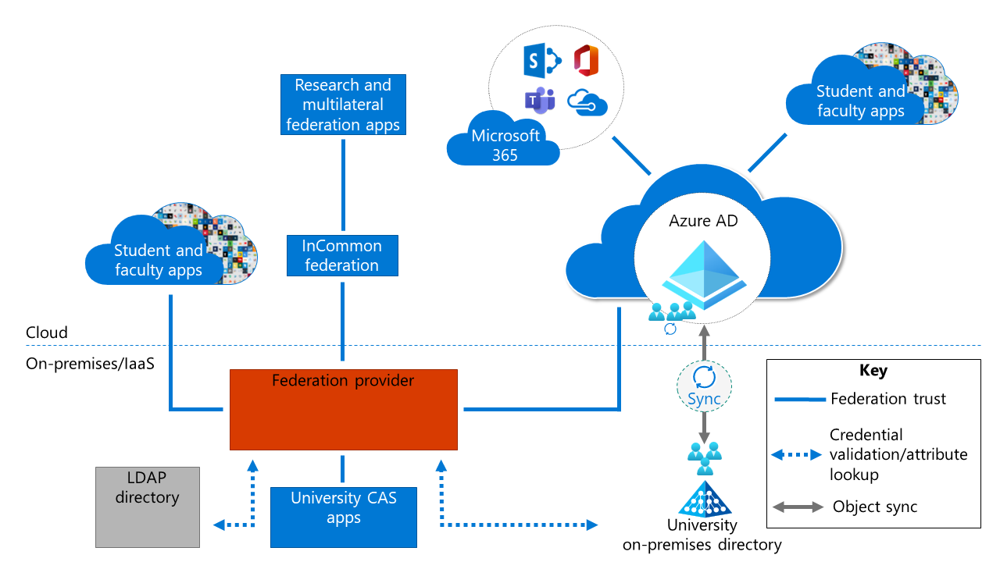

# Baseline architecture overview

Microsoft often speaks with research universities that operate in hybrid environments in which applications are either cloud based or hosted on-premises. In both cases, applications can use various authentication protocols. In some cases, these protocols are reaching end of life or aren't providing the required level of security.

Applications drive much of the need for different authentication protocols and different identity management (IdM) mechanisms.

In research university environments, research apps often drive IdM requirements. A university might use a federation provider, such as Shibboleth, as a primary identity provider (IdP). If so, Azure Active Directory (Azure AD) is often configured to federate with Shibboleth. If Microsoft 365 apps are also in use, Azure AD enables you to configure integration.

Applications used in research universities operate in various parts of the overall IT footprint:

* Research and multilateral federation applications are available through InCommon and eduGAIN.

* Library applications provide access to electronic journals and other e-content providers.

* Some applications use legacy authentication protocols such as Central Authentication Service to enable single sign-on.

* Student and faculty applications often use multiple authentication mechanisms. For example, some are integrated with Shibboleth or other federation providers, whereas others are integrated with Azure AD.

* Microsoft 365 applications are integrated with Azure AD.

* Windows Server Active Directory might be in use and synchronized with Azure AD.

* Lightweight Directory Access Protocol (LDAP) is in use at many universities that might have an external LDAP directory or identity registry. These registries are often used to house confidential attributes, role hierarchy information, and even certain types of users, such as applicants.

* On-premises Active Directory, or an external LDAP directory, is often used to enable single-credential sign-in for non-web applications and various non-Microsoft operating system sign-ins.

## Baseline architecture challenges

Baseline architectures often evolve over time, introducing complexity and rigidness to the design and the ability to update. Some of the challenges with using the baseline architecture include:

* **Hard to react to new requirements**: Having a complex environment makes it hard to quickly adapt and keep up with the most recent regulations and requirements. For example, if you have apps in lots of locations, and these apps are connected in different ways with different IdMs, you have to decide where to locate multifactor authentication (MFA) services and how to enforce MFA.

  Higher education also experiences fragmented service ownership. The people responsible for key services such as enterprise resource planning, learning management systems, division, and department solutions might resist efforts to change or modify the systems that they operate.

* **Can't take advantage of all Microsoft 365 capabilities for all apps** (for example, Intune, Conditional Access, passwordless): Many universities want to move toward the cloud and use their existing investments in Azure AD. However, with a different federation provider as their primary IdP, universities can't take advantage of all the Microsoft 365 capabilities for the rest of their apps.

* **Complexity of a solution**: There are many components to manage. Some components are in the cloud, and some are on-premises or in infrastructure as a service (IaaS) instances. Apps are operated in many places. From a user perspective, this experience can be disjointed. For example, users sometime see a Shibboleth sign-in page and other times see an Azure AD sign-in page.

We present three solutions to solve these challenges, while also addressing the following requirements:

* Ability to participate in multilateral federations such as InCommon and eduGAIN

* Ability to support all types of apps (even apps that require legacy protocols)

* Ability to support external directories and attribute stores

We present the three solutions in order, from most preferred to least preferred. Each satisfies requirements but introduces tradeoff decisions that are expected in a complex architecture. Based on your requirements and starting point, select the one that best suits your environment. We also provide a decision tree to aid in this decision.

## Next steps

See these related articles about multilateral federation:

[Multilateral federation introduction](multilateral-federation-introduction.md)

[Multilateral federation Solution 1: Azure AD with Cirrus Bridge](multilateral-federation-solution-one.md)

[Multilateral federation Solution 2: Azure AD with Shibboleth as a SAML proxy](multilateral-federation-solution-two.md)

[Multilateral federation Solution 3: Azure AD with AD FS and Shibboleth](multilateral-federation-solution-three.md)

[Multilateral federation decision tree](multilateral-federation-decision-tree.md)
