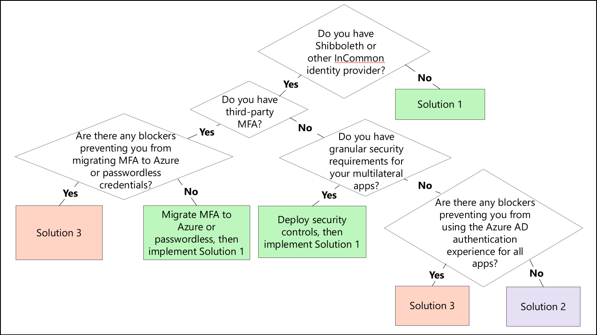

# Decision tree

Use this decision tree to determine the multilateral federation solution that's best suited for your environment.

## Migration resources

The following resources can help with your migration to the solutions covered in this content.

| Migration resource | Description | Relevant for  migrating to... |
| - | - | - |
| [Resources for migrating applications to Azure Active Directory](../manage-apps/migration-resources.md) | List of resources to help you migrate application access and authentication to Azure Active Directory (Azure AD) | Solution 1, Solution 2, and Solution 3 |
| [Azure AD custom claims provider](../develop/custom-claims-provider-overview.md)| Overview of the Azure AD custom claims provider | Solution 1 |
| [Custom security attributes](../fundamentals/custom-security-attributes-manage.md) | Steps for managing access to custom security attributes | Solution 1 |
| [Azure AD SSO integration with Cirrus Bridge](../saas-apps/cirrus-identity-bridge-for-azure-ad-tutorial.md) | Tutorial to integrate Cirrus Bridge with Azure AD | Solution 1 |
| [Cirrus Bridge overview](https://blog.cirrusidentity.com/documentation/azure-bridge-setup-rev-6.0) | Cirrus Identity documentation for configuring Cirrus Bridge with Azure AD | Solution 1 |
| [Configuring Shibboleth as a SAML proxy](https://shibboleth.atlassian.net/wiki/spaces/KB/pages/1467056889/Using+SAML+Proxying+in+the+Shibboleth+IdP+to+connect+with+Azure+AD) | Shibboleth article that describes how to use the SAML proxying feature to connect the Shibboleth identity provider (IdP) to Azure AD | Solution 2 |
| [Azure AD Multi-Factor Authentication deployment considerations](../authentication/howto-mfa-getstarted.md) | Guidance for configuring Azure AD Multi-Factor Authentication | Solution 1 and Solution 2 |

## Next steps

See these related articles about multilateral federation:

[Multilateral federation introduction](multilateral-federation-introduction.md)

[Multilateral federation baseline design](multilateral-federation-baseline.md)

[Multilateral federation Solution 1: Azure AD with Cirrus Bridge](multilateral-federation-solution-one.md)

[Multilateral federation Solution 2: Azure AD with Shibboleth as a SAML proxy](multilateral-federation-solution-two.md)

[Multilateral federation Solution 3: Azure AD with AD FS and Shibboleth](multilateral-federation-solution-three.md)
