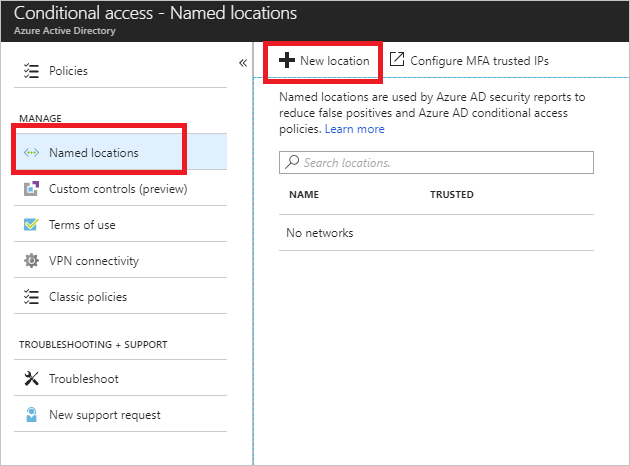
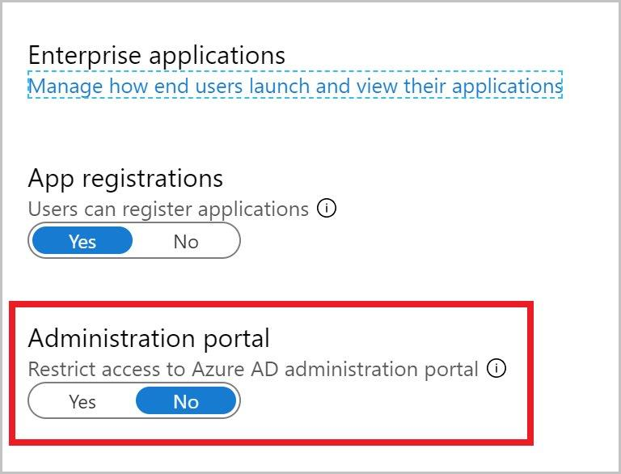
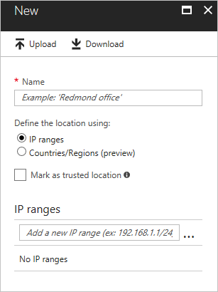

# Microsoft Entra authentication management operations reference guide

This section of the [Microsoft Entra operations reference guide](ops-guide-intro.md) describes the checks and actions you should take to secure and manage credentials, define authentication experience, delegate assignment, measure usage, and define access policies based on enterprise security posture.

> [!NOTE]
> These recommendations are current as of the date of publishing but can change over time. Organizations should continuously evaluate their identity practices as Microsoft products and services evolve over time.

## Key operational processes

### Assign owners to key tasks

Managing Microsoft Entra ID requires the continuous execution of key operational tasks and processes, which may not be part of a rollout project. It's still important you set up these tasks to optimize your environment. The key tasks and their recommended owners include:

| Task | Owner |
| :- | :- |
| Manage lifecycle of single sign-on (SSO) configuration in Microsoft Entra ID | IAM Operations Team |
| Design Conditional Access policies for Microsoft Entra applications | InfoSec Architecture Team |
| Archive sign-in activity in a SIEM system | InfoSec Operations Team |
| Archive risk events in a SIEM system | InfoSec Operations Team |
| Triage and investigate security reports | InfoSec Operations Team |
| Triage and investigate risk events | InfoSec Operations Team |
| Triage and investigate users flagged for risk and vulnerability reports from Microsoft Entra ID Protection | InfoSec Operations Team |

> [!NOTE]
> Microsoft Entra ID Protection requires a Microsoft Entra ID P2 license. To find the right license for your requirements, see [Comparing generally available features of the Microsoft Entra ID Free and Microsoft Entra ID P1 or P2 editions](https://www.microsoft.com/security/business/identity-access-management/azure-ad-pricing).

As you review your list, you may find you need to either assign an owner for tasks that are missing an owner or adjust ownership for tasks with owners that aren't aligned with the recommendations above.

#### Owner recommended reading

- [Assigning administrator roles in Microsoft Entra ID](../roles/permissions-reference.md)

## Credentials management

### Password policies

Managing passwords securely is one of the most critical parts of identity and access management and often the biggest target of attacks. Microsoft Entra ID supports several features that can help prevent an attack from being successful.

Use the table below to find the recommended solution for mitigating the issue that needs to be addressed:

| Issue | Recommendation |
| :- | :- |
| No mechanism to protect against weak passwords | Enable Microsoft Entra ID [self-service password reset (SSPR)](../authentication/concept-sspr-howitworks.md) and [password protection](../authentication/concept-password-ban-bad-on-premises.md) |
| No mechanism to detect leaked passwords | Enable [password hash sync](../hybrid/connect/how-to-connect-password-hash-synchronization.md) (PHS) to gain insights |
| Using AD FS and unable to move to managed authentication | Enable [AD FS Extranet Smart Lockout](/windows-server/identity/ad-fs/operations/configure-ad-fs-extranet-smart-lockout-protection) and / or [Microsoft Entra Smart Lockout](../authentication/howto-password-smart-lockout.md) |
| Password policy uses complexity-based rules such as length, multiple character sets, or expiration | Reconsider in favor of [Microsoft Recommended Practices](https://www.microsoft.com/research/publication/password-guidance/?from=http%3A%2F%2Fresearch.microsoft.com%2Fpubs%2F265143%2Fmicrosoft_password_guidance.pdf) and switch your approach to password management and deploy [Microsoft Entra password protection](../authentication/concept-password-ban-bad.md). |
| Users aren't registered to use multifactor authentication | [Register all user's security information](../identity-protection/howto-identity-protection-configure-mfa-policy.md) so it can be used as a mechanism to verify the user's identity along with their password |
| There is no revocation of passwords based on user risk | Deploy Microsoft Entra [Identity Protection user risk policies](../identity-protection/howto-identity-protection-configure-risk-policies.md) to force password changes on leaked credentials using SSPR |
| There's no smart lockout mechanism to protect malicious authentication from bad actors coming from identified IP addresses | Deploy cloud-managed authentication with either password hash sync or [pass-through authentication](../hybrid/connect/how-to-connect-pta-quick-start.md) (PTA) |

#### Password policies recommended reading

- [Microsoft Entra ID and AD FS best practices: Defending against password spray attacks - Enterprise Mobility + Security](https://cloudblogs.microsoft.com/enterprisemobility/2018/03/05/azure-ad-and-adfs-best-practices-defending-against-password-spray-attacks/)

### Enable self-service password reset and password protection

Users needing to change or reset their passwords is one of the biggest sources of volume and cost of help desk calls. In addition to cost, changing the password as a tool to mitigate a user risk is a fundamental step in improving the security posture of your organization.

At a minimum, it's recommended you deploy Microsoft Entra ID [self-service password reset](../authentication/concept-sspr-howitworks.md) (SSPR) and on-premises [password protection](../authentication/howto-password-ban-bad-on-premises-deploy.md) to accomplish:

- Deflect help desk calls.
- Replace the use of temporary passwords.
- Replace any existing self-service password management solution that relies on an on-premises solution.
- [Eliminate weak passwords](../authentication/concept-password-ban-bad.md) in your organization.

> [!NOTE]
> For organizations with a Microsoft Entra ID P2 subscription, it is recommended to deploy SSPR and use it as part of an [Identity Protection User Risk Policy](../identity-protection/howto-identity-protection-configure-risk-policies.md).

### Strong credential management

Passwords by themselves aren't secure enough to prevent bad actors from gaining access to your environment. At a minimum, any user with a privileged account must be enabled for multifactor authentication. Ideally, you should enable [combined registration](../authentication/concept-registration-mfa-sspr-combined.md) and require all users to register for MFA and SSPR using the [combined registration experience](https://support.microsoft.com/account-billing/set-up-your-security-info-from-a-sign-in-prompt-28180870-c256-4ebf-8bd7-5335571bf9a8). Eventually, we recommend you adopt a strategy to [provide resilience](../authentication/concept-resilient-controls.md) to reduce the risk of lockout due to unforeseen circumstances.

### On-premises outage authentication resiliency

In addition to the benefits of simplicity and enabling leaked credential detection, Microsoft Entra Password Hash Sync (PHS) and Microsoft Entra multifactor authentication allow users to access SaaS applications and Microsoft 365 in spite of on-premises outages due to cyberattacks such as [NotPetya](https://www.microsoft.com/security/blog/2018/02/05/overview-of-petya-a-rapid-cyberattack/). It's also possible to enable PHS while in conjunction with federation. Enabling PHS allows a fallback of authentication when federation services aren't available.

If your on-premises organization is lacking an outage resiliency strategy or has one that isn't integrated with Microsoft Entra ID, you should deploy Microsoft Entra PHS and define a disaster recovery plan that includes PHS. Enabling Microsoft Entra PHS will allow users to authenticate against Microsoft Entra ID should your on-premises Active Directory be unavailable.

To better understand your authentication options, see [Choose the right authentication method for your Microsoft Entra hybrid identity solution](../hybrid/connect/choose-ad-authn.md).

### Programmatic usage of credentials

Microsoft Entra ID scripts using PowerShell or applications using the Microsoft Graph API require secure authentication. Poor credential management executing those scripts and tools increase the risk of credential theft. If you're using scripts or applications that rely on hard-coded passwords or password prompts you should first review passwords in config files or source code, then replace those dependencies and use Azure Managed Identities, Integrated-Windows Authentication, or [certificates](../reports-monitoring/howto-configure-prerequisites-for-reporting-api.md) whenever possible. For applications where the previous solutions aren't possible, consider using [Azure Key Vault](https://azure.microsoft.com/services/key-vault/).

If you determine that there are service principals with password credentials and you're unsure how those password credentials are secured by scripts or applications, contact the owner of the application to better understand usage patterns.

Microsoft also recommends you contact application owners to understand usage patterns if there are service principals with password credentials.

## Authentication experience

### On-premises authentication

Federated Authentication with integrated Windows authentication (IWA) or Seamless Single Sign-On (SSO) managed authentication with password hash sync or pass-through authentication is the best user experience when inside the corporate network with line-of-sight to on-premises domain controllers. It minimizes credential prompt fatigue and reduces the risk of users falling prey to phishing attacks. If you're already using cloud-managed authentication with PHS or PTA, but users still need to type in their password when authenticating on-premises, then you should immediately [deploy Seamless SSO](../hybrid/connect/how-to-connect-sso.md). On the other hand, if you're currently federated with plans to eventually migrate to cloud-managed authentication, then you should implement Seamless SSO as part of the migration project.

### Device trust access policies

Like a user in your organization, a device is a core identity you want to protect. You can use a device's identity to protect your resources at any time and from any location. Authenticating the device and accounting for its trust type improves your security posture and usability by:

- Avoiding friction, for example, with MFA, when the device is trusted
- Blocking access from untrusted devices
- For Windows 10 devices, provide [single sign-on to on-premises resources seamlessly](../devices/device-sso-to-on-premises-resources.md).

You can carry out this goal by bringing device identities and managing them in Microsoft Entra ID by using one of the following methods:

- Organizations can use [Microsoft Intune](/intune/what-is-intune) to manage the device and enforce compliance policies, attest device health, and set Conditional Access policies based on whether the device is compliant. Microsoft Intune can manage iOS devices, Mac desktops (Via JAMF integration), Windows desktops (natively using Mobile Device Management for Windows 10, and co-management with Microsoft Configuration Manager) and Android mobile devices.
- [Microsoft Entra hybrid join](../devices/how-to-hybrid-join.md) provides management with Group Policies or Microsoft Configuration Manager in an environment with Active Directory domain-joined computers devices. Organizations can deploy a managed environment either through PHS or PTA with Seamless SSO. Bringing your devices to Microsoft Entra ID maximizes user productivity through SSO across your cloud and on-premises resources while enabling you to secure access to your cloud and on-premises resources with [Conditional Access](../conditional-access/overview.md) at the same time.

If you have domain-joined Windows devices that aren't registered in the cloud, or domain-joined Windows devices that are registered in the cloud but without Conditional Access policies, then you should register the unregistered devices and, in either case, [use Microsoft Entra hybrid join as a control](../conditional-access/concept-conditional-access-grant.md) in your Conditional Access policies.

If you're managing devices with MDM or Microsoft Intune, but not using device controls in your Conditional Access policies, then we recommend using [Require device to be marked as compliant](../conditional-access/concept-conditional-access-grant.md#require-device-to-be-marked-as-compliant) as a control in those policies.

#### Device trust access policies recommended reading

- [How To: Plan your Microsoft Entra hybrid join implementation](../devices/hybrid-join-plan.md)
- [Identity and device access configurations](/microsoft-365/enterprise/microsoft-365-policies-configurations)

### Windows Hello for Business

In Windows 10, [Windows Hello for Business](/windows/security/identity-protection/hello-for-business/hello-identity-verification) replaces passwords with strong two-factor authentication on PCs. Windows Hello for Business enables a more streamlined MFA experience for users and reduces your dependency on passwords. If you haven't begun rolling out Windows 10 devices, or have only partially deployed them, we recommend you upgrade to Windows 10 and [enable Windows Hello for Business](/windows/security/identity-protection/hello-for-business/hello-manage-in-organization) on all devices.

If you would like to learn more about passwordless authentication, see [A world without passwords with Microsoft Entra ID](../authentication/concept-authentication-passwordless.md).

## Application authentication and assignment

### Single sign-on for apps

Providing a standardized single sign-on mechanism to the entire enterprise is crucial for best user experience, reduction of risk, ability to report, and governance. If you're using applications that support SSO with Microsoft Entra ID but are currently configured to use local accounts, you should reconfigure those applications to use SSO with Microsoft Entra ID. Likewise, if you're using any applications that support SSO with Microsoft Entra ID but are using another Identity Provider, you should reconfigure those applications to use SSO with Microsoft Entra ID as well. For applications that don't support federation protocols but do support forms-based authentication, we recommend you configure the application to use [password vaulting](../app-proxy/application-proxy-configure-single-sign-on-password-vaulting.md) with Microsoft Entra application proxy.

> [!NOTE]
> If you don't have a mechanism to discover unmanaged applications in your organization, we recommend implementing a discovery process using a cloud access security broker solution (CASB) such as [Microsoft Defender for Cloud Apps](https://www.microsoft.com/enterprise-mobility-security/cloud-app-security).

Finally, if you have a Microsoft Entra app gallery and use applications that support SSO with Microsoft Entra ID, we recommend [listing the application in the app gallery](../manage-apps/v2-howto-app-gallery-listing.md).

#### Single sign-on recommended reading

- [What is application access and single sign-on with Microsoft Entra ID](../manage-apps/what-is-single-sign-on.md)

### Migration of AD FS applications to Microsoft Entra ID

[Migrating apps from AD FS to Microsoft Entra ID](../manage-apps/migrate-adfs-apps-stages.md) enables additional capabilities on security, more consistent manageability, and a better collaboration experience. If you have applications configured in AD FS that support SSO with Microsoft Entra ID, then you should reconfigure those applications to use SSO with Microsoft Entra ID. If you have applications configured in AD FS with uncommon configurations unsupported by Microsoft Entra ID, you should contact the app owners to understand if the special configuration is an absolute requirement of the application. If it isn't required, then you should reconfigure the application to use SSO with Microsoft Entra ID.

> [!NOTE]
> [Microsoft Entra Connect Health for ADFS](../hybrid/connect/how-to-connect-health-adfs.md) can be used to collect configuration details about each application that can potentially be migrated to Microsoft Entra ID.

### Assign users to applications

[Assigning users to applications](../manage-apps/assign-user-or-group-access-portal.md) is best mapped by using groups because they allow greater flexibility and ability to manage at scale. The benefits of using groups include [attribute-based dynamic group membership](../enterprise-users/groups-dynamic-membership.md) and [delegation to app owners](../fundamentals/how-to-manage-groups.md). Therefore, if you're already using and managing groups, we recommend you take the following actions to improve management at scale:

- Delegate group management and governance to application owners.
- Allow self-service access to the application.
- Define dynamic groups if user attributes can consistently determine access to applications.
- Implement attestation to groups used for application access using [Microsoft Entra access reviews](../governance/access-reviews-overview.md).

On the other hand, if you find applications that have assignment to individual users, be sure to implement [governance](../governance/index.yml) around those applications.

#### Assign users to applications recommended reading

- [Assign users and groups to an application in Microsoft Entra ID](../manage-apps/assign-user-or-group-access-portal.md)
- [Delegate app registration permissions in Microsoft Entra ID](../roles/delegate-app-roles.md)
- [Dynamic membership rules for groups in Microsoft Entra ID](../enterprise-users/groups-dynamic-membership.md)

## Access policies

### Named locations

With [named locations](../conditional-access/location-condition.md) in Microsoft Entra ID, you can label trusted IP address ranges in your organization. Microsoft Entra ID uses named locations to:

- Prevent false positives in risk events. Signing in from a trusted network location lowers a user's sign-in risk.
- Configure [location-based Conditional Access](../conditional-access/location-condition.md).

Based on priority, use the table below to find the recommended solution that best meets your organization's needs:

| **Priority** | **Scenario** | **Recommendation** |
| ------------ | -------------------------------------------------------------------------------------------------------------------------------------- | ----------------------------------------------------------------------------------- |
| 1 | If you use PHS or PTA and named locations haven't been defined | Define named locations to improve detection of risk events |
| 2 | If you're federated and don't use "insideCorporateNetwork" claim and named locations haven't been defined | Define named locations to improve detection of risk events |
| 3 | If you don't use named locations in Conditional Access policies and there's no risk or device controls in Conditional Access policies | Configure the Conditional Access policy to include named locations |
| 4 | If you're federated and do use "insideCorporateNetwork" claim and named locations haven't been defined | Define named locations to improve detection of risk events |
| 5 | If you're using trusted IP addresses with MFA rather than named locations and marking them as trusted | Define named locations and mark them as trusted to improve detection of risk events |

### Risk-based access policies

Microsoft Entra ID can calculate the risk for every sign-in and every user. Using risk as a criterion in access policies can provide a better user experience, for example, fewer authentication prompts, and better security, for example, only prompt users when they're needed, and automate the response and remediation.

If you already own Microsoft Entra ID P2 licenses that support using risk in access policies, but they aren't being used, we highly recommend adding risk to your security posture.

#### Risk-based access policies recommended reading

- [How To: Configure the sign-in risk policy](../identity-protection/howto-identity-protection-configure-risk-policies.md)
- [How To: Configure the user risk policy](../identity-protection/howto-identity-protection-configure-risk-policies.md)

### Client application access policies

Microsoft Intune Application Management (MAM) provides the ability to push data protection controls such as storage encryption, PIN, remote storage cleanup, etc. to compatible client mobile applications such as Outlook Mobile. In addition, Conditional Access policies can be created to [restrict access](../conditional-access/howto-policy-approved-app-or-app-protection.md) to cloud services such as Exchange Online from approved or compatible apps.

If your employees install MAM-capable applications such as Office mobile apps to access corporate resources such as Exchange Online or SharePoint Online, and you also support BYOD (bring your own device), we recommend you deploy application MAM policies to manage the application configuration in personally owned devices without MDM enrollment and then update your Conditional Access policies to only allow access from MAM-capable clients.

Should employees install MAM-capable applications against corporate resources and access is restricted on Intune Managed devices, then you should consider deploying application MAM policies to manage the application configuration for personal devices, and update Conditional Access policies to only allow access from MAM capable clients.

### Conditional Access implementation

Conditional Access is an essential tool for improving the security posture of your organization. Therefore, it is important you follow these best practices:

- Ensure that all SaaS applications have at least one policy applied
- Avoid combining the **All apps** filter with the **block** control to avoid lockout risk
- Avoid using the **All users** as a filter and inadvertently adding **Guests**
- **Migrate all "legacy" policies to the Azure portal**
- Catch all criteria for users, devices, and applications
- Use Conditional Access policies to [implement MFA](../conditional-access/plan-conditional-access.md), rather than using a **per-user MFA**
- Have a small set of core policies that can apply to multiple applications
- Define empty exception groups and add them to the policies to have an exception strategy
- Plan for [break glass](../roles/security-planning.md#break-glass-what-to-do-in-an-emergency) accounts without MFA controls
- Ensure a consistent experience across Microsoft 365 client applications, for example, Teams, OneDrive, Outlook, etc.) by implementing the same set of controls for services such as Exchange Online and SharePoint Online
- Assignment to policies should be implemented through groups, not individuals
- Do regular reviews of the exception groups used in policies to limit the time users are out of the security posture. If you own Microsoft Entra ID P2, then you can use access reviews to automate the process

#### Conditional Access recommended reading

- [Best practices for Conditional Access in Microsoft Entra ID](../conditional-access/overview.md)
- [Identity and device access configurations](/microsoft-365/enterprise/microsoft-365-policies-configurations)
- [Microsoft Entra Conditional Access settings reference](../conditional-access/concept-conditional-access-conditions.md)
- [Common Conditional Access policies](../conditional-access/concept-conditional-access-policy-common.md)

## Access surface area

### Legacy authentication

Strong credentials such as MFA cannot protect apps using legacy authentication protocols, which make it the preferred attack vector by malicious actors. Locking down legacy authentication is crucial to improve the access security posture.

Legacy authentication is a term that refers to authentication protocols used by apps like:

- Older Office clients that don't use modern authentication (for example, Office 2010 client)
- Clients that use mail protocols such as IMAP/SMTP/POP

Attackers strongly prefer these protocols - in fact, nearly [100% of password spray attacks](https://techcommunity.microsoft.com/t5/Azure-Active-Directory-Identity/Your-Pa-word-doesn-t-matter/ba-p/731984) use legacy authentication protocols! Hackers use legacy authentication protocols, because they don't support interactive sign-in, which is needed for additional security challenges like multifactor authentication and device authentication.

If legacy authentication is widely used in your environment, you should plan to migrate legacy clients to clients that support [modern authentication](/office365/enterprise/modern-auth-for-office-2013-and-2016) as soon as possible. In the same token, if you have some users already using modern authentication but others that still use legacy authentication, you should take the following steps to lock down legacy authentication clients:

1. Use [Sign-In Activity reports](../reports-monitoring/concept-sign-ins.md) to identify users who are still using legacy authentication and plan remediation:

   a. Upgrade to modern authentication capable clients to affected users.
   
   b. Plan a cutover timeframe to lock down per steps below.
   
   c. Identify what legacy applications have a hard dependency on legacy authentication. See step 3 below.

2. Disable legacy protocols at the source (for example Exchange Mailbox) for users who aren't using legacy auth to avoid more exposure.
3. For the remaining accounts (ideally non-human identities such as service accounts), use [Conditional Access to restrict legacy protocols](https://techcommunity.microsoft.com/t5/Azure-Active-Directory-Identity/Azure-AD-Conditional-Access-support-for-blocking-legacy-auth-is/ba-p/245417) post-authentication.

#### Legacy authentication recommended reading

- [Enable or disable POP3 or IMAP4 access to mailboxes in Exchange Server](/exchange/clients/pop3-and-imap4/configure-mailbox-access)

### Consent grants

In an illicit consent grant attack, the attacker creates a Microsoft Entra registered application that requests access to data such as contact information, email, or documents. Users might be granting consent to malicious applications via phishing attacks when landing on malicious websites.

Below are a list of apps with permissions you might want to scrutinize for Microsoft cloud services:

- Apps with app or delegated \*.ReadWrite Permissions
- Apps with delegated permissions can read, send, or manage email on behalf of the user
- Apps that are granted the using the following permissions:

| Resource | Permission |
| :- | :- |
| Exchange Online | EAS.AccessAsUser.All |
| | EWS.AccessAsUser.All |
| | Mail.Read |
| Microsoft Graph API | Mail.Read |
| | Mail.Read.Shared |
| | Mail.ReadWrite |

- Apps granted full user impersonation of the signed-in user. For example:

|Resource | Permission |
| :- | :- |
| Microsoft Graph API| Directory.AccessAsUser.All |
| Azure REST API | user_impersonation |

To avoid this scenario, you should refer to [detect and remediate illicit consent grants in Office 365](/office365/securitycompliance/detect-and-remediate-illicit-consent-grants) to identify and fix any applications with illicit grants or applications that have more grants than are necessary. Next, [remove self-service altogether](../manage-apps/configure-user-consent.md) and [establish governance procedures](../manage-apps/configure-admin-consent-workflow.md). Finally, schedule regular reviews of app permissions and remove them when they are not needed.

#### Consent grants recommended reading

- [Overview of Microsoft Graph permissions](/graph/permissions-overview)
- [Microsoft Graph API permissions](/graph/permissions-reference)

### User and group settings

Below are the user and group settings that can be locked down if there isn't an explicit business need:

#### User settings

- **External Users** - external collaboration can happen organically in the enterprise with services like Teams, Power BI, SharePoint Online, and Azure Information Protection. If you have explicit constraints to control user-initiated external collaboration, it is recommended you enable external users by using [Microsoft Entra Entitlement management](../governance/entitlement-management-overview.md) or a controlled operation such as through your help desk. If you don't want to allow organic external collaboration for services, you can [block members from inviting external users completely](../external-identities/external-collaboration-settings-configure.md). Alternatively, you can also [allow or block specific domains](../external-identities/allow-deny-list.md) in external user invitations.
- **App Registrations** - when App registrations are enabled, end users can onboard applications themselves and grant access to their data. A typical example of App registration is users enabling Outlook plug-ins, or voice assistants such as Alexa and Siri to read their email and calendar or send emails on their behalf. If the customer decides to turn off App registration, the InfoSec and IAM teams must be involved in the management of exceptions (app registrations that are needed based on business requirements), as they would need to register the applications with an admin account, and most likely require designing a process to operationalize the process.
- **Administration Portal** - organizations can lock down the Microsoft Entra blade in the Azure portal so that non-administrators can't access Microsoft Entra management in the Azure portal and get confused. Go to the user settings in the Microsoft Entra management portal to restrict access:

> [!NOTE]
> Non-administrators can still access to the Microsoft Entra management interfaces via command-line and other programmatic interfaces.

#### Group settings

**Self-Service Group Management / Users can create Security groups / Microsoft 365 groups.** If there's no current self-service initiative for groups in the cloud, customers might decide to turn it off until they're ready to use this capability.

#### Groups recommended reading

- [What is Microsoft Entra B2B collaboration?](../external-identities/what-is-b2b.md)
- [Integrating Applications with Microsoft Entra ID](../develop/quickstart-register-app.md)
- [Apps, permissions, and consent in Microsoft Entra ID.](../develop/quickstart-register-app.md)
- [Use groups to manage access to resources in Microsoft Entra ID](../fundamentals/concept-learn-about-groups.md)
- [Setting up self-service application access management in Microsoft Entra ID](../enterprise-users/groups-self-service-management.md)

### Traffic from unexpected locations

Attackers originate from various parts of the world. Manage this risk by using Conditional Access policies with location as the condition. The [location condition](../conditional-access/location-condition.md) of a Conditional Access policy enables you to block access for locations from where there's no business reason to sign in from.

If available, use a security information and event management (SIEM) solution to analyze and find patterns of access across regions. If you don't use a SIEM product, or it isn't ingesting authentication information from Microsoft Entra ID, we recommend you use [Azure Monitor](../../azure-monitor/overview.md) to identify patterns of access across regions.

## Access usage

### Microsoft Entra logs archived and integrated with incident response plans

Having access to sign-in activity, audits and risk events for Microsoft Entra ID is crucial for troubleshooting, usage analytics, and forensics investigations. Microsoft Entra ID provides access to these sources through REST APIs that have a limited retention period. A security information and event management (SIEM) system, or equivalent archival technology, is key for long-term storage of audits and supportability. To enable long-term storage of Microsoft Entra logs, you must either add them to your existing SIEM solution or use [Azure Monitor](../reports-monitoring/concept-activity-logs-azure-monitor.md). Archive logs that can be used as part of your incident response plans and investigations.

#### Logs recommended reading

- [Microsoft Entra ID audit API reference](/graph/api/resources/directoryaudit)
- [Microsoft Entra sign-in activity report API reference](/graph/api/resources/signin)
- [Get data using the Microsoft Entra reporting API with certificates](../reports-monitoring/howto-configure-prerequisites-for-reporting-api.md)
- [Microsoft Graph for Microsoft Entra ID Protection](../identity-protection/howto-identity-protection-graph-api.md)
- [Office 365 Management Activity API reference](/office/office-365-management-api/office-365-management-activity-api-reference)
- [How to use the Microsoft Entra ID Power BI Content Pack](../reports-monitoring/howto-use-azure-monitor-workbooks.md)

## Summary

There are 12 aspects to a secure Identity infrastructure. This list will help you further secure and manage credentials, define authentication experience, delegate assignment, measure usage, and define access policies based on enterprise security posture.

- Assign owners to key tasks.
- Implement solutions to detect weak or leaked passwords, improve password management and protection, and further secure user access to resources.
- Manage the identity of devices to protect your resources at any time and from any location.
- Implement passwordless authentication.
- Provide a standardized single sign-on mechanism across the organization.
- Migrate apps from AD FS to Microsoft Entra ID to enable better security and more consistent manageability.
- Assign users to applications by using groups to allow greater flexibility and ability to manage at scale.
- Configure risk-based access policies.
- Lock down legacy authentication protocols.
- Detect and remediate illicit consent grants.
- Lock down user and group settings.
- Enable long-term storage of Microsoft Entra logs for troubleshooting, usage analytics, and forensics investigations.

## Next steps

Get started with the [Identity governance operational checks and actions](ops-guide-govern.md).
