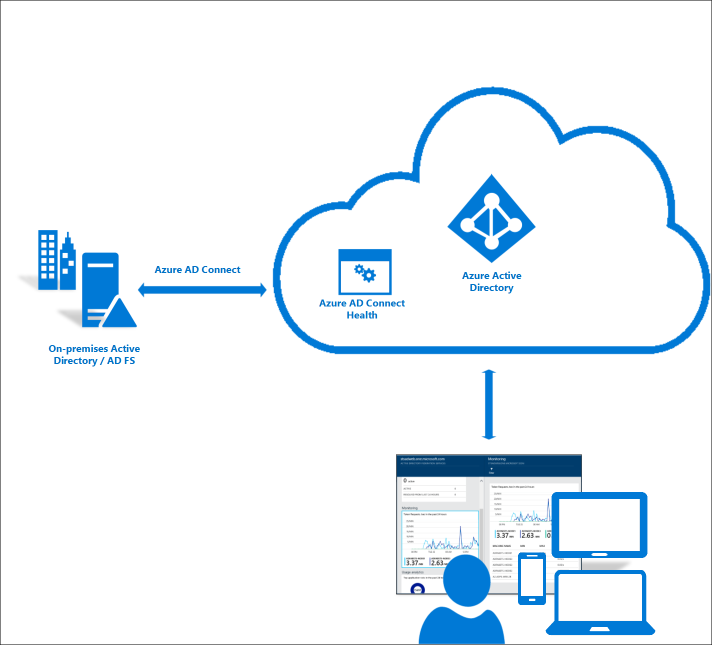
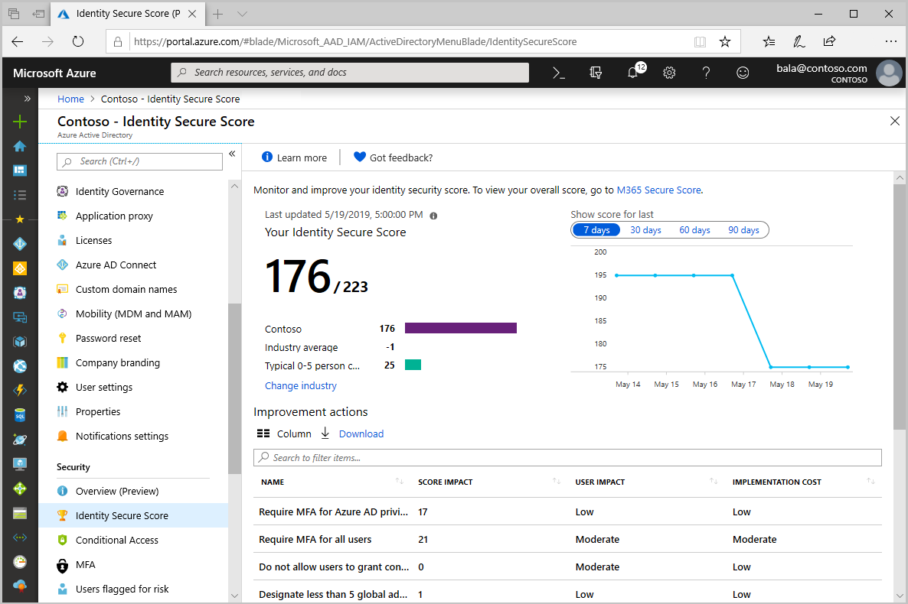

# Microsoft Entra general operations guide reference

This section of the [Microsoft Entra operations reference guide](ops-guide-intro.md) describes the checks and actions you should take to optimize the general operations of Microsoft Entra ID.

> [!NOTE]
> These recommendations are current as of the date of publishing but can change over time. Organizations should continuously evaluate their operational practices as Microsoft products and services evolve over time.

## Key operational processes

### Assign owners to key tasks

Managing Microsoft Entra ID requires the continuous execution of key operational tasks and processes, which may not be part of a rollout project. It's still important you set up these tasks to optimize your environment. The key tasks and their recommended owners include:

| Task | Owner |
| :- | :- |
| Drive Improvements on Identity Secure Score | InfoSec Operations Team |
| Maintain Microsoft Entra Connect Servers | IAM Operations Team |
| Regularly execute and triage IdFix Reports | IAM Operations Team |
| Triage Microsoft Entra Connect Health Alerts for Sync and AD FS | IAM Operations Team |
| If not using Microsoft Entra Connect Health, then customer has equivalent process and tools to monitor custom infrastructure | IAM Operations Team |
| If not using AD FS, then customer has equivalent process and tools to monitor custom infrastructure | IAM Operations Team |
| Monitor Hybrid Logs: Microsoft Entra application proxy Connectors | IAM Operations Team |
| Monitor Hybrid Logs: Passthrough Authentication Agents | IAM Operations Team |
| Monitor Hybrid Logs: Password Writeback Service | IAM Operations Team |
| Monitor Hybrid Logs: On-premises password protection gateway | IAM Operations Team |
| Monitor Hybrid Logs: Microsoft Entra multifactor authentication NPS Extension (if applicable) | IAM Operations Team |

As you review your list, you may find you need to either assign an owner for tasks that are missing an owner or adjust ownership for tasks with owners that aren't aligned with the recommendations above.

#### Owners recommended reading

- [Assigning administrator roles in Microsoft Entra ID](../roles/permissions-reference.md)

## Hybrid management

### Recent versions of on-premises components

Having the most up-to-date versions of on-premises components provides the customer all the latest security updates, performance improvements and functionality that could help to further simplify the environment. Most components have an automatic upgrade setting, which will automate the upgrade process.

These components include:

- Microsoft Entra Connect
- Microsoft Entra application proxy Connectors
- Microsoft Entra pass-through authentication agents
- Microsoft Entra Connect Health Agents

Unless one has been established, you should define a process to upgrade these components and rely on the automatic upgrade feature whenever possible. If you find components that are six or more months behind, you should upgrade as soon as possible.

#### Hybrid management recommended reading

- [Microsoft Entra Connect: Automatic upgrade](../hybrid/connect/how-to-connect-install-automatic-upgrade.md)
- [Understand Microsoft Entra application proxy connectors | Automatic updates](../app-proxy/application-proxy-connectors.md#automatic-updates)

### Microsoft Entra Connect Health alert baseline

Organizations should deploy [Microsoft Entra Connect Health](../hybrid/connect/whatis-azure-ad-connect.md#what-is-azure-ad-connect-health) for monitoring and reporting of Microsoft Entra Connect and AD FS. Microsoft Entra Connect and AD FS are critical components that can break lifecycle management and authentication and therefore lead to outages. Microsoft Entra Connect Health helps monitor and gain insights into your on-premises identity infrastructure thus ensuring the reliability of your environment.

As you monitor the health of your environment, you must immediately address any high severity alerts, followed by lower severity alerts.

#### Microsoft Entra Connect Health recommended reading

- [Microsoft Entra Connect Health Agent Installation](../hybrid/connect/how-to-connect-health-agent-install.md)

### On-premises agents logs

Some identity and access management services require on-premises agents to enable hybrid scenarios. Examples include password reset, pass-through authentication (PTA), Microsoft Entra application proxy, and Microsoft Entra multifactor authentication NPS extension. It's key that the operations team baseline and monitor the health of these components by archiving and analyzing the component agent logs using solutions such as System Center Operations Manager or SIEM. It's equally important your Infosec Operations team or help desk understand how to troubleshoot patterns of errors.

#### On-premises agents logs recommended reading

- [Troubleshoot Application Proxy](../app-proxy/application-proxy-troubleshoot.md)
- [Self-service password reset troubleshooting](../authentication/troubleshoot-sspr.md)
- [Understand Microsoft Entra application proxy connectors](../app-proxy/application-proxy-connectors.md)
- [Microsoft Entra Connect: Troubleshoot Pass-through Authentication](../hybrid/connect/tshoot-connect-pass-through-authentication.md#collecting-pass-through-authentication-agent-logs)
- [Troubleshoot error codes for the Microsoft Entra multifactor authentication NPS extension](../authentication/howto-mfa-nps-extension-errors.md)

### On-premises agents management

Adopting best practices can help the optimal operation of on-premises agents. Consider the following best practices:

- Multiple Microsoft Entra application proxy connectors per connector group are recommended to provide seamless load balancing and high availability by avoiding single points of failure when accessing the proxy applications. If you presently have only one connector in a connector group that handles applications in production, you should deploy at least two connectors for redundancy.
- Creating and using an app proxy connector group for debugging purposes can be useful for troubleshooting scenarios and when onboarding new on-premises applications. We also recommend installing networking tools such as Message Analyzer and Fiddler in the connector machines.
- Multiple pass-through authentication agents are recommended to provide seamless load balancing and high availability by avoiding single point of failure during the authentication flow. Be sure to deploy at least two pass-through authentication agents for redundancy.

#### On-premises agents management recommended reading

- [Understand Microsoft Entra application proxy connectors](../app-proxy/application-proxy-connectors.md)
- [Microsoft Entra pass-through authentication - quickstart](../hybrid/connect/how-to-connect-pta-quick-start.md#step-4-ensure-high-availability)

## Management at scale

### Identity secure score

The [identity secure score](./../fundamentals/identity-secure-score.md) provides a quantifiable measure of the security posture of your organization. It's key to constantly review and address findings reported and strive to have the highest score possible. The score helps you to:

- Objectively measure your identity security posture
- Plan identity security improvements
- Review the success of your improvements

If your organization currently has no program in place to monitor changes in Identity Secure Score, it is recommended you implement a plan and assign owners to monitor and drive improvement actions. Organizations should remediate improvement actions with a score impact higher than 30 as soon as possible.

### Notifications

Microsoft sends email communications to administrators to notify various changes in the service, configuration updates that are needed, and errors that require admin intervention. It's important that customers set the notification email addresses so that notifications are sent to the proper team members who can acknowledge and act upon all notifications. We recommend you add multiple recipients to the [Message Center](/office365/admin/manage/message-center) and request that notifications (including Microsoft Entra Connect Health notifications) be sent to a distribution list or shared mailbox. If you only have one Global Administrator account with an email address, be sure to configure at least two email-capable accounts.

There are two "From" addresses used by Microsoft Entra ID: <o365mc@email2.microsoft.com>, which sends Message Center notifications; and <azure-noreply@microsoft.com>, which sends notifications related to:

- [Microsoft Entra access reviews](../governance/access-reviews-overview.md)
- [Microsoft Entra Connect Health](../hybrid/connect/how-to-connect-health-operations.md#enable-email-notifications)
- [Microsoft Entra ID Protection](../identity-protection/howto-identity-protection-configure-notifications.md)
- [Microsoft Entra Privileged Identity Management](../privileged-identity-management/pim-email-notifications.md)
- [Enterprise App Expiring Certificate Notifications](../manage-apps/tutorial-manage-certificates-for-federated-single-sign-on.md#add-email-notification-addresses-for-certificate-expiration)
- Enterprise App Provisioning Service Notifications

Refer to the following table to learn the type of notifications that are sent and where to check for them:

| Notification source | What is sent | Where to check |
|:-|:-|:-|
| Technical contact | Sync errors | Azure portal - properties blade |
| Message Center | Incident and degradation notices of Identity Services and Microsoft 365 backend services | Office Portal |
| Identity Protection Weekly Digest | Identity Protection Digest | Microsoft Entra ID Protection blade |
| Microsoft Entra Connect Health | Alert notifications | Azure portal - Microsoft Entra Connect Health blade |
| Enterprise Applications Notifications | Notifications when certificates are about to expire and provisioning errors | Azure portal - Enterprise Application blade (each app has its own email address setting) |

#### Notifications recommended reading

- [Change your organization's address, technical contact, and more](/office365/admin/manage/change-address-contact-and-more)

## Operational surface area

### AD FS lockdown

Organizations, which configure applications to authenticate directly to Microsoft Entra ID benefit from [Microsoft Entra smart lockout](../authentication/concept-sspr-howitworks.md). If you use AD FS in Windows Server 2012 R2, implement AD FS [extranet lockout protection](/windows-server/identity/ad-fs/operations/configure-ad-fs-extranet-soft-lockout-protection). If you use AD FS on Windows Server 2016 or later, implement [extranet smart lockout](https://support.microsoft.com/help/4096478/extranet-smart-lockout-feature-in-windows-server-2016). At a minimum, we recommend you enable extranet lockout to contain the risk of brute force attacks against on-premises Active Directory. However, if you have AD FS in Windows 2016 or higher, you should also enable extranet smart lockout that will help to mitigate [password spray](https://www.microsoft.com/microsoft-365/blog/2018/03/05/azure-ad-and-adfs-best-practices-defending-against-password-spray-attacks/) attacks.

If AD FS is only used for Microsoft Entra federation, there are some endpoints that can be turned off to minimize the attack surface area. For example, if AD FS is only used for Microsoft Entra ID, you should disable WS-Trust endpoints other than the endpoints enabled for **usernamemixed** and **windowstransport**.

### Access to machines with on-premises identity components

Organizations should lock down access to the machines with on-premises hybrid components in the same way as your on-premises domain. For example, a backup operator or Hyper-V administrator shouldn't be able to sign in to the Microsoft Entra Connect Server to change rules.

The Active Directory administrative tier model was designed to protect identity systems using a set of buffer zones between full control of the Environment (Tier 0) and the high-risk workstation assets that attackers frequently compromise.

The [tier model](/windows-server/identity/securing-privileged-access/securing-privileged-access-reference-material) is composed of three levels and only includes administrative accounts, not standard user accounts.

- **Tier 0** - Direct Control of enterprise identities in the environment. Tier 0 includes accounts, groups, and other assets that have direct or indirect administrative control of the Active Directory forest, domains, or domain controllers, and all the assets in it. The security sensitivity of all Tier 0 assets is equivalent as they're all effectively in control of each other.
- **Tier 1** - Control of enterprise servers and applications. Tier 1 assets include server operating systems, cloud services, and enterprise applications. Tier 1 administrator accounts have administrative control of a significant amount of business value that is hosted on these assets. A common example role is server administrators who maintain these operating systems with the ability to impact all enterprise services.
- **Tier 2** - Control of user workstations and devices. Tier 2 administrator accounts have administrative control of a significant amount of business value that is hosted on user workstations and devices. Examples include Help Desk and computer support administrators because they can impact the integrity of almost any user data.

Lock down access to on-premises identity components such as Microsoft Entra Connect, AD FS, and SQL services the same way as you do for domain controllers.

## Summary

There are seven aspects to a secure Identity infrastructure. This list will help you find the actions you should take to optimize the operations for Microsoft Entra ID.

- Assign owners to key tasks.
- Automate the upgrade process for on-premises hybrid components.
- Deploy Microsoft Entra Connect Health for monitoring and reporting of Microsoft Entra Connect and AD FS.
- Monitor the health of on-premises hybrid components by archiving and analyzing the component agent logs using System Center Operations Manager or a SIEM solution.
- Implement security improvements by measuring your security posture with Identity Secure Score.
- Lock down AD FS.
- Lock down access to machines with on-premises identity components.

## Next steps

Refer to the [Microsoft Entra deployment plans](deployment-plans.md) for implementation details on any capabilities you haven't deployed.
