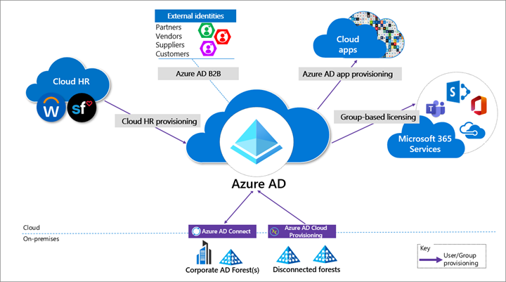

  
# Protecting Microsoft 365 from on-premises attacks

Many customers connect their private corporate networks to Microsoft 365 to benefit their users, devices, and applications. However, these private networks can be compromised in many well-documented ways. Microsoft 365 acts as a sort of nervous system for many organizations. It's critical to protect it from compromised on-premises infrastructure.

This article shows you how to configure your systems to help protect your Microsoft 365 cloud environment from on-premises compromise, including the following elements:

- Microsoft Entra tenant configuration settings
- How Microsoft Entra tenants can be safely connected to on-premises systems
- The tradeoffs required to operate your systems in ways that protect your cloud systems from on-premises compromise

Microsoft strongly recommends that you implement this guidance.

## Threat sources in on-premises environments

Your Microsoft 365 cloud environment benefits from an extensive monitoring and security infrastructure. Microsoft 365 uses machine learning and human intelligence to look across worldwide traffic. It can rapidly detect attacks and allow you to reconfigure nearly in real time.

Hybrid deployments can connect on-premises infrastructure to Microsoft 365. In such deployments, many organizations delegate trust to on-premises components for critical authentication and directory object state management decisions. If the on-premises environment is compromised, these trust relationships become an attacker's opportunities to compromise your Microsoft 365 environment.

The two primary threat vectors are *federation trust relationships* and *account synchronization.* Both vectors can grant an attacker administrative access to your cloud.

- **Federated trust relationships**, such as Security Assertions Markup Language (SAML) authentication, are used to authenticate to Microsoft 365 through your on-premises identity infrastructure. If a SAML token-signing certificate is compromised, federation allows anyone who has that certificate to impersonate any user in your cloud.

  We recommend that you disable federation trust relationships for authentication to Microsoft 365 when possible.

- **Account synchronization** can be used to modify privileged users, including their credentials, or groups that have administrative privileges in Microsoft 365.

  We recommend that you ensure that synchronized objects hold no privileges beyond a user in Microsoft 365. You can control privileges either directly or through inclusion in trusted roles or groups. Ensure these objects have no direct or nested assignment in trusted cloud roles or groups.

## Protecting Microsoft 365 from on-premises compromise

To address the threats described above, we recommend you adhere to the principles illustrated in the following diagram:

1. **Fully isolate your Microsoft 365 administrator accounts.** They should be:

   - Mastered in Microsoft Entra ID.
   - Authenticated by using multifactor authentication.
   - Secured by Microsoft Entra Conditional Access.
   - Accessed only by using Azure-managed workstations.

   These administrator accounts are restricted-use accounts. No on-premises accounts should have administrative privileges in Microsoft 365.

   For more information, see [About admin roles](/microsoft-365/admin/add-users/about-admin-roles). Also, see [Roles for Microsoft 365 in Microsoft Entra ID](../roles/m365-workload-docs.md).

1. **Manage devices from Microsoft 365.** Use Microsoft Entra join and cloud-based mobile device management (MDM) to eliminate dependencies on your on-premises device management infrastructure. These dependencies can compromise device and security controls.

1. **Ensure no on-premises account has elevated privileges to Microsoft 365.** Some accounts access on-premises applications that require NTLM, LDAP, or Kerberos authentication. These accounts must be in the organization's on-premises identity infrastructure. Ensure that these accounts, including service accounts, aren't included in privileged cloud roles or groups. Also ensure that changes to these accounts can't affect the integrity of your cloud environment. Privileged on-premises software must not be capable of affecting Microsoft 365 privileged accounts or roles.

1. **Use Microsoft Entra cloud authentication to eliminate dependencies on your on-premises credentials.** Always use strong authentication, such as Windows Hello, FIDO, Microsoft Authenticator, or Microsoft Entra multifactor authentication.

## Specific security recommendations

The following sections provide guidance about how to implement the principles described above.

### Isolate privileged identities

In Microsoft Entra ID, users who have privileged roles, such as administrators, are the root of trust to build and manage the rest of the environment. Implement the following practices to minimize the effects of a compromise.

- Use cloud-only accounts for Microsoft Entra ID and Microsoft 365 privileged roles.

- Deploy privileged access devices for privileged access to manage Microsoft 365 and Microsoft Entra ID. See [Device roles and profiles](/security/compass/privileged-access-devices#device-roles-and-profiles).

  Deploy Microsoft Entra Privileged Identity Management (PIM) for just-in-time access to all human accounts that have privileged roles. Require strong authentication to activate roles. See [What is Microsoft Entra Privileged Identity Management](../privileged-identity-management/pim-configure.md).

- Provide administrative roles that allow the least privilege necessary to do required tasks. See [Least privileged roles by task in Microsoft Entra ID](../roles/delegate-by-task.md).

- To enable a rich role assignment experience that includes delegation and multiple roles at the same time, consider using Microsoft Entra security groups or Microsoft 365 Groups. These groups are collectively called *cloud groups*.

  Also, enable role-based access control. See [Assign Microsoft Entra roles to groups](../roles/groups-assign-role.md). You can use administrative units to restrict the scope of roles to a portion of the organization. See [Administrative units in Microsoft Entra ID](../roles/administrative-units.md).

- Deploy emergency access accounts. Do *not* use on-premises password vaults to store credentials. See [Manage emergency access accounts in Microsoft Entra ID](../roles/security-emergency-access.md).

For more information, see [Securing privileged access](/security/compass/overview). Also, see [Secure access practices for administrators in Microsoft Entra ID](../roles/security-planning.md).

### Use cloud authentication

Credentials are a primary attack vector. Implement the following practices to make credentials more secure:

- **Deploy passwordless authentication**. Reduce the use of passwords as much as possible by deploying passwordless credentials. These credentials are managed and validated natively in the cloud. For more information, see [Plan a passwordless authentication deployment in Microsoft Entra ID](../authentication/howto-authentication-passwordless-deployment.md).

  Choose from these authentication methods:

  - [Windows Hello for business](/windows/security/identity-protection/hello-for-business/passwordless-strategy)
  - [The Microsoft Authenticator app](../authentication/howto-authentication-passwordless-phone.md)
  - [FIDO2 security keys](../authentication/howto-authentication-passwordless-security-key-windows.md)

- **Deploy multifactor authentication**. For more information, see [Plan a Microsoft Entra multifactor authentication deployment](../authentication/howto-mfa-getstarted.md).

  Provision multiple strong credentials by using Microsoft Entra multifactor authentication. That way, access to cloud resources requires a Microsoft Entra ID managed credential in addition to an on-premises password. For more information, see [Build resilience with credential management](./resilience-in-credentials.md) and [Create a resilient access control management strategy by using Microsoft Entra ID](./resilience-overview.md).

### Limitations and tradeoffs

Hybrid account password management requires hybrid components such as password protection agents and password writeback agents. If your on-premises infrastructure is compromised, attackers can control the machines on which these agents reside. This vulnerability won't compromise your cloud infrastructure. But your cloud accounts won't protect these components from on-premises compromise.

On-premises accounts synced from Active Directory are marked to never expire in Microsoft Entra ID. This setting is usually mitigated by on-premises Active Directory password settings. If your instance of Active Directory is compromised and synchronization is disabled, set the [EnforceCloudPasswordPolicyForPasswordSyncedUsers](../hybrid/connect/how-to-connect-password-hash-synchronization.md) option to force password changes.

## Provision user access from the cloud

*Provisioning* refers to the creation of user accounts and groups in applications or identity providers.

We recommend the following provisioning methods:

- **Provision from cloud HR apps to Azure AD.** This provisioning enables an on-premises compromise to be isolated. This isolation doesn't disrupt your joiner-mover-leaver cycle from your cloud HR apps to Microsoft Entra ID.
- **Cloud applications.** Where possible, deploy Microsoft Entra app provisioning as opposed to on-premises provisioning solutions. This method protects some of your software as a service (SaaS) apps from malicious hacker profiles in on-premises breaches. For more information, see [What is app provisioning in Microsoft Entra ID](../app-provisioning/user-provisioning.md).
- **External identities.** Use Microsoft Entra B2B collaboration to reduce the dependency on on-premises accounts for external collaboration with partners, customers, and suppliers. Carefully evaluate any direct federation with other identity providers. For more information, see [B2B collaboration overview](../external-identities/what-is-b2b.md).

  We recommend limiting B2B guest accounts in the following ways:

  - Limit guest access to browsing groups and other properties in the directory. Use the external collaboration settings to restrict guests' ability to read groups they're not members of.
  - Block access to the Azure portal. You can make rare necessary exceptions.  Create a Conditional Access policy that includes all guests and external users. Then implement a policy to block access. See [Conditional Access](../conditional-access/concept-conditional-access-cloud-apps.md).

- **Disconnected forests.** Use Microsoft Entra cloud provisioning to connect to disconnected forests. This approach eliminates the need to establish cross-forest connectivity or trusts, which can broaden the effect of an on-premises breach. For more information, see [What is Microsoft Entra Connect cloud sync](../hybrid/cloud-sync/what-is-cloud-sync.md).

### Limitations and tradeoffs

When used to provision hybrid accounts, the Microsoft Entra ID-from-cloud-HR system relies on on-premises synchronization to complete the data flow from Active Directory to Microsoft Entra ID. If synchronization is interrupted, new employee records won't be available in Microsoft Entra ID.

## Use cloud groups for collaboration and access

Cloud groups allow you to decouple your collaboration and access from your on-premises infrastructure.

- **Collaboration**. Use Microsoft 365 Groups and Microsoft Teams for modern collaboration. Decommission on-premises distribution lists, and [upgrade distribution lists to Microsoft 365 Groups in Outlook](/office365/admin/manage/upgrade-distribution-lists).
- **Access**. Use Microsoft Entra security groups or Microsoft 365 Groups to authorize access to applications in Microsoft Entra ID.
- **Office 365 licensing**. Use group-based licensing to provision to Office 365 by using cloud-only groups. This method decouples control of group membership from on-premises infrastructure.

Owners of groups that are used for access should be considered privileged identities to avoid membership takeover in an on-premises compromise. A takeover would include direct manipulation of group membership on-premises or manipulation of on-premises attributes that can affect dynamic group membership in Microsoft 365.

## Manage devices from the cloud

Use Microsoft Entra capabilities to securely manage devices.

Deploy Microsoft Entra joined Windows 10 workstations with mobile device management policies. Enable Windows Autopilot for a fully automated provisioning experience. See [Plan your Microsoft Entra join implementation](../devices/device-join-plan.md) and [Windows Autopilot](/mem/autopilot/windows-autopilot).

- **Use Windows 10 workstations**.
  - Deprecate machines that run Windows 8.1 and earlier.
  - Don't deploy computers that have server operating systems as workstations.
- **Use Microsoft Intune as the authority for all device management workloads.** See [Microsoft Intune](https://www.microsoft.com/security/business/endpoint-management/microsoft-intune).
- **Deploy privileged access devices.** For more information, see [Device roles and profiles](/security/compass/privileged-access-devices#device-roles-and-profiles).

### Workloads, applications, and resources 

- **On-premises single-sign-on (SSO) systems**

  Deprecate any on-premises federation and web access management infrastructure. Configure applications to use Microsoft Entra ID.

- **SaaS and line-of-business (LOB) applications that support modern authentication protocols**

  Use Microsoft Entra ID for SSO. The more apps you configure to use Microsoft Entra ID for authentication, the less risk in an on-premises compromise. For more information, see [What is single sign-on in Microsoft Entra ID](../manage-apps/what-is-single-sign-on.md).

- **Legacy applications**

  You can enable authentication, authorization, and remote access to legacy applications that don't support modern authentication. Use [Microsoft Entra application proxy](../app-proxy/application-proxy.md). Or, enable them through a network or application delivery controller solution by using secure hybrid access partner integrations. See [Secure legacy apps with Microsoft Entra ID](../manage-apps/secure-hybrid-access.md).

  Choose a VPN vendor that supports modern authentication. Integrate its authentication with Microsoft Entra ID. In an on-premises compromise, you can use Microsoft Entra ID to disable or block access by disabling the VPN.

- **Application and workload servers**

  Applications or resources that required servers can be migrated to Azure infrastructure as a service (IaaS). Use Microsoft Entra Domain Services to decouple trust and dependency on on-premises instances of Active Directory. To achieve this decoupling, make sure virtual networks used for Microsoft Entra Domain Services don't have a connection to corporate networks. See [Microsoft Entra Domain Services](../../active-directory-domain-services/overview.md).

  Use credential tiering. Application servers are typically considered tier-1 assets. For more information, see [Enterprise access model](/security/compass/privileged-access-access-model#ADATM_BM).

## Conditional Access policies

Use Microsoft Entra Conditional Access to interpret signals and use them to make authentication decisions. For more information, see the [Conditional Access deployment plan](../conditional-access/plan-conditional-access.md).

- Use Conditional Access to block legacy authentication protocols whenever possible. Additionally, disable legacy authentication protocols at the application level by using an application-specific configuration. See [Block legacy authentication](../conditional-access/howto-conditional-access-policy-block-legacy.md).

  For more information, see [Legacy authentication protocols](./auth-sync-overview.md#legacy-authentication-protocols). Or see specific details for [Exchange Online](/exchange/clients-and-mobile-in-exchange-online/disable-basic-authentication-in-exchange-online#how-basic-authentication-works-in-exchange-online) and [SharePoint Online](/powershell/module/sharepoint-online/set-spotenant).

- Implement the recommended identity and device access configurations. See [Common Zero Trust identity and device access policies](/microsoft-365/security/office-365-security/identity-access-policies).

- If you're using a version of Microsoft Entra ID that doesn't include Conditional Access, use [Security defaults in Microsoft Entra ID](../fundamentals/security-defaults.md).

  For more information about Microsoft Entra feature licensing, see the [Microsoft Entra pricing guide](https://www.microsoft.com/security/business/identity-access-management/azure-ad-pricing).

## Monitor

After you configure your environment to protect your Microsoft 365 from an on-premises compromise, proactively monitor the environment. For more information, see [What is Microsoft Entra monitoring?](../reports-monitoring/overview-monitoring-health.md)

### Scenarios to monitor

Monitor the following key scenarios, in addition to any scenarios specific to your organization. For example, you should proactively monitor access to your business-critical applications and resources.

- **Suspicious activity**

  Monitor all Microsoft Entra ID risk events for suspicious activity. See [How To: Investigate risk](../identity-protection/howto-identity-protection-investigate-risk.md). Microsoft Entra ID Protection is natively integrated with [Microsoft Defender for Identity](/defender-for-identity/what-is).

  Define network named locations to avoid noisy detections on location-based signals. See [Using the location condition in a Conditional Access policy](../conditional-access/location-condition.md).

- **User and Entity Behavioral Analytics (UEBA) alerts**

  Use UEBA to get insights on anomaly detection. Microsoft Defender for Cloud Apps provides UEBA in the cloud. See [Investigate risky users](/cloud-app-security/tutorial-ueba).

  You can integrate on-premises UEBA from Azure Advanced Threat Protection (ATP). Microsoft Defender for Cloud Apps reads signals from Microsoft Entra ID Protection. See [Connect to your Active Directory Forest](/defender-for-identity/install-step2).

- **Emergency access accounts activity**

  Monitor any access that uses emergency access accounts. See [Manage emergency access accounts in Microsoft Entra ID](../roles/security-emergency-access.md). Create alerts for investigations. This monitoring must include the following actions: 

  - Sign-ins
  - Credential management
  - Any updates on group memberships
  - Application assignments

- **Privileged role activity**

  Configure and review security alerts generated by Microsoft Entra Privileged Identity Management (PIM). Monitor direct assignment of privileged roles outside PIM by generating alerts whenever a user is assigned directly. See [Security alerts](../privileged-identity-management/pim-how-to-configure-security-alerts.md?tabs=new#security-alerts).

- **Microsoft Entra tenant-wide configurations**

  Any change to tenant-wide configurations should generate alerts in the system. These changes include but aren't limited to the following changes:

  - Updated custom domains
  - Microsoft Entra B2B changes to allowlists and blocklists
  - Microsoft Entra B2B changes to allowed identity providers, such as SAML identity providers through direct federation or social sign-ins
  - Conditional Access or Risk policy changes

- **Application and service principal objects**

  - New applications or service principals that might require Conditional Access policies
  - Credentials added to service principals
  - Application consent activity

- **Custom roles**

  - Updates to the custom role definitions
  - Newly created custom roles

### Log management

Define a log storage and retention strategy, design, and implementation to facilitate a consistent tool set. For example, you could consider security information and event management (SIEM) systems like Microsoft Sentinel, common queries, and investigation and forensics playbooks.

- **Microsoft Entra logs**. Ingest generated logs and signals by consistently following best practices for settings such as diagnostics, log retention, and SIEM ingestion.

  The log strategy must include the following Microsoft Entra logs:

  - Sign-in activity
  - Audit logs
  - Risk events

  Microsoft Entra ID provides Azure Monitor integration for the sign-in activity log and audit logs. See [Microsoft Entra activity logs in Azure Monitor](../reports-monitoring/concept-activity-logs-azure-monitor.md).

  Use the Microsoft Graph API to ingest risk events. See [Use the Microsoft Graph identity protection APIs](/graph/api/resources/identityprotection-root).

  You can stream Microsoft Entra logs to Azure Monitor logs. See [Integrate Microsoft Entra logs with Azure Monitor logs](../reports-monitoring/howto-integrate-activity-logs-with-log-analytics.md).

- **Hybrid infrastructure operating system security logs**. All hybrid identity infrastructure operating system logs should be archived and carefully monitored as a tier-0 system, because of the surface-area implications. Include the following elements:

  - Application Proxy agents
  - Password writeback agents
  - Password Protection Gateway machines
  - Network policy servers (NPSs) that have the Microsoft Entra multifactor authentication RADIUS extension
  - Microsoft Entra Connect

    You must deploy Microsoft Entra Connect Health to monitor identity synchronization. See [What is Microsoft Entra Connect](../hybrid/connect/whatis-azure-ad-connect.md).

## Next steps

- [Build resilience into identity and access management by using Microsoft Entra ID](resilience-overview.md)
- [Secure external access to resources](secure-external-access-resources.md) 
- [Integrate all your apps with Microsoft Entra ID](../fundamentals/five-steps-to-full-application-integration.md)
