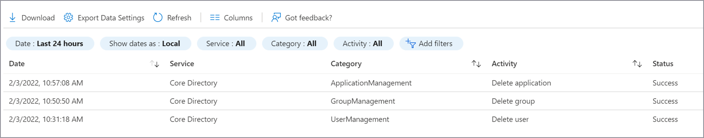
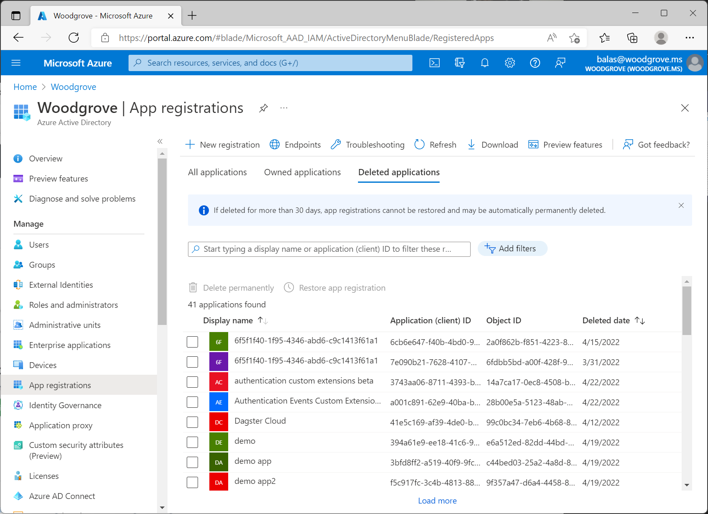

# Recover from deletions

This article addresses recovering from soft and hard deletions in your Azure Active Directory (Azure AD) tenant. If you haven't already done so, read [Recoverability best practices](recoverability-overview.md) for foundational knowledge.

## Monitor for deletions

The [Azure AD Audit log](../reports-monitoring/concept-audit-logs.md) contains information on all delete operations performed in your tenant. Export these logs to a security information and event management tool such as [Microsoft Sentinel](../../sentinel/overview.md).

You can also use Microsoft Graph to audit changes and build a custom solution to monitor differences over time. For more information on how to find deleted items by using Microsoft Graph, see [List deleted items - Microsoft Graph v1.0](/graph/api/directory-deleteditems-list?tabs=http).

### Audit log

The Audit log always records a "Delete \<object\>" event when an object in the tenant is removed from an active state by either a soft or hard deletion.

A delete event for applications, users, and Microsoft 365 Groups is a soft delete. For any other object type, it's a hard delete. Track the occurrence of hard-delete events by comparing "Delete \<object\>" events with the type of object that was deleted. Note the events that don't support soft delete. Also note "Hard Delete \<object\>" events.

| Object type | Activity in log| Result |
| - | - | - |
| Application| Delete application| Soft deleted |
| Application| Hard delete application| Hard deleted |
| User| Delete user| Soft deleted |
| User| Hard delete user| Hard deleted |
| Microsoft 365 Group| Delete group| Soft deleted |
| Microsoft 365 Group| Hard delete group| Hard deleted |
| All other objects| Delete "objectType"| Hard deleted |

> [!NOTE]
> The Audit log doesn't distinguish the group type of a deleted group. Only Microsoft 365 Groups are soft deleted. If you see a Delete group entry, it might be the soft delete of a Microsoft 365 Group or the hard delete of another type of group.
>
>*It's important that your documentation of your known good state includes the group type for each group in your organization*. To learn more about documenting your known good state, see [Recoverability best practices](recoverability-overview.md).

### Monitor support tickets

A sudden increase in support tickets about access to a specific object might indicate that a deletion occurred. Because some objects have dependencies, deletion of a group used to access an application, an application itself, or a Conditional Access policy that targets an application can all cause broad sudden impact. If you see a trend like this, check to ensure that none of the objects required for access were deleted.

## Soft deletions

When objects such as users, Microsoft 365 Groups, or application registrations are soft deleted, they enter a suspended state in which they aren't available for use by other services. In this state, items retain their properties and can be restored for 30 days. After 30 days, objects in the soft-deleted state are permanently, or hard, deleted.

> [!NOTE]
> Objects can't be restored from a hard-deleted state. They must be re-created and reconfigured.

### When soft deletes occur

It's important to understand why object deletions occur in your environment so that you can prepare for them. This section outlines frequent scenarios for soft deletion by object class. You might see scenarios that are unique to your organization, so a discovery process is key to preparation.

### Users

Users enter the soft-delete state anytime the user object is deleted by using the Azure portal, Microsoft Graph, or PowerShell.

The most frequent scenarios for user deletion are:

* An administrator intentionally deletes a user in the Azure portal in response to a request or as part of routine user maintenance.
* An automation script in Microsoft Graph or PowerShell triggers the deletion. For example, you might have a script that removes users who haven't signed in for a specified time.
* A user is moved out of scope for synchronization with Azure AD Connect.
* A user is removed from an HR system and is deprovisioned via an automated workflow.

### Microsoft 365 Groups

The most frequent scenarios for Microsoft 365 Groups being deleted are:

* An administrator intentionally deletes the group, for example, in response to a support request.
* An automation script in Microsoft Graph or PowerShell triggers the deletion. For example, you might have a script that deletes groups that haven't been accessed or attested to by the group owner for a specified time.
* Unintentional deletion of a group owned by non-admins.

### Application objects and service principals

The most frequent scenarios for application deletion are:

* An administrator intentionally deletes the application, for example, in response to a support request.
* An automation script in Microsoft Graph or PowerShell triggers the deletion. For example, you might want a process for deleting abandoned applications that are no longer used or managed. In general, create an offboarding process for applications rather than scripting to avoid unintentional deletions.

When you delete an application, the application registration by default enters the soft-delete state. To understand the relationship between application registrations and service principals, see [Apps and service principals in Azure AD - Microsoft identity platform](../develop/app-objects-and-service-principals.md).

### Administrative units

The most common scenario for deletions is when administrative units (AU) are deleted by accident, although still needed. 

## Recover from soft deletion

You can restore soft-deleted items in the administrative portal, or by using Microsoft Graph. Not all object classes can manage soft-delete capabilities in the portal, some are only listed, viewed, hard deleted, or restored using the deletedItems Microsoft Graph API.

### Properties maintained with soft delete

|Object type|Important properties maintained|
|---|---|
|Users (including external users)|All properties maintained, including ObjectID, group memberships, roles, licenses, and application assignments|
|Microsoft 365 Groups|All properties maintained, including ObjectID, group memberships, licenses, and application assignments|
|Application registration | All properties maintained. See more information after this table.|
|Service principal|All properties maintained|
|Administrative unit (AU)|All properties maintained|

### Users

You can see soft-deleted users in the Azure portal on the **Users | Deleted users** page.

For more information on how to restore users, see the following documentation:

* To restore from the Azure portal, see [Restore or permanently remove recently deleted user](../fundamentals/users-restore.md).
* To restore by using Microsoft Graph, see [Restore deleted item – Microsoft Graph v1.0](/graph/api/directory-deleteditems-restore?tabs=http).

### Groups

You can see soft-deleted Microsoft 365 Groups in the Azure portal on the **Groups | Deleted groups** page.

For more information on how to restore soft-deleted Microsoft 365 Groups, see the following documentation:

* To restore from the Azure portal, see [Restore a deleted Microsoft 365 Group](../enterprise-users/groups-restore-deleted.md).
* To restore by using Microsoft Graph, see [Restore deleted item – Microsoft Graph v1.0](/graph/api/directory-deleteditems-restore?tabs=http).

### Applications and service principals

Applications have two objects: the application registration and the service principal. For more information on the differences between the registration and the service principal, see [Apps and service principals in Azure AD](../develop/app-objects-and-service-principals.md).

To restore an application from the Azure portal, select **App registrations** > **Deleted applications**. Select the application registration to restore, and then select **Restore app registration**.

Currently, service principals can be listed, viewed, hard deleted, or restored via the deletedItems Microsoft Graph API. To restore applications using Microsoft Graph, see [Restore deleted item - Microsoft Graph v1.0.](/graph/api/directory-deleteditems-restore?tabs=http).

### Administrative units

AUs can be listed, viewed, or restored via the deletedItems Microsoft Graph API. To restore AUs using Microsoft Graph, see [Restore deleted item - Microsoft Graph v1.0.](/graph/api/directory-deleteditems-restore?tabs=http). Once an AU is deleted it remains in a soft deleted state and can be restored for 30 days, but cannot be hard deleted during that time. Soft deleted AUs are hard deleted automatically after 30 days.

## Hard deletions

A hard deletion is the permanent removal of an object from your Azure AD tenant. Objects that don't support soft delete are removed in this way. Similarly, soft-deleted objects are hard deleted after a deletion time of 30 days. The only object types that support a soft delete are:

* Users
* Microsoft 365 Groups
* Application registration
* Service principal
* Administrative unit

> [!IMPORTANT]
> All other item types are hard deleted. When an item is hard deleted, it can't be restored. It must be re-created. Neither administrators nor Microsoft can restore hard-deleted items. Prepare for this situation by ensuring that you have processes and documentation to minimize potential disruption from a hard delete.
>
> For information on how to prepare for and document current states, see [Recoverability best practices](recoverability-overview.md).

### When hard deletes usually occur

Hard deletes might occur in the following circumstances.

Moving from soft to hard delete:

* A soft-deleted object wasn't restored within 30 days.
* An administrator intentionally deletes an object in the soft delete state.

Directly hard deleted:

* The object type that was deleted doesn't support soft delete.
* An administrator chooses to permanently delete an item by using the portal, which typically occurs in response to a request.
* An automation script triggers the deletion of the object by using Microsoft Graph or PowerShell. Use of an automation script to clean up stale objects isn't uncommon. A robust off-boarding process for objects in your tenant helps you to avoid mistakes that might result in mass deletion of critical objects.

## Recover from hard deletion

Hard-deleted items must be re-created and reconfigured. It's best to avoid unwanted hard deletions.

### Review soft-deleted objects

Ensure you have a process to frequently review items in the soft-delete state and restore them if appropriate. To do so, you should:

* Frequently [list deleted items](/graph/api/directory-deleteditems-list?tabs=http).
* Ensure that you have specific criteria for what should be restored.
* Ensure that you have specific roles or users assigned to evaluate and restore items as appropriate.
* Develop and test a continuity management plan. For more information, see [Considerations for your Enterprise Business Continuity Management Plan](/compliance/assurance/assurance-developing-your-ebcm-plan).

For more information on how to avoid unwanted deletions, see the following articles in [Recoverability best practices](recoverability-overview.md):

* Business continuity and disaster planning
* Document known good states
* Monitoring and data retention
