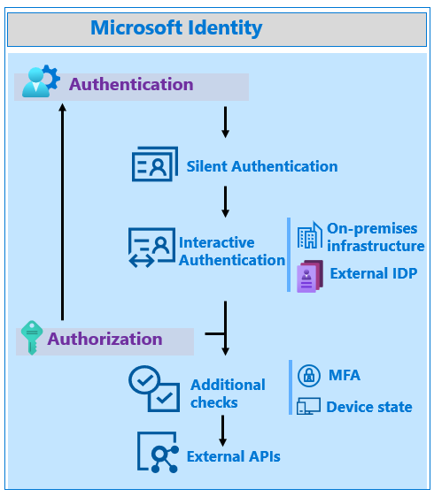

# Increase the resilience of authentication and authorization in client applications you develop

Learn to build resilience into client applications that use the Microsoft identity platform and Microsoft Entra ID to sign in users, and perform actions on behalf of those users.

## Use the Microsoft Authentication Library (MSAL)

The Microsoft Authentication Library (MSAL) is part of the Microsoft identity platform. MSAL acquires, manages, caches, and refreshes tokens; it uses best practices for resilience. MSAL helps developers create secure solutions.

Learn more:

* [Overview of the Microsoft Authentication Library](../develop/msal-overview.md)
* [What is the Microsoft identity platform?](../develop/v2-overview.md)
* [Microsoft identity platform documentation](../develop/index.yml)

MSAL caches tokens and uses a silent token acquisition pattern. MSAL serializes the token cache on operating systems that natively provide secure storage like Universal Windows Platform (UWP), iOS, and Android. Customize the serialization behavior when you're using: 

* Microsoft.Identity.Web
* MSAL.NET
* MSAL for Java
* MSAL for Python

Learn more:

* [Token cache serialization](https://github.com/AzureAD/microsoft-identity-web/wiki/token-cache-serialization)
* [Token cache serialization in MSAL.NET](../develop/msal-net-token-cache-serialization.md)
* [Custom token cache serialization in MSAL for Java](/entra/msal/java/advanced/msal-java-token-cache-serialization)
* [Custom token cache serialization in MSAL for Python](/entra/msal/python/advanced/msal-python-token-cache-serialization).

   

When you're using MSAL, token caching, refreshing, and silent acquisition is supported. Use simple patterns to acquire the tokens for authentication. There's support for many languages. Find code sample on, [Microsoft identity platform code samples](../develop/sample-v2-code.md).

## [C#](#tab/csharp)

```csharp
try
{
    result = await app.AcquireTokenSilent(scopes, account).ExecuteAsync();
}
catch(MsalUiRequiredException ex)
{
    result = await app.AcquireToken(scopes).WithClaims(ex.Claims).ExecuteAsync()
}
```

## [JavaScript](#tab/javascript)

```javascript
return myMSALObj.acquireTokenSilent(request).catch(error => {
    console.warn("silent token acquisition fails. acquiring token using redirect");
    if (error instanceof msal.InteractionRequiredAuthError) {
        // fallback to interaction when silent call fails
        return myMSALObj.acquireTokenPopup(request).then(tokenResponse => {
            console.log(tokenResponse);

            return tokenResponse;
        }).catch(error => {
            console.error(error);
        });
    } else {
        console.warn(error);
    }
});
```

---

MSAL is able to refresh tokens. When the Microsoft identity platform issues a long-lived token, it can send information to the client to refresh the token (refresh\_in). The app runs while the old token is valid, but it takes longer for another token acquisition.

### MSAL releases

We recommend developers build a process to use the latest MSAL release because authentication is part of app security. Use this practice for libraries under development and improve app resilience. 

Find the latest version and release notes:

* [`microsoft-authentication-library-for-js`](https://github.com/AzureAD/microsoft-authentication-library-for-js/releases)
* [`microsoft-authentication-library-for-dotnet`](https://github.com/AzureAD/microsoft-authentication-library-for-dotnet/releases)
* [`microsoft-authentication-library-for-python`](https://github.com/AzureAD/microsoft-authentication-library-for-python/releases)
* [`microsoft-authentication-library-for-java`](https://github.com/AzureAD/microsoft-authentication-library-for-java/releases)
* [`microsoft-authentication-library-for-objc`](https://github.com/AzureAD/microsoft-authentication-library-for-objc/releases)
* [`microsoft-authentication-library-for-android`](https://github.com/AzureAD/microsoft-authentication-library-for-android/releases)
* [`microsoft-authentication-library-for-js`](https://github.com/AzureAD/microsoft-authentication-library-for-js/releases)
* [`microsoft-identity-web`](https://github.com/AzureAD/microsoft-identity-web/releases)

## Resilient patterns for token handling

If you don't use MSAL, use resilient patterns for token handling. The MSAL library implements best practices. 

Generally, applications using modern authentication call an endpoint to retrieve tokens that authenticate the user, or authorize the application to call protected APIs. MSAL handles authentication and implements patterns to improve resilience. If you don't use MSAL, use the guidance in this section for best practices. Otherwise, MSAL implements best practices automatically.

### Cache tokens

Ensure apps cache tokens accurately from the Microsoft identity platform. After your app receives tokens, the HTTP response with tokens has an `expires_in` property that indicates the duration to cache, and when to reuse it. Confirm application don't attempt to decode an API access token.

   

Cached tokens prevent unnecessary traffic between an app and the Microsoft identity platform. This scenario makes the app less susceptible to token acquisition failures by reducing token acquisition calls. Cached tokens improve application performance, because the app blocks acquiring tokens less frequently. Users remain signed in to your application for the token lifetime.

### Serialize and persist tokens

Ensure apps serialize their token cache securely to persist the tokens between app instances. Reuse tokens during their lifetime. Refresh tokens and access tokens are issued for many hours. During this time, users might start your application several times. When an app starts, confirm it looks for valid access, or a refresh token. This increases app resilience and performance.

Learn more:

* [Refresh the access tokens](../develop/v2-oauth2-auth-code-flow.md#refresh-the-access-token)
* [Microsoft identity platform access tokens](../develop/access-tokens.md)

   

Ensure persistent token storage has access control and encryption, in relation to the user-owner, or process identity. On various operating systems, there are credential storage features.

### Acquire tokens silently

Authenticating a user or retrieving authorization to call an API entails multiple steps in Microsoft identity platform. For example, users signing in for the first time enter credentials and perform a multi-factor authentication. Each step affects the resource that provides the service. The best user experience with the least dependencies is silent token acquisition.

  

Silent token acquisition starts with a valid token from the app token cache. If there's no valid token, the app attempts to acquire a token using an available refresh token, and the token endpoint. If neither option is available, the app acquires a token using the `prompt=none` parameter. This action uses the authorization endpoint, but no UI appears for the user. If possible, the Microsoft identity platform provides a token to the app without user interaction. If no method results in a token, then the user manually reauthenticates.

> [!NOTE]
> In general, ensure apps don't use prompts like 'login' and 'consent'. These prompts force user interaction, when no interaction is required.

## Response code handling

Use the following sections to learn about response codes.

### HTTP 429 response code

There are error responses that affect resilience. If your application receives an HTTP 429 response code, Too Many Requests, Microsoft identity platform is throttling your requests. If an app makes too many requests, it's throttled to prevent the app from receiving tokens. Don't allow an app to attempt token acquisition, before the **Retry-After** response field time is complete. Often, a 429 response indicates the application isn't caching and reusing tokens correctly. Confirm how tokens are cached and reused in the application.

### HTTP 5x response code

If an application receives an HTTP 5x response code, the app must not enter a fast retry loop. Use the same handling for a 429 response. If no Retry-After header appears, implement an exponential back-off retry with the first retry, at least 5 seconds after the response.

When a request times out, immediate retries are discouraged. Implement an exponential back-off retry, with the first retry, at least 5 seconds after the response.

## Retrieving authorization related information

Many applications and APIs need user information to authorize. Available methods have advantages and disadvantages. 

### Tokens

Identity (ID) tokens and access tokens have standard claims that provide information. If needed information is in the token, the most efficient technique is token claims, because that prevents another network call. Fewer network calls equate better resilience.

Learn more:

* [Microsoft identity platform ID tokens](../develop/id-tokens.md)
* [Microsoft identity platform access tokens](../develop/access-tokens.md)

> [!NOTE]
> Some applications call the UserInfo endpoint to retrieve claims about the authenticated user. The information in the ID token is a superset of information from the UserInfo endpoint. Enable apps to use the ID token instead of calling the UserInfo endpoint.

Augment standard token claims with optional claims, such as groups. The **Application Group** option includes groups assigned to the application. The **All** or **Security groups** options include groups from apps in the same tenant, which can add groups to the token. Evaluate the effect, because it can negate the efficiency of requesting groups in the token by causing token bloat, and requiring more calls to get the groups.

Learn more: 

* [Provide optional claims to your app](../develop/optional-claims.md)
* [Configuring groups optional claims](../develop/optional-claims.md#configure-groups-optional-claims)

We recommend you use and include app roles, which customers manage by using the portal or APIs. Assign roles to users and groups to control access. When a token is issued, the assigned roles are in the token roles claim. Information derived from a token prevents more APIs calls.

See, [Add app roles to your application and receive them in the token](../develop/howto-add-app-roles-in-apps.md)

Add claims based on tenant information. For example, an extension has an enterprise-specific User ID.

Adding information from the directory to a token is efficient and increases resiliency by reducing dependencies. It doesn't address resilience issues due to an inability to acquire a token. Add optional claims for the application's primary scenarios. If the app requires information for administrative functionality, the application can obtain that information, as needed.

### Microsoft Graph

Microsoft Graph has a unified API endpoint to access Microsoft 365 data about productivity patterns, identity, and security. Applications using Microsoft Graph can use Microsoft 365 information for authorization.

Apps require one token to access Microsoft 365, which is more resilient than previous APIs for Microsoft 365 components like Microsoft Exchange or Microsoft SharePoint that required multiple tokens.

When using Microsoft Graph APIs, use a Microsoft Graph SDK that simplifies building resilient applications that access Microsoft Graph.

See, [Microsoft Graph SDK overview](/graph/sdks/sdks-overview)

For authorization, consider using token claims instead of some Microsoft Graph calls. Request groups, app roles, and optional claims in tokens. Microsoft Graph for authorization requires more network calls that rely on the Microsoft identity platform and Microsoft Graph. However, if your application relies on Microsoft Graph as its data layer, then Microsoft Graph for authorization isn't more risk.

## Use broker authentication on mobile devices

On mobile devices, an authentication broker like Microsoft Authenticator improves resilience. The authentication broker uses a primary refresh token (PRT) with claims about the user and device. Use PRT for authentication tokens to access other applications from the device. When a PRT requests application access, Microsoft Entra ID trusts its device and MFA claims. This increases resilience by reducing steps to authenticate the device. Users aren't challenged with multiple MFA prompts on the same device.

See, [What is a Primary Refresh Token?](../devices/concept-primary-refresh-token.md)

  

MSAL supports broker authentication. Learn more:

* [SSO through Authentication broker on iOS](../develop/single-sign-on-macos-ios.md#sso-through-authentication-broker-on-ios)
* [Enable cross-app SSO on Android using MSAL](../develop/msal-android-single-sign-on.md)

## Continuous Access Evaluation

Continuous Access Evaluation (CAE) increases application security and resilience with long-lived tokens. With CAE, an access token is revoked based on critical events and policy evaluation, rather than short token lifetimes. For some resource APIs, because risk and policy are evaluated in real time, CAE increases token lifetime up to 28 hours. MSAL refreshes long-lived tokens.

Learn more:

* [Continuous Access Evaluation](../conditional-access/concept-continuous-access-evaluation.md)
* [Securing applications with Continuous Access Evaluation](/security/zero-trust/develop/secure-with-cae)
* [Critical event evaluation](../conditional-access/concept-continuous-access-evaluation.md#critical-event-evaluation)
* [Conditional Access policy evaluation](../conditional-access/concept-continuous-access-evaluation.md#conditional-access-policy-evaluation)
* [How to use CAE enabled APIs in your applications](../develop/app-resilience-continuous-access-evaluation.md)

If you develop resource APIs, go to `openid.net` for [Shared Signals – A Secure Webhooks Framework](https://openid.net/wg/sse/).

## Next steps

* [How to use CAE enabled APIs in your applications](../develop/app-resilience-continuous-access-evaluation.md)
* [Increase the resilience of authentication and authorization in daemon applications you develop](resilience-daemon-app.md)
* [Build resilience in your identity and access management infrastructure](resilience-in-infrastructure.md)
* [Build resilience in your customer identity and access management with Azure AD B2C](resilience-b2c.md)
