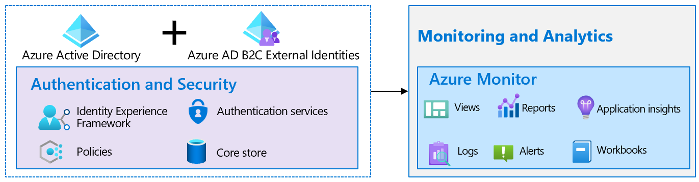

# Resilience through monitoring and analytics

Monitoring maximizes the availability and performance of your applications and services. It delivers a comprehensive solution for collecting, analyzing, and acting on telemetry from your infrastructure and applications. Alerts proactively notify you when issues are found with your service or applications. They allow you to identify and address issues before the end users of your service notice them. [Microsoft Entra ID Log Analytics](https://azure.microsoft.com/services/monitor/?OCID=AID2100131_SEM_6d16332c03501fc9c1f46c94726d2264:G:s&ef_id=6d16332c03501fc9c1f46c94726d2264:G:s&msclkid=6d16332c03501fc9c1f46c94726d2264#features) helps you analyze, search the audit logs and sign-in logs, and build custom views.

Watch this video to learn how to set up monitoring and reporting in Azure AD B2C using Azure Monitor.

>[!Video https://www.youtube.com/embed/Mu9GQy-CbXI]

## Monitor and get notified through alerts

Monitoring your system and infrastructure is critical to ensure the overall health of your services. It starts with the definition of business metrics, such as, new user arrival, end user's authentication rates, and conversion. Configure such indicators to monitor. If you're planning for an upcoming surge because of promotion or holiday traffic, revise your estimates specifically for the event and corresponding benchmark for the business metrics. After the event, fall back to the previous benchmark.

Similarly, to detect failures or performance disruptions, setting up a good baseline and then defining alerting is an indispensable practice to respond to emerging issues promptly.

### How to implement monitoring and alerting

- **Monitoring**: Use [Azure Monitor](/azure/active-directory-b2c/azure-monitor) to continuously monitor health against key Service Level Objectives (SLO) and get notification whenever a critical change happens. Begin by identifying Azure AD B2C policy or an application as a critical component of your business whose health needs to be monitored to maintain SLO. Identify key indicators that align with your SLOs.
For example, track the following metrics, since a sudden drop in either will lead to a loss in business.

  - **Total requests**: The total "n" number of requests sent to Azure AD B2C policy.

  - **Success rate (%)**: Successful requests/Total number of requests.

  Access the [key indicators](/azure/active-directory-b2c/view-audit-logs) in [application insights](/azure/active-directory-b2c/analytics-with-application-insights) where Azure AD B2C policy-based logs, [audit logs](/azure/active-directory-b2c/analytics-with-application-insights), and sign-in logs are stored.  

   - **Visualizations**: Using Log analytics build dashboards to visually monitor the key indicators.

   - **Current period**: Create temporal charts to show changes in the Total requests and Success rate (%) in the current period, for example, current week.

   - **Previous period**: Create temporal charts to show changes in the Total requests and Success rate (%) over some previous period for reference purposes, for example, last week.

- **Alerting**: Using log analytics define [alerts](/azure/azure-monitor/alerts/alerts-create-new-alert-rule) that get triggered when there are sudden changes in the key indicators. These changes may negatively impact the SLOs. Alerts use various forms of notification methods including email, SMS, and webhooks. Start by defining a criterion that acts as a threshold against which alert will be triggered. For example:
  - Alert against abrupt drop in Total requests: Trigger an alert when number of total requests drop abruptly. For example, when there's a 25% drop in the total number of requests compared to previous period, raise an alert.  
  - Alert against significant drop in Success rate (%): Trigger an alert when success rate of the selected policy significantly drops.
  - Upon receiving an alert, troubleshoot the issue using [Log Analytics](/azure/azure-monitor/visualize/workbooks-view-designer-conversion-overview), [Application Insights](/azure/active-directory-b2c/troubleshoot-with-application-insights), and [VS Code extension](https://marketplace.visualstudio.com/items?itemName=AzureADB2CTools.aadb2c) for Azure AD B2C. After you resolve the issue and deploy an updated application or policy, it continues to monitor the key indicators until they return back to normal range.

- **Service alerts**: Use the [Azure AD B2C service level alerts](/azure/service-health/service-health-overview) to get notified of service issues, planned maintenance, health advisory, and security advisory.

- **Reporting**: [By using log analytics](../reports-monitoring/howto-integrate-activity-logs-with-azure-monitor-logs.md), build reports that help you gain understanding about user insights, technical challenges, and growth opportunities.
  - **Health Dashboard**: Create [custom dashboards using Azure Dashboard](/azure/azure-monitor/app/tutorial-app-dashboards) feature, which supports adding charts using Log Analytics queries. For example, identify pattern of successful and failed sign-ins, failure reasons and telemetry about devices used to make the requests.
  - **Abandon Azure AD B2C journeys**: Use the [workbook](https://github.com/azure-ad-b2c/siem#list-of-abandon-journeys) to track the list of abandoned Azure AD B2C journeys where user started the sign-in or sign-up journey but never finished it. It provides you details about policy ID and breakdown of steps that are taken by the user before abandoning the journey.
  - **Azure AD B2C monitoring workbooks**: Use the [monitoring workbooks](https://github.com/azure-ad-b2c/siem) that include Azure AD B2C dashboard, Multi-factor authentication (MFA) operations, Conditional Access report, and Search logs by correlationId. This practice provides better insights into the health of your Azure AD B2C environment.
  
## Next steps

- [Resilience resources for Azure AD B2C developers](resilience-b2c.md)
  - [Resilient end-user experience](resilient-end-user-experience.md)
  - [Resilient interfaces with external processes](resilient-external-processes.md)
  - [Resilience through developer best practices](resilience-b2c-developer-best-practices.md)
- [Build resilience in your authentication infrastructure](resilience-in-infrastructure.md)
- [Increase resilience of authentication and authorization in your applications](resilience-app-development-overview.md)
