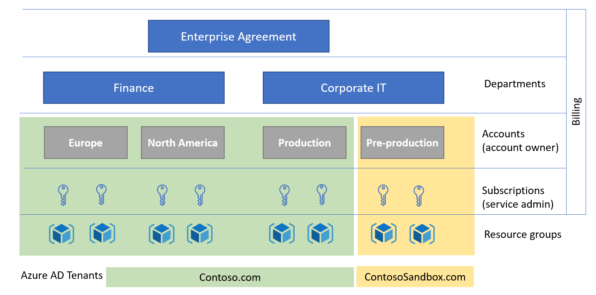

# Azure resource management fundamentals

It's important to understand the structure and terms that are specific to Azure resources. The following image shows an example of the four levels of scope that are provided by Azure:

## Terminology

The following are some of the terms you should be familiar with:

**Resource** - A manageable item that is available through Azure. Virtual machines, storage accounts, web apps, databases, and virtual networks are examples of resources.

**Resource group** - A container that holds related resources for an Azure solution such as a collection of virtual machines, associated VNets, and load balancers that require management by specific teams. The [resource group](../../azure-resource-manager/management/overview.md) includes those resources that you want to manage as a group. You decide which resources belong in a resource group based on what makes the most sense for your organization. Resource groups can also be used to help with life-cycle management by deleting all resources that have the same lifespan at one time. This approach also provides security benefit by leaving no fragments that might be exploited.

**Subscription** - From an organizational hierarchy perspective, a subscription is a billing and management container of resources and resource groups. An Azure subscription has a trust relationship with Microsoft Entra ID. A subscription trusts Microsoft Entra ID to authenticate users, services, and devices.

>[!Note]
>A subscription may trust only one Microsoft Entra tenant. However, each tenant may trust multiple subscriptions and subscriptions can be moved between tenants.

**Management group** - [Azure management groups](../../governance/management-groups/overview.md) provide a hierarchical method of applying policies and compliance at different scopes above subscriptions. It can be at the tenant root management group (highest scope) or at lower levels in the hierarchy. You organize subscriptions into containers called "management groups" and apply your governance conditions to the management groups. All subscriptions within a management group automatically inherit the conditions applied to the management group. Note, policy definitions can be applied to a management group or subscription.

**Resource provider** - A service that supplies Azure resources. For example, a common [resource provider](../../azure-resource-manager/management/resource-providers-and-types.md) is Microsoft. Compute, which supplies the virtual machine resource. Microsoft. Storage is another common resource provider.

**Resource Manager template** - A JavaScript Object Notation (JSON) file that defines one or more resources to deploy to a resource group, subscription, tenant, or management group. The template can be used to deploy the resources consistently and repeatedly. See [Template deployment overview](../../azure-resource-manager/templates/overview.md). Additionally, the [Bicep language](../../azure-resource-manager/bicep/overview.md) can be used instead of JSON.

## Azure Resource Management Model

Each Azure subscription is associated with controls used by [Azure Resource Manager](../../azure-resource-manager/management/overview.md) (ARM). Resource Manager is the deployment and management service for Azure, it has a trust relationship with Microsoft Entra ID for identity management for organizations, and the Microsoft Account (MSA) for individuals. Resource Manager provides a management layer that enables you to create, update, and delete resources in your Azure subscription. You use management features like access control, locks, and tags, to secure and organize your resources after deployment.

>[!NOTE]
>Prior to ARM, there was another deployment model named Azure Service Manager (ASM) or "classic". To learn more, see [Azure Resource Manager vs. classic deployment](../../azure-resource-manager/management/deployment-models.md). Managing environments with the ASM model is out of scope of this content.

Azure Resource Manager is the front-end service, which hosts the REST APIs used by PowerShell, the Azure portal, or other clients to manage resources. When a client makes a request to manage a specific resource, Resource Manager proxies the request to the resource provider to complete the request. For example, if a client makes a request to manage a virtual machine resource, Resource Manager proxies the request to the Microsoft. Compute resource provider. Resource Manager requires the client to specify an identifier for both the subscription and the resource group to manage the virtual machine resource.

Before any resource management request can be executed by Resource Manager, a set of controls is checked.

* **Valid user check** - The user requesting to manage the resource must have an account in the Microsoft Entra tenant associated with the subscription of the managed resource.

* **User permission check** - Permissions are assigned to users using [role-based access control (RBAC)](../../role-based-access-control/overview.md). An RBAC role specifies a set of permissions a user may take on a specific resource. RBAC helps you manage who has access to Azure resources, what they can do with those resources, and what areas they have access to.

* **Azure policy check** - [Azure policies](../../governance/policy/overview.md) specify the operations allowed or explicitly denied for a specific resource. For example, a policy can specify that users are only allowed (or not allowed) to deploy a specific type of virtual machine.

The following diagram summarizes the resource model we just described.

**Azure Lighthouse** - [Azure Lighthouse](../../lighthouse/overview.md) enables resource management across tenants. Organizations can delegate roles at the subscription or resource group level to identities in another tenant.

Subscriptions that enable [delegated resource management](../../lighthouse/concepts/architecture.md) with Azure Lighthouse have attributes that indicate the tenant IDs that can manage subscriptions or resource groups, and mapping between the built-in RBAC role in the resource tenant to identities in the service provider tenant. At runtime, Azure Resource Manager will consume these attributes to authorize tokens coming from the service provider tenant.

It's worth noting that Azure Lighthouse itself is modeled as an Azure resource provider, which means that aspects of the delegation across a tenant can be targeted through Azure Policies.

**Microsoft 365 Lighthouse** - [Microsoft 365 Lighthouse](/microsoft-365/lighthouse/m365-lighthouse-overview?view=o365-worldwide&preserve-view=true) is an admin portal that helps Managed Service Providers (MSPs) secure and manage devices, data, and users at scale for small- and medium-sized business (SMB) customers who are using Microsoft 365 Business Premium, Microsoft 365 E3, or Windows 365 Business.

## Azure resource management with Microsoft Entra ID

Now that you have a better understanding of the resource management model in Azure, let's briefly examine some of the capabilities of Microsoft Entra ID that can provide identity and access management for Azure resources.

### Billing

Billing is important to resource management because some billing roles interact with or can manage resources. Billing works differently depending on the type of agreement that you have with Microsoft.

#### Azure Enterprise Agreements

Azure Enterprise Agreement (Azure EA) customers are onboarded to the Azure EA Portal upon execution of their commercial contract with Microsoft. Upon onboarding, an identity is associated to a "root" Enterprise Administrator billing role. The portal provides a hierarchy of management functions:

* Departments help you segment costs into logical groupings and enable you to set a budget or quota at the department level.

* Accounts are used to further segment departments. You can use accounts to manage subscriptions and to access reports.
The EA portal can authorize Microsoft Accounts (MSA) or Microsoft Entra accounts (identified in the portal as "Work or School Accounts"). Identities with the role of "Account Owner" in the EA portal can create Azure subscriptions.

#### Enterprise billing and Microsoft Entra tenants

When an Account Owner creates an Azure subscription within an enterprise agreement, the identity and access management of the subscription is configured as follows:

* The Azure subscription is associated with the same Microsoft Entra tenant of the Account Owner.

* The account owner who created the subscription will be assigned the Service Administrator and Account Administrator roles. (The Azure EA Portal assigns Azure Service Manager (ASM) or "classic" roles to manage subscriptions. To learn more, see [Azure Resource Manager vs. classic deployment](../../azure-resource-manager/management/deployment-models.md).)

An enterprise agreement can be configured to support multiple tenants by setting the authentication type of "Work or school account cross-tenant" in the Azure EA Portal. Given the above, organizations can set multiple accounts for each tenant, and multiple subscriptions for each account, as shown in the diagram below.

It's important to note that the default configuration described above grants the Azure EA Account Owner privileges to manage the resources in any subscriptions they created. For subscriptions holding production workloads, consider decoupling billing and resource management by changing the service administrator of the subscription right after creation.

 To further decouple and prevent the account owner from regaining service administrator access to the subscription, the subscription's tenant can be [changed](../fundamentals/how-subscriptions-associated-directory.md) after creation. If the account owner doesn't have a user object in the Microsoft Entra tenant the subscription is moved to, they can't regain the service owner role.

To learn more, visit [Azure roles, Microsoft Entra roles, and classic subscription administrator roles](../../role-based-access-control/rbac-and-directory-admin-roles.md).  

### Microsoft Customer Agreement

Customers enrolled with a [Microsoft Customer Agreement](../../cost-management-billing/understand/mca-overview.md) (MCA) have a different billing management system with its own roles.

A [billing account](../../cost-management-billing/manage/understand-mca-roles.md) for the Microsoft Customer Agreement contains one or more [billing profiles](../../cost-management-billing/manage/understand-mca-roles.md) that allow managing invoices and payment methods. Each billing profile contains one or more [invoice sections](../../cost-management-billing/manage/understand-mca-roles.md) to organize costs on the billing profile's invoice.

In a Microsoft Customer Agreement, billing roles come from a single Microsoft Entra tenant. To provision subscriptions for multiple tenants, the subscriptions must be initially created in the same Microsoft Entra tenant as the MCA, and then changed. In the diagram below, the subscriptions for the Corporate IT pre-production environment were moved to the ContosoSandbox tenant after creation.

 

## RBAC and role assignments in Azure

In the Microsoft Entra Fundamentals section, you learned Azure RBAC is the authorization system that provides fine-grained access management to Azure resources, and includes many [built-in roles](../../role-based-access-control/built-in-roles.md). You can create [custom roles](../../role-based-access-control/custom-roles.md), and assign roles at different scopes. Permissions are enforced by assigning RBAC roles to objects requesting access to Azure resources.

Microsoft Entra roles operate on concepts like [Azure role-based access control](../../role-based-access-control/overview.md). The [difference between these two role-based access control systems](../../role-based-access-control/rbac-and-directory-admin-roles.md) is that Azure RBAC uses Azure Resource Management to control access to Azure resources such as virtual machines or storage, and Microsoft Entra roles control access to Microsoft Entra ID, applications, and Microsoft services such as Office 365.

Both Microsoft Entra roles and Azure RBAC roles integrate with Microsoft Entra Privileged Identity Management to enable just-in-time activation policies such as approval workflow and MFA.

## ABAC and role assignments in Azure

[Attribute-based access control (ABAC)](../../role-based-access-control/conditions-overview.md) is an authorization system that defines access based on attributes associated with security principals, resources, and environment. With ABAC, you can grant a security principal access to a resource based on attributes. Azure ABAC refers to the implementation of ABAC for Azure.

Azure ABAC builds on Azure RBAC by adding role assignment conditions based on attributes in the context of specific actions. A role assignment condition is an additional check that you can optionally add to your role assignment to provide more fine-grained access control. A condition filters down permissions granted as a part of the role definition and role assignment. For example, you can add a condition that requires an object to have a specific tag to read the object. You can't explicitly deny access to specific resources using conditions.

## Conditional Access

Microsoft Entra [Conditional Access](../conditional-access/concept-conditional-access-cloud-apps.md) can be used to manage access to Azure management endpoints. Conditional Access policies can be applied to the Microsoft Azure Management cloud app to protect the Azure resource management endpoints such as:

* Azure Resource Manager Provider (services)

* Azure Resource Manager APIs

* Azure PowerShell

* Azure CLI

* Azure portal

For example, an administrator may configure a Conditional Access policy, which allows a user to sign in to the Azure portal only from approved locations, and also requires either multifactor authentication (MFA) or a hybrid Microsoft Entra domain-joined device.

## Azure Managed Identities

A common challenge when building cloud applications is how to manage the credentials in your code for authenticating to cloud services. Keeping the credentials secure is an important task. Ideally, the credentials never appear on developer workstations and aren't checked into source control. [Managed identities for Azure resources](../managed-identities-azure-resources/overview.md) provide Azure services with an automatically managed identity in Microsoft Entra ID. You can use the identity to authenticate to any service that supports Microsoft Entra authentication without any credentials in your code.

There are two types of managed identities:

* A system-assigned managed identity is enabled directly on an Azure resource. When the resource is enabled, Azure creates an identity for the resource in the associated subscription's trusted Microsoft Entra tenant. After the identity is created, the credentials are provisioned onto the resource. The lifecycle of a system-assigned identity is directly tied to the Azure resource. If the resource is deleted, Azure automatically cleans up the credentials and the identity in Microsoft Entra ID.

* A user-assigned managed identity is created as a standalone Azure resource. Azure creates an identity in the Microsoft Entra tenant that's trusted by the subscription with which the resource is associated. After the identity is created, the identity can be assigned to one or more Azure resources. The lifecycle of a user-assigned identity is managed separately from the lifecycle of the Azure resources to which it's assigned.

Internally, managed identities are service principals of a special type, to only be used by specific Azure resources. When the managed identity is deleted, the corresponding service principal is automatically removed. Noe that authorization of Graph API permissions can only be done by PowerShell, so not all features of Managed Identity are accessible via the Portal UI.

## Microsoft Entra Domain Services

Microsoft Entra Domain Services provides a managed domain to facilitate authentication for Azure workloads using legacy protocols. Supported servers are moved from an on-premises AD DS forest and joined to a Microsoft Entra Domain Services managed domain and continue to use legacy protocols for authentication (for example, Kerberos authentication).

## Azure AD B2C directories and Azure

An Azure AD B2C tenant is linked to an Azure subscription for billing and communication purposes. Azure AD B2C tenants have a self-contained role structure in the directory, which is independent from the Azure RBAC privileged roles of the Azure subscription.

When the Azure AD B2C tenant is initially provisioned, the user creating the B2C tenant must have contributor or owner permissions in the subscription. Upon creation, that user becomes the first Azure AD B2C tenant global administrator and they can later create other accounts and assign them to directory roles.

It's important to note that the owners and contributors of the linked Microsoft Entra subscription can remove the link between the subscription and the directory, which will affect the ongoing billing of the Azure AD B2C usage.

## Identity considerations for IaaS solutions in Azure

This scenario covers identity isolation requirements that organizations have for Infrastructure-as-a-Service (IaaS) workloads.

There are three key options regarding isolation management of IaaS workloads:

* Virtual machines joined to stand-alone Active Directory Domain Services (AD DS)

* Microsoft Entra Domain Services joined virtual machines

* Sign-in to virtual machines in Azure using Microsoft Entra authentication

A key concept to address with the first two options is that there are two identity realms that are involved in these scenarios.

* When you sign in to an Azure Windows Server VM via remote desktop protocol (RDP), you're generally logging on to the server using your domain credentials, which performs a Kerberos authentication against an on-premises AD DS domain controller or Microsoft Entra Domain Services. Alternatively, if the server isn't domain-joined then a local account can be used to sign in to the virtual machines.

* When you sign in to the Azure portal to create or manage a VM, you're authenticating against Microsoft Entra ID (potentially using the same credentials if you've synchronized the correct accounts), and this could result in an authentication against your domain controllers should you be using Active Directory Federation Services (AD FS) or PassThrough Authentication.

### Virtual machines joined to standalone Active Directory Domain Services

AD DS is the Windows Server based directory service that organizations have largely adopted for on-premises identity services. AD DS can be deployed when a requirement exists to deploy IaaS workloads to Azure that require identity isolation from AD DS administrators and users in another forest.

The following considerations need to be made in this scenario:

AD DS domain controllers: a minimum of two AD DS domain controllers must be deployed to ensure that authentication services are highly available and performant. For more information, see [AD DS Design and Planning](/windows-server/identity/ad-ds/plan/ad-ds-design-and-planning).

**AD DS Design and Planning** - A new AD DS forest must be created with the following services configured correctly:

* **AD DS Domain Name Services (DNS)** - AD DS DNS must be configured for the relevant zones within AD DS to ensure that name resolution operates correctly for servers and applications.

* **AD DS Sites and Services** - These services must be configured to ensure that applications have low latency and performant access to domain controllers. The relevant virtual networks, subnets, and data center locations that servers are located in should be configured in sites and services.

* **AD DS FSMOs** - The Flexible Single Master Operation (FSMO) roles that are required should be reviewed and assigned to the appropriate AD DS domain controllers.

* **AD DS Domain Join** - All servers (excluding "jumpboxes") that require AD DS for authentication, configuration and management need to be joined to the isolated forest.

* **AD DS Group Policy (GPO)** - AD DS GPOs must be configured to ensure that the configuration meets the security requirements, and that the configuration is standardized across the forest and domain-joined machines.

* **AD DS Organizational Units (OU)** - AD DS OUs must be defined to ensure grouping of AD DS resources into logical management and configuration silos for purposes of administration and application of configuration.

* **Role-based access control** - RBAC must be defined for administration and access to resources joined to this forest. This includes:

  * **AD DS Groups** - Groups must be created to apply appropriate permissions for users to AD DS resources.

  * **Administration accounts** - As mentioned at the start of this section there are two administration accounts required to manage this solution.

    * An AD DS administration account with the least privileged access required to perform the administration required in AD DS and domain-joined servers.

    * A Microsoft Entra administration account for Azure portal access to connect, manage, and configure virtual machines, VNets, network security groups and other required Azure resources.

  * **AD DS user accounts** - Relevant user accounts need to be provisioned and added to correct groups to allow user access to applications hosted by this solution.

**Virtual networks (VNets)** - Configuration guidance

* **AD DS domain controller IP address** - The domain controllers shouldn't be configured with static IP addresses within the operating system. The IP addresses should be reserved on the Azure VNet to ensure they always stay the same and DC should be configured to use DHCP.

* **VNet DNS Server** - DNS servers must be configured on VNets that are part of this isolated solution to point to the domain controllers. This is required to ensure that applications and servers can resolve the required AD DS services or other services joined to the AD DS forest.

* **Network security groups (NSGs)** - The domain controllers should be located on their own VNet or subnet with NSGs defined to only allow access to domain controllers from required servers (for example, domain-joined machines or jumpboxes). Jumpboxes should be added to an application security group (ASG) to simplify NSG creation and administration.

**Challenges**: The list below highlights key challenges with using this option for identity isolation:

* An additional AD DS Forest to administer, manage and monitor resulting in more work for the IT team to perform.

* Further infrastructure may be required for management of patching and software deployments. Organizations should consider deploying Azure Update Management, Group Policy (GPO) or System Center Configuration Manager (SCCM) to manage these servers.

* Additional credentials for users to remember and use to access resources.

>[!IMPORTANT]
>For this isolated model, it is assumed that there is no connectivity to or from the domain controllers from the customer's corporate network and that there are no trusts configured with other forests. A jumpbox or management server should be created to allow a point from which the AD DS domain controllers can be managed and administered.

### Microsoft Entra Domain Services joined virtual machines

When a requirement exists to deploy IaaS workloads to Azure that require identity isolation from AD DS administrators and users in another forest, then a Microsoft Entra Domain Services managed domain can be deployed. Microsoft Entra Domain Services is a service that provides a managed domain to facilitate authentication for Azure workloads using legacy protocols. This provides an isolated domain without the technical complexities of building and managing your own AD DS. The following considerations need to be made.

**Microsoft Entra Domain Services managed domain** - Only one Microsoft Entra Domain Services managed domain can be deployed per Microsoft Entra tenant and this is bound to a single VNet. It's recommended that this VNet forms the "hub" for Microsoft Entra Domain Services authentication. From this hub, "spokes" can be created and linked to allow legacy authentication for servers and applications. The spokes are additional VNets on which Microsoft Entra Domain Services joined servers are located and are linked to the hub using Azure network gateways or VNet peering.

**Managed domain location** - A location must be set when deploying a Microsoft Entra Domain Services managed domain. The location is a physical region (data center) where the managed domain is deployed. It's recommended you:

* Consider a location that is geographically closed to the servers and applications that require Microsoft Entra Domain Services services.

* Consider regions that provide Availability Zones capabilities for high availability requirements. For more information, see [Regions and Availability Zones in Azure](../../reliability/availability-zones-service-support.md).

**Object provisioning** - Microsoft Entra Domain Services synchronizes identities from the Microsoft Entra ID that is associated with the subscription that Microsoft Entra Domain Services is deployed into. It's also worth noting that if the associated Microsoft Entra ID has synchronization set up with Microsoft Entra Connect (user forest scenario) then the life cycle of these identities can also be reflected in Microsoft Entra Domain Services. This service has two modes that can be used for provisioning user and group objects from Microsoft Entra ID.

* **All**: All users and groups are synchronized from Microsoft Entra ID into Microsoft Entra Domain Services.

* **Scoped**: Only users in scope of a group(s) are synchronized from Microsoft Entra ID into Microsoft Entra Domain Services.

When you first deploy Microsoft Entra Domain Services, an automatic one-way synchronization is configured to replicate the objects from Microsoft Entra ID. This one-way synchronization continues to run in the background to keep the Microsoft Entra Domain Services managed domain up to date with any changes from Microsoft Entra ID. No synchronization occurs from Microsoft Entra Domain Services back to Microsoft Entra ID. For more information, see [How objects and credentials are synchronized in a Microsoft Entra Domain Services managed domain](../../active-directory-domain-services/synchronization.md).

It's worth noting that if you need to change the type of synchronization from All to Scoped (or vice versa), then the Microsoft Entra Domain Services managed domain will need to be deleted, recreated and configured. In addition, organizations should consider the use of "scoped" provisioning to reduce the identities to only those that need access to Microsoft Entra Domain Services resources as a good practice.

**Group Policy Objects (GPO)** - To configure GPO in a Microsoft Entra Domain Services managed domain you must use Group Policy Management tools on a server that has been domain joined to the Microsoft Entra Domain Services managed domain. For more information, see [Administer Group Policy in a Microsoft Entra Domain Services managed domain](../../active-directory-domain-services/manage-group-policy.md).

**Secure LDAP** - Microsoft Entra Domain Services provides a secure LDAP service that can be used by applications that require it. This setting is disabled by default and to enable secure LDAP a certificate needs to be uploaded, in addition, the NSG that secures the VNet that Microsoft Entra Domain Services is deployed on to must allow port 636 connectivity to the Microsoft Entra Domain Services managed domains. For more information, see [Configure secure LDAP for a Microsoft Entra Domain Services managed domain](../../active-directory-domain-services/tutorial-configure-ldaps.md).

**Administration** - To perform administration duties on Microsoft Entra Domain Services (for example, domain join machines or edit GPO), the account used for this task needs to be part of the Microsoft Entra DC Administrators group. Accounts that are members of this group can't directly sign-in to domain controllers to perform management tasks. Instead, you create a management VM that is joined to the Microsoft Entra Domain Services managed domain, then install your regular AD DS management tools. For more information, see [Management concepts for user accounts, passwords, and administration in Microsoft Entra Domain Services](../../active-directory-domain-services/administration-concepts.md).

**Password hashes** - For authentication with Microsoft Entra Domain Services to work, password hashes for all users need to be in a format that is suitable for NT LAN Manager (NTLM) and Kerberos authentication. To ensure authentication with Microsoft Entra Domain Services works as expected, the following prerequisites need to be performed.

* **Users synchronized with Microsoft Entra Connect (from AD DS)** - The legacy password hashes need to be synchronized from on-premises AD DS to Microsoft Entra ID.

* **Users created in Microsoft Entra ID** - Need to reset their password for the correct hashes to be generated for usage with Microsoft Entra Domain Services. For more information, see [Enable synchronization of password hashes](../../active-directory-domain-services/tutorial-configure-password-hash-sync.md).

**Network** - Microsoft Entra Domain Services is deployed on to an Azure VNet so considerations need to be made to ensure that servers and applications are secured and can access the managed domain correctly. For more information, see [Virtual network design considerations and configuration options for Microsoft Entra Domain Services](../../active-directory-domain-services/network-considerations.md).

* Microsoft Entra Domain Services must be deployed in its own subnet: Don't use an existing subnet or a gateway subnet.

* **A network security group (NSG)** - is created during the deployment of a Microsoft Entra Domain Services managed domain. This network security group contains the required rules for correct service communication. Don't create or use an existing network security group with your own custom rules.

* **Microsoft Entra Domain Services requires 3-5 IP addresses** - Make sure that your subnet IP address range can provide this number of addresses. Restricting the available IP addresses can prevent Microsoft Entra Domain Services from maintaining two domain controllers.

* **VNet DNS Server** - As previously discussed about the "hub and spoke" model, it's important to have DNS configured correctly on the VNets to ensure that servers joined to the Microsoft Entra Domain Services managed domain have the correct DNS settings to resolve the Microsoft Entra Domain Services managed domain. Each VNet has a DNS server entry that is passed to servers as they obtain an IP address and these DNS entries need to be the IP addresses of the Microsoft Entra Domain Services managed domain. For more information, see [Update DNS settings for the Azure virtual network](../../active-directory-domain-services/tutorial-create-instance.md).

**Challenges** - The following list highlights key challenges with using this option for Identity Isolation.

* Some Microsoft Entra Domain Services configuration can only be administered from a Microsoft Entra Domain Services joined server.

* Only one Microsoft Entra Domain Services managed domain can be deployed per Microsoft Entra tenant. As we describe in this section the hub and spoke model is recommended to provide Microsoft Entra Domain Services authentication to services on other VNets.

* Further infrastructure maybe required for management of patching and software deployments. Organizations should consider deploying Azure Update Management, Group Policy (GPO) or System Center Configuration Manager (SCCM) to manage these servers.

For this isolated model, it's assumed that there's no connectivity to the VNet that hosts the Microsoft Entra Domain Services managed domain from the customer's corporate network and that there are no trusts configured with other forests. A jumpbox or management server should be created to allow a point from which the Microsoft Entra Domain Services can be managed and administered.

### Sign into virtual machines in Azure using Microsoft Entra authentication

When a requirement exists to deploy IaaS workloads to Azure that require identity isolation, then the final option is to use Microsoft Entra ID for logon to servers in this scenario. This provides the ability to make Microsoft Entra ID the identity realm for authentication purposes and identity isolation can be achieved by provisioning the servers into the relevant subscription, which is linked to the required Microsoft Entra tenant. The following considerations need to be made.

**Supported operating systems**: Signing into virtual machines in Azure using Microsoft Entra authentication is currently supported in Windows and Linux. For more specifics on supported operating systems, refer to the documentation for [Windows](../devices/howto-vm-sign-in-azure-ad-windows.md) and [Linux](../devices/howto-vm-sign-in-azure-ad-linux.md).

**Credentials**: One of the key benefits of signing into virtual machines in Azure using Microsoft Entra authentication is the ability to use the same federated or managed Microsoft Entra credentials that you normally use for access to Microsoft Entra services for sign-in to the virtual machine.

>[!NOTE]
>The Microsoft Entra tenant that is used for sign-in in this scenario is the Microsoft Entra tenant that is associated with the subscription that the virtual machine has been provisioned into. This Microsoft Entra tenant can be one that has identities synchronized from on-premises AD DS. Organizations should make an informed choice that aligns with their isolation principals when choosing which subscription and Microsoft Entra tenant they wish to use for sign-in to these servers.

**Network Requirements**: These virtual machines will need to access Microsoft Entra ID for authentication so you must ensure that the virtual machines network configuration permits outbound access to Microsoft Entra endpoints on 443. See the documentation for [Windows](../devices/howto-vm-sign-in-azure-ad-windows.md) and [Linux](../devices/howto-vm-sign-in-azure-ad-linux.md) for more information.

**Role-based Access Control (RBAC)**: Two RBAC roles are available to provide the appropriate level of access to these virtual machines. These RBAC roles can be configured via the Azure portal or via the Azure Cloud Shell Experience. For more information, see [Configure role assignments for the VM](../devices/howto-vm-sign-in-azure-ad-windows.md).

* **Virtual machine administrator logon**: Users with this role assigned to them can log into an Azure virtual machine with administrator privileges.

* **Virtual machine user logon**: Users with this role assigned to them can log into an Azure virtual machine with regular user privileges.

Conditional Access: A key benefit of using Microsoft Entra ID for signing into Azure virtual machines is the ability to enforce Conditional Access as part of the sign-in process. This provides the ability for organizations to require conditions to be met before allowing access to the virtual machine and to use multifactor authentication to provide strong authentication. For more information, see [Using Conditional Access](../devices/howto-vm-sign-in-azure-ad-windows.md).

>[!NOTE]
>Remote connection to virtual machines joined to Microsoft Entra ID is only allowed from Windows 10, Windows 11, and Cloud PC PCs that are Microsoft Entra joined or Microsoft Entra hybrid joined to the same directory as the virtual machine.

**Challenges**: The list below highlights key challenges with using this option for identity isolation.

* No central management or configuration of servers. For example, there's no Group Policy that can be applied to a group of servers. Organizations should consider deploying [Update Management in Azure](../../automation/update-management/overview.md) to manage patching and updates of these servers.

* Not suitable for multi-tiered applications that have requirements to authenticate with on-premises mechanisms such as Windows Integrated Authentication across these servers or services. If this is a requirement for the organization, then it's recommended that you explore the Standalone Active Directory Domain Services, or the Microsoft Entra Domain Services scenarios described in this section.

For this isolated model, it's assumed that there's no connectivity to the VNet that hosts the virtual machines from the customer's corporate network. A jumpbox or management server should be created to allow a point from which these servers can be managed and administered.

## Next steps

* [Introduction to delegated administration and isolated environments](secure-introduction.md)

* [Microsoft Entra fundamentals](./secure-fundamentals.md)

* [Resource isolation in a single tenant](secure-single-tenant.md)

* [Resource isolation with multiple tenants](secure-multiple-tenants.md)

* [Best practices](secure-best-practices.md)
