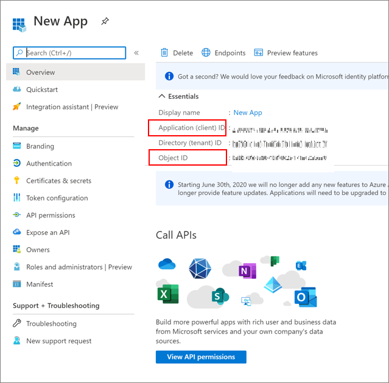

# Securing service principals in Microsoft Entra ID 

A Microsoft Entra service principal is the local representation of an application object in a tenant or directory. It's the identity of the application instance. Service principals define application access and resources the application accesses. A service principal is created in each tenant where the application is used and references the globally unique application object. The tenant secures the service principal sign-in and access to resources. 

Learn more: [Application and service principal objects in Microsoft Entra ID](../develop/app-objects-and-service-principals.md)

## Tenant-service principal relationships

A single-tenant application has one service principal in its home tenant. A multi-tenant web application or API requires a service principal in each tenant. A service principal is created when a user from that tenant consents to use of the application or API. This consent creates a one-to-many relationship between the multi-tenant application and its associated service principals.

A multi-tenant application is homed in a tenant and has instances in other tenants. Most software-as-a-service (SaaS) applications accommodate multi-tenancy. Use service principals to ensure the needed security posture for the application, and its users, in single- and multi-tenant scenarios.

## ApplicationID and ObjectID

An application instance has two properties: the ApplicationID (or ClientID) and the ObjectID.

> [!NOTE] 
> The terms **application** and **service principal** are used interchangeably, when referring to an application in authentication tasks. However, they are two representations of applications in Microsoft Entra ID.

The ApplicationID represents the global application and is the same for application instances, across tenants. The ObjectID is a unique value for an application object. As with users, groups, and other resources, the ObjectID helps to identify an application instance in Microsoft Entra ID.

To learn more, see [Application and service principal relationship in Microsoft Entra ID](../develop/app-objects-and-service-principals.md)

### Create an application and its service principal object

You can create an application and its service principal object (ObjectID) in a tenant using:

* Azure PowerShell
* Microsoft Graph PowerShell
* Azure command-line interface (Azure CLI)
* Microsoft Graph API
* The Azure portal
* Other tools

## Service principal authentication

There are two mechanisms for authentication, when using service principals—client certificates and client secrets.

Because certificates are more secure, it's recommended you use them, when possible. Unlike client secrets, client certificates can't be embedded in code, accidentally. When possible, use Azure Key Vault for certificate and secrets management to encrypt assets with keys protected by hardware security modules:

* Authentication keys
* Storage account keys
* Data encryption keys
* .pfx files
* Passwords 

For more information on Azure Key Vault and how to use it for certificate and secret management, see:

* [About Azure Key Vault](/azure/key-vault/general/overview)
* [Assign a Key Vault access policy](/azure/key-vault/general/assign-access-policy) 

### Challenges and mitigations
 
When using service principals, use the following table to match challenges and mitigations.

| Challenge| Mitigation|
| - | - |
| Access reviews for service principals assigned to privileged roles| This functionality is in preview |
| Service principal access reviews| Manual check of resource access control list using the Azure portal |
| Over-permissioned service principals| When you create automation service accounts, or service principals, grant permissions for the task. Evaluate service principals to reduce privileges. |
|Identify modifications to service principal credentials or authentication methods | - See, [Sensitive operations report workbook](../reports-monitoring/workbook-sensitive-operations-report.md)   - See the Tech Community blog post, [Microsoft Entra workbook to help you assess Solorigate risk](https://techcommunity.microsoft.com/t5/azure-active-directory-identity/azure-ad-workbook-to-help-you-assess-solorigate-risk/ba-p/2010718)|

## Find accounts using service principals

To find accounts, run the following commands using service principals with Azure CLI or PowerShell.

* Azure CLI - `az ad sp list`
* PowerShell - `Get-MgServicePrincipal -All:$true` 

For more information, see [Get-MgServicePrincipal](/powershell/module/microsoft.graph.applications/get-mgserviceprincipal)

## Assess service principal security

To assess the security, evaluate privileges and credential storage. Use the following table to help mitigate challenges:

|Challenge | Mitigation|
| - | - |
| Detect the user who consented to a multi-tenant app, and detect illicit consent grants to a multi-tenant app | - Run the following PowerShell to find multi-tenant apps  `Get-MgServicePrincipal -All:$true | ? {$_.Tags -eq "WindowsAzureActiveDirectoryIntegratedApp"}`  - Disable user consent   - Allow user consent from verified publishers, for selected permissions (recommended)   - Configure them in the user context   - Use their tokens to trigger the service principal|
|Use of a hard-coded shared secret in a script using a service principal|Use a certificate|
|Tracking who uses the certificate or the secret| Monitor the service principal sign-ins using the Microsoft Entra sign-in logs|
|Can't manage service principal sign-in with Conditional Access| Monitor the sign-ins using the Microsoft Entra sign-in logs
| Contributor is the default Azure role-based access control (Azure RBAC) role|Evaluate needs and apply the least possible permissions|

Learn more: [What is Conditional Access?](../conditional-access/overview.md)

## Move from a user account to a service principal 

If you're using an Azure user account as a service principal, evaluate if you can move to a managed identity or a service principal. If you can't use a managed identity, grant a service principal enough permissions and scope to run the required tasks. You can create a service principal by registering an application, or with PowerShell.

When using Microsoft Graph, check the API documentation. Ensure the permission type for application is supported.  See, [Create servicePrincipal](/graph/api/serviceprincipal-post-serviceprincipals?view=graph-rest-1.0&tabs=http&preserve-view=true)

Learn more:

* [How to use managed identities for App Service and Azure Functions](/azure/app-service/overview-managed-identity?tabs=dotnet)
* [Create a Microsoft Entra application and service principal that can access resources](../develop/howto-create-service-principal-portal.md)
* [Use Azure PowerShell to create a service principal with a certificate](../develop/howto-authenticate-service-principal-powershell.md)

## Next steps

Learn more about service principals:

* [Create a Microsoft Entra application and service principal that can access resources](../develop/howto-create-service-principal-portal.md)
* [Sign-in logs in Microsoft Entra ID](../reports-monitoring/concept-sign-ins.md)

Secure service accounts:

* [Securing cloud-based service accounts](secure-service-accounts.md)
* [Securing managed identities in Microsoft Entra ID](service-accounts-managed-identities.md)
* [Governing Microsoft Entra service accounts](govern-service-accounts.md)
* [Securing on-premises service accounts](service-accounts-on-premises.md)

Conditional Access:

Use Conditional Access to block service principals from untrusted locations. 

See, [Create a location-based Conditional Access policy](../conditional-access/workload-identity.md#create-a-location-based-conditional-access-policy)
