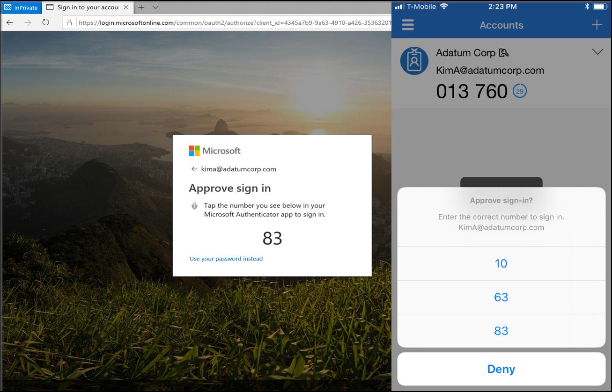
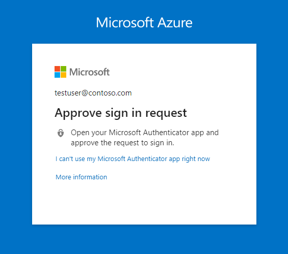

# Authentication methods in Microsoft Entra ID - Microsoft Authenticator app

The Microsoft Authenticator app provides an additional level of security to your Microsoft Entra work or school account or your Microsoft account and is available for [Android](https://go.microsoft.com/fwlink/?linkid=866594) and [iOS](https://go.microsoft.com/fwlink/?linkid=866594). With the Microsoft Authenticator app, users can authenticate in a passwordless way during sign-in, or as an additional verification option during self-service password reset (SSPR) or multifactor authentication events.

Users may receive a notification through the mobile app for them to approve or deny, or use the Authenticator app to generate an OATH verification code that can be entered in a sign-in interface. If you enable both a notification and verification code, users who register the Authenticator app can use either method to verify their identity.

To use the Authenticator app at a sign-in prompt rather than a username and password combination, see [Enable passwordless sign-in with the Microsoft Authenticator](howto-authentication-passwordless-phone.md).

> [!NOTE]
> - Users don't have the option to register their mobile app when they enable SSPR. Instead, users can register their mobile app at [https://aka.ms/mfasetup](https://aka.ms/mfasetup) or as part of the combined security info registration at [https://aka.ms/setupsecurityinfo](https://aka.ms/setupsecurityinfo).
> - The Authenticator app may not be supported on beta versions of iOS and Android. In addition, starting October 20th, 2023 the authenticator app on Android will no longer support older verisons of the Android Company Portal. Android users with Company Portal versions below 2111 (5.0.5333.0) will not be able to re-register or register new instances of the authenticator app until they update their Company Portal application to a newer version.

## Passwordless sign-in

Instead of seeing a prompt for a password after entering a username, a user that has enabled phone sign-in from the Authenticator app sees a message to enter a number in their app. When the correct number is selected, the sign-in process is complete.

This authentication method provides a high level of security, and removes the need for the user to provide a password at sign-in. 

To get started with passwordless sign-in, see [Enable passwordless sign-in with the Microsoft Authenticator](howto-authentication-passwordless-phone.md).

## Notification through mobile app

The Authenticator app can help prevent unauthorized access to accounts and stop fraudulent transactions by pushing a notification to your smartphone or tablet. Users view the notification, and if it's legitimate, select **Verify**. Otherwise, they can select **Deny**.

> [!NOTE]
> Starting in August, 2023, sign-ins from unfamiliar locations no longer generate notifications. Similar to how unfamiliar locations work in [Smart lockout](howto-password-smart-lockout.md), a location becomes "familiar" during the first 14 days of use, or the first 10 sign-ins. If the location is unfamiliar, or if the relevant Google or Apple service responsible for push notifications isn't available, users won't see their notification as usual. In that case, they should open Microsoft Authenticator, or Authenticator Lite in a relevant companion app like Outlook, refresh by either pulling down or hitting **Refresh**, and approve the request. 

In China, the *Notification through mobile app* method on Android devices doesn't work because as Google play services (including push notifications) are blocked in the region. However, iOS notifications do work. For Android devices, alternate authentication methods should be made available for those users.

## Verification code from mobile app

The Authenticator app can be used as a software token to generate an OATH verification code. After entering your username and password, you enter the code provided by the Authenticator app into the sign-in interface. The verification code provides a second form of authentication.

> [!NOTE]
> OATH verification codes generated by Authenticator aren't supported for certificate-based authentication.

Users may have a combination of up to five OATH hardware tokens or authenticator applications, such as the Authenticator app, configured for use at any time.

## FIPS 140 compliant for Microsoft Entra authentication

Beginning with version 6.6.8, Microsoft Authenticator for iOS is compliant with [Federal Information Processing Standard (FIPS) 140](https://csrc.nist.gov/publications/detail/fips/140/3/final?azure-portal=true) for all Microsoft Entra authentications using push multi-factor authentications (MFA), passwordless Phone Sign-In (PSI), and time-based one-time passcodes (TOTP).  

Consistent with the guidelines outlined in [NIST SP 800-63B](https://pages.nist.gov/800-63-3/sp800-63b.html?azure-portal=true), authenticators are required to use FIPS 140 validated cryptography. This helps federal agencies meet the requirements of [Executive Order (EO) 14028](https://www.whitehouse.gov/briefing-room/presidential-actions/2021/05/12/executive-order-on-improving-the-nations-cybersecurity/?azure-portal=true) and healthcare organizations working with [Electronic Prescriptions for Controlled Substances (EPCS)](/azure/compliance/offerings/offering-epcs-us). 

FIPS 140 is a US government standard that defines minimum security requirements for cryptographic modules in information technology products and systems. Testing against the FIPS 140 standard is maintained by the [Cryptographic Module Validation Program (CMVP)](https://csrc.nist.gov/Projects/cryptographic-module-validation-program?azure-portal=true).

No changes in configurations are required in Microsoft Authenticator or the Microsoft Entra admin center to enable FIPS 140 compliance. Beginning with Microsoft Authenticator for iOS version 6.6.8, Microsoft Entra authentications will be FIPS 140 compliant by default.

Authenticator leverages the native Apple cryptography to achieve FIPS 140, Security Level 1 compliance on Apple iOS devices beginning with Microsoft Authenticator version 6.6.8. For more information about the certifications being used, see the [Apple CoreCrypto module](https://support.apple.com/guide/sccc/security-certifications-for-ios-scccfa917cb49/web?azure-portal=true). 

FIPS 140 compliance for Microsoft Authenticator on Android is in progress and will follow soon.

## Determining Microsoft Authenticator registration type in My Security-Info 
Managining and adding additional Microsoft Authenticator registrations can be performed by users by accessing https://aka.ms/mysecurityinfo or by selecting Security info from  from My Account. Specific icons are used to differentiate whether the Microsoft Authenticator registration is capable of passwordless phone sign-in or MFA. 

Authenticator registration type | Icon
------ | ------
Microsoft Authenticator: Passwordless phone sign-in   |   
Microsoft Authenticator: MFA capable | 

## Next steps

- To get started with passwordless sign-in, see [Enable passwordless sign-in with the Microsoft Authenticator](howto-authentication-passwordless-phone.md).

- Learn more about configuring authentication methods using the [Microsoft Graph REST API](/graph/api/resources/authenticationmethods-overview).
