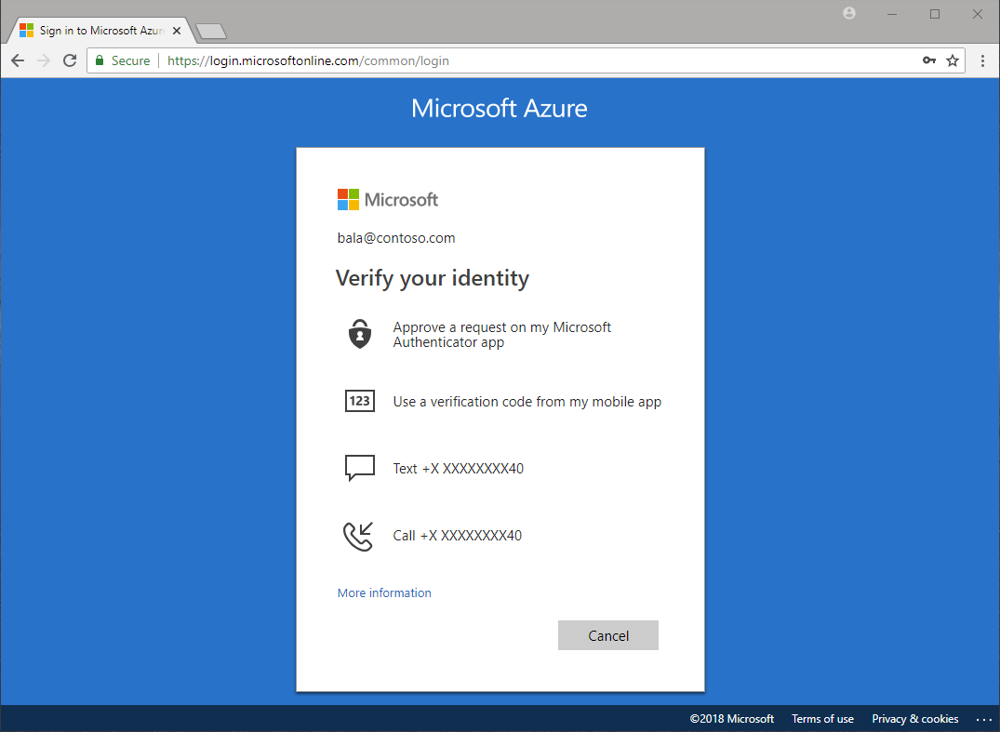
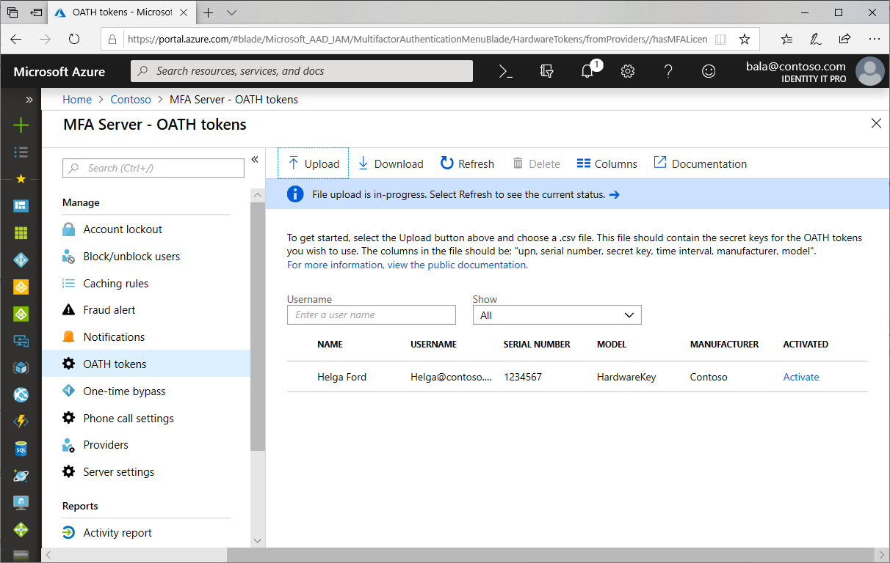

# What are authentication methods?

Azure AD self-service password reset (SSPR) and Multi-Factor Authentication (MFA) may ask for additional information, known as authentication methods or security info, to confirm you are who you say you are when using the associated features.

Administrators can define in policy which authentication methods are available to users of SSPR and MFA. Some authentication methods may not be available to all features.

Microsoft highly recommends Administrators enable users to select more than the minimum required number of authentication methods in case they do not have access to one.

|Authentication Method|Usage|
| --- | --- |
| Password | MFA and SSPR |
| Security questions | SSPR Only |
| Email address | SSPR Only |
| Microsoft Authenticator app | MFA and Public Preview for SSPR |
| OATH Hardware token | Public preview for MFA and SSPR |
| SMS | MFA and SSPR |
| Voice call | MFA and SSPR |
| App passwords | MFA only in certain cases |



|     |
| --- |
| OATH Hardware tokens for MFA and SSPR and Mobile app notification or Mobile app code as methods for Azure AD self-service password reset are public preview features of Azure Active Directory. For more information about previews, see  [Supplemental Terms of Use for Microsoft Azure Previews](https://azure.microsoft.com/support/legal/preview-supplemental-terms/)|
|     |

## Password

Your Azure AD password is considered an authentication method. It is the one method that **cannot be disabled**.

## Security questions

Security questions are available **only in Azure AD self-service password reset** to non-administrator accounts.

If you use security questions, we recommend using them in conjunction with another method. Security questions can be less secure than other methods because some people might know the answers to another user's questions.

> [!NOTE]
> Security questions are stored privately and securely on a user object in the directory and can only be answered by users during registration. There is no way for an administrator to read or modify a user's questions or answers.
>

### Predefined questions

* In what city did you meet your first spouse/partner?
* In what city did your parents meet?
* In what city does your nearest sibling live?
* In what city was your father born?
* In what city was your first job?
* In what city was your mother born?
* What city were you in on New Year's 2000?
* What is the last name of your favorite teacher in high school?
* What is the name of a college you applied to but didn't attend?
* What is the name of the place in which you held your first wedding reception?
* What is your father's middle name?
* What is your favorite food?
* What is your maternal grandmother's first and last name?
* What is your mother's middle name?
* What is your oldest sibling's birthday month and year? (e.g. November 1985)
* What is your oldest sibling's middle name?
* What is your paternal grandfather's first and last name?
* What is your youngest sibling's middle name?
* What school did you attend for sixth grade?
* What was the first and last name of your childhood best friend?
* What was the first and last name of your first significant other?
* What was the last name of your favorite grade school teacher?
* What was the make and model of your first car or motorcycle?
* What was the name of the first school you attended?
* What was the name of the hospital in which you were born?
* What was the name of the street of your first childhood home?
* What was the name of your childhood hero?
* What was the name of your favorite stuffed animal?
* What was the name of your first pet?
* What was your childhood nickname?
* What was your favorite sport in high school?
* What was your first job?
* What were the last four digits of your childhood telephone number?
* When you were young, what did you want to be when you grew up?
* Who is the most famous person you have ever met?

All of the predefined security questions are translated and localized into the full set of Office 365 languages based on the user's browser locale.

### Custom security questions

Custom security questions are not localized. All custom questions are displayed in the same language as they are entered in the administrative user interface, even if the user's browser locale is different. If you need localized questions, you should use the predefined questions.

The maximum length of a custom security question is 200 characters.

### Security question requirements

* The minimum answer character limit is three characters.
* The maximum answer character limit is 40 characters.
* Users can't answer the same question more than one time.
* Users can't provide the same answer to more than one question.
* Any character set can be used to define the questions and the answers, including Unicode characters.
* The number of questions defined must be greater than or equal to the number of questions that were required to register.

## Email address

Email address is available **only in Azure AD self-service password reset**.

Microsoft recommends the use of an email account that would not require the user's Azure AD password to access.

## Microsoft Authenticator app

The Microsoft Authenticator app provides an additional level of security to your Azure AD work or school account or your Microsoft account.

The Microsoft Authenticator app is available for [Android](https://go.microsoft.com/fwlink/?linkid=866594), [iOS](https://go.microsoft.com/fwlink/?linkid=866594), and [Windows Phone](http://go.microsoft.com/fwlink/?Linkid=825071).

> [!NOTE]
> Users will not have the option to register their mobile app when registering for self-service password reset. Instead, users can register their mobile app at [https://aka.ms/mfasetup](https://aka.ms/mfasetup) or in the security info registration preview at [https://aka.ms/setupsecurityinfo](https://aka.ms/setupsecurityinfo).
>

### Notification through mobile app

The Microsoft Authenticator app can help prevent unauthorized access to accounts and stop fraudulent transactions by pushing a notification to your smartphone or tablet. Users view the notification, and if it's legitimate, select Verify. Otherwise, they can select Deny.

> [!WARNING]
> For self-service password reset when only one method is required for reset, verification code is the only option available to users **to ensure the highest level of security**.
>
> When two methods are required users will be able to reset using **EITHER** notification **OR** verification code in addition to any other enabled methods.
>

If you enable the use of both notification through mobile app and verification code from mobile app, users who register the Microsoft Authenticator app using a notification are able to use both notification and code to verify their identity.

### Verification code from mobile app

The Microsoft Authenticator app or other third-party apps can be used as a software token to generate an OATH verification code. After entering your username and password, you enter the code provided by the app into the sign-in screen. The verification code provides a second form of authentication.

> [!WARNING]
> For self-service password reset when only one method is required for reset verification code is the only option available to users **to ensure the highest level of security**.
>

## OATH hardware tokens

OATH is an open standard that specifies how one-time password (OTP) codes are generated. Azure AD will support the use of OATH-TOTP SHA-1 tokens of the 30-second or 60-second variety. Customers can procure these tokens from the vendor of their choice. Note that secret keys are limited to 128 characters, which may not be compatible with all tokens.



Once tokens are acquired they must be uploaded in a comma-separated values (CSV) file format including the UPN, serial number, secret key, time interval, manufacturer, and model as the example below shows.

```
upn,serial number,secret key,timeinterval,manufacturer,model
Helga@contoso.com,1234567,1234567890abcdef1234567890abcdef,60,Contoso,HardwareKey
```

> [!NOTE]
> Make sure you include the header row in your CSV file as shown above.

Once properly formatted as a CSV file, an administrator can then sign in to the Azure portal and navigate to **Azure Active Directory**, **MFA Server**, **OATH tokens**, and upload the resulting CSV file.

Depending on the size of the CSV file, it may take a few minutes to process. Click the **Refresh** button to get the current status. If there are any errors in the file, you will have the option to download a CSV file listing any errors for you to resolve.

Once any errors have been addressed, the administrator then can activate each key by clicking **Activate** for the token to be activated and entering the OTP displayed on the token.

## Mobile phone

Two options are available to users with mobile phones.

If users don't want their mobile phone number to be visible in the directory, but they still want to use it for password reset, administrators should not populate it in the directory. Users should populate their **Authentication Phone** attribute via the [password reset registration portal](https://aka.ms/ssprsetup). Administrators can see this information in the user's profile, but it's not published elsewhere.

To work properly, phone numbers must be in the format *+CountryCode PhoneNumber*, for example, +1 4255551234.

> [!NOTE]
> There needs to be a space between the country code and the phone number.
>
> Password reset does not support phone extensions. Even in the +1 4255551234X12345 format, extensions are removed before the call is placed.

### Text message

An SMS is sent to the mobile phone number containing a verification code. Enter the verification code provided in the sign-in interface to continue.

### Phone call

An automated voice call is made to the phone number you provide. Answer the call and press # in the phone keypad to authenticate

## Office phone

An automated voice call is made to the phone number you provide. Answer the call and presses # in the phone keypad to authenticate.

To work properly, phone numbers must be in the format *+CountryCode PhoneNumber*, for example, +1 4255551234.

The office phone attribute is managed by your administrator.

> [!NOTE]
> There needs to be a space between the country code and the phone number.
>
> Password reset does not support phone extensions. Even in the +1 4255551234X12345 format, extensions are removed before the call is placed.

## App Passwords

Certain non-browser apps do not support multi-factor authentication, if a user has been enabled for multi-factor authentication and attempt to use non-browser apps, they are unable to authenticate. An app password allows users to continue to authenticate

If you enforce Multi-Factor Authentication through Conditional Access policies and not through per-user MFA, you cannot create app passwords. Applications that use Conditional Access policies to control access do not need app passwords.

If your organization is federated for SSO with Azure AD and you are going to be using Azure MFA, then be aware of the following details:

* The app password is verified by Azure AD and therefore bypasses federation. Federation is only used when setting up app passwords. For federated (SSO) users, passwords are stored in the organizational ID. If the user leaves the company, that info has to flow to organizational ID using DirSync. Account disable/deletion may take up to three hours to sync, which delays disable/deletion of app passwords in Azure AD.
* On-premises Client Access Control settings are not honored by App Password.
* No on-premises authentication logging/auditing capability is available for app passwords.
* Certain advanced architectural designs may require using a combination of organizational username and passwords and app passwords when using two-step verification with clients, depending on where they authenticate. For clients that authenticate against an on-premises infrastructure, you would use an organizational username and password. For clients that authenticate against Azure AD, you would use the app password.
* By default, users cannot create app passwords. If you need to allow users to create app passwords, select the **Allow users to create app passwords to sign into non-browser applications option** under service settings.

## Next steps

[Enable self service password reset for your organization](quickstart-sspr.md)

[Enable Azure Multi-Factor Authentication for your organization](howto-mfa-getstarted.md)

[Enable converged registration for Azure Multi-Factor Authentication and Azure AD self-service password reset](concept-registration-mfa-sspr-converged.md)

[End-user authentication method configuration documentation](https://aka.ms/securityinfoguide)
