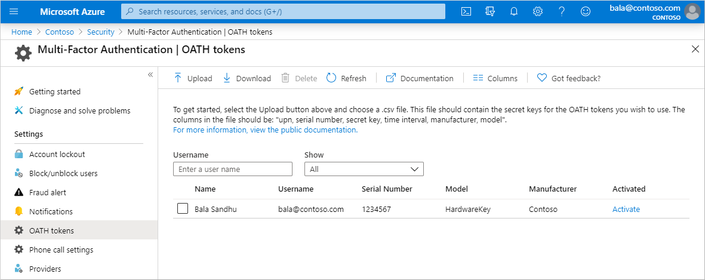
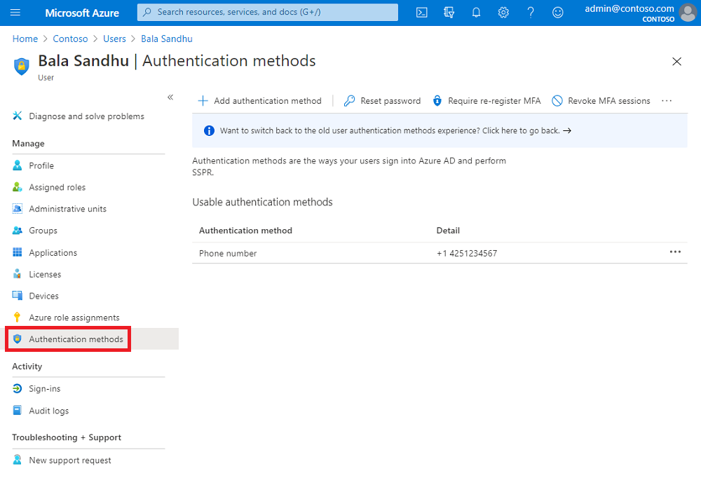
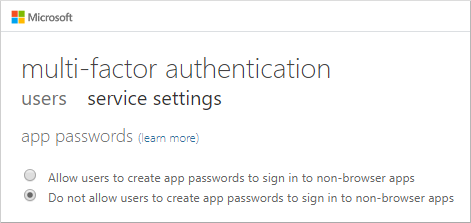

# What authentication and verification methods are available in Azure Active Directory?

As part of the sign-in experience for accounts in Azure Active Directory (Azure AD), there are different ways that a user can authenticate themselves. A username and password is the most common way a user would historically provide credentials. With modern authentication and security features in Azure AD, that basic password can be supplemented or replaced with additional authentication methods.

A user in Azure AD can choose to authenticate using one of the following authentication methods:

* Traditional username and password
* Microsoft Authenticator App passwordless sign-in
* OATH hardware token or FIDO2 security key
* SMS-based passwordless sign-in

Many accounts in Azure AD are enabled for self-service password reset (SSPR) or Azure Multi-Factor Authentication. These features include additional verification methods, such as a phone call or security questions. It's recommended that you require users to register multiple verification methods. When one method isn't available for a user, they can choose to authenticate with another method.

The following table outlines what methods are available for primary or secondary authentication:

| Method | Primary authentication | Secondary authentication |
| --- | --- | --- |
| [Password](#password) | Yes | |
| [Microsoft Authenticator app](#microsoft-authenticator-app) | Yes (preview) | MFA and SSPR |
| [FIDO2 security keys (preview)](#fido2-security-keys) | Yes | MFA-only |
| [OATH software tokens](#oath-software-tokens) | No | MFA |
| [OATH hardware tokens (preview)](#oath-hardware-tokens-preview) | Yes | MFA |
| [SMS](#phone-options) | Yes (preview) | MFA and SSPR |
| [Voice call](#phone-options) | No | MFA and SSPR |
| [Security questions](#security-questions) | No | SSPR-only |
| [Email address](#email-address) | No | SSPR-only |
| [App passwords](#app-passwords) | No | MFA only in certain cases |

This article outlines these different authentication and verification methods available in Azure AD and any specific limitations or restrictions.


## Password

An Azure AD password is often one of the primary authentication methods. You can't disable the password authentication method.

Even if you use an authentication method such as [SMS-based sign-in](howto-authentication-sms-signin.md) when the user doesn't use their password to sign, a password remains as an available authentication method.

## Microsoft Authenticator app

The Authenticator app provides an additional level of security to your Azure AD work or school account or your Microsoft account and is available for [Android](https://go.microsoft.com/fwlink/?linkid=866594), [iOS](https://go.microsoft.com/fwlink/?linkid=866594), and [Windows Phone](https://www.microsoft.com/p/microsoft-authenticator/9nblgggzmcj6). With the Microsoft Authenticator app, users can authenticate in a passwordless way during sign-in, or as an additional verification option during self-service password reset (SSPR) or Azure Multi-Factor Authentication events.

Users may receive a notification through the mobile app for them to approve or deny, or use the Authenticator app to generate an OATH verification code that can be entered in a sign-in interface. If you enable both a notification and verification code, users who register the Authenticator app can use either method to verify their identity.

To use the Authenticator app at a sign-in prompt rather than a username and password combination, see [Enable passwordless sign-in with the Microsoft Authenticator app (preview)](howto-authentication-passwordless-phone.md).

> [!NOTE]
> Users don't have the option to register their mobile app when they enable SSPR. Instead, users can register their mobile app at [https://aka.ms/mfasetup](https://aka.ms/mfasetup) or as part of the combined security info registration at [https://aka.ms/setupsecurityinfo](https://aka.ms/setupsecurityinfo).

### Notification through mobile app

The Authenticator app can help prevent unauthorized access to accounts and stop fraudulent transactions by pushing a notification to your smartphone or tablet. Users view the notification, and if it's legitimate, select **Verify**. Otherwise, they can select **Deny**.


> [!NOTE]
> If your organization has staff working in or traveling to China, the *Notification through mobile app* method on Android devices doesn't work in that country/region. Alternate authentication methods should be made available for those users.

### Verification code from mobile app

The Authenticator app can be used as a software token to generate an OATH verification code. After entering your username and password, you enter the code provided by the Authenticator app into the sign-in interface. The verification code provides a second form of authentication.

Users may have a combination of up to five OATH hardware tokens or authenticator applications, such as the Microsoft Authenticator app, configured for use at any time.

> [!WARNING]
> To ensure the highest level of security for self-service password reset when only one method is required for reset, a verification code is the only option available to users.
>
> When two methods are required, users can reset using either a notification or verification code in addition to any other enabled methods.

## FIDO2 security keys

The FIDO (Fast IDentity Online) Alliance helps to promote open authentication standards and reduce the user of passwords as a form of authentication. FIDO2 is the latest standard that incorporates the web authentication (WebAuthn) standard.

To use FIDO2 security keys at a sign-in prompt rather than a username and password combination, see [Enable passwordless FIDO2 security key sign-in (preview)](howto-authentication-passwordless-security-key.md).

Users can register and then select a FIDO2 security key at the sign-in interface as their main means of authentication. These FIDO2 security keys are typically USB devices, but could also use Bluetooth or NFC. With a hardware device that handles the authentication, the security of an account is increased as there's no password that could be exposed or guessed.

FIDO2 security keys in Azure AD are currently in preview. For more information about previews, see [Supplemental Terms of Use for Microsoft Azure Previews](https://azure.microsoft.com/support/legal/preview-supplemental-terms/).

## OATH tokens

OATH TOTP (Time-based One Time Password) is an open standard that specifies how one-time password (OTP) codes are generated. OATH TOTP can be implemented using either software or hardware to generate the codes. Azure AD doesn't support OATH HOTP, a different code generation standard.

### OATH software tokens

Software OATH tokens are typically applications such as the Microsoft Authenticator app and other authenticator apps. Azure AD generates the secret key, or seed, that's input into the app and used to generate each OTP.

The Authenticator app automatically generates codes when set up to do push notifications so a user has a backup even if their device doesn't have connectivity. Third-party applications that use OATH TOTP to generate codes can also be used.

Some OATH TOTP hardware tokens are programmable, meaning they don't come with a secret key or seed pre-programmed. These programmable hardware tokens can be set up using the secret key or seed obtained from the software token setup flow. Customers can purchase these tokens from the vendor of their choice and use the secret key or seed in their vendor's setup process.

### OATH hardware tokens (preview)

Azure AD supports the use of OATH-TOTP SHA-1 tokens that refresh codes every 30 or 60 seconds. Customers can purchase these tokens from the vendor of their choice.

OATH TOTP hardware tokens typically come with a secret key, or seed, pre-programmed in the token. These keys must be input into Azure AD as described in the following steps. Secret keys are limited to 128 characters, which may not be compatible with all tokens. The secret key can only contain the characters *a-z* or *A-Z* and digits *1-7*, and must be encoded in *Base32*.

Programmable OATH TOTP hardware tokens that can be reseeded can also be set up with Azure AD in the software token setup flow.

OATH hardware tokens are supported as part of a public preview. For more information about previews, see  [Supplemental Terms of Use for Microsoft Azure Previews](https://azure.microsoft.com/support/legal/preview-supplemental-terms/)



Once tokens are acquired they must be uploaded in a comma-separated values (CSV) file format including the UPN, serial number, secret key, time interval, manufacturer, and model as shown in the following example:

```csv
upn,serial number,secret key,time interval,manufacturer,model
Helga@contoso.com,1234567,1234567abcdef1234567abcdef,60,Contoso,HardwareKey
```

> [!NOTE]
> Make sure you include the header row in your CSV file.

Once properly formatted as a CSV file, an administrator can then sign in to the Azure portal, navigate to **Azure Active Directory > Security > MFA > OATH tokens**, and upload the resulting CSV file.

Depending on the size of the CSV file, it may take a few minutes to process. Select the **Refresh** button to get the current status. If there are any errors in the file, you can download a CSV file that lists any errors for you to resolve. The field names in the downloaded CSV file are different than the uploaded version.

Once any errors have been addressed, the administrator then can activate each key by selecting **Activate** for the token and entering the OTP displayed on the token.

Users may have a combination of up to five OATH hardware tokens or authenticator applications, such as the Microsoft Authenticator app, configured for use at any time.

## Phone options

For direct authentication using text message, you can [Configure and enable users for SMS-based authentication(preview)](howto-authentication-sms-signin.md). SMS-based sign-in is great for front-line workers. With SMS-based sign-in, users don't need to know a username and password to access applications and services. The user instead enters their registered mobile phone number, receives a text message with a verification code, and enters that in the sign-in interface.

Users can also verify themselves using a mobile phone or office phone as secondary form of authentication used during Azure Multi-Factor Authentication or self-service password reset (SSPR).

To work properly, phone numbers must be in the format *+CountryCode PhoneNumber*, for example, *+1 4251234567*.

> [!NOTE]
> There needs to be a space between the country/region code and the phone number.
>
> Password reset doesn't support phone extensions. Even in the *+1 4251234567X12345* format, extensions are removed before the call is placed.

### Mobile phone verification

For Azure Multi-Factor Authentication or SSPR, users can choose to receive a text message with a verification code to enter in the sign-in interface, or receive a phone call with a prompt to enter their defined pin code.

If users don't want their mobile phone number to be visible in the directory but want to use it for password reset, administrators shouldn't populate the phone number in the directory. Instead, users should populate their **Authentication Phone** attribute via the combined security info registration at [https://aka.ms/setupsecurityinfo](https://aka.ms/setupsecurityinfo). Administrators can see this information in the user's profile, but it's not published elsewhere.



Microsoft doesn't guarantee consistent SMS or voice-based Azure Multi-Factor Authentication prompt delivery by the same number. In the interest of our users, we may add or remove short codes at any time as we make route adjustments to improve SMS deliverability. Microsoft doesn't support short codes for countries / regions besides the United States and Canada.

#### Text message verification

With text message verification during SSPR or Azure Multi-Factor Authentication, an SMS is sent to the mobile phone number containing a verification code. To complete the sign-in process, the verification code provided is entered into the sign-in interface.

#### Phone call verification

With phone call verification during SSPR or Azure Multi-Factor Authentication, an automated voice call is made to the phone number registered by the user. To complete the sign-in process, the user is prompted to enter their pin number followed by # on their keypad.

### Office phone verification

The office phone attribute is managed by the Azure AD administrator and can't be registered by a user themselves.

With phone call verification during SSPR or Azure Multi-Factor Authentication, an automated voice call is made to the phone number registered by the user. To complete the sign-in process, the user is prompted to enter their pin number followed by # on their keypad.

### Troubleshooting phone options

If you have problems with phone authentication for Azure AD, review the following troubleshooting steps:

* Blocked caller ID on a single device.
   * Review any blocked numbers configured on the device.
* Wrong phone number or incorrect country/region code, or confusion between personal phone number versus work phone number.
   * Troubleshoot the user object and configured authentication methods. Make sure that the correct phone numbers are registered.
* Wrong PIN entered.
   * Confirm the user has used the correct PIN as registered for their account.
* Call forwarded to voicemail.
   * Ensure that the user has their phone turned on and that service is available in their area, or use alternate method.
* User is blocked
   * Have an Azure AD administrator unblock the user in the Azure portal.
* SMS is not subscribed on the device.
   * Have the user change methods or activate SMS on the device.
* Faulty telecom providers such as no phone input detected, missing DTMF tones issues, blocked caller ID on multiple devices, or blocked SMS across multiple devices.
   * Microsoft uses multiple telecom providers to route phone calls and SMS messages for authentication. If you see any of the above issues, have a user attempt to use the method at least five times within 5 minutes and have that user's information available when contacting Microsoft support.

## Security questions

Security questions aren't used as an authentication method during a sign-in event. Instead, security questions can be used during the self-service password reset (SSPR) process to confirm who you are. Administrator accounts can't use security questions as verification method with SSPR.

When users register for SSPR, they're prompted to choose the authentication methods to use. If they choose to use security questions, they pick from a set of questions to prompt for and then provide their own answers.


> [!NOTE]
> Security questions are stored privately and securely on a user object in the directory and can only be answered by users during registration. There's no way for an administrator to read or modify a user's questions or answers.

Security questions can be less secure than other methods because some people might know the answers to another user's questions. If you use security questions with SSPR, it's recommended to use them in conjunction with another method. A user can be prompted to use the Microsoft Authenticator App or phone authentication to verify their identity during the SSPR process, and choose security questions only if they don't have their phone or registered device with them.

### Predefined questions

The following predefined security questions are available for use as a verification method with SSPR. All of these security questions are translated and localized into the full set of Office 365 languages based on the user's browser locale:

* In what city did you meet your first spouse/partner?
* In what city did your parents meet?
* In what city does your nearest sibling live?
* In what city was your father born?
* In what city was your first job?
* In what city was your mother born?
* What city were you in on New Year's 2000?
* What is the last name of your favorite teacher in high school?
* What is the name of a college you applied to but didn't attend?
* What is the name of the place in which you held your first wedding reception?
* What is your father's middle name?
* What is your favorite food?
* What is your maternal grandmother's first and last name?
* What is your mother's middle name?
* What is your oldest sibling's birthday month and year? (for example, November 1985)
* What is your oldest sibling's middle name?
* What is your paternal grandfather's first and last name?
* What is your youngest sibling's middle name?
* What school did you attend for sixth grade?
* What was the first and last name of your childhood best friend?
* What was the first and last name of your first significant other?
* What was the last name of your favorite grade school teacher?
* What was the make and model of your first car or motorcycle?
* What was the name of the first school you attended?
* What was the name of the hospital in which you were born?
* What was the name of the street of your first childhood home?
* What was the name of your childhood hero?
* What was the name of your favorite stuffed animal?
* What was the name of your first pet?
* What was your childhood nickname?
* What was your favorite sport in high school?
* What was your first job?
* What were the last four digits of your childhood telephone number?
* When you were young, what did you want to be when you grew up?
* Who is the most famous person you have ever met?

### Custom security questions

For additional flexibility, you can define your own custom security questions. The maximum length of a custom security question is 200 characters.

Custom security questions aren't automatically localized like with the default security questions. All custom questions are displayed in the same language as they're entered in the administrative user interface, even if the user's browser locale is different. If you need localized questions, you should use the predefined questions.

### Security question requirements

For both default and custom security questions, the following requirements and limitations apply:

* The minimum answer character limit is three characters.
* The maximum answer character limit is 40 characters.
* Users can't answer the same question more than one time.
* Users can't provide the same answer to more than one question.
* Any character set can be used to define the questions and the answers, including Unicode characters.
* The number of questions defined must be greater than or equal to the number of questions that were required to register.

## Email address

An email address can't be used as a direct authentication method. Email address is only available as a verification option for self-service password reset (SSPR). When email address is selected during SSPR, an email is sent to the user to complete the authentication / verification process.

During registration for SSPR, a user provides the email address to use. It's recommended that they use a different email account than their corporate account to make sure they can access it during SSPR.

## App passwords

Certain older, non-browser apps don't understand pauses or breaks in the authentication process. If a user is enabled for multi-factor authentication and attempts to use one of these older, non-browser apps, they usually can't successfully authenticate. An app password allows users to continue to successfully authenticate with older, non-browser apps without interruption.

By default, users can't create app passwords. If you need to allow users to create app passwords, select the **Allow users to create app passwords to sign into non-browser apps** under *Service settings* for user's Azure Multi-Factor Authentication properties.



If you enforce Azure Multi-Factor Authentication using Conditional Access policies and not through per-user MFA, you can't create app passwords. Modern applications that use Conditional Access policies to control access don't need app passwords.

If your organization is federated for single sign-on (SSO) with Azure AD and you use Azure Multi-Factor Authentication, the following considerations apply:

* The app password is verified by Azure AD, so bypasses federation. Federation is only used when setting up app passwords. For federated (SSO) users, passwords are stored in the organizational ID. If the user leaves the company, that info has to flow to organizational ID using DirSync. Account disable or deletion  events may take up to three hours to sync, which delays the disabling / deletion of app passwords in Azure AD.
* On-premises Client Access Control settings aren't honored by app passwords.
* No on-premises authentication logging or auditing capability is available for app passwords.
* Certain advanced architectural designs may require using a combination of organizational username and passwords and app passwords when using multi-factor authentication, depending on where they authenticate.
    * For clients that authenticate against an on-premises infrastructure, you would use an organizational username and password.
    * For clients that authenticate against Azure AD, you would use the app password.

## Next steps

To get started, see the [tutorial for self-service password reset (SSPR)][tutorial-sspr] and [Azure Multi-Factor Authentication][tutorial-azure-mfa].

To learn more about SSPR concepts, see [How Azure AD self-service password reset works][concept-sspr].

To learn more about MFA concepts, see [How Azure Multi-Factor Authentication works][concept-mfa].

<!-- INTERNAL LINKS -->
[tutorial-sspr]: tutorial-enable-sspr.md
[tutorial-azure-mfa]: tutorial-enable-azure-mfa.md
[concept-sspr]: concept-sspr-howitworks.md
[concept-mfa]: concept-mfa-howitworks.md