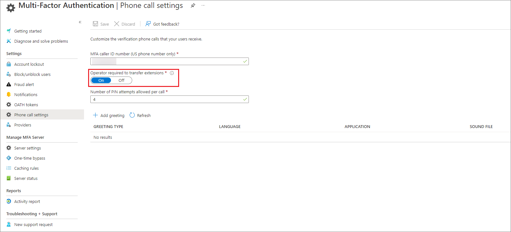

# How to enable and disable operator assistance

On September 30, 2023, we will retire operator assistance in Microsoft Entra multifactor authentication and it will no longer be available. To avoid service disruption, follow the steps in this topic to disable operator assistance before September 30, 2023.

Operator assistance is a feature within Microsoft Entra ID that allows an operator to manually transfer phone calls instead of automatic transfer. When this setting is enabled, the office phone number is dialed and when answered, the system asks the operator to transfer the call to a given extension.

Operator assistance can be enabled for an entire tenant or for an individual user. If the setting is **On**, the entire tenant is enabled for operator assistance. If you choose **Phone call** as the default method and have an extension specified as part of your office phone number (delineated by **x**), an operator can manually transfer the phone call.

For example, let's say a customer in U.S has an office phone number 425-555-1234x5678. When operator assistance is enabled, the system will dial 425-555-1234. Once answered, the customer (also known as the operator) is asked to transfer the call to extension 5678. Once transferred and answered, the system recites the normal MFA prompt and awaits approval.

If the setting is **Off**, the system will automatically dial extensions as part of the phone number. Your admin can still specify individual users who should be enabled for operator assistance by prefixing the extension with ‘@’. For example, 425-555-1234x@5678 would indicate that operator assistance should be used, even though the setting is **Off**.

To check the status of this feature in your own tenant, sign in to the [Microsoft Entra admin center](https://entra.microsoft.com) as at least an [Authentication Policy Administrator](../roles/permissions-reference.md#authentication-policy-administrator), then click **Protection** > **Multifactor authentication** > **Phone call settings**. Check **Operator required to transfer extensions** to see if the setting is **On** or **Off**. 

You can improve the reliability, security, and create a frictionless MFA experience by using the following guidance:

- You have [registered a direct phone number](https://aka.ms/mfasetup) (contains no extension) or [other method](concept-authentication-methods.md) to be used for multifactor authentication or self-service password reset if enabled. 
- Your admins have registered a direct phone number (contains no extension) on behalf of the user to be used for [multifactor authentication](howto-mfa-userdevicesettings.md#add-authentication-methods-for-a-user) or [self-service password reset](tutorial-enable-sspr.md) if enabled. 
- Phone system supports automated attendant functionality. 
 
