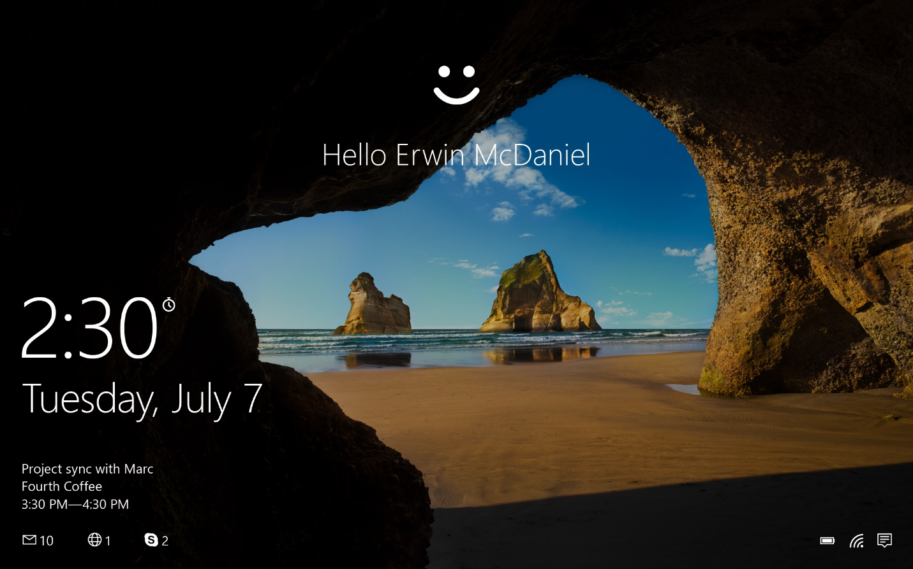
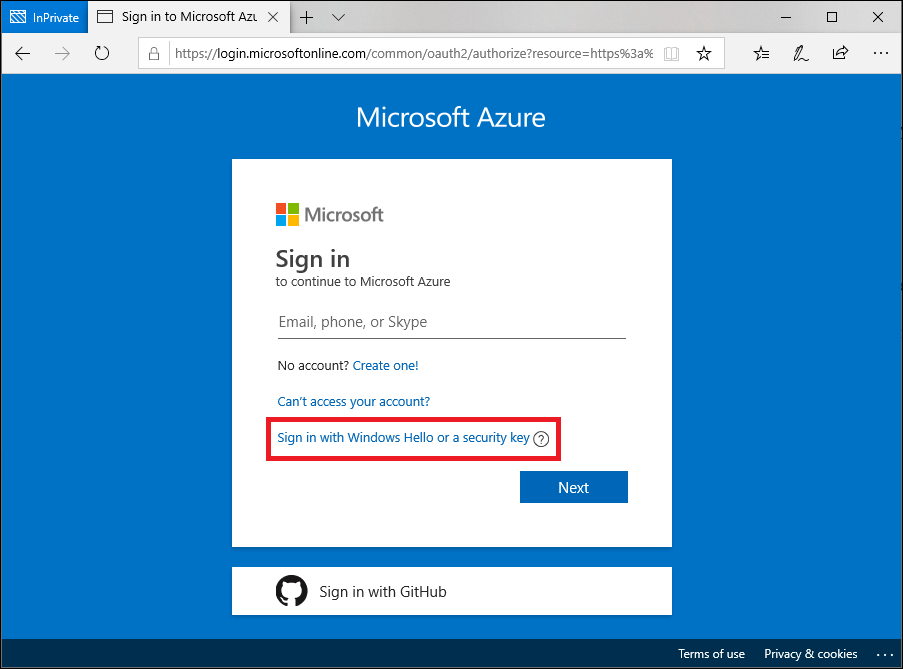

# Passwordless authentication options for Azure Active Directory

Features like multifactor authentication (MFA) are a great way to secure your organization, but users often get frustrated with the additional security layer on top of having to remember their passwords. Passwordless authentication methods are more convenient because the password is removed and replaced with something you have, plus something you are or something you know.

| Authentication  | Something you have | Something you are or know |
| --- | --- | --- |
| Passwordless | Windows 10 Device, phone, or security key | Biometric or PIN |

Each organization has different needs when it comes to authentication. Microsoft global Azure and Azure Government offer the following three passwordless authentication options that integrate with Azure Active Directory (Azure AD):

- Windows Hello for Business
- Microsoft Authenticator 
- FIDO2 security keys

## Windows Hello for Business

Windows Hello for Business is ideal for information workers that have their own designated Windows PC. The biometric and PIN credentials are directly tied to the user's PC, which prevents access from anyone other than the owner. With public key infrastructure (PKI) integration and built-in support for single sign-on (SSO), Windows Hello for Business provides a convenient method for seamlessly accessing corporate resources on-premises and in the cloud.

The following steps show how the sign-in process works with Azure AD:

1. A user signs into Windows using biometric or PIN gesture. The gesture unlocks the Windows Hello for Business private key and is sent to the Cloud Authentication security support provider, referred to as the *Cloud AP provider*.
1. The Cloud AP provider requests a nonce (a random arbitrary number that can be used just once) from Azure AD.
1. Azure AD returns a nonce that's valid for 5 minutes.
1. The Cloud AP provider signs the nonce using the user's private key and returns the signed nonce to the Azure AD.
1. Azure AD validates the signed nonce using the user's securely registered public key against the nonce signature.  Azure AD validates the signature and then validates the returned signed nonce. When the nonce is validated, Azure AD creates a primary refresh token (PRT) with session key that is encrypted to the device's transport key and returns it to the Cloud AP provider.
1. The Cloud AP provider receives the encrypted PRT with session key. The Cloud AP provider uses the device's private transport key to decrypt the session key and protects the session key using the device's Trusted Platform Module (TPM).
1. The Cloud AP provider returns a successful authentication response to Windows. The user is then able to access Windows as well as cloud and on-premises applications without the need to authenticate again (SSO).

The Windows Hello for Business [planning guide](/windows/security/identity-protection/hello-for-business/hello-planning-guide) can be used to help you make decisions on the type of Windows Hello for Business deployment and the options you'll need to consider.

## Microsoft Authenticator

You can also allow your employee's phone to become a passwordless authentication method. You may already be using the Authenticator app as a convenient multi-factor authentication option in addition to a password. You can also use the Authenticator App as a passwordless option.

The Authenticator App turns any iOS or Android phone into a strong, passwordless credential. Users can sign in to any platform or browser by getting a notification to their phone, matching a number displayed on the screen to the one on their phone, and then using their biometric (touch or face) or PIN to confirm. Refer to [Download and install the Microsoft Authenticator](https://support.microsoft.com/account-billing/download-and-install-the-microsoft-authenticator-app-351498fc-850a-45da-b7b6-27e523b8702a) for installation details.

Passwordless authentication using the Authenticator app follows the same basic pattern as Windows Hello for Business. It's a little more complicated as the user needs to be identified so that Azure AD can find the Authenticator app version being used:

1. The user enters their username.
1. Azure AD detects that the user has a strong credential and starts the Strong Credential flow.
1. A notification is sent to the app via Apple Push Notification Service (APNS) on iOS devices, or via Firebase Cloud Messaging (FCM) on Android devices.
1. The user receives the push notification and opens the app.
1. The app calls Azure AD and receives a proof-of-presence challenge and nonce.
1. The user completes the challenge by entering their biometric or PIN to unlock private key.
1. The nonce is signed with the private key and sent back to Azure AD.
1. Azure AD performs public/private key validation and returns a token.

To get started with passwordless sign-in, complete the following how-to:

> [!div class="nextstepaction"]
> [Enable passwordless sign using the Authenticator app](howto-authentication-passwordless-phone.md)

## FIDO2 security keys

The FIDO (Fast IDentity Online) Alliance helps to promote open authentication standards and reduce the use of passwords as a form of authentication. FIDO2 is the latest standard that incorporates the web authentication (WebAuthn) standard.

FIDO2 security keys are an unphishable standards-based passwordless authentication method that can come in any form factor. Fast Identity Online (FIDO) is an open standard for passwordless authentication. FIDO allows users and organizations to leverage the standard to sign in to their resources without a username or password using an external security key or a platform key built into a device.

Users can register and then select a FIDO2 security key at the sign-in interface as their main means of authentication. These FIDO2 security keys are typically USB devices, but could also use Bluetooth or NFC. With a hardware device that handles the authentication, the security of an account is increased as there's no password that could be exposed or guessed.

FIDO2 security keys can be used to sign in to their Azure AD or hybrid Azure AD joined Windows 10 devices and get single-sign on to their cloud and on-premises resources. Users can also sign in to supported browsers. FIDO2 security keys are a great option for enterprises who are very security sensitive or have scenarios or employees who aren't willing or able to use their phone as a second factor.

We have a reference document for which [browsers support FIDO2 authentication with Azure AD](fido2-compatibility.md), as well as best practices for developers wanting to [support FIDO2 auth in the applications they develop](../develop/support-fido2-authentication.md).

The following process is used when a user signs in with a FIDO2 security key:

1. The user plugs the FIDO2 security key into their computer.
2. Windows detects the FIDO2 security key.
3. Windows sends an authentication request.
4. Azure AD sends back a nonce.
5. The user completes their gesture to unlock the private key stored in the FIDO2 security key's secure enclave.
6. The FIDO2 security key signs the nonce with the private key.
7. The primary refresh token (PRT) token request with signed nonce is sent to Azure AD.
8. Azure AD verifies the signed nonce using the FIDO2 public key.
9. Azure AD returns PRT to enable access to on-premises resources.

### FIDO2 security key providers

The following providers offer FIDO2 security keys of different form factors that are known to be compatible with the passwordless experience. We encourage you to evaluate the security properties of these keys by contacting the vendor as well as the [FIDO Alliance](https://fidoalliance.org/).

| Provider                  |     Biometric     | USB | NFC | BLE | FIPS Certified | Contact                                                                                             |
|---------------------------|:-----------------:|:---:|:---:|:---:|:--------------:|-----------------------------------------------------------------------------------------------------|
| AuthenTrend               | ![y]              | ![y]| ![y]| ![y]| ![n]           | https://authentrend.com/about-us/#pg-35-3                                                           |
| Ciright                   | ![n]              | ![n]| ![y]| ![n]| ![n]           | https://www.cyberonecard.com/                                                                       |
| Crayonic                  | ![y]              | ![n]| ![y]| ![y]| ![n]           | https://www.crayonic.com/keyvault                                                                   |
| Ensurity                  | ![y]              | ![y]| ![n]| ![n]| ![n]           | https://www.ensurity.com/contact                                                                    |
| Excelsecu                 | ![y]              | ![y]| ![y]| ![y]| ![n]           | https://www.excelsecu.com/productdetail/esecufido2secu.html                                         |
| Feitian                   | ![y]              | ![y]| ![y]| ![y]| ![y]           | https://shop.ftsafe.us/pages/microsoft                                                              |
| Fortinet                  | ![n]              | ![y]| ![n]| ![n]| ![n]           | https://www.fortinet.com/                                                                           |
| Giesecke + Devrient (G+D) | ![y]              | ![y]| ![y]| ![y]| ![n]           | https://www.gi-de.com/en/identities/enterprise-security/hardware-based-authentication               |
| GoTrustID Inc.            | ![n]              | ![y]| ![y]| ![y]| ![n]           | https://www.gotrustid.com/idem-key                                                                  |
| HID                       | ![n]              | ![y]| ![y]| ![n]| ![n]           | https://www.hidglobal.com/products/crescendo-key                                                    |
| Hypersecu                 | ![n]              | ![y]| ![n]| ![n]| ![n]           | https://www.hypersecu.com/hyperfido                                                                 |
| Hypr                      | ![y]              | ![y]| ![n]| ![y]| ![n]           | https://www.hypr.com/true-passwordless-mfa                                                          |
| Identiv                   | ![n]              | ![y]| ![y]| ![n]| ![n]           | https://www.identiv.com/products/logical-access-control/utrust-fido2-security-keys/nfc              |
| IDmelon Technologies Inc. | ![y]              | ![y]| ![y]| ![y]| ![n]           | https://www.idmelon.com/#idmelon                                                                    |
| Kensington                | ![y]              | ![y]| ![n]| ![n]| ![n]           | https://www.kensington.com/solutions/product-category/why-biometrics/                               |
| KONA I                    | ![y]              | ![n]| ![y]| ![y]| ![n]           | https://konai.com/business/security/fido                                                            |
| Movenda                   | ![y]              | ![n]| ![y]| ![y]| ![n]           | https://www.movenda.com/en/authentication/fido2/overview                                            |
| NeoWave                   | ![n]              | ![y]| ![y]| ![n]| ![n]           | https://neowave.fr/en/products/fido-range/                                                          |
| Nymi                      | ![y]              | ![n]| ![y]| ![n]| ![n]           | https://www.nymi.com/nymi-band                                                                      | 
| Octatco                   | ![y]              | ![y]| ![n]| ![n]| ![n]           | https://octatco.com/                                                                                |
| OneSpan Inc.              | ![n]              | ![y]| ![n]| ![y]| ![n]           | https://www.onespan.com/products/fido                                                               |
| Swissbit                  | ![n]              | ![y]| ![y]| ![n]| ![n]           | https://www.swissbit.com/en/products/ishield-fido2/                                                 |
| Thales Group              | ![n]              | ![y]| ![y]| ![n]| ![y]           | https://cpl.thalesgroup.com/access-management/authenticators/fido-devices                           |
| Thetis                    | ![y]              | ![y]| ![y]| ![y]| ![n]           | https://thetis.io/collections/fido2                                                                 |
| Token2 Switzerland        | ![y]              | ![y]| ![y]| ![n]| ![n]           | https://www.token2.swiss/shop/product/token2-t2f2-alu-fido2-u2f-and-totp-security-key               |
| Token Ring                | ![y]              | ![n]| ![y]| ![n]| ![n]           | https://www.tokenring.com/                                                                          |
| TrustKey Solutions        | ![y]              | ![y]| ![n]| ![n]| ![n]           | https://www.trustkeysolutions.com/security-keys/                                                    |
| VinCSS                    | ![n]              | ![y]| ![n]| ![n]| ![n]           | https://passwordless.vincss.net                                                                     |
| WiSECURE Technologies     | ![n]              | ![y]| ![n]| ![n]| ![n]           | https://wisecure-tech.com/en-us/zero-trust/fido/authtron                                            |
| Yubico                    | ![y]              | ![y]| ![y]| ![n]| ![y]           | https://www.yubico.com/solutions/passwordless/                                                      |

<!--Image references-->
[y]: ./media/fido2-compatibility/yes.png
[n]: ./media/fido2-compatibility/no.png

> [!NOTE]
> If you purchase and plan to use NFC-based security keys, you need a supported NFC reader for the security key. The NFC reader isn't an Azure requirement or limitation. Check with the vendor for your NFC-based security key for a list of supported NFC readers.

If you're a vendor and want to get your device on this list of supported devices, check out our guidance on how to [become a Microsoft-compatible FIDO2 security key vendor](concept-fido2-hardware-vendor.md).

To get started with FIDO2 security keys, complete the following how-to:

> [!div class="nextstepaction"]
> [Enable passwordless sign using FIDO2 security keys](howto-authentication-passwordless-security-key.md)

## Supported scenarios

The following considerations apply:

- Administrators can enable passwordless authentication methods for their tenant.

- Administrators can target all users or select users/groups within their tenant for each method.

- Users can register and manage these passwordless authentication methods in their account portal.

- Users can sign in with these passwordless authentication methods:
   - Authenticator app: Works in scenarios where Azure AD authentication is used, including across all browsers, during Windows 10 setup, and with integrated mobile apps on any operating system.
   - Security keys: Work on lock screen for Windows 10 and the web in supported browsers like Microsoft Edge (both legacy and new Edge).

- Users can use passwordless credentials to access resources in tenants where they are a guest, but they may still be required to perform MFA in that resource tenant. For more information, see [Possible double multi-factor authentication](../external-identities/current-limitations.md#possible-double-multi-factor-authentication).  

- Users may not register passwordless credentials within a tenant where they are a guest, the same way that they do not have a password managed in that tenant.  

## Choose a passwordless method

The choice between these three passwordless options depends on your company's security, platform, and app requirements.

Here are some factors for you to consider when choosing Microsoft passwordless technology:

||**Windows Hello for Business**|**Passwordless sign-in with the Authenticator app**|**FIDO2 security keys**|
|:-|:-|:-|:-|
|**Pre-requisite**| Windows 10, version 1809 or later Azure Active Directory| Authenticator app Phone (iOS and Android devices)|Windows 10, version 1903 or later Azure Active Directory|
|**Mode**|Platform|Software|Hardware|
|**Systems and devices**|PC with a built-in Trusted Platform Module (TPM) PIN and biometrics recognition |PIN and biometrics recognition on phone|FIDO2 security devices that are Microsoft compatible|
|**User experience**|Sign in using a PIN or biometric recognition (facial, iris, or fingerprint) with Windows devices. Windows Hello authentication is tied to the device; the user needs both the device and a sign-in component such as a PIN or biometric factor to access corporate resources.|Sign in using a mobile phone with fingerprint scan, facial or iris recognition, or PIN. Users sign in to work or personal account from their PC or mobile phone.|Sign in using FIDO2 security device (biometrics, PIN, and NFC) User can access device based on organization controls and authenticate based on PIN, biometrics using devices such as USB security keys and NFC-enabled smartcards, keys, or wearables.|
|**Enabled scenarios**| Password-less experience with Windows device. Applicable for dedicated work PC with ability for single sign-on to device and applications.|Password-less anywhere solution using mobile phone. Applicable for accessing work or personal applications on the web from any device.|Password-less experience for workers using biometrics, PIN, and NFC. Applicable for shared PCs and where a mobile phone is not a viable option (such as for help desk personnel, public kiosk, or hospital team)|

Use the following table to choose which method will support your requirements and users.

|Persona|Scenario|Environment|Passwordless technology|
|:-|:-|:-|:-|
|**Admin**|Secure access to a device for management tasks|Assigned Windows 10 device|Windows Hello for Business and/or FIDO2 security key|
|**Admin**|Management tasks on non-Windows devices| Mobile or non-windows device|Passwordless sign-in with the  Authenticator app|
|**Information worker**|Productivity work|Assigned Windows 10 device|Windows Hello for Business and/or FIDO2 security key|
|**Information worker**|Productivity work| Mobile or non-windows device|Passwordless sign-in with the Authenticator app|
|**Frontline worker**|Kiosks in a factory, plant, retail, or data entry|Shared Windows 10 devices|FIDO2 Security keys|

## Next steps

To get started with passwordless in Azure AD, complete one of the following how-tos:

* [Enable FIDO2 security key passwordless sign-in](howto-authentication-passwordless-security-key.md)
* [Enable phone-based passwordless sign-in with the Authenticator app](howto-authentication-passwordless-phone.md)

### External Links

* [FIDO Alliance](https://fidoalliance.org/)
* [FIDO2 CTAP specification](https://fidoalliance.org/specs/fido-v2.0-id-20180227/fido-client-to-authenticator-protocol-v2.0-id-20180227.html)
