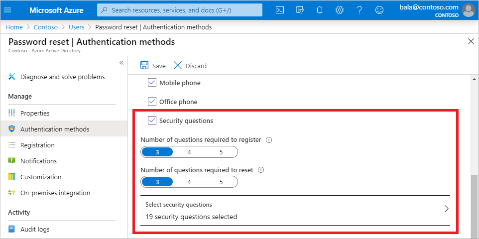

# Authentication methods in Azure Active Directory - security questions

Security questions aren't used as an authentication method during a sign-in event. Instead, security questions can be used during the self-service password reset (SSPR) process to confirm who you are. Administrator accounts can't use security questions as verification method with SSPR.

When users register for SSPR, they're prompted to choose the authentication methods to use. If they choose to use security questions, they pick from a set of questions to prompt for and then provide their own answers.

> [!NOTE]
> Security questions are stored privately and securely on a user object in the directory and can only be answered by users during registration. There's no way for an administrator to read or modify a user's questions or answers.

Security questions can be less secure than other methods because some people might know the answers to another user's questions. If you use security questions with SSPR, it's recommended to use them in conjunction with another method. A user can be prompted to use the Microsoft Authenticator App or phone authentication to verify their identity during the SSPR process, and choose security questions only if they don't have their phone or registered device with them.

## Predefined questions

The following predefined security questions are available for use as a verification method with SSPR. All of these security questions are translated and localized into the full set of Microsoft 365 languages based on the user's browser locale:

* In what city did you meet your first spouse/partner?
* In what city did your parents meet?
* In what city does your nearest sibling live?
* In what city was your father born?
* In what city was your first job?
* In what city was your mother born?
* What city were you in on New Year's 2000?
* What is the last name of your favorite teacher in high school?
* What is the name of a college you applied to but didn't attend?
* What is the name of the place in which you held your first wedding reception?
* What is your father's middle name?
* What is your favorite food?
* What is your maternal grandmother's first and last name?
* What is your mother's middle name?
* What is your oldest sibling's birthday month and year? (for example, November 1985)
* What is your oldest sibling's middle name?
* What is your paternal grandfather's first and last name?
* What is your youngest sibling's middle name?
* What school did you attend for sixth grade?
* What was the first and last name of your childhood best friend?
* What was the first and last name of your first significant other?
* What was the last name of your favorite grade school teacher?
* What was the make and model of your first car or motorcycle?
* What was the name of the first school you attended?
* What was the name of the hospital in which you were born?
* What was the name of the street of your first childhood home?
* What was the name of your childhood hero?
* What was the name of your favorite stuffed animal?
* What was the name of your first pet?
* What was your childhood nickname?
* What was your favorite sport in high school?
* What was your first job?
* What were the last four digits of your childhood telephone number?
* When you were young, what did you want to be when you grew up?
* Who is the most famous person you have ever met?

## Custom security questions

For additional flexibility, you can define your own custom security questions. The maximum length of a custom security question is 200 characters.

Custom security questions aren't automatically localized like with the default security questions. All custom questions are displayed in the same language as they're entered in the administrative user interface, even if the user's browser locale is different. If you need localized questions, you should use the predefined questions.

## Security question requirements

For both default and custom security questions, the following requirements and limitations apply:

* The minimum answer character limit is three characters.
* The maximum answer character limit is 40 characters.
* Users can't answer the same question more than one time.
* Users can't provide the same answer to more than one question.
* Any character set can be used to define the questions and the answers, including Unicode characters.
* The number of questions defined must be greater than or equal to the number of questions that were required to register.

## Next steps

To get started, see the [tutorial for self-service password reset (SSPR)][tutorial-sspr].

To learn more about SSPR concepts, see [How Azure AD self-service password reset works][concept-sspr].

Learn more about configuring authentication methods using the [Microsoft Graph REST API](/graph/api/resources/authenticationmethods-overview).

<!-- INTERNAL LINKS -->
[tutorial-sspr]: tutorial-enable-sspr.md
[concept-sspr]: concept-sspr-howitworks.md
