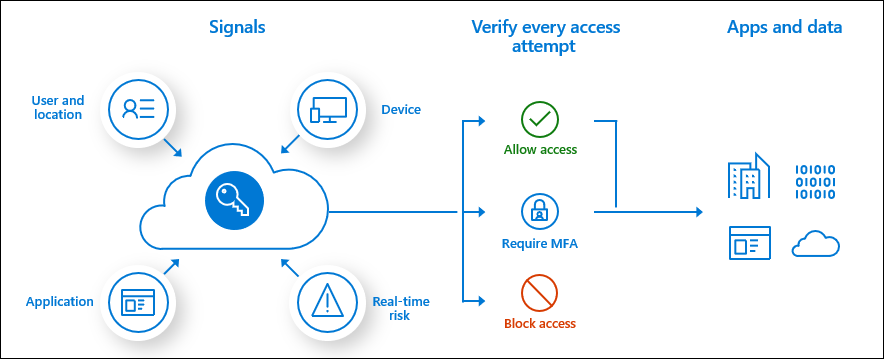

# Enable Multi-Factor Authentication for your organization

There are multiple ways to enable Azure Multi-Factor Authentication (MFA) for your Azure Active Directory (AD) users based on the licenses that your organization owns. 

Based on our studies, your account is more than 99.9% less likely to be compromised if you use MFA.

So how does your organization turn on multi-factor authentication even for free, before becoming a statistic?

## Free option

Customers who are utilizing the free benefits of Azure AD can use [security defaults](../conditional-access/concept-conditional-access-security-defaults.md) to enable multi-factor authentication in their environment.

## Office 365

For customers with Office 365, there are two options:

- [Security defaults](../conditional-access/concept-conditional-access-security-defaults.md) can be enabled through Azure AD to protect all of your users with Azure Multi-Factor Authentication.
- If your organization requires more granularity in providing multi-factor authentication, your Office licenses include [per-user MFA](../authentication/howto-mfa-userstates.md) capabilities. Per-user MFA is enabled and enforced on each user individually by administrators.

## Azure AD Premium P1

For customers with Azure AD Premium P1 or similar licenses that include this functionality such as Enterprise Mobility + Security E3, Microsoft 365 F1, or Microsoft 365 E3: 

The recommendation is to use [Conditional Access policies](../conditional-access/concept-conditional-access-policy-common.md) for the best user experience.

## Azure AD Premium P2

For customers with Azure AD Premium P2 or similar licenses that include this functionality such as Enterprise Mobility + Security E5 or Microsoft 365 E5: 

The recommendation is to use [Conditional Access policies](../conditional-access/concept-conditional-access-policy-common.md) along with [Identity Protection](../identity-protection/overview-v2.md) risk policies for the best user experience and enforcement flexibility.

## Authentication methods

|   | Security defaults | All other methods |
| --- | --- | --- |
| Notification through mobile app | X | X |
| Verification code from mobile app or hardware token |   | X |
| Text message to phone |   | X |
| Call to phone |   | X |
| App passwords |   | X** |

** App passwords are only available in per-user MFA with legacy authentication scenarios only if enabled by administrators.

## Next steps

[Azure AD pricing page](https://azure.microsoft.com/pricing/details/active-directory/)
