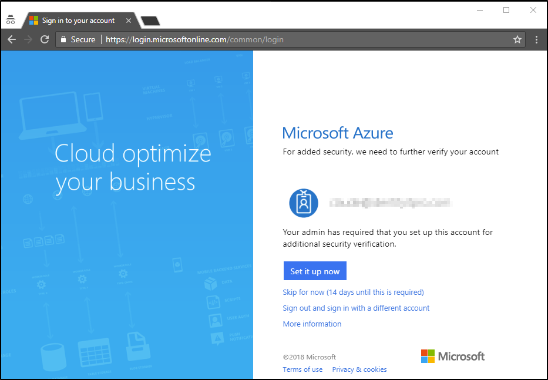

# How Azure Multi-Factor Authentication works

The security of two-step verification lies in its layered approach. Compromising multiple authentication factors presents a significant challenge for attackers. Even if an attacker manages to learn the user's password, it is useless without also having possession of the additional authentication method. It works by requiring two or more of the following authentication methods:

* Something you know (typically a password)
* Something you have (a trusted device that is not easily duplicated, like a phone)
* Something you are (biometrics)

 &nbsp;&nbsp;&nbsp;&nbsp;&nbsp; &nbsp;&nbsp;&nbsp;&nbsp;&nbsp; &nbsp;&nbsp;&nbsp;&nbsp;&nbsp; &nbsp;&nbsp;&nbsp;&nbsp;&nbsp; &nbsp;&nbsp;&nbsp;&nbsp;&nbsp;

Azure Multi-Factor Authentication (MFA) helps safeguard access to data and applications while maintiaining simplicity for users.  It provides additional security by requiring a second form of authentication and delivers strong authentication via a range of easy to use [authentication methods](concept-authentication-methods.md).

## Authenticaion methods

All users require a password which is their first factor of authentication in most cases, in addition your organization can allow users to use a text message, a phone call, or an app on their phone to provide a second factor. We call these authentication methods. You can choose to pre-populate some data for your users like their office phone number or require them to register and confirm their methods as part of your rollout.

## How to deploy

Multi-Factor Authentication can be purchased and deployed in three primary ways:

**Multi-Factor Authentication for Office 365** - A subset of Azure Multi-Factor Authentication capabilities are available as a part of your [Office 365 subscription](https://support.office.com/article/plan-for-multi-factor-authentication-for-office-365-deployments-043807b2-21db-4d5c-b430-c8a6dee0e6ba
).
**Azure MFA Server** - If your organization wants to manage the associated infratructure elements and has deployed AD FS in your on-premsies enviornment this may be an option.
**Azure MFA Service (Cloud)** - This is the reccomended path for new deployments. Azure MFA in the cloud requires no on-premises infrastructure and can be used with your federated or cloud-only users.

## Next steps

- Find details about [licensing your users](concept-mfa-licensing.md)

- Get details about [which version to deploy](concept-mfa-whichversion.md)

- Find answers to [Frequently asked questions](multi-factor-authentication-faq.md)