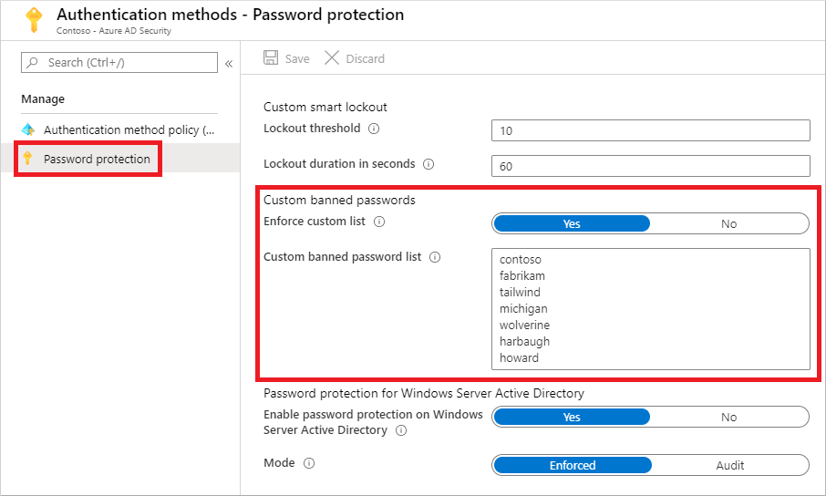

# Eliminate bad passwords using Microsoft Entra Password Protection

A lot of security guidance recommends that you don't use the same password in multiple places, to make it complex, and to avoid simple passwords like *Password123*. You can provide your users with [guidance on how to choose passwords](https://www.microsoft.com/research/publication/password-guidance), but weak or insecure passwords are often still used. Microsoft Entra Password Protection detects and blocks known weak passwords and their variants, and can also block additional weak terms that are specific to your organization.

With Microsoft Entra Password Protection, default global banned password lists are automatically applied to all users in a Microsoft Entra tenant. To support your own business and security needs, you can define entries in a custom banned password list. When users change or reset their passwords, these banned password lists are checked to enforce the use of strong passwords.

You should use additional features like [Microsoft Entra multifactor authentication](concept-mfa-howitworks.md), not just rely on strong passwords enforced by Microsoft Entra Password Protection. For more information on using multiple layers of security for your sign-in events, see [Your Pa$$word doesn't matter](https://techcommunity.microsoft.com/t5/Azure-Active-Directory-Identity/Your-Pa-word-doesn-t-matter/ba-p/731984).

> [!IMPORTANT]
> This conceptual article explains to an administrator how Microsoft Entra Password Protection works. If you're an end user already registered for self-service password reset and need to get back into your account, go to [https://aka.ms/sspr](https://aka.ms/sspr).
>
> If your IT team hasn't enabled the ability to reset your own password, reach out to your helpdesk for additional assistance.

## Global banned password list

The Microsoft Entra ID Protection team constantly analyzes Microsoft Entra security telemetry data looking for commonly used weak or compromised passwords. Specifically, the analysis looks for base terms that often are used as the basis for weak passwords. When weak terms are found, they're added to the *global banned password list*. The contents of the global banned password list aren't based on any external data source, but on the results of Microsoft Entra security telemetry and analysis.

When a password is changed or reset for any user in a Microsoft Entra tenant, the current version of the global banned password list is used to validate the strength of the password. This validation check results in stronger passwords for all Microsoft Entra customers.

The global banned password list is automatically applied to all users in a Microsoft Entra tenant. There's nothing to enable or configure, and can't be disabled. This global banned password list is applied to users when they change or reset their own password through Microsoft Entra ID.

> [!NOTE]
> Cyber-criminals also use similar strategies in their attacks to identify common weak passwords and variations. To improve security, Microsoft doesn't publish the contents of the global banned password list.

## Custom banned password list

Some organizations want to improve security and add their own customizations on top of the global banned password list. To add your own entries, you can use the *custom banned password list*. Terms added to the custom banned password list should be focused on organizational-specific terms such as the following examples:

- Brand names
- Product names
- Locations, such as company headquarters
- Company-specific internal terms
- Abbreviations that have specific company meaning

When terms are added to the custom banned password list, they're combined with the terms in the global banned password list. Password change or reset events are then validated against the combined set of these banned password lists.

> [!NOTE]
> The custom banned password list is limited to a maximum of 1000 terms. It's not designed for blocking extremely large lists of passwords.
>
> To fully leverage the benefits of the custom banned password list, first understand [how are passwords evaluated](#how-are-passwords-evaluated) before you add terms to the custom banned list. This approach lets you efficiently detect and block large numbers of weak passwords and their variants.

Let's consider a customer named *Contoso*. The company is based in London and makes a product named *Widget*. For this example customer, it would be wasteful and less secure to try to block specific variations of these terms such as the following:

- "Contoso!1"
- "Contoso@London"
- "ContosoWidget"
- "!Contoso"
- "LondonHQ"

Instead, it's much more efficient and secure to block only the key base terms, such as the following examples:

- "Contoso"
- "London"
- "Widget"

The password validation algorithm then automatically blocks weak variants and combinations.

To get started with using a custom banned password list, complete the following tutorial:

> [!div class="nextstepaction"]
> [Tutorial: Configure custom banned passwords](tutorial-configure-custom-password-protection.md)

## Password spray attacks and third-party compromised password lists

Microsoft Entra Password Protection helps you defend against password spray attacks. Most password spray attacks don't attempt to attack any given individual account more than a few times. This behavior would increase the likelihood of detection, either via account lockout or other means.

Instead, the majority of password spray attacks submit only a small number of the known weakest passwords against each of the accounts in an enterprise. This technique allows the attacker to quickly search for an easily compromised account and avoid potential detection thresholds.

Microsoft Entra Password Protection efficiently blocks all known weak passwords likely to be used in password spray attacks. This protection is based on real-world security telemetry data from Microsoft Entra ID to build the global banned password list.

There are some third-party websites that enumerate millions of passwords that have been compromised in previous publicly known security breaches. It's common for third-party password validation products to be based on brute-force comparison against those millions of passwords. However, those techniques aren't the best way to improve overall password strength given the typical strategies used by password spray attackers.

> [!NOTE]
> The global banned password list isn't based on any third-party data sources, including compromised password lists.

Although the global banned list is small in comparison to some third-party bulk lists, it's sourced from real-world security telemetry on actual password spray attacks. This approach improves the overall security and effectiveness, and the password validation algorithm also uses smart fuzzy-matching techniques. As a result, Microsoft Entra Password Protection efficiently detects and blocks millions of the most common weak passwords from being used in your enterprise.

## On-premises hybrid scenarios

Many organizations have a hybrid identity model that includes on-premises Active Directory Domain Services (AD DS) environments. To extend the security benefits of Microsoft Entra Password Protection into your AD DS environment, you can install components on your on-premises servers. These agents require password change events in the on-premises AD DS environment to comply with the same password policy as in Microsoft Entra ID.

For more information, see [Enforce Microsoft Entra Password Protection for AD DS](concept-password-ban-bad-on-premises.md).

## How are passwords evaluated

When a user changes or resets their password, the new password is checked for strength and complexity by validating it against the combined list of terms from the global and custom banned password lists.

Even if a user's password contains a banned password, the password may be accepted if the overall password is otherwise strong enough. A newly configured password goes through the following steps to assess its overall strength to determine if it should be accepted or rejected:

### Step 1: Normalization

A new password first goes through a normalization process. This technique allows for a small set of banned passwords to be mapped to a much larger set of potentially weak passwords.

Normalization has the following two parts:

* All uppercase letters are changed to lower case.
* Then, common character substitutions are performed, such as in the following example:

   | Original letter | Substituted letter |
   |-----------------|--------------------|
   | 0               | o                  |
   | 1               | l                  |
   | $               | s                  |
   | \@              | a                  |

Consider the following example:

* The password "blank" is banned.
* A user tries to change their password to "Bl@nK".
* Even though "Bl@nk" isn't banned, the normalization process converts this password to "blank".
* This password would be rejected.

### Step 2: Check if password is considered banned

A password is then examined for other matching behavior, and a score is generated. This final score determines if the password change request is accepted or rejected.

#### Fuzzy matching behavior

Fuzzy matching is used on the normalized password to identify if it contains a password found on either the global or the custom banned password lists. The matching process is based on an edit distance of one (1) comparison.

Consider the following example:

* The password "abcdef" is banned.
* A user tries to change their password to one of the following:

   * 'abcdeg' - *last character changed from 'f' to 'g'*
   * 'abcdefg' - *'g' appended to end*
   * 'abcde' - *trailing 'f' was deleted from end*

* Each of the above passwords doesn't specifically match the banned password "abcdef".

    However, since each example is within an edit distance of 1 of the banned term 'abcdef', they're all considered as a match to "abcdef".
* These passwords would be rejected.

#### Substring matching (on specific terms)

Substring matching is used on the normalized password to check for the user's first and last name as well as the tenant name. Tenant name matching isn't done when validating passwords on an AD DS domain controller for on-premises hybrid scenarios.

> [!IMPORTANT]
> Substring matching is only enforced for names, and other terms, that are at least four characters long.

Consider the following example:

* A user named Poll who wants to reset their password to "p0LL23fb".
* After normalization, this password would become "poll23fb".
* Substring matching finds that the password contains the user's first name "Poll".
* Even though "poll23fb" wasn't specifically on either banned password list, substring matching found "Poll" in the password.
* This password would be rejected.

#### Score Calculation

The next step is to identify all instances of banned passwords in the user's normalized new password. Points are assigned based on the following criteria:

1. Each banned password that's found in a user's password is given one point.
1. Each remaining character that is not part of a banned password is given one point.
1. A password must be at least five (5) points to be accepted.

For the next two example scenarios, Contoso is using Microsoft Entra Password Protection and has "contoso" on their custom banned password list. Let's also assume that "blank" is on the global list.

In the following example scenario, a user changes their password to "C0ntos0Blank12":

* After normalization, this password becomes "contosoblank12".
* The matching process finds that this password contains two banned passwords: "contoso" and "blank".
* This password is then given the following score:

    *[contoso] + [blank] + [1] + [2] = 4 points*

* As this password is under five (5) points, it's rejected.

Let's look a slightly different example to show how additional complexity in a password can build the required number of points to be accepted. In the following example scenario, a user changes their password to "ContoS0Bl@nkf9!":

* After normalization, this password becomes "contosoblankf9!".
* The matching process finds that this password contains two banned passwords: "contoso" and "blank".
* This password is then given the following score:

    *[contoso] + [blank] + [f] + [9] + [!] = 5 points*

* As this password is at least five (5) points, it's accepted.

> [!IMPORTANT]
> The banned password algorithm, along with the global banned password list, can and do change at any time in Azure based on ongoing security analysis and research.
>
> For the on-premises DC agent service in hybrid scenarios, updated algorithms only take effect after the DC agent software is upgraded.

## What do users see

When a user attempts to reset or change a password to something that would be banned, one of the following error messages are displayed:

*"Unfortunately, your password contains a word, phrase, or pattern that makes your password easily guessable. Please try again with a different password."*

*"We've seen that password too many times before. Choose something harder to guess."*

*"Choose a password that's harder for people to guess."*

## License requirements

| Users | Microsoft Entra Password Protection with global banned password list | Microsoft Entra Password Protection with custom banned password list|
|-------------------------------------------|---------------------------|---------------------------|
| Cloud-only users                          | Microsoft Entra ID Free             | Microsoft Entra ID P1 or P2 |
| Users synchronized from on-premises AD DS | Microsoft Entra ID P1 or P2 | Microsoft Entra ID P1 or P2 |

> [!NOTE]
> On-premises AD DS users that aren't synchronized to Microsoft Entra ID also benefit from Microsoft Entra Password Protection based on existing licensing for synchronized users.

Additional licensing information, including costs, can be found on the [Microsoft Entra pricing site](https://www.microsoft.com/security/business/identity-access-management/azure-ad-pricing).

## Next steps

To get started with using a custom banned password list, complete the following tutorial:

> [!div class="nextstepaction"]
> [Tutorial: Configure custom banned passwords](tutorial-configure-custom-password-protection.md)

You can also then [enable on-premises Microsoft Entra Password Protection](howto-password-ban-bad-on-premises-deploy.md).
