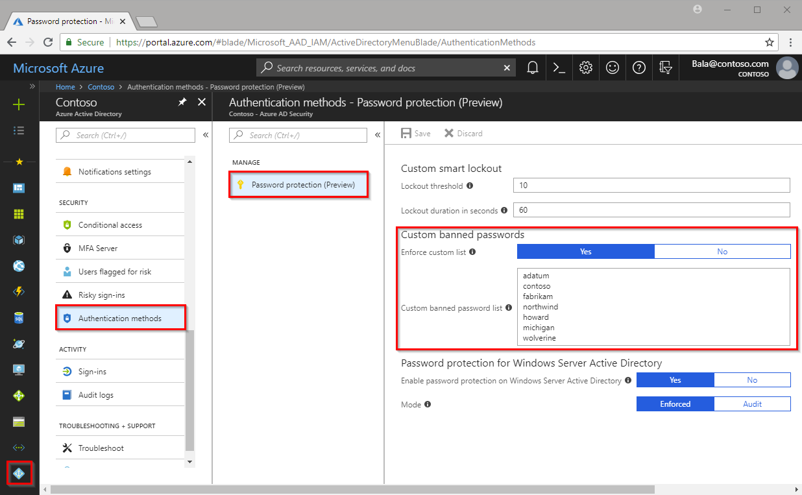

# Eliminate bad passwords in your organization

Industry leaders tell you not to use the same password in multiple places, to make it complex, and to not make it simple like “Password123”. How can organizations guarantee that their users are following best-practice guidance? How can they make sure users aren't using weak passwords, or even variations on weak passwords?

The initial step in having stronger passwords is to provide guidance to your users. Microsoft's current guidance on this topic can be found at the following link:

[Microsoft Password Guidance](https://www.microsoft.com/research/publication/password-guidance)

Having good guidance is important, but even with that we know that many users will still end up choosing weak passwords. Azure AD Password Protection protects your organization by detecting and blocking known weak passwords and their variants, as well as optionally blocking additional weak terms that are specific to your organization.

For more information about current security efforts, see the [Microsoft Security Intelligence Report](https://www.microsoft.com/security/operations/security-intelligence-report).

## Global banned password list

The Azure AD Identity Protection team constantly analyzes Azure AD security telemetry data looking for commonly used weak or compromised passwords, or more specifically, the weak base terms that often are used as the basis for weak passwords. When such weak terms are found, they are added to the global banned password list. The contents of the global banned password list are not based on any external data source. The global banned password list is based entirely on the ongoing results of Azure AD security telemetry and analysis.

Whenever a new password is changed or reset for any user in any tenant in Azure AD, the current version of the global banned password list is used as the key input when validating the strength of the password. This validation results in much stronger passwords for all Azure AD customers.

> [!NOTE]
> Cyber-criminals also use similar strategies in their attacks. Therefore Microsoft does not publish the contents of this list publicly.

## Custom banned password list

Some organizations may want to improve security even further by adding their own customizations on top of the global banned password list in what Microsoft calls the custom banned password list. Microsoft recommends that terms added to this list are primarily focused on organizational-specific terms such as:

- Brand names
- Product names
- Locations (for example, such as company headquarters)
- Company-specific internal terms
- Abbreviations that have specific company meaning.

Once terms are added to the custom banned password list, they will be combined with the terms in the global banned password list when validating passwords.

> [!NOTE]
> The custom banned password list is limited to having a maximum of 1000 terms. It is not designed for blocking extremely large lists of passwords. In order to fully leverage the benefits of the custom banned password list, Microsoft recommends that you first review and understand the password evaluation algorithm (see [How are passwords evaluated](concept-password-ban-bad.md#how-are-passwords-evaluated)) before adding new terms to the custom banned list. Understanding how the algorithm works will enable your enterprise to efficiently detect and block large numbers of weak passwords and their variants.

For example:  consider a customer named “Contoso”, that is based in London, and that makes a product named “Widget”. For such a customer, it would be wasteful as well as less secure to try to block specific variations of these terms such as:

- "Contoso!1"
- "Contoso@London"
- "ContosoWidget"
- "!Contoso"
- "LondonHQ"
- ...etcetera

Instead, it is much more efficient and secure to block only the key base terms:

- "Contoso"
- "London"
- "Widget"

The password validation algorithm will then automatically block weak variants and combinations of the above.

The custom banned password list and the ability to enable on-premises Active Directory integration is managed using the Azure portal.

## Password spray attacks and third-party compromised password lists

One key Azure AD password protection benefit is to help you defend against password spray attacks. Most password spray attacks do not attempt to attack any given individual account more than a few times since such behavior greatly increases the likelihood of detection, either via account lockout or other means. The majority of password spray attacks therefore rely on submitting only a small number of the known weakest passwords against each of the accounts in an enterprise. This technique allows the attacker to quickly search for an easily compromised account while at the same time avoiding potential detection thresholds.

Azure AD password protection is designed to efficiently block all known weak passwords that are likely to be used in password spray attacks, based on real-world security telemetry data as seen by Azure AD.  Microsoft is aware of third-party websites that enumerate millions of passwords that have been compromised in previous publicly known security breaches. It is common for third-party password validation products to be based on brute-force comparison against those millions of passwords. Microsoft feels that such techniques are not the best way to improve overall password strength given the typical strategies used by password spray attackers.

> [!NOTE]
> The Microsoft global banned password list is not based whatsoever on any third-party data sources, including compromised password lists.

Although the Microsoft global banned list is small in comparison to some third-party bulk lists, its security effects are amplified by the fact that it is sourced from real-world security telemetry on actual password spray attacks, plus the fact that the Microsoft password validation algorithm uses smart fuzzy-matching techniques. The end result is that it will efficiently detect and block millions of the most common weak passwords from being used in your enterprise. Customers who choose to add organization-specific terms to the custom banned password list also benefit from the same algorithm.

Additional information on password-based security issues may be reviewed at [Your Pa$$word doesn't matter](https://techcommunity.microsoft.com/t5/Azure-Active-Directory-Identity/Your-Pa-word-doesn-t-matter/ba-p/731984).

## On-premises hybrid scenarios

Protecting cloud-only accounts is helpful but many organizations maintain hybrid scenarios including on-premises Windows Server Active Directory. The security benefits of Azure AD password protection may also be extended into your Windows Server Active Directory environment via the installation of on-premises agents. Now users and administrators who change or reset passwords in Active Directory are required to comply with the same password policy as cloud-only users.

## How are passwords evaluated

Whenever a user changes or resets their password, the new password is checked for strength and complexity by validating it against the combined list of terms from the global and custom banned password lists (if the latter is configured).

Even if a user’s password contains a banned password, the password may still be accepted if the overall password is strong enough otherwise. A newly configured password will go through the following steps to assess its overall strength to determine if it should be accepted or rejected.

### Step 1: Normalization

A new password first goes through a normalization process. This technique allows for a small set of banned passwords to be mapped to a much larger set of potentially weak passwords.

Normalization has two parts.  First, all uppercase letters are changed to lower case.  Second, common character substitutions are performed, for example:  

| Original letter  | Substituted letter |
| --- | --- |
| '0'  | 'o' |
| '1'  | 'l' |
| '$'  | 's' |
| '\@'  | 'a' |

Example: assume that the password “blank” is banned, and a user tries to change their password to “Bl@nK”. Even though “Bl@nk” is not specifically banned, the normalization process converts this password to “blank”, which is a banned password.

### Step 2: Check if password is considered banned

#### Fuzzy matching behavior

Fuzzy matching is used on the normalized password to identify if it contains a password found on either the global or the custom banned password lists. The matching process is based on an edit distance of one (1) comparison.  

Example: assume that the password “abcdef” is banned, and a user tries to change their password to one of the following:

‘abcdeg’    *(last character changed from ‘f’ to ‘g’)*
‘abcdefg’   *’(g’ appended to end)*
‘abcde’     *(trailing ‘f’ was deleted from end)*

Each of the above passwords does not specifically match the banned password "abcdef". However, since each example is within an edit distance of 1 of the banned term ‘abcdef’, they are all considered as a  match to “abcdef”.

#### Substring matching (on specific terms)

Substring matching is used on the normalized password to check for the user’s first and last name as well as the tenant name (note that tenant name matching is not done when validating passwords on an Active Directory domain controller).

Example: assume that we have a user, Pol, who wants to reset their password to “P0l123fb”. After normalization, this password would become “pol123fb”. Substring matching finds that the password contains the user’s first name “Pol”. Even though “P0l123fb” was not specifically on either banned password list, substring matching found “Pol" in the password. Therefore this password would be rejected.

#### Score Calculation

The next step is to identify all instances of banned passwords in the user's normalized new password. Then:

1. Each banned password that is found in a user’s password is given one point.
2. Each remaining unique character is given one point.
3. A password must be at least five (5) points for it to be accepted.

For the next two examples, let’s assume that Contoso is using Azure AD Password Protection and has “contoso” on their custom list. Let’s also assume that “blank” is on the global list.

Example: a user changes their password to “C0ntos0Blank12”

After normalization, this password becomes “contosoblank12”. The matching process finds that this password contains two banned passwords: contoso and blank. This password is then given a score:

[contoso] + [blank] + [1] + [2] = 4 points
Since this password is under five (5) points, it will be rejected.

Example: a user changes their password to “ContoS0Bl@nkf9!”.

After normalization, this password becomes “contosoblankf9!”. The matching process finds that this password contains two banned passwords: contoso and blank. This password is then given a score:

[contoso] + [blank] + [f] + [9] + [!] = 5 points
Since this password is at least five (5) points, it is accepted.

   > [!IMPORTANT]
   > Please note that the banned password algorithm along with the global list can and do change at any time in Azure based on ongoing security analysis and research. For the on-premises DC agent service, updated algorithms will only take effect after the DC agent software is re-installed.

## License requirements

|   | Azure AD password protection with global banned password list | Azure AD password protection with custom banned password list|
| --- | --- | --- |
| Cloud-only users | Azure AD Free | Azure AD Premium P1 or P2 |
| Users synchronized from on-premises Windows Server Active Directory | Azure AD Premium P1 or P2 | Azure AD Premium P1 or P2 |

> [!NOTE]
> On-premises Windows Server Active Directory users that are not synchronized to Azure Active Directory also benefits from Azure AD password protection based on existing licensing for synchronized users.

Additional licensing information, including costs, can be found on the [Azure Active Directory pricing site](https://azure.microsoft.com/pricing/details/active-directory/).

## What do users see

When a user attempts to reset a password to something that would be banned, they see the following error message:

Unfortunately, your password contains a word, phrase, or pattern that makes your password easily guessable. Please try again with a different password.

## Next steps

- [Configure the custom banned password list](howto-password-ban-bad.md)
- [Enable Azure AD password protection agents on-premises](howto-password-ban-bad-on-premises-deploy.md)
