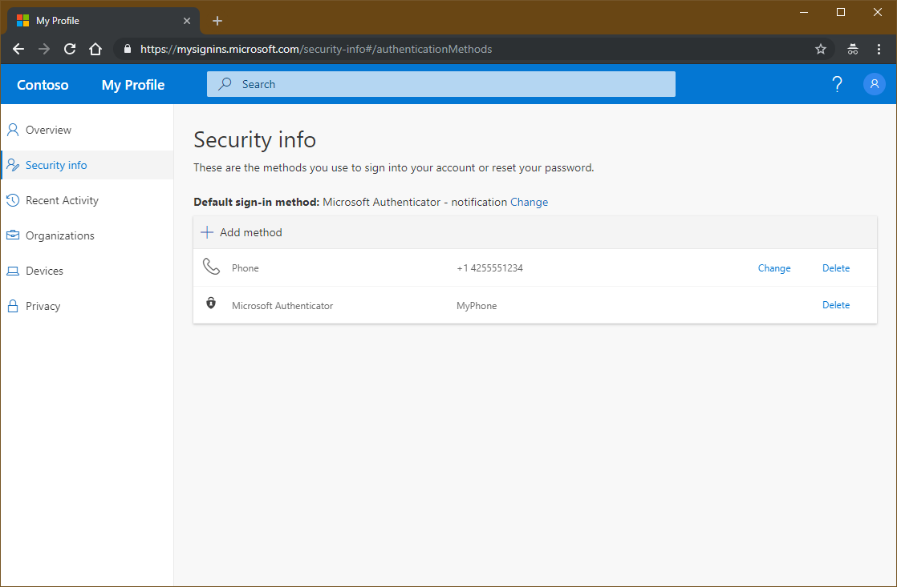
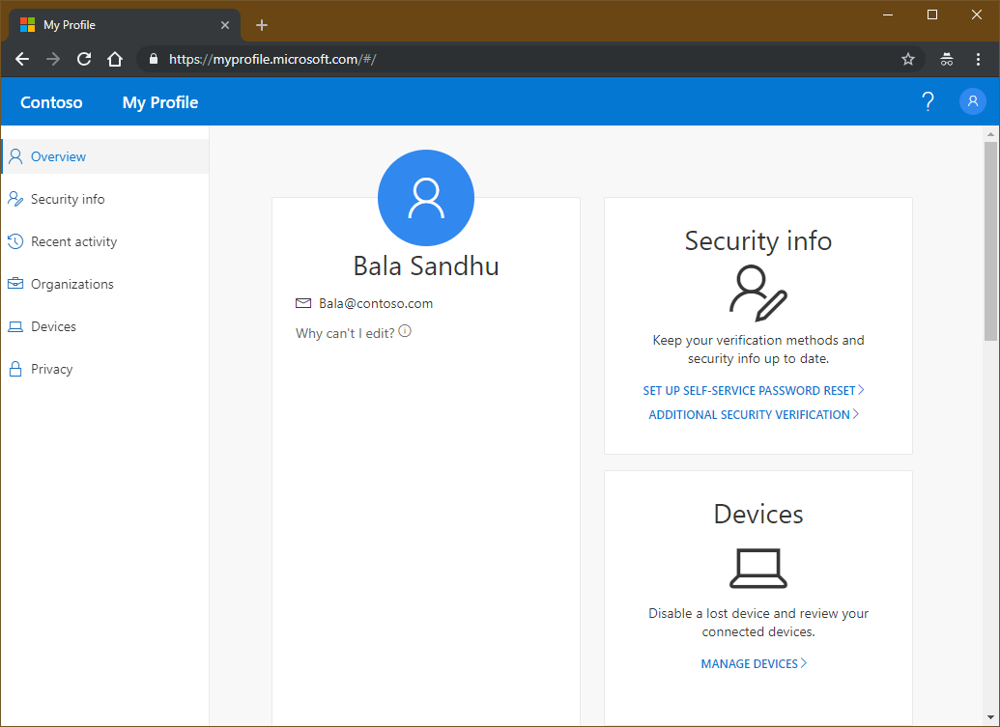
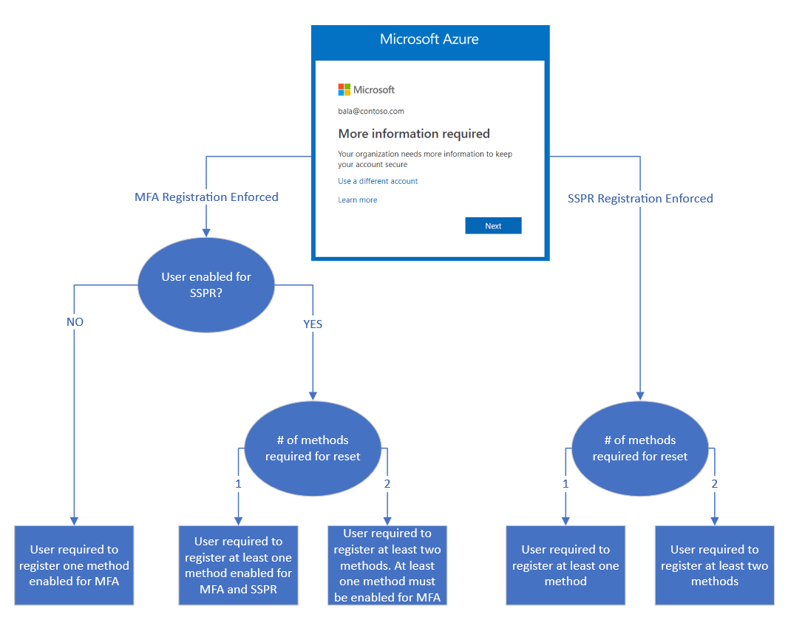

# Combined security information registration overview

Before combined registration, users registered authentication methods for Azure Multi-Factor Authentication and self-service password reset (SSPR) separately. People were confused that similar methods were used for Multi-Factor Authentication and SSPR but they had to register for both features. Now, with combined registration, users can register once and get the benefits of both Multi-Factor Authentication and SSPR.

This article outlines what combined security registration is. To get started with combined security registration, see the following article:

> [!div class="nextstepaction"]
> [Enable combined security registration](howto-registration-mfa-sspr-combined.md)

Before enabling the new experience, review this administrator-focused documentation and the user-focused documentation to ensure you understand the functionality and effect of this feature. Base your training on the [user documentation](../user-help/user-help-security-info-overview.md) to prepare your users for the new experience and help to ensure a successful rollout.

Azure AD combined security information registration is not currently available to national clouds like Azure US Government, Azure Germany, or Azure China 21Vianet.

> [!IMPORTANT]
> Users who are enabled for both the original preview and the enhanced combined registration experience will see the new behavior. Users who are enabled for both experiences will see only the new My Profile experience. The new My Profile aligns with the look and feel of combined registration and provides a seamless experience for users. Users can see My Profile by going to [https://myprofile.microsoft.com](https://myprofile.microsoft.com).
>
> You might encounter an error message while trying to access the Security info option. For example, "Sorry, we can't sign you in". In this case, confirm that you don't have any configuration or group policy object that blocks third-party cookies on the web browser.

My Profile pages are localized based on the language settings of the computer accessing the page. Microsoft stores the most recent language used in the browser cache, so subsequent attempts to access the pages will continue to render in the last language used. If you clear the cache, the pages will re-render. If you want to force a specific language, you can add `?lng=<language>` to the end of the URL, where `<language>` is the code of the language you want to render.

## Methods available in combined registration

Combined registration supports the following authentication methods and actions:

| Method | Register | Change | Delete |
| --- | --- | --- | --- |
| Microsoft Authenticator | Yes (maximum of 5) | No | Yes |
| Other authenticator app | Yes (maximum of 5) | No | Yes |
| Hardware token | No | No | Yes |
| Phone | Yes | Yes | Yes |
| Alternate phone | Yes | Yes | Yes |
| Office phone | No | No | No |
| Email | Yes | Yes | Yes |
| Security questions | Yes | No | Yes |
| App passwords | Yes | No | Yes |
| FIDO2 security keys *Managed mode only from the [Security info](https://mysignins.microsoft.com/security-info) page*| Yes | Yes | Yes |

> [!NOTE]
> App passwords are available only to users who have been enforced for Multi-Factor Authentication. App passwords are not available to users who are enabled for Multi-Factor Authentication via a Conditional Access policy.

Users can set one of the following options as the default Multi-Factor Authentication method:

- Microsoft Authenticator – notification.
- Authenticator app or hardware token – code.
- Phone call.
- Text message.

As we continue to add more authentication methods to Azure AD, those methods will be available in combined registration.

## Combined registration modes

There are two modes of combined registration: interrupt and manage.

- **Interrupt mode** is a wizard-like experience, presented to users when they register or refresh their security info at sign-in.
- **Manage mode** is part of the user profile and allows users to manage their security info.

For both modes, users who have previously registered a method that can be used for Multi-Factor Authentication will need to perform Multi-Factor Authentication before they can access their security info. Users must confirm their information before continuing to use their previously registered methods. 

### Interrupt mode

Combined registration respects both Multi-Factor Authentication and SSPR policies, if both are enabled for your tenant. These policies control whether a user is interrupted for registration during sign-in and which methods are available for registration.

Here are several scenarios in which users might be prompted to register or refresh their security info:

- Multi-Factor Authentication registration enforced through Identity Protection: Users are asked to register during sign-in. They register Multi-Factor Authentication methods and SSPR methods (if the user is enabled for SSPR).
- Multi-Factor Authentication registration enforced through per-user Multi-Factor Authentication: Users are asked to register during sign-in. They register Multi-Factor Authentication methods and SSPR methods (if the user is enabled for SSPR).
- Multi-Factor Authentication registration enforced through Conditional Access or other policies: Users are asked to register when they use a resource that requires Multi-Factor Authentication. They register Multi-Factor Authentication methods and SSPR methods (if the user is enabled for SSPR).
- SSPR registration enforced: Users are asked to register during sign-in. They register only SSPR methods.
- SSPR refresh enforced: Users are required to review their security info at an interval set by the admin. Users are shown their info and can confirm the current info or make changes if needed.

When registration is enforced, users are shown the minimum number of methods needed to be compliant with both Multi-Factor Authentication and SSPR policies, from most to least secure.

For example:

- A user is enabled for SSPR. The SSPR policy required two methods to reset and has enabled mobile app code, email, and phone.
   - This user is required to register two methods.
      - The user is shown authenticator app and phone by default.
      - The user can choose to register email instead of authenticator app or phone.

This flowchart describes which methods are shown to a user when interrupted to register during sign-in:

If you have both Multi-Factor Authentication and SSPR enabled, we recommend that you enforce Multi-Factor Authentication registration.

If the SSPR policy requires users to review their security info at regular intervals, users are interrupted during sign-in and shown all their registered methods. They can confirm the current info if it's up-to-date, or they can make changes if they need to. Users must perform multi-factor authentication when accessing this page.

### Manage mode

Users can access manage mode by going to [https://aka.ms/mysecurityinfo](https://aka.ms/mysecurityinfo) or by selecting **Security info** from My Profile. From there, users can add methods, delete or change existing methods, change the default method, and more.

## Key usage scenarios

### Set up security info during sign-in

An admin has enforced registration.

A user has not set up all required security info and goes to the Azure portal. After entering the user name and password, the user is prompted to set up security info. The user then follows the steps shown in the wizard to set up the required security info. If your settings allow it, the user can choose to set up methods other than those shown by default. After completing the wizard, users review the methods they set up and their default method for Multi-Factor Authentication. To complete the setup process, the user confirms the info and continues to the Azure portal.

### Set up security info from My Profile

An admin has not enforced registration.

A user who hasn't yet set up all required security info goes to [https://myprofile.microsoft.com](https://myprofile.microsoft.com). The user selects **Security info** in the left pane. From there, the user chooses to add a method, selects any of the methods available, and follows the steps to set up that method. When finished, the user sees the method that was just set up on the Security info page.

### Delete security info from My Profile

A user who has previously set up at least one method navigates to [https://aka.ms/mysecurityinfo](https://aka.ms/mysecurityinfo). The user chooses to delete one of the previously registered methods. When finished, the user no longer sees that method on the Security info page.

### Change the default method from My Profile

A user who has previously set up at least one method that can be used for Multi-Factor Authentication navigates to [https://aka.ms/mysecurityinfo](https://aka.ms/mysecurityinfo). The user changes the current default method to a different default method. When finished, the user sees the new default method on the Security info page.

## Next steps

To get started, see the tutorials to [enable self-service password reset](tutorial-enable-sspr.md) and [enable Azure Multi-Factor Authentication](tutorial-enable-azure-mfa.md).

Learn how to [enable combined registration in your tenant](howto-registration-mfa-sspr-combined.md) or [force users to re-register authentication methods](howto-mfa-userdevicesettings.md#manage-user-authentication-options).

You can also review the [available methods for Azure Multi-Factor Authentication and SSPR](concept-authentication-methods.md).
