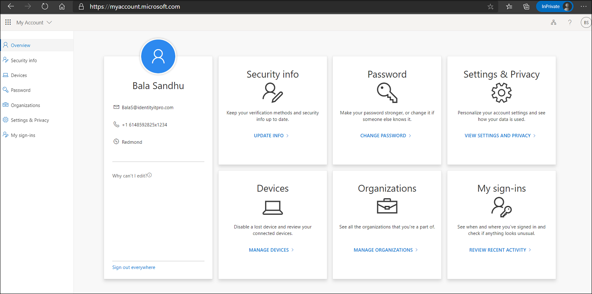
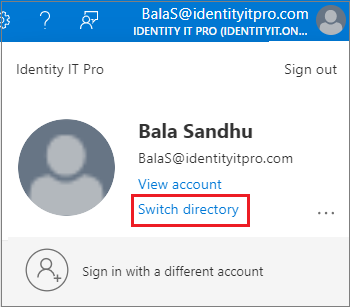

# Combined security information registration for Microsoft Entra overview

Before combined registration, users registered authentication methods for Microsoft Entra multifactor authentication and self-service password reset (SSPR) separately. People were confused that similar methods were used for multifactor authentication and SSPR but they had to register for both features. Now, with combined registration, users can register once and get the benefits of both multifactor authentication and SSPR. We recommend this video on [How to enable and configure SSPR in Microsoft Entra ID](https://www.youtube.com/watch?v=rA8TvhNcCvQ).

Before enabling the new experience, review this administrator-focused documentation and the user-focused documentation to ensure you understand the functionality and effect of this feature. Base your training on the [user documentation](https://support.microsoft.com/account-billing/set-up-your-security-info-from-a-sign-in-prompt-28180870-c256-4ebf-8bd7-5335571bf9a8) to prepare your users for the new experience and help to ensure a successful rollout.

Microsoft Entra ID combined security information registration is available for Azure US Government but not Microsoft Azure operated by 21Vianet.

*My Account* pages are localized based on the language settings of the computer accessing the page. Microsoft stores the most recent language used in the browser cache, so subsequent attempts to access the pages continue to render in the last language used. If you clear the cache, the pages re-render.

If you want to force a specific language, you can add `?lng=<language>` to the end of the URL, where `<language>` is the code of the language you want to render.

## Methods available in combined registration

Combined registration supports the authentication methods and actions in the following table.

| Method | Register | Change | Delete |
| --- | --- | --- | --- |
| Microsoft Authenticator | Yes (maximum of 5) | No | Yes |
| Other authenticator app | Yes (maximum of 5) | No | Yes |
| Hardware token | No | No | Yes |
| Phone | Yes | Yes | Yes |
| Alternate phone | Yes | Yes | Yes |
| Office phone* | Yes | Yes | Yes |
| Email | Yes | Yes | Yes |
| Security questions | Yes | No | Yes |
| App passwords* | Yes | No | Yes |
| FIDO2 security keys*| Yes | No | Yes |

> [!NOTE]
> If you enable Microsoft Authenticator for passwordless authentication mode in the Authentication methods policy, users need to also enable passwordless sign-in in the Authenticator app.
>
> Alternate phone can only be registered in *Manage mode* on [https://aka.ms/mysecurityinfo](https://aka.ms/mysecurityinfo) and requires Voice calls to be enabled in the Authentication methods policy.
>
> Office phone can only be registered in *Interrupt mode* if the users *Business phone* property has been set. Office phone can be added by users in *Managed mode* from [https://aka.ms/mysecurityinfo](https://aka.ms/mysecurityinfo) without this requirement.
>
> App passwords are available only to users who have been enforced for per-user MFA. App passwords aren't available to users who are enabled for Microsoft Entra multifactor authentication by a Conditional Access policy.
>
> FIDO2 security keys, can only be added in *Manage mode* on [https://aka.ms/mysecurityinfo](https://aka.ms/mysecurityinfo).

Users can set one of the following options as the default multifactor authentication method. 

- Microsoft Authenticator – push notification or passwordless
- Authenticator app or hardware token – code
- Phone call
- Text message

>[!NOTE]
>Virtual phone numbers aren't supported for Voice calls or SMS messages.

Third party authenticator apps don't provide push notification. As we continue to add more authentication methods to Microsoft Entra ID, those methods become available in combined registration.

## Combined registration modes

There are two modes of combined registration: interrupt and manage.

- **Interrupt mode** is a wizard-like experience, presented to users when they register or refresh their security info at sign-in.
- **Manage mode** is part of the user profile and allows users to manage their security info.

For both modes, users who have previously registered a method that can be used for Microsoft Entra multifactor authentication need to perform multifactor authentication before they can access their security info. Users must confirm their information before continuing to use their previously registered methods. 

### Interrupt mode

Combined registration adheres to both multifactor authentication and SSPR policies, if both are enabled for your tenant. These policies control whether a user is interrupted for registration during sign-in and which methods are available for registration. If only an SSPR policy is enabled, then users will be able to skip (indefinitely) the registration interruption and complete it at a later time.

The following are sample scenarios where users might be prompted to register or refresh their security info:

- *multifactor authentication registration enforced through Identity Protection:* Users are asked to register during sign-in. They register multifactor authentication methods and SSPR methods (if the user is enabled for SSPR).
- *multifactor authentication registration enforced through per-user multifactor authentication:* Users are asked to register during sign-in. They register multifactor authentication methods and SSPR methods (if the user is enabled for SSPR).
- *multifactor authentication registration enforced through Conditional Access or other policies:* Users are asked to register when they use a resource that requires multifactor authentication. They register multifactor authentication methods and SSPR methods (if the user is enabled for SSPR).
- *SSPR registration enforced:* Users are asked to register during sign-in. They register only SSPR methods.
- *SSPR refresh enforced:* Users are required to review their security info at an interval set by the admin. Users are shown their info and can confirm the current info or make changes if needed.

When registration is enforced, users are shown the minimum number of methods needed to be compliant with both multifactor authentication and SSPR policies, from most to least secure. Users going through combined registration where both MFA and SSPR registration are enforced and the SSPR policy requires two methods will first be required to register an MFA method as the first method and can select another MFA or SSPR specific method as the second registered method (e.g. email, security questions etc.)

Consider the following example scenario:

- A user is enabled for SSPR. The SSPR policy requires two methods to reset and has enabled Microsoft Authenticator app, email, and phone.
- When the user chooses to register, two methods are required:
   - The user is shown Microsoft Authenticator app and phone by default.
   - The user can choose to register email instead of Authenticator app or phone.

When they set up Microsoft Authenticator, the user can click **I want to setup a different method** to register other authentication methods. The list of available methods is determined by the Authentication methods policy for the tenant. 

:::image type="content" border="true" source="media/concept-registration-mfa-sspr-combined/choose.png" alt-text="Screenshot of how to choose another method when you set up Microsoft Authenticator.":::

The following flowchart describes which methods are shown to a user when interrupted to register during sign-in:

If you have both multifactor authentication and SSPR enabled, we recommend that you enforce multifactor authentication registration.

If the SSPR policy requires users to review their security info at regular intervals, users are interrupted during sign-in and shown all their registered methods. They can confirm the current info if it's up to date, or they can make changes if they need to. Users must perform multifactor authentication to access this page.

### Manage mode

Users can access manage mode by going to [https://aka.ms/mysecurityinfo](https://aka.ms/mysecurityinfo) or by selecting **Security info** from My Account. From there, users can add methods, delete or change existing methods, change the default method, and more.

## Key usage scenarios

### Protect Security info registration with Conditional Access
To secure when and how users register for Microsoft Entra multifactor authentication and self-service password reset, you can use user actions in Conditional Access policy. This functionality may be enabled in organizations that want users to register for Microsoft Entra multifactor authentication and SSPR from a central location, such as a trusted network location during HR onboarding. Learn more on how to configure [common Conditional Access policies for securing security info registration.](../conditional-access/howto-conditional-access-policy-registration.md)

### Set up security info during sign-in

An admin has enforced registration.

A user has not set up all required security info and goes to the Microsoft Entra admin center. After the user enters the user name and password, the user is prompted to set up security info. The user then follows the steps shown in the wizard to set up the required security info. If your settings allow it, the user can choose to set up methods other than those shown by default. After users complete the wizard, they review the methods they set up and their default method for multifactor authentication. To complete the setup process, the user confirms the info and continues to the Microsoft Entra admin center.

### Set up security info from My Account

An admin hasn't enforced registration.

A user who hasn't yet set up all required security info goes to [https://myaccount.microsoft.com](https://myaccount.microsoft.com). The user selects **Security info** in the left pane. From there, the user chooses to add a method, selects any of the methods available, and follows the steps to set up that method. When finished, the user sees the method that was set up on the Security info page.

### Set up other methods after partial registration

If a user has partially satisfied MFA or SSPR registration due to existing authentication method registrations performed by the user or admin, users will only be asked to register additional information allowed by the Authentication methods policy settings when registration is required. If more than one other authentication method is available for the user to choose and register, an option on the registration experience titled **I want to set up another method** will be shown and allow the user to set up their desired authentication method.  

:::image type="content" border="true" source="./media/concept-registration-mfa-sspr-combined/other-method.png" alt-text="Screenshot of how to set up another method." :::  

### Delete security info from My Account

A user who has previously set up at least one method navigates to [https://aka.ms/mysecurityinfo](https://aka.ms/mysecurityinfo). The user chooses to delete one of the previously registered methods. When finished, the user no longer sees that method on the Security info page.

### Change the default method from My Account

A user who has previously set up at least one method that can be used for multifactor authentication navigates to [https://aka.ms/mysecurityinfo](https://aka.ms/mysecurityinfo). The user changes the current default method to a different default method. When finished, the user sees the new default method on the Security info page.

### Switch directory

An external identity such as a B2B user may need to switch the directory to change the security registration information for a third-party tenant. 
In addition, users who access a resource tenant may be confused when they change settings in their home tenant but don't see the changes reflected in the resource tenant. 

For example, a user sets Microsoft Authenticator app push notification as the primary authentication to sign-in to home tenant and also has SMS/Text as another option. 
This user is also configured with SMS/Text option on a resource tenant. 
If this user removes SMS/Text as one of the authentication options on their home tenant, they get confused when access to the resource tenant asks them to respond to SMS/Text message. 

To switch the directory in the Microsoft Entra admin center, click the user account name in the upper right corner and click **Switch directory**.

Or, you can specify a tenant by URL to access security information.

`https://mysignins.microsoft.com/security-info?tenant=<Tenant Name>`

`https://mysignins.microsoft.com/security-info/?tenantId=<Tenant ID>`

> [!NOTE]
> Customers attempting to register or manage security info through combined registration or the My Sign-ins page should use a modern browser such as Microsoft Edge. 
> 
> IE11 is not officially supported for creating a webview or browser in applications as it will not work as expected in all scenarios.
> 
> Applications that have not been updated and are still using Azure AD Authentication Library (ADAL) that rely on legacy webviews can fallback to older versions of IE. In these scenarios, users will experience a blank page when directed to the My Sign-ins page. To resolve this issue, switch to a modern browser.

## Next steps

To get started, see the tutorials to [enable self-service password reset](tutorial-enable-sspr.md) and [enable Microsoft Entra multifactor authentication](tutorial-enable-azure-mfa.md).

Learn how to [enable combined registration in your tenant](howto-registration-mfa-sspr-combined.md) or [force users to re-register authentication methods](howto-mfa-userdevicesettings.md#manage-user-authentication-options).

You can also review the [available methods for Microsoft Entra multifactor authentication and SSPR](concept-authentication-methods.md).
