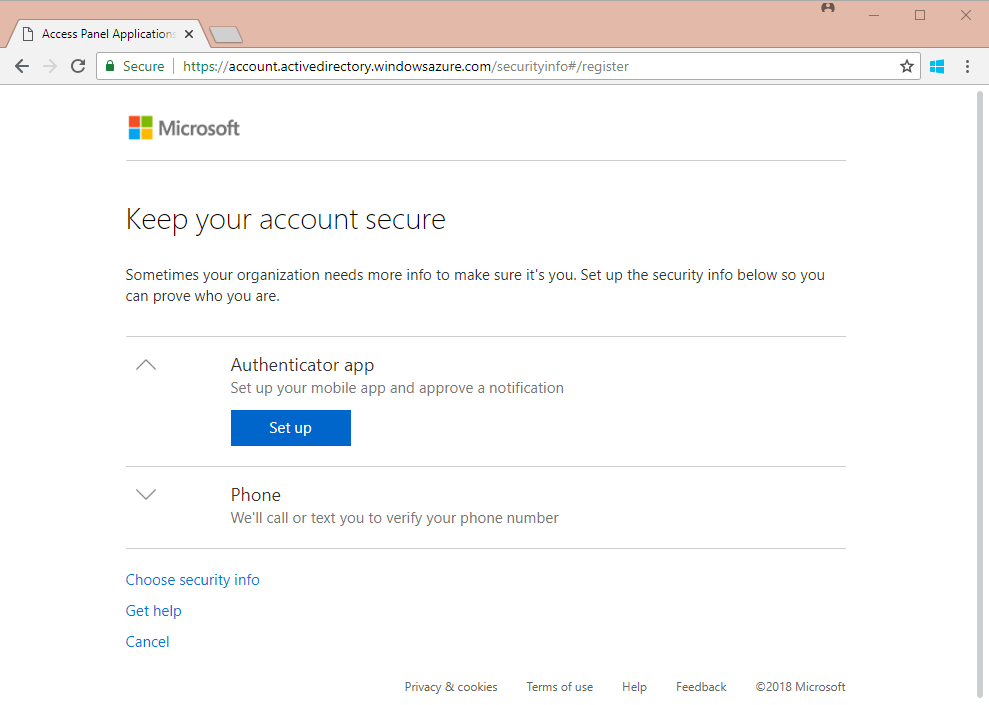
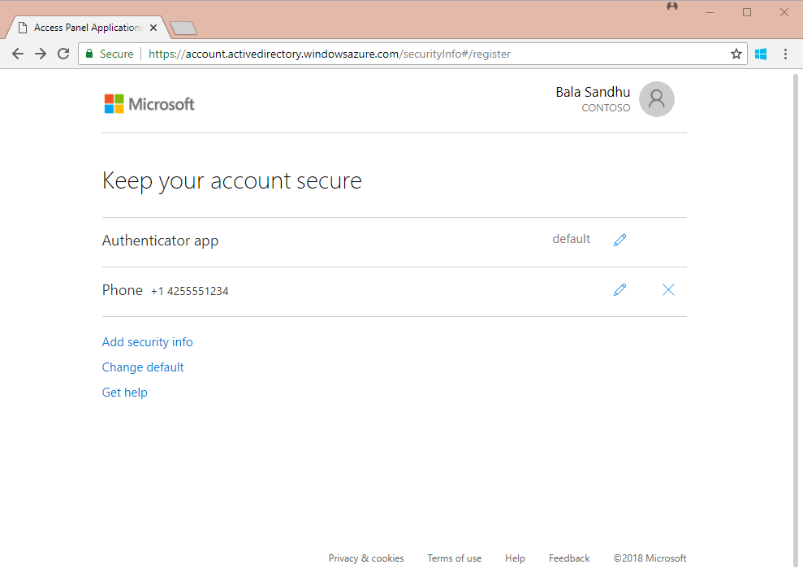

# Converged registration for self-service password reset and Azure Multi-Factor Authentication (public preview)

Until now, users were required to register authentication methods for Azure Multi-Factor Authentication (MFA) and self-service password reset (SSPR) in two different portals. Many users were confused that similar methods were used for both Azure MFA and SSPR and would not register in both portals. Some users were then unable to use either Azure MFA or SSPR when needed, leading to helpdesk calls. 

Now, users can register once and get the benefits of both Azure MFA and SSPR. Users don't need to register their authentication methods for these features twice.  

Before you enable this new experience for your organization, we recommend that you review this article and the [user documentation](https://aka.ms/securityinfoguide) to understand the impact that the experience will have on your users. You can use the user documentation to train and prepare your users for the new experience and help ensure a successful rollout.

|     |
| --- |
| Converged registration for self-service password reset and Azure Multi-Factor Authentication is a public preview feature of Azure Active Directory (Azure AD). For more information about previews, see  [Supplemental Terms of Use for Microsoft Azure Previews](https://azure.microsoft.com/support/legal/preview-supplemental-terms/).|
|     |

To enable your users to register authentication methods for both Azure Multi-Factor Authentication and self-service password reset in a single experience, complete the following steps:

1. Sign in to the Azure portal as a global administrator or user administrator.
2. Browse to **Azure Active Directory** > **User settings** > **Manage settings for access panel preview features**.
3. Under **Users can use preview features for registering and managing security info**, you can choose to enable for a **Selected** group of users or for **All** users.

Users can now go to [https://aka.ms/setupsecurityinfo](https://aka.ms/setupsecurityinfo) to register their authentication methods for both MFA and SSPR. To learn more about what your users will see in this new experience, see the [user documentation](https://aka.ms/securityinfoguide).  

> [!NOTE]
> After you enable this experience, users who register or confirm their phone number or mobile app through the new experience can use them for MFA and SSPR, if those methods are enabled in the MFA and SSPR policies. If you then disable this experience, users who go to the previous SSPR registration page at https:/aka.ms/ssprsetup will be required to perform multi-factor authentication before they can access the page.  

## How it works

If a user has previously registered authentication methods through the separate MFA and SSPR registration experiences, they don't need to register that information again. But if your settings require users to register for MFA or SSPR, they might see a prompt to review their security information when signing in.

If a user has registered a method that can be used for MFA, they are prompted to perform multi-factor authentication before they can access the new experience.

If you have enforced registration for MFA or SSPR and a user has not yet registered, they are prompted to register when they sign in.

Users who are prompted to register while signing in see the following experience:

> [!NOTE]
> This experience is shown only when a user is prompted to register while signing in. Users who go directly to the experience at https://aka.ms/setupsecurityinfo see a different version of the experience, which is described later in this article.

The displayed authentication methods change based on the methods enabled in your MFA and SSPR policies. The user is asked to register the minimum number of authentication methods needed to be compliant with the MFA policy, SSPR policy, or both. If there is flexibility in which authentication methods the user can register, they can select **Choose security info** to choose other authentication methods.  

> [!NOTE]
> If you enable the use of both mobile app notification and mobile app code, users who register the Microsoft Authenticator app through a notification can use both notification and code to verify their identity.

Unlike the previous MFA registration experience, users are not prompted to register an app password when going through the new registration experience. Instead, they should follow the steps listed in the apps passwords tutorial to register app passwords in the new experience.  

After a user completes registration, their default MFA method is automatically set. If the user registered an authenticator app, the default method is set to app. If the user did not register an authenticator app and only registered their phone number, the default method is set to phone call. Users can change their default by going to https://aka.ms/setupsecurityinfo and selecting **Change default**.  

If registration is not enforced, users can manage their own authentication methods at https://aka.ms/setupsecurityinfo. If a user has previously registered a method that can be used for MFA, they are asked to perform multi-factor authentication before they can access the page.  

On this page, users see previously registered authentication methods and authentication methods registered for them, such as Office phone. Users can also add, edit, or delete their authentication methods (excluding Office phone).  

Audit logs for this new experience exist under the Authentication Methods category of the audit log.  

## Known issues

**Default MFA method is set to phone call when a user registers a phone by using text message**

   * Some users might notice that their default MFA method is set to phone call after they register their phone number by using text message. Users can resolve this issue by changing their default method by following the instructions in the article [Manage your security info (preview)](../user-help/security-info-manage-settings.md#change-your-info).

**User can't access the new registration experience after an admin disables their default method**

   * Some users might not be able to access the new registration experience if their administrator has disabled their previously registered default MFA method. Here is an example scenario:
      1. User previously registered their phone number and set their default method to phone call.
      2. Admin disables phone call as an MFA method for the tenant.
      3. User is prompted to register during sign-in because they need to register an additional method to meet the tenant SSPR policy.
      4. User tries to register but cannot access the page and is stuck in a loop because a default method isn't set.

## Next steps

[Learn how to deploy Azure AD self-service password reset](howto-sspr-deployment.md)

[Learn how to require multi-factor authentication for signing in](howto-mfa-getstarted.md)

[Learn how to configure user authentication methods](https://aka.ms/securityinfoguide)