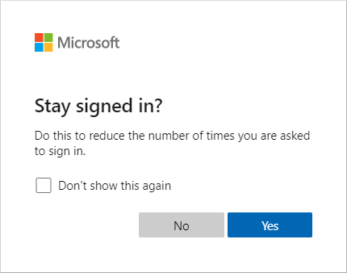
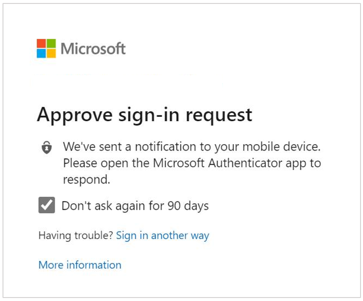
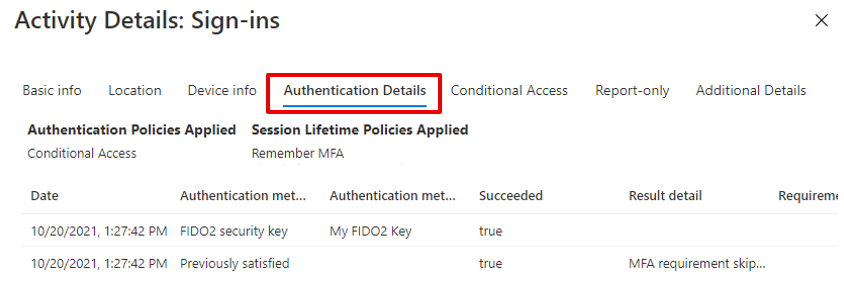

# Optimize reauthentication prompts and understand session lifetime for Azure AD Multi-Factor Authentication

Azure Active Directory (Azure AD) has multiple settings that determine how often users need to reauthenticate. This reauthentication could be with a first factor such as password, FIDO, or passwordless Microsoft Authenticator, or to perform multifactor authentication (MFA). You can configure these reauthentication settings as needed for your own environment and the user experience you want.

The Azure AD default configuration for user sign-in frequency is a rolling window of 90 days. Asking users for credentials often seems like a sensible thing to do, but it can backfire. If users are trained to enter their credentials without thinking, they can unintentionally supply them to a malicious credential prompt.

It might sound alarming to not ask for a user to sign back in, though any violation of IT policies revokes the session. Some examples include a password change, an incompliant device, or an account disable operation. You can also explicitly [revoke users' sessions using PowerShell](/powershell/module/azuread/revoke-azureaduserallrefreshtoken).

This article details recommended configurations and how different settings work and interact with each other.

## Recommended settings

To give your users the right balance of security and ease of use by asking them to sign in at the right frequency, we recommend the following configurations:

* If you have Azure AD Premium:
    * Enable single sign-on (SSO) across applications using [managed devices](../devices/overview.md) or [Seamless SSO](../hybrid/how-to-connect-sso.md).
    * If reauthentication is required, use a Conditional Access [sign-in frequency policy](../conditional-access/howto-conditional-access-session-lifetime.md).
    * For users that sign in from non-managed devices or mobile device scenarios, persistent browser sessions may not be preferable, or you might use Conditional Access to enable persistent browser sessions with sign-in frequency policies. Limit the duration to an appropriate time based on the sign-in risk, where a user with less risk has a longer session duration.
* If you have Microsoft 365 apps licenses or the free Azure AD tier:
    * Enable single sign-on (SSO) across applications using [managed devices](../devices/overview.md) or [Seamless SSO](../hybrid/how-to-connect-sso.md).
    * Keep the *Remain signed-in* option enabled and guide your users to accept it.
* For mobile devices scenarios, make sure your users use the Microsoft Authenticator app. This app is used as a broker to other Azure AD federated apps, and reduces authentication prompts on the device.

Our research shows that these settings are right for most tenants. Some combinations of these settings, such as *Remember MFA* and *Remain signed-in*, can result in prompts for your users to authenticate too often. Regular reauthentication prompts are bad for user productivity and can make them more vulnerable to attacks.

## Azure AD session lifetime configuration settings

To optimize the frequency of authentication prompts for your users, you can configure Azure AD session lifetime options. Understand the needs of your business and users, and configure settings that provide the best balance for your environment.

### Evaluate session lifetime policies

Without any session lifetime settings, there are no persistent cookies in the browser session. Every time a user closes and open the browser, they get a prompt for reauthentication. In Office clients, the default time period is a rolling window of 90 days. With this default Office configuration, if the user has reset their password or there has been inactivity of over 90 days, the user is required to reauthenticate with all required factors (first and second factor).

A user might see multiple MFA prompts on a device that doesn't have an identity in Azure AD. Multiple prompts result when each application has its own OAuth Refresh Token that isn't shared with other client apps. In this scenario, MFA prompts multiple times as each application requests an OAuth Refresh Token to be validated with MFA.

In Azure AD, the most restrictive policy for session lifetime determines when the user needs to reauthenticate. Consider the following scenario:

* You enable *Remain signed-in*, which uses a persistent browser cookie, and
* You also enable *Remember MFA for 14 days*

In this example scenario, the user needs to reauthenticate every 14 days. This behavior follows the most restrictive policy, even though the *Keep me signed in* by itself wouldn't require the user for reauthentication on the browser.

### Managed devices

Devices joined to Azure AD using Azure AD Join or Hybrid Azure AD Join receive a [Primary Refresh Tokens (PRT)](../devices/concept-primary-refresh-token.md) to use single sign-on (SSO) across applications. This PRT lets a user sign in once on the device and allows IT staff to make sure that standards for security and compliance are met. If a user needs to be asked to sign in more frequently on a joined device for some apps or scenarios, this can be achieved using [Conditional Access Sign-in Frequency](../conditional-access/howto-conditional-access-session-lifetime.md).

### Show option to remain signed-in

When a user selects **Yes** on the *Stay signed in?* prompt option during sign-in, a persistent cookie is set on the browser. This persistent cookie remembers both first and second factor, and it applies only for authentication requests in the browser.

If you have an Azure AD Premium 1 license, we recommend using Conditional Access policy for *Persistent browser session*. This policy overwrites the *Stay signed in?* setting and provides an improved user experience. If you don't have an Azure AD Premium 1 license, we recommend enabling the stay signed in setting for your users.

For more information on configuring the option to let users remain signed-in, see [How to manage the 'Stay signed in?' prompt](../fundamentals/how-to-manage-stay-signed-in-prompt.md).

### Remember Multi-Factor Authentication  

This setting lets you configure values between 1-365 days and sets a persistent cookie on the browser when a user selects the **Don't ask again for X days** option at sign-in.

While this setting reduces the number of authentications on web apps, it increases the number of authentications for modern authentication clients, such as Office clients. These clients normally prompt only after password reset or inactivity of 90 days. However, setting this value to less than 90 days shortens the default MFA prompts for Office clients, and increases reauthentication frequency. When used in combined with **Remain signed-in** or Conditional Access policies, it may increase the number of authentication requests.

If you use *Remember MFA* and have Azure AD Premium 1 licenses, consider migrating these settings to Conditional Access Sign-in Frequency. Otherwise, consider using *Keep me signed in?* instead.

More information, see [Remember Multi-Factor Authentication](howto-mfa-mfasettings.md#remember-multi-factor-authentication).

### Authentication session management with Conditional Access

**Sign-in frequency** allows the administrator to choose sign-in frequency that applies for both first and second factor in both client and browser. We recommend using these settings, along with using managed devices, in scenarios when you have a need to restrict authentication session, such as for critical business applications.

**Persistent browser session** allows users to remain signed in after closing and reopening their browser window. Similar to the *Remain signed-in* setting, it sets a persistent cookie on the browser. However, since it's configured by the admin, it doesn't require the user select **Yes** in the *Stay signed-in?* option so provides a better user experience. If you use the *Remain signed-in?* option, we recommend you enable the **Persistent browser session** policy instead.

For more information. see [Configure authentication session management with Conditional Access](../conditional-access/howto-conditional-access-session-lifetime.md).

### Configurable token lifetimes

This setting allows configuration of lifetime for token issued by Azure Active Directory. This policy is replaced by *Authentication session management with Conditional Access*. If you are using *Configurable token lifetimes* today, we recommend starting the migration to the Conditional Access policies.

## Review your tenant configuration  

Now that you understand how different settings works and the recommended configuration, it's time to check your tenants. You can start by looking at the sign-in logs to understand which session lifetime policies were applied during sign-in.

Under each sign-in log, go to the **Authentication Details** tab and explore **Session Lifetime Policies Applied**. For more information, see [Authentication details](../reports-monitoring/concept-sign-ins.md#authentication-details).

To configure or review the *Remain signed-in* option, complete the following steps:

1. In the Azure portal, search for and select *Azure Active Directory*.
1. Select **Company Branding**, then for each locale, choose **Show option to remain signed in**.
1. Choose *Yes*, then select **Save**.

To remember multifactor authentication settings on trusted devices, complete the following steps:

1. In the Azure portal, search for and select *Azure Active Directory*.
1. Select **Security**, then **MFA**.
1. Under **Configure**, select **Additional cloud-based MFA settings**.
1. In the *Multi-factor authentication service settings* page, scroll to **remember multi-factor authentication settings**. Disable the setting by unchecking the checkbox.

To configure Conditional Access policies for sign-in frequency and persistent browser session, complete the following steps:

1. In the Azure portal, search for and select *Azure Active Directory*.
1. Select **Security**, then **Conditional Access**.
1. Configure a policy using the recommended session management options detailed in this article.

To review token lifetimes, [use Azure AD PowerShell to query any Azure AD policies](../develop/configure-token-lifetimes.md#get-started). Disable any policies that you have in place.

If more than one setting is enabled in your tenant, we recommend updating your settings based on the licensing available for you. For example, if you have Azure AD premium licenses you should only use the Conditional Access policy of *Sign-in Frequency* and *Persistent browser session*. If you have Microsoft 365 apps or Azure AD free licenses, you should use the *Remain signed-in?* configuration.

If you have enabled configurable token lifetimes, this capability will be removed soon. Plan a migration to a Conditional Access policy.

The following table summarizes the recommendations based on licenses:

|              | Azure AD Free and Microsoft 365 apps | Azure AD Premium |
|------------------------------|-----------------------------------|------------------|
| **SSO**                      | [Azure AD join](../devices/concept-azure-ad-join.md) or [Hybrid Azure AD join](../devices/concept-azure-ad-join-hybrid.md), or [Seamless SSO](../hybrid/how-to-connect-sso.md) for unmanaged devices. | Azure AD join Hybrid Azure AD join |
| **Reauthentication settings** | Remain signed-in                  | Use Conditional Access policies for sign-in frequency and persistent browser session |

## Next steps

To get started, complete the tutorial to [Secure user sign-in events with Azure AD Multi-Factor Authentication](tutorial-enable-azure-mfa.md) or [Use risk detections for user sign-ins to trigger Azure AD Multi-Factor Authentication](tutorial-risk-based-sspr-mfa.md).
