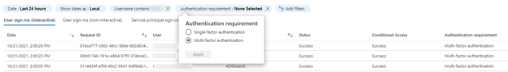
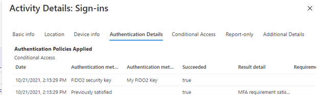
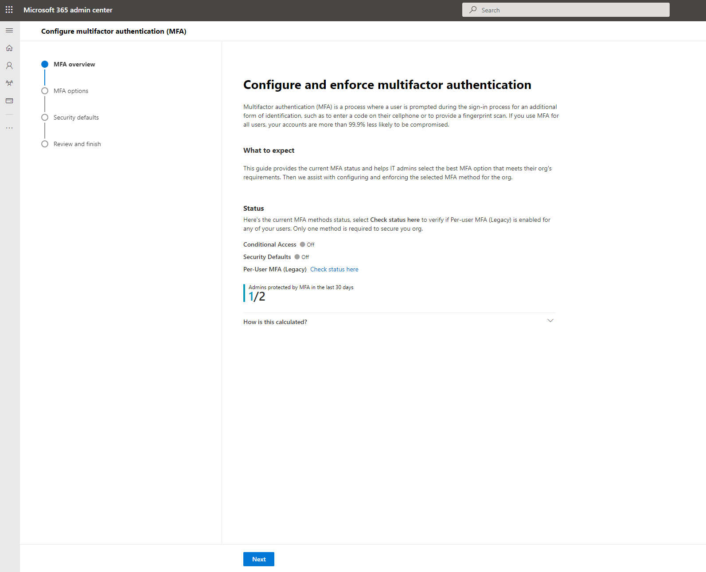

# Find and address gaps in strong authentication coverage for your administrators

Requiring multifactor authentication (MFA) for the administrators in your tenant is one of the first steps you can take to increase the security of your tenant. In this article, we'll cover how to make sure all of your administrators are covered by multifactor authentication.

## Detect current usage for Azure AD Built-in administrator roles

The [Azure AD Secure Score](../fundamentals/identity-secure-score.md) provides a score for **Require MFA for administrative roles** in your tenant. This improvement action tracks the MFA usage of Global administrator, Security administrator, Exchange administrator, and SharePoint administrator. 

There are different ways to check if your admins are covered by an MFA policy. 

- To troubleshoot sign-in for a specific administrator, you can use the sign-in logs. The sign-in logs let you filter **Authentication requirement** for specific users. Any sign-in where **Authentication requirement** is **Single-factor authentication** means there was no multifactor authentication policy that was required for the sign-in.

  

  Click **Authentication details** for [details about the MFA requirements](../reports-monitoring/concept-sign-ins.md#authentication-details).
  
  

- To choose which policy to enable based on your user licenses, we have a new MFA enablement wizard to help you [compare MFA policies](concept-mfa-licensing.md#compare-multi-factor-authentication-policies) and see which steps are right for your organization. The wizard shows administrators who were protected by MFA in the last 30 days.

  

- You can run [this script](https://github.com/microsoft/AzureADToolkit/blob/main/src/Find-AADToolkitUnprotectedUsersWithAdminRoles.ps1) to programmatically generate a report of all users with directory role assignments who have signed in with or without MFA in the last 30 days. This script will enumerate all active built-in and custom role assignments, all eligible built-in and custom role assignments, and groups with roles assigned.

## Enforce multifactor authentication on your administrators

If you find administrators who aren't protected by multifactor authentication, you can protect them in one of the following ways:

- If your administrators are licensed for Azure AD Premium, you can [create a Conditional Access policy](tutorial-enable-azure-mfa.md) to enforce MFA for administrators. You can also update this policy to require MFA from users who are in custom roles.  

- Run the [MFA enablement wizard](https://aka.ms/MFASetupGuide) to choose your MFA policy.

- If you assign custom or built-in admin roles in [Privileged Identity Management](../privileged-identity-management/pim-configure.md), require multifactor authentication upon role activation.

## Use Passwordless and phishing resistant authentication methods for your administrators

After your admins are enforced for multifactor authentication and have been using it for a while, it is time to raise the bar on strong authentication and use Passwordless and phishing resistant authentication method: 

- [Phone Sign-in (with Microsoft Authenticator)](concept-authentication-authenticator-app.md)
- [FIDO2](concept-authentication-passwordless.md#fido2-security-keys)
- [Windows Hello for Business](/windows/security/identity-protection/hello-for-business/hello-overview)

You can read more about these authentication methods and their security considerations in [Azure AD authentication methods](concept-authentication-methods.md).
