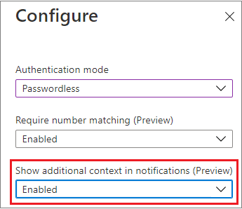

# How to use additional context in Microsoft Authenticator notifications (Preview) - Authentication Methods Policy

This topic covers how to improve the security of user sign-in by adding the application and location in Microsoft Authenticator push notifications.  

## Prerequisites

Your organization will need to enable Microsoft Authenticator push notifications for some users or groups using the new Authentication Methods Policy API.

>[!NOTE]
>Additional context can be targeted to only a single group, which can be dynamic or nested. On-premises synchronized security groups and cloud-only security groups are supported for the Authentication Method Policy.

## Passwordless phone sign-in and multifactor authentication 

When a user receives a Passwordless phone sign-in or MFA push notification in the Microsoft Authenticator app, they'll see the name of the application that requests the approval and the location based on the IP address where the sign-in originated from.

:::image type="content" border="false" source="./media/howto-authentication-passwordless-phone/location.png" alt-text="Screenshot of additional context in the MFA push notification.":::

The additional context can be combined with [number matching](how-to-mfa-number-match.md) to further improve sign-in security. 

:::image type="content" border="false" source="./media/howto-authentication-passwordless-phone/location-with-number-match.png" alt-text="Screenshot of additional context with number matching in the MFA push notification.":::

### Policy schema changes 

>[!NOTE]
>In Graph Explorer, ensure you've consented to the **Policy.Read.All** and **Policy.ReadWrite.AuthenticationMethod** permissions. 

Identify a single target group for the schema configuration. Then use the following API endpoint to change the displayAppInformationRequiredState property to **enabled**:

https://graph.microsoft.com/beta/authenticationMethodsPolicy/authenticationMethodConfigurations/MicrosoftAuthenticator

>[!NOTE]
>For Passwordless phone sign-in, the Authenticator app does not retrieve policy information just in time for each sign-in request. Instead, the Authenticator app does a best effort retrieval of the policy once every 7 days. We understand this limitation is less than ideal and are working to optimize the behavior. In the meantime, if you want to force a policy update to test using additional context with Passwordless phone sign-in, you can remove and re-add the account in the Authenticator app. 

#### MicrosoftAuthenticatorAuthenticationMethodConfiguration properties

**PROPERTIES**

| Property | Type | Description |
|---------|------|-------------|
| id | String | The authentication method policy identifier. |
| state | authenticationMethodState | Possible values are: **enabled**<br>**disabled** |
 
**RELATIONSHIPS**

| Relationship | Type | Description |
|--------------|------|-------------|
| includeTargets | [microsoftAuthenticatorAuthenticationMethodTarget](/graph/api/resources/passwordlessmicrosoftauthenticatorauthenticationmethodtarget) |
| collection | A collection of users or groups who are enabled to use the authentication method. |
 
#### MicrosoftAuthenticator includeTarget properties
 
**PROPERTIES**

| Property | Type | Description |
|----------|------|-------------|
| authenticationMode | String | Possible values are:<br>**any**: Both passwordless phone sign-in and traditional second factor notifications are allowed.<br>**deviceBasedPush**: Only passwordless phone sign-in notifications are allowed.<br>**push**: Only traditional second factor push notifications are allowed. |
| id | String | Object ID of an Azure AD user or group. |
| targetType | authenticationMethodTargetType | Possible values are: **user**, **group**.<br>You can only set one group or user for additional context. |
| displayAppInformationRequiredState | advancedConfigState | Possible values are:<br>**enabled** explicitly enables the feature for the selected group.<br>**disabled** explicitly disables the feature for the selected group.<br>**default** allows Azure AD to manage whether the feature is enabled or not for the selected group. |

>[!NOTE]
>Additional context can only be enabled for a single group.

#### Example of how to enable additional context for all users

Change the **displayAppInformationRequiredState** from **default** to **enabled**. 

The value of Authentication Mode can be either **any** or **push**, depending on whether or not you also want to enable passwordless phone sign-in. In these examples, we'll use **any**, but if you do not want to allow passwordless, use **push**.

You need to PATCH the entire includeTarget to prevent overwriting any previous configuration. In that case, do a GET first, update only the relevant fields, and then PATCH. The following example only shows the update to the **displayAppInformationRequiredState**. 

```json
//Retrieve your existing policy via a GET. 
//Leverage the Response body to create the Request body section. Then update the Request body similar to the Request body as shown below.
//Change the Query to PATCH and Run query
 
{
    "@odata.context": "https://graph.microsoft.com/beta/$metadata#authenticationMethodConfigurations/$entity",
    "@odata.type": "#microsoft.graph.microsoftAuthenticatorAuthenticationMethodConfiguration",
    "id": "MicrosoftAuthenticator",
    "state": "enabled",
    "includeTargets@odata.context": "https://graph.microsoft.com/beta/$metadata#authenticationMethodsPolicy/authenticationMethodConfigurations('MicrosoftAuthenticator')/microsoft.graph.microsoftAuthenticatorAuthenticationMethodConfiguration/includeTargets",
    "includeTargets": [
        {
            "targetType": "group",
            "id": "all_users",
            "authenticationMode": "any",
            "displayAppInformationRequiredState": "enabled",
            "numberMatchingRequiredState": "enabled"
        }
    ]
}
 
```
 
To confirm this update has applied, run the GET request below using the endpoint below.
GET - https://graph.microsoft.com/beta/authenticationMethodsPolicy/authenticationMethodConfigurations/MicrosoftAuthenticator
 
 
#### Example of how to enable additional context for a single group
 
Change the **displayAppInformationRequiredState** value from **default** to **enabled.** 
Change the **id** from **all_users** to the ObjectID of the group from the Azure AD portal.

You need to PATCH the entire includeTarget to prevent overwriting any previous configuration. We recommend that you do a GET first, and then update only the relevant fields and then PATCH. The example below only shows the update to the **displayAppInformationRequiredState**. 

```json
//Copy paste the below in the Request body section as shown below.
//Leverage the Response body to create the Request body section. Then update the Request body similar to the Request body as shown below.
//Change query to PATCH and run query

{
    "@odata.context": "https://graph.microsoft.com/beta/$metadata#authenticationMethodConfigurations/$entity",
    "@odata.type": "#microsoft.graph.microsoftAuthenticatorAuthenticationMethodConfiguration",
    "id": "MicrosoftAuthenticator",
    "state": "enabled",
    "includeTargets@odata.context": "https://graph.microsoft.com/beta/$metadata#authenticationMethodsPolicy/authenticationMethodConfigurations('MicrosoftAuthenticator')/microsoft.graph.microsoftAuthenticatorAuthenticationMethodConfiguration/includeTargets",
    "includeTargets": [
        {
            "targetType": "group",
            "id": "1ca44590-e896-4dbe-98ed-b140b1e7a53a",
            "authenticationMode": "any",
            "displayAppInformationRequiredState": "enabled",
            "numberMatchingRequiredState": "enabled"
        }
    ]
}
```
 
To verify, RUN GET again and verify the ObjectID
GET https://graph.microsoft.com/beta/authenticationMethodsPolicy/authenticationMethodConfigurations/MicrosoftAuthenticator
 

#### Example of error when enabling additional context for multiple groups

The PATCH request will fail with 400 Bad Request and the error will contain the following message: 

`Persistance of policy failed with error: You cannot enable multiple targets for feature 'Require Display App Information'. Choose only one of the following includeTargets to enable: aede0efe-c1b4-40dc-8ae7-2c402f23e312,aede0efe-c1b4-40dc-8ae7-2c402f23e317.`

### Test the end-user experience
Add the test user account to the Microsoft Authenticator app. The account **doesn't** need to be enabled for phone sign-in. 

See the end-user experience of an Authenticator MFA push notification with additional context by signing into aka.ms/MFAsetup. 

### Turn off additional context

To turn off additional context, you'll need to PATCH remove **displayAppInformationRequiredState** from **enabled** to **disabled**/**default**.

```json
{
    "@odata.context": "https://graph.microsoft.com/beta/$metadata#authenticationMethodConfigurations/$entity",
    "@odata.type": "#microsoft.graph.microsoftAuthenticatorAuthenticationMethodConfiguration",
    "id": "MicrosoftAuthenticator",
    "state": "enabled",
    "includeTargets@odata.context": "https://graph.microsoft.com/beta/$metadata#authenticationMethodsPolicy/authenticationMethodConfigurations('MicrosoftAuthenticator')/microsoft.graph.microsoftAuthenticatorAuthenticationMethodConfiguration/includeTargets",
    "includeTargets": [
        {
            "targetType": "group",
            "id": "all_users",
            "authenticationMode": "any",
            "displayAppInformationRequiredState": "enabled",
            "numberMatchingRequiredState": "default"
        }
    ]
}
```

## Enable additional context in the portal

To enable additional context in the Azure AD portal, complete the following steps:

1. In the Azure AD portal, click **Security** > **Authentication methods** > **Microsoft Authenticator**.
1. Select the target users, click the three dots on the right, and click **Configure**.
   
   

1. Select the **Authentication mode**, and then for **Show additional context in notifications (Preview)**, click **Enable**, and then click **Done**.

   

## Known issues

Additional context is not supported for Network Policy Server (NPS). 

## Next steps

[Authentication methods in Azure Active Directory - Microsoft Authenticator app](concept-authentication-authenticator-app.md)

