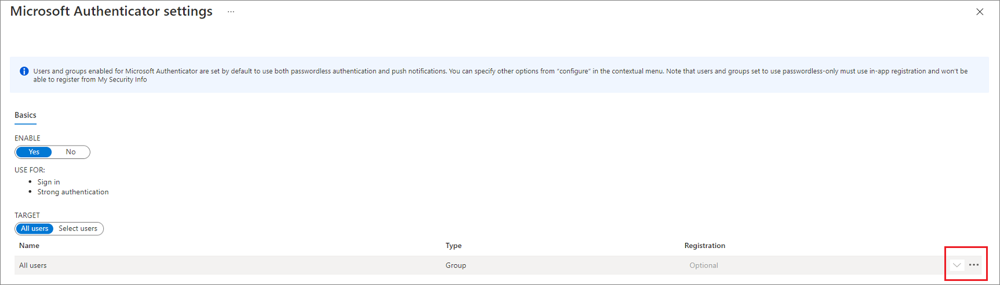
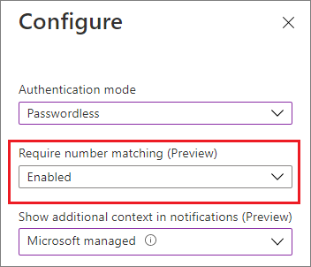

# How to use number matching in multifactor authentication (MFA) notifications (Preview) - Authentication Methods Policy

This topic covers how to enable number matching in Microsoft Authenticator push notifications to improve user sign-in security.  

>[!NOTE]
>Number matching is a key security upgrade to traditional second factor notifications in the Microsoft Authenticator app that will be enabled by default for all tenants a few months after general availability (GA).<br> 
>We highly recommend enabling number matching in the near-term for improved sign-in security.

## Prerequisites

Your organization will need to enable Microsoft Authenticator (traditional second factor) push notifications for some users or groups using the new Authentication Methods Policy API. If your organization is using ADFS adapter or NPS extensions, please upgrade to the latest versions for a consistent experience. 

## Number matching

<!---check below with Mayur. The bit about the policy came from the number match FAQ at the end.--->

Number matching can be targeted to only a single group, which can be dynamic or nested. On-premises synchronized security groups and cloud-only security groups are supported for the Authentication Method Policy. 

Number matching is available for the following scenarios. When enabled, all scenarios support number matching.

- [Multifactor authentication](tutorial-enable-azure-mfa.md)
- [Self-service password reset](howto-sspr-deployment.md)
- [Combined SSPR and MFA registration during Authenticator app set up](howto-registration-mfa-sspr-combined.md)
- [AD FS adapter](howto-mfaserver-adfs-windows-server.md)
- [NPS extension](howto-mfa-nps-extension.md)

>[!NOTE]
>For passwordless users, enabling or disabling number matching has no impact because it's already part of the passwordless experience. 

### Multifactor authentication

When a user responds to an MFA push notification using Microsoft Authenticator, they will be presented with a number. They need to type that number into the app to complete the approval. 


### SSPR

During self-service password reset, Microsoft Authenticator notification will show a number that the user will need to type in their Authenticator app notification. This number will only be seen to users who have been enabled for number matching.

### Combined registration

When a user is goes through combined registration to set up Microsoft Authenticator, the user is asked to approve a notification as part of adding the account. For users who are enabled for number matching, this notification will show a number that they need to type in their Authenticator app notification. 

### AD FS adapter

The AD FS adapter supports number matching after installing an update. Earlier versions of Windows Server don't support number matching. On earlier versions, users will continue to see the **Approve**/**Deny** experience and won't see number matching until you upgrade.

| Version | Update |
|---------|--------|
| Windows Server 2022 | [October 26, 2021—KB5006745 (OS Build 20348.320) Preview](https://support.microsoft.com/topic/october-26-2021-kb5006745-os-build-20348-320-preview-8ff9319a-19e7-40c7-bbd1-cd70fcca066c) |
| Windows Server 2019 | [October 19, 2021—KB5006744 (OS Build 17763.2268) Preview](https://support.microsoft.com/topic/october-19-2021-kb5006744-os-build-17763-2268-preview-e043a8a3-901b-4190-bb6b-f5a4137411c0) |
| Windows Server 2016 | [October 12, 2021—KB5006669 (OS Build 14393.4704)](https://support.microsoft.com/topic/october-12-2021-kb5006669-os-build-14393-4704-bcc95546-0768-49ae-bec9-240cc59df384) |


### NPS extension

Make sure you run the latest version of the [NPS extension](https://www.microsoft.com/download/details.aspx?id=54688). NPS extension versions beginning with 1.0.1.40 support number matching. 

Because the NPS extension can't show a number, a user who is enabled for number matching will still be prompted to **Approve**/**Deny**. However, you can create a registry key that overrides push notifications to ask a user to enter a One-Time Passcode (OTP). The user must have an OTP authentication method registered to see this behavior. Common OTP authentication methods include the OTP available in the Microsoft Authenticator app, other software tokens, and so on. 

If the user doesn't have an OTP method registered, they will continue to get the **Approve**/**Deny** experience. A user with number matching disabled will always see the **Approve**/**Deny** experience.

To create the registry key that overrides push notifications:

1. On the NPS Server, open the Registry Editor.
1. Navigate to HKEY_LOCAL_MACHINE\SOFTWARE\Microsoft\AzureMfa.
1. Set the following Key Value Pair:
   Key: OVERRIDE_NUMBER_MATCHING_WITH_OTP
   Value = TRUE
1. Restart the NPS Service. 

### Policy schema changes 

>[!NOTE]
>In Graph Explorer, ensure you've consented to the **Policy.Read.All** and **Policy.ReadWrite.AuthenticationMethod** permissions. 

Identify your single target group for the schema configuration. Then use the following API endpoint to change the numberMatchingRequiredState property to **enabled**:

https://graph.microsoft.com/beta/authenticationMethodsPolicy/authenticationMethodConfigurations/MicrosoftAuthenticator


#### MicrosoftAuthenticatorAuthenticationMethodConfiguration properties

**PROPERTIES**

| Property | Type | Description |
|---------|------|-------------|
| id | String | The authentication method policy identifier. |
| state | authenticationMethodState | Possible values are: **enabled**<br>**disabled** |
 
**RELATIONSHIPS**

| Relationship | Type | Description |
|--------------|------|-------------|
| includeTargets | [microsoftAuthenticatorAuthenticationMethodTarget](/graph/api/resources/passwordlessmicrosoftauthenticatorauthenticationmethodtarget) |
| collection | A collection of users or groups who are enabled to use the authentication method. |
 
#### MicrosoftAuthenticator includeTarget properties
 
**PROPERTIES**

| Property | Type | Description |
|----------|------|-------------|
| authenticationMode | String | Possible values are:<br>**any**: Both passwordless phone sign-in and traditional second factor notifications are allowed.<br>**deviceBasedPush**: Only passwordless phone sign-in notifications are allowed.<br>**push**: Only traditional second factor push notifications are allowed. |
| id | String | Object ID of an Azure AD user or group. |
| targetType | authenticationMethodTargetType | Possible values are: **user**, **group**.<br>Please note: You will be able to only set one group or user for number matching. |
| numberMatchingRequiredState | advancedConfigState | Possible values are:<br>**enabled** explicitly enables the feature for the selected group.<br>**disabled** explicitly disables the feature for the selected group.<br>**default** allows Azure AD to manage whether the feature is enabled or not for the selected group. |

>[!NOTE]
>Number matching can only be enabled for a single group.

#### Example of how to enable number matching for all users

You will need to change the **numberMatchingRequiredState** from **default** to **enabled**. 

Note that the value of Authentication Mode can be either **any** or **push**, depending on whether or not you also want to enable passwordless phone sign-in. In these examples, we will use **any**, but if you do not want to allow passwordless, use **push**. 

>[!NOTE]
>For passwordless users, enabling or disabling number matching has no impact because it's already part of the passwordless experience. 

You might need to patch the entire includeTarget to prevent overwriting any previous configuration. In that case, do a GET first, update only the relevant fields, and then PATCH. The following example only shows the update to the **numberMatchingRequiredState**. 

```json
//Retrieve your existing policy via a GET. 
//Leverage the Response body to create the Request body section. Then update the Request body similar to the Request body as shown below.
//Change the Query to PATCH and Run query
 
{
    "@odata.context": "https://graph.microsoft.com/beta/$metadata#authenticationMethodConfigurations/$entity",
    "@odata.type": "#microsoft.graph.microsoftAuthenticatorAuthenticationMethodConfiguration",
    "id": "MicrosoftAuthenticator",
    "state": "enabled",
    "includeTargets@odata.context": "https://graph.microsoft.com/beta/$metadata#authenticationMethodsPolicy/authenticationMethodConfigurations('MicrosoftAuthenticator')/microsoft.graph.microsoftAuthenticatorAuthenticationMethodConfiguration/includeTargets",
    "includeTargets": [
        {
            "targetType": "group",
            "id": "all_users",
            "authenticationMode": "any",
            "displayAppInformationRequiredState": "enabled",
            "numberMatchingRequiredState": "enabled"
        }
    ]
}
 
```
 
To confirm this has applied, please run the GET request below using the endpoint below.
GET - https://graph.microsoft.com/beta/authenticationMethodsPolicy/authenticationMethodConfigurations/MicrosoftAuthenticator
 
 
#### Example of how to enable number matching for a single group
 
We will need to change the **numberMatchingRequiredState** value from **default** to **enabled.** 
You will need to change the **id** from **all_users** to the ObjectID of the group from the Azure AD portal.

You need to PATCH the entire includeTarget to prevent overwriting any previous configuration. We recommend that you do a GET first, and then update only the relevant fields and then PATCH. The example below only shows the update to the **numberMatchingRequiredState**. 

```json
//Copy paste the below in the Request body section as shown below.
//Leverage the Response body to create the Request body section. Then update the Request body similar to the Request body as shown below.
//Change query to PATCH and run query
{
    "@odata.context": "https://graph.microsoft.com/beta/$metadata#authenticationMethodConfigurations/$entity",
    "@odata.type": "#microsoft.graph.microsoftAuthenticatorAuthenticationMethodConfiguration",
    "id": "MicrosoftAuthenticator",
    "state": "enabled",
    "includeTargets@odata.context": "https://graph.microsoft.com/beta/$metadata#authenticationMethodsPolicy/authenticationMethodConfigurations('MicrosoftAuthenticator')/microsoft.graph.microsoftAuthenticatorAuthenticationMethodConfiguration/includeTargets",
    "includeTargets": [
        {
            "targetType": "group",
            "id": "1ca44590-e896-4dbe-98ed-b140b1e7a53a",
            "authenticationMode": "any",
            "displayAppInformationRequiredState": "enabled",
            "numberMatchingRequiredState": "enabled"
        }
    ]
}
```
 
To verify, RUN GET again and verify the ObjectID
GET https://graph.microsoft.com/beta/authenticationMethodsPolicy/authenticationMethodConfigurations/MicrosoftAuthenticator
 

#### Example of error when enabling number matching for multiple groups

The PATCH request will fail with 400 Bad Request and the error will contain the following message: 


`Persistance of policy failed with error: You cannot enable multiple targets for feature 'Require Number Matching'. Choose only one of the following includeTargets to enable: aede0efe-c1b4-40dc-8ae7-2c402f23e312,aede0efe-c1b4-40dc-8ae7-2c402f23e317.`

### Test the end user experience
Add the test user account to the Microsoft Authenticator app. The account does **not** need to be enabled for phone sign-in. 

See the end user experience of an Authenticator MFA push notification with number matching by signing into aka.ms/MFAsetup. 

### Turn off number matching

To turn number matching off, you will need to PATCH remove **numberMatchingRequiredState** from **enabled** to **disabled**/**default**.

```json
{
    "@odata.context": "https://graph.microsoft.com/beta/$metadata#authenticationMethodConfigurations/$entity",
    "@odata.type": "#microsoft.graph.microsoftAuthenticatorAuthenticationMethodConfiguration",
    "id": "MicrosoftAuthenticator",
    "state": "enabled",
    "includeTargets@odata.context": "https://graph.microsoft.com/beta/$metadata#authenticationMethodsPolicy/authenticationMethodConfigurations('MicrosoftAuthenticator')/microsoft.graph.microsoftAuthenticatorAuthenticationMethodConfiguration/includeTargets",
    "includeTargets": [
        {
            "targetType": "group",
            "id": "all_users",
            "authenticationMode": "any",
            "displayAppInformationRequiredState": "enabled",
            "numberMatchingRequiredState": "default"
        }
    ]
}
```

## Enable number matching in the portal

To enable number matching in the Azure AD portal, complete the following steps:

1. In the Azure AD portal, click **Security** > **Authentication methods** > **Microsoft Authenticator**.
1. Select the target users, click the three dots on the right, and click **Configure**.
   
   

1. Select the **Authentication mode**, and then for **Require number matching (Preview)**, click **Enable**, and then click **Done**. 

   
   
>[!NOTE]
>[Least privilege role in Azure Active Directory - Multi-factor Authentication](../roles/delegate-by-task.md#multi-factor-authentication)

Number matching is not supported for Apple Watch notifications. Apple Watch need to use their phone to approve notifications when number matching is enabled.

## Next steps

[Authentication methods in Azure Active Directory - Microsoft Authenticator app](concept-authentication-authenticator-app.md)