# How to run a registration campaign to set up Microsoft Authenticator - Microsoft Authenticator

You can nudge users to set up Microsoft Authenticator during sign-in. Users go through their regular sign-in, perform multifactor authentication as usual, and then get prompted to set up Microsoft Authenticator. You can include or exclude users or groups to control who gets nudged to set up the app. This allows targeted campaigns to move users from less secure authentication methods to Authenticator.  

You can also define how many days a user can postpone, or "snooze," the nudge. If a user taps **Skip for now** to postpone the app setup, they get nudged again on the next MFA attempt after the snooze duration has elapsed. You can decide whether the user can snooze indefinitely or up to three times (after which registration is required).

>[!NOTE]
>As users go through their regular sign-in, Conditional Access policies that govern security info registration apply before the user is prompted to set up Authenticator. For example, if a Conditional Access policy requires security info updates can only occur on an internal network, then users won't be prompted to set up Authenticator unless they are on the internal network. 

## Prerequisites 

- Your organization must have enabled Microsoft Entra multifactor authentication. Every edition of Microsoft Entra ID includes Microsoft Entra multifactor authentication. No other license is needed for a registration campaign.
- Users can't have already set up the Authenticator app for push notifications on their account. 
- Admins need to enable users for the Authenticator app using one of these policies:  
  - MFA Registration Policy: Users will need to be enabled for **Notification through mobile app**.  
  - Authentication Methods Policy: Users will need to be enabled for the Authenticator app and the Authentication mode set to **Any** or **Push**. If the policy is set to **Passwordless**, the user won't be eligible for the nudge. For more information about how to set the Authentication mode, see [Enable passwordless sign-in with Microsoft Authenticator](howto-authentication-passwordless-phone.md). 

## User experience

1. User successfully authenticates using Microsoft Entra multifactor authentication. 

1. User sees prompt to set up the Authenticator app to improve their sign-in experience. Only users who are allowed for the Authenticator app push notifications and don't have it currently set up will see the prompt. 

   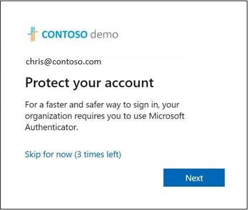

1. User taps **Next** and steps through the Authenticator app setup. 
   1. First download the app.  
   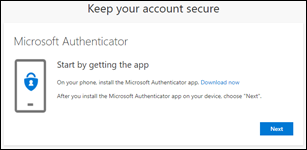

   1. See how to set up the Authenticator app. 
   
      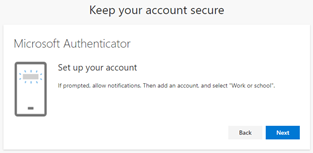

   1. Scan the QR Code. 

      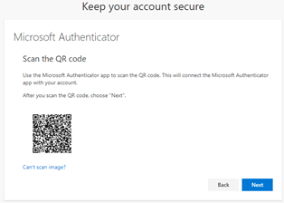

   1. Approve the test notification.

      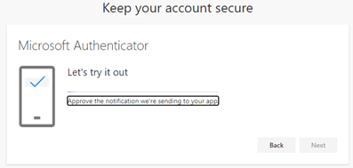

   1. Notification approved.

      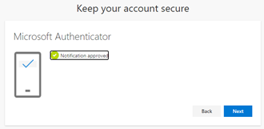

   1. Authenticator app is now successfully set up as the user's default sign-in method.

      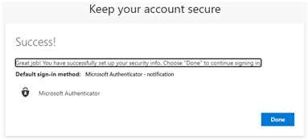

1. If a user wishes to not install the Authenticator app, they can tap **Skip for now** to snooze the prompt for up to 14 days, which can be set by an admin. Users with free and trial subscriptions can snooze the prompt up to three times.

   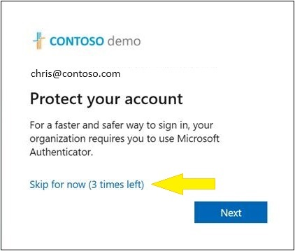


## Enable the registration campaign policy using the Microsoft Entra admin center

To enable a registration campaign in the Microsoft Entra admin center, complete the following steps:

1. Sign in to the [Microsoft Entra admin center](https://entra.microsoft.com) as [Authentication Policy Administrator](../roles/permissions-reference.md#authentication-policy-administrator) or [Global Administrator](../roles/permissions-reference.md#global-administrator).
1. Browse to **Protection** > **Authentication methods** > **Registration campaign** and click **Edit**.
1. For **State**, click **Microsoft managed** or **Enabled**. In the following screenshot, the registration campaign is **Microsoft managed**. That setting allows Microsoft to set the default value to be either Enabled or Disabled. From Sept. 25 to Oct. 20, 2023, the Microsoft managed value for the registration campaign will change to **Enabled** for voice call and text message users across all tenants. For more information, see [Protecting authentication methods in Microsoft Entra ID](concept-authentication-default-enablement.md).

   :::image type="content" border="true" source="media/how-to-mfa-registration-campaign/admin-experience.png" alt-text="Screenshot of enabling a registration campaign.":::

1. Select any users or groups to exclude from the registration campaign, and then click **Save**. 

## Enable the registration campaign policy using Graph Explorer

In addition to using the Microsoft Entra admin center, you can also enable the registration campaign policy using Graph Explorer. To enable the registration campaign policy, you must use the Authentication Methods Policy using Graph APIs. **Global Administrators** and **Authentication Policy Administrators** can update the policy. 

To configure the policy using Graph Explorer:

1. Sign in to Graph Explorer and ensure you've consented to the **Policy.Read.All** and **Policy.ReadWrite.AuthenticationMethod** permissions.

   To open the Permissions panel:

   

1. Retrieve the Authentication methods policy: `GET https://graph.microsoft.com/beta/policies/authenticationmethodspolicy`

1. Update the registrationEnforcement and authenticationMethodsRegistrationCampaign section of the policy to enable the nudge on a user or group.

   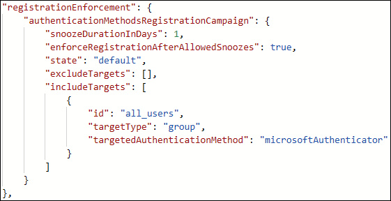

To update the policy, perform a PATCH on the Authentication Methods Policy with only the updated registrationEnforcement section: `PATCH https://graph.microsoft.com/beta/policies/authenticationmethodspolicy`

The following table lists **authenticationMethodsRegistrationCampaign** properties.

|Name|Possible values|Description|
|------|-----------------|-------------|
|snoozeDurationInDays|Range: 0 - 14|Defines the number of days before the user is nudged again.<br>If the value is 0, the user is nudged during every MFA attempt.<br>Default: 1 day|
|enforceRegistrationAfterAllowedSnoozes|"true"<br>"false"|Dictates whether a user is required to perform setup after 3 snoozes.<br>If true, user is required to register.<br>If false, user can snooze indefinitely.<br>Default: true<br>Please note this property only comes into effect once the Microsoft managed value for the registration campaign will change to Enabled for text message and voice call for your organization.|
|state|"enabled"<br>"disabled"<br>"default"|Allows you to enable or disable the feature.<br>Default value is used when the configuration hasn't been explicitly set and will use Microsoft Entra ID default value for this setting. From Sept. 25 to Oct. 20, 2023, the default state will change to enabled for voice call and text message users across all tenants.<br>Change state to enabled (for all users) or disabled as needed.|
|excludeTargets|N/A|Allows you to exclude different users and groups that you want omitted from the feature. If a user is in a group that is excluded and a group that is included, the user will be excluded from the feature.|
|includeTargets|N/A|Allows you to include different users and groups that you want the feature to target.|

The following table lists **includeTargets** properties.

| Name | Possible values | Description |
|------|-----------------|-------------|
| targetType| "user"<br>"group" | The kind of entity targeted. |
| Id | A guid identifier | The ID of the user or group targeted. |
| targetedAuthenticationMethod | "microsoftAuthenticator" | The authentication method user is prompted to register. The only permissible value is "microsoftAuthenticator". |

The following table lists **excludeTargets** properties.

| Name       | Possible values   | Description                           |
|------------|-------------------|---------------------------------------|
| targetType | "user"<br>"group" | The kind of entity targeted.          |
| Id         | A string          | The ID of the user or group targeted. |

### Examples

Here are a few sample JSONs you can use to get started! 

- Include all users 
  
  If you want to include ALL users in your tenant, update the following JSON example with the relevant GUIDs of your users and groups. Then paste it in Graph Explorer and run `PATCH` on the endpoint. 

  ```json
  {
  "registrationEnforcement": {
          "authenticationMethodsRegistrationCampaign": {
              "snoozeDurationInDays": 1,
              "enforceRegistrationAfterAllowedSnoozes": true,
              "state": "enabled",
              "excludeTargets": [],
              "includeTargets": [
                  {
                      "id": "all_users",
                      "targetType": "group",
                      "targetedAuthenticationMethod": "microsoftAuthenticator"
                  }
              ]
          }
      }
  }
  ```

- Include specific users or groups of users

  If you want to include certain users or groups in your tenant, update the following JSON example with the relevant GUIDs of your users and groups. Then paste the JSON in Graph Explorer and run `PATCH` on the endpoint. 

  ```json
  {
  "registrationEnforcement": {
        "authenticationMethodsRegistrationCampaign": {
            "snoozeDurationInDays": 1,
            "enforceRegistrationAfterAllowedSnoozes": true,
            "state": "enabled",
            "excludeTargets": [],
            "includeTargets": [
                {
                    "id": "*********PLEASE ENTER GUID***********",
                    "targetType": "group",
                    "targetedAuthenticationMethod": "microsoftAuthenticator"
                },
                {
                    "id": "*********PLEASE ENTER GUID***********",
                    "targetType": "user",
                    "targetedAuthenticationMethod": "microsoftAuthenticator"
                }
            ]
        }
    }
  }  
  ```

- Include and exclude specific users or groups

  If you want to include AND exclude certain users or groups in your tenant, update the following JSON example with the relevant GUIDs of your users and groups. Then paste it in Graph Explorer and run `PATCH` on the endpoint. 

  ```json
  {
  "registrationEnforcement": {
          "authenticationMethodsRegistrationCampaign": {
              "snoozeDurationInDays": 1,
              "enforceRegistrationAfterAllowedSnoozes": true,
              "state": "enabled",
              "excludeTargets": [
                  {
                      "id": "*********PLEASE ENTER GUID***********",
                      "targetType": "group"
                  },
                {
                      "id": "*********PLEASE ENTER GUID***********",
                      "targetType": "user"
                  }
              ],
              "includeTargets": [
                  {
                      "id": "*********PLEASE ENTER GUID***********",
                      "targetType": "group",
                      "targetedAuthenticationMethod": "microsoftAuthenticator"
                  },
                  {
                      "id": "*********PLEASE ENTER GUID***********",
                      "targetType": "user",
                      "targetedAuthenticationMethod": "microsoftAuthenticator"
                  }
              ]
          }
      }
  }
  ```

### Identify the GUIDs of users to insert in the JSONs

1. Sign in to the [Microsoft Entra admin center](https://entra.microsoft.com) as at least an [Authentication Policy Administrator](../roles/permissions-reference.md#authentication-policy-administrator).
1. In the **Manage** blade, tap **Users**.
1. In the **Users** page, identify the specific user you want to target.
1. When you tap the specific user, you’ll see their **Object ID**, which is the user’s GUID.

   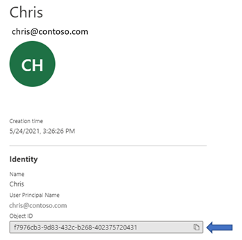

### Identify the GUIDs of groups to insert in the JSONs

1. Sign in to the [Microsoft Entra admin center](https://entra.microsoft.com) as at least an [Authentication Policy Administrator](../roles/permissions-reference.md#authentication-policy-administrator).
1. In the **Manage** blade, tap **Groups**.
1. In the **Groups** page, identify the specific group you want to target.
1. Tap the group and get the **Object ID**.

   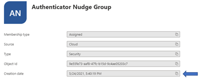

<!---comment out PS until ready>

### PowerShell

1. Install the module.
1. Ensure you pass the right roles:
   
   ```powershell
   Connect-MgGraph -Scopes "User.Read.All","Group.ReadWrite.All"
   ```

1. Select the beta profile.
1. Call `Update-MgPolicyAuthenticationMethod`.

<---->

## Limitations

The nudge won't appear on mobile devices that run Android or iOS.

## Frequently asked questions

**Is registration campaign available for MFA Server?** 

No. This feature is available only for users using Microsoft Entra multifactor authentication. 

**Can users be nudged within an application?** 

Nudge is available only on browsers and not on applications.

**Can users be nudged on a mobile device?** 

Nudge is not available on mobile devices.

**How long does the campaign run for?** 

You can enable the campaign for as long as you like. Whenever you want to be done running the campaign, use the admin center or APIs to disable the campaign.  

**Can each group of users have a different snooze duration?** 

No. The snooze duration for the prompt is a tenant-wide setting and applies to all groups in scope. 

**Can users be nudged to set up passwordless phone sign-in?** 

The feature aims to empower admins to get users set up with MFA using the Authenticator app and not passwordless phone sign-in.  

**Will a user who signs in with a 3rd party authenticator app see the nudge?** 

Yes. If a user is enabled for the registration campaign and doesn't have Microsoft Authenticator set up for push notifications, the user is nudged to set up Authenticator. 

**Will a user who has Authenticator set up only for TOTP codes see the nudge?**

Yes. If a user is enabled for the registration campaign and Authenticator app isn't set up for push notifications, the user is nudged to set up push notification with Authenticator.

**If a user just went through MFA registration, are they nudged in the same sign-in session?** 

No. To provide a good user experience, users won't be nudged to set up the Authenticator in the same session that they registered other authentication methods.  

**Can I nudge my users to register another authentication method?** 

No. The feature, for now, aims to nudge users to set up the Authenticator app only. 

**Is there a way for me to hide the snooze option and force my users to setup the Authenticator app?**  

Set the **Limited number of snoozes** to **Enabled** such that users can postpone the app setup up to three times, after which setup is required.  

**Will I be able to nudge my users if I am not using Microsoft Entra multifactor authentication?** 

No. The nudge only works for users who are doing MFA using the Microsoft Entra multifactor authentication service. 

**Will Guest/B2B users in my tenant be nudged?** 

Yes. If they have been scoped for the nudge using the policy. 

**What if the user closes the browser?** 

It's the same as snoozing. If setup is required for a user after they snoozed three times, the user is prompted the next time they sign in.

**Why don't some users see a nudge when there is a Conditional Access policy for "Register security information"?**

A nudge won't appear if a user is in scope for a Conditional Access policy that blocks access to the **Register security information** page.

**Do users see a nudge when there is a terms of use (ToU) screen presented to the user during sign-in?**

A nudge won't appear if a user is presented with the [terms of use (ToU)](../conditional-access/terms-of-use.md) screen during sign-in.

**Do users see a nudge when Conditional Access custom controls are applicable to the sign-in?**

A nudge won't appear if a user is redirected during sign-in due to [Conditional Access custom controls](../conditional-access/controls.md) settings.

## Next steps

[Enable passwordless sign-in with Microsoft Authenticator](howto-authentication-passwordless-phone.md)
