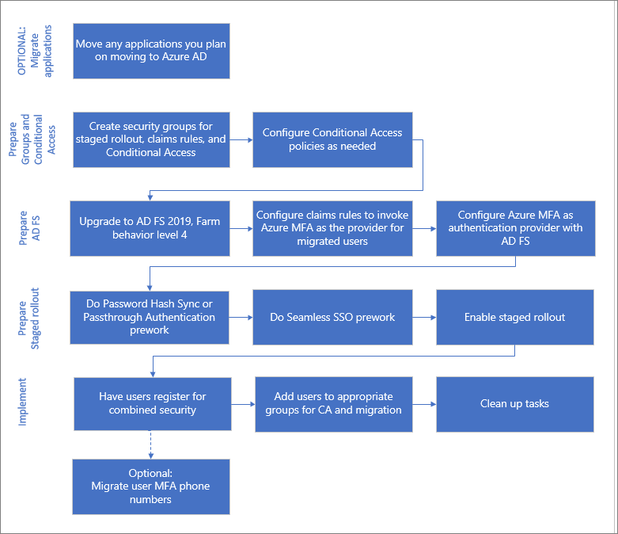
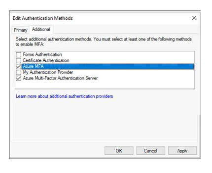
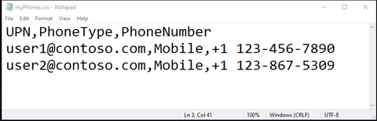

# Migrate to Azure AD MFA and Azure AD user authentication

Multi-factor authentication (MFA) helps secure your infrastructure and assets from bad actors. 
Microsoft’s Multi-Factor Authentication Server (MFA Server) is no longer offered for new deployments. 
Customers who are using MFA Server should move to Azure AD Multi-Factor Authentication (Azure AD MFA). 

There are several options for migrating your multi-factor authentication (MFA) from MFA Server to Azure Active Directory (Azure AD). 
These include:

* Good: Moving only your [MFA service to Azure AD](how-to-migrate-mfa-server-to-azure-mfa.md). 
* Better: Moving your MFA service and user authentication to Azure AD, covered in this article.
* Best: Moving all of your applications, your MFA service, and user authentication to Azure AD. See the move applications to Azure AD section of this article if you plan to move applications, covered in this article. 

To select the appropriate MFA migration option for your organization, see the considerations in [Migrate from MFA Server to Azure Active Directory MFA](how-to-migrate-mfa-server-to-azure-mfa.md). 

The following diagram shows the process for migrating to Azure AD MFA and cloud authentication while keeping some of your applications on AD FS. 
This process enables the iterative migration of users from MFA Server to Azure MFA based on group membership.

Each step is explained in the subsequent sections of this article.

>[!NOTE]
>If you are planning on moving any applications to Azure Active Directory as a part of this migration, you should do so prior to your MFA migration. If you move all of your apps, you can skip sections of the MFA migration process. See the section on moving applications at the end of this article.

## Process to migrate to Azure AD and user authentication



## Prepare groups and Conditional Access

Groups are used in three capacities for MFA migration.
* **To iteratively move users to Azure AD MFA with staged rollout.**
Use a group created in Azure AD, also known as a cloud-only group. You can use Azure AD security groups or Microsoft 365 Groups for both moving users to MFA and for Conditional Access policies.  For more information see creating an Azure AD security group, and  this overview of Microsoft 365 Groups for administrators.
  >[!IMPORTANT]
  >Nested and dynamic groups are not supported in the staged rollout process. Do not use these types of groups for your staged rollout effort.
* **Conditional Access policies**. 
You can use either Azure AD or on-premises groups for conditional access.
* **To invoke Azure AD MFA for AD FS applications with claims rules.**
This applies only if you have applications on AD FS.
This must be an on-premises Active Directory security group. Once Azure AD MFA is an additional authentication method, you can designate groups of users to use that method on each relying party trust. For example, you can call Azure AD MFA for users you have already migrated, and MFA Server for those not yet migrated. This is helpful both in testing, and during migration. 

>[!NOTE] 
>We do not recommend that you reuse groups that are used for security. When using a security group to secure a group of high-value apps via a Conditional Access policy, that should be the only use of that group.

### Configure Conditional Access policies

If you are already using Conditional Access to determine when users are prompted for MFA, you won’t need any changes to your policies. 
As users are migrated to cloud authentication, they will start using Azure AD MFA as defined by your existing Conditional Access policies. 
They won’t be redirected to AD FS and MFA Server anymore.

If your federated domain(s) have SupportsMFA set to false, you are likely enforcing MFA on AD FS using claims rules. 
In this case, you will need to analyze your claims rules on the Azure AD relying party trust and create Conditional Access policies that support the same security goals.

If you need to configure Conditional Access policies, you need to do so before enabling staged rollout. 
For more information, see the following resources:
* [Plan a Conditional Access deployment](../conditional-access/plan-conditional-access.md)
* [Common Conditional Access policies](../conditional-access/concept-conditional-access-policy-common.md)

## Prepare AD FS 

If you do not have any applications in AD FS that require MFA, you can skip this section and go to the section Prepare staged rollout.

### Upgrade AD FS server farm to 2019, FBL 4

In AD FS 2019, Microsoft released new functionality that provides the ability to specify additional authentication methods for a relying party, such as an application. 
This is done by using group membership to determine the authentication provider. 
By specifying an additional authentication method, you can transition to Azure AD MFA while keeping other authentication intact during the transition. 

For more information, see [Upgrading to AD FS in Windows Server 2016 using a WID database](/windows-server/identity/ad-fs/deployment/upgrading-to-ad-fs-in-windows-server). 
The article covers both upgrading your farm to AD FS 2019 and upgrading your FBL to 4.

### Configure claims rules to invoke Azure AD MFA

Now that you have Azure AD MFA as an additional authentication method, you can assign groups of users to use Azure AD MFA. You do this by configuring claims rules, also known as *relying party trusts*. By using groups, you can control which authentication provider is called either globally or by application. For example, you can call Azure AD MFA for users who have registered for combined security information or had their phone numbers migrated, while calling MFA Server for those who have not. 

>[!NOTE]
>Claims rules require on-premises security group. 

#### Back up existing rules 

Before configuring new claims rules, back up your existing rules. 
You will need to restore these as a part of your clean up steps. 

Depending on your configuration, you may also need to copy the existing rule and append the new rules being created for the migration.

To view existing global rules, run:  
```powershell
Get-AdfsAdditionalAuthenticationRule
```

To view existing relying party trusts, run the following command and replace RPTrustName with the name of the relying party trust claims rule: 

```powershell
(Get-AdfsRelyingPartyTrust -Name “RPTrustName”).AdditionalAuthenticationRules
```

#### Access control policies

>[!NOTE]
>Access control policies can’t be configured so that a specific authentication provider is invoked based on group membership. 

To transition from your access control policies to additional authentication rules, run this command for each of your Relying Party Trusts using the MFA Server authentication provider:

```powershell
Set-AdfsRelyingPartyTrust -**TargetName AppA -AccessControlPolicyName $Null**
```

This command will move the logic from your current Access Control Policy into Additional Authentication Rules.

#### Set up the group, and find the SID

You will need to have a specific group in which you place users for whom you want to invoke Azure AD MFA. You will need to find the security identifier (SID) for that group.
To find the group SID use the following command, with your group name
`Get-ADGroup “GroupName”`


#### Setting the claims rules to call Azure MFA

The following PowerShell cmdlets invoke Azure AD MFA for those in the group when they aren’t on the corporate network. 
You must replace "YourGroupSid" with the SID found by running the preceding cmdlet.

Make sure you review the [How to Choose Additional Auth Providers in 2019](/windows-server/identity/ad-fs/overview/whats-new-active-directory-federation-services-windows-server#how-to-choose-additional-auth-providers-in-2019). 

>[!IMPORTANT] 
>Backup your existing claims rules before proceeding.

##### Set global claims rule 

Run the following command and replace RPTrustName with the name of the relying party trust claims rule: 

```powershell
(Get-AdfsRelyingPartyTrust -Name “RPTrustName”).AdditionalAuthenticationRules
```

The command  returns your current additional authentication rules for your relying party trust.  
You need to append the following rules to your current claim rules:

```console
c:[Type == "https://schemas.microsoft.com/ws/2008/06/identity/claims/groupsid", Value == 
"YourGroupSID"] => issue(Type = "https://schemas.microsoft.com/claims/authnmethodsproviders", 
Value = "AzureMfaAuthentication");
not exists([Type == "https://schemas.microsoft.com/ws/2008/06/identity/claims/groupsid", 
Value=="YourGroupSid"]) => issue(Type = 
"https://schemas.microsoft.com/claims/authnmethodsproviders", Value = 
"AzureMfaServerAuthentication");’
```

The following example assumes your current claim rules are configured to prompt for MFA when users connect from outside your network. 
This example includes the additional rules that you need to append.

```PowerShell
Set-AdfsAdditionalAuthenticationRule -AdditionalAuthenticationRules 'c:[type == 
"https://schemas.microsoft.com/ws/2012/01/insidecorporatenetwork", value == "false"] => issue(type = 
"https://schemas.microsoft.com/ws/2008/06/identity/claims/authenticationmethod", value = 
"https://schemas.microsoft.com/claims/multipleauthn" );
 c:[Type == "https://schemas.microsoft.com/ws/2008/06/identity/claims/groupsid", Value == 
“YourGroupSID"] => issue(Type = "https://schemas.microsoft.com/claims/authnmethodsproviders", 
Value = "AzureMfaAuthentication");
not exists([Type == "https://schemas.microsoft.com/ws/2008/06/identity/claims/groupsid", 
Value==“YourGroupSid"]) => issue(Type = 
"https://schemas.microsoft.com/claims/authnmethodsproviders", Value = 
"AzureMfaServerAuthentication");’
```

##### Set per-application claims rule

This example modifies claim rules on a specific relying party trust (application). It includes the additional rules you need to append.

```PowerShell
Set-AdfsRelyingPartyTrust -TargetName AppA -AdditionalAuthenticationRules 'c:[type == 
"https://schemas.microsoft.com/ws/2012/01/insidecorporatenetwork", value == "false"] => issue(type = 
"https://schemas.microsoft.com/ws/2008/06/identity/claims/authenticationmethod", value = 
"https://schemas.microsoft.com/claims/multipleauthn" );
c:[Type == "https://schemas.microsoft.com/ws/2008/06/identity/claims/groupsid", Value == 
“YourGroupSID"] => issue(Type = "https://schemas.microsoft.com/claims/authnmethodsproviders", 
Value = "AzureMfaAuthentication");
not exists([Type == "https://schemas.microsoft.com/ws/2008/06/identity/claims/groupsid", 
Value==“YourGroupSid"]) => issue(Type = 
"https://schemas.microsoft.com/claims/authnmethodsproviders", Value = 
"AzureMfaServerAuthentication");’
```

### Configure Azure AD MFA as an authentication provider in AD FS

In order to configure Azure AD MFA for AD FS, you must configure each AD FS server. 
If you have multiple AD FS servers in your farm, you can configure them remotely using Azure AD PowerShell.

For step-by-step directions on this process, see [Configure the AD FS servers](/windows-server/identity/ad-fs/operations/configure-ad-fs-and-azure-mfa#configure-the-ad-fs-servers).

Once you have configured the servers, you can add Azure AD MFA as an additional authentication method. 




## Prepare staged rollout 

Now you are ready to enable the staged rollout feature. Staged rollout helps you to iteratively move your users to either PHS or PTA. 

* Be sure to review the [supported scenarios](../hybrid/how-to-connect-staged-rollout.md#supported-scenarios). 
* First you will need to do either the [prework for PHS](../hybrid/how-to-connect-staged-rollout.md#pre-work-for-password-hash-sync) or the [prework for PTA](../hybrid/how-to-connect-staged-rollout.md#pre-work-for-pass-through-authentication). We  recommend PHS. 
* Next you will do the [prework for seamless SSO](../hybrid/how-to-connect-staged-rollout.md#pre-work-for-seamless-sso). 
* [Enable the staged rollout of cloud authentication](../hybrid/how-to-connect-staged-rollout.md#enable-a-staged-rollout-of-a-specific-feature-on-your-tenant) for your selected authentication method. 
* Add the group(s) you created for staged rollout. Remember that you will add users to groups iteratively, and that they cannot be dynamic groups or nested groups. 

## Register users for Azure MFA

There are two ways to register users for Azure MFA: 

* Register for combined security (MFA and self-service-password reset) 
* Migrate phone numbers from MFA Server

The Microsoft Authenticator app can be used as a passwordless sign in method as well as a second factor for MFA with either method.

### Register for combined security registration (recommended)

We recommend having your users register for combined security information, which is a single place to register their authentication methods and devices for both MFA and SSPR. 
While it is possible to migrate data from the MFA Server to Azure AD MFA, the following challenges occur:

* Only phone numbers can be migrated.
* Authenticator apps will need to be reregistered.
* Stale data can be migrated.

Microsoft provides communication templates that you can provide to your users to guide them through the combined registration process. 
These include templates for email, posters, table tents, and a variety of other assets. Users register their information at `https://aka.ms/mysecurityinfo`, which takes them to the combined security registration screen. 

We recommend that you [secure the security registration process with Conditional Access](../conditional-access/howto-conditional-access-policy-registration.md) that requires the registration to occur from a trusted device or location. For information on tracking registration statuses, see [Authentication method activity for Azure Active Directory](howto-authentication-methods-activity.md).
> [!NOTE]
> Users who MUST register their combined security information from a non-trusted location or device can be issued a Temporary Access Pass or alternatively, temporarily excluded from the policy.

### Migrate phone numbers from MFA Server

While you can migrate users’ registered MFA phone numbers and hardware tokens, you cannot migrate device registrations such as their Microsoft Authenticator app settings. 
Migrating phone numbers can lead to stale numbers being migrated, and make users more likely to stay on phone-based MFA instead of setting up more secure methods like [passwordless sign-in with the Microsoft Authenticator app](howto-authentication-passwordless-phone.md). 
We therefore recommend that regardless of the migration path you choose, that you have all users register for [combined security information](howto-registration-mfa-sspr-combined.md). 
Combined security information enables users to also register for self-service password reset.

If having users register their combined security information is not an option, it is possible to export the users along with their phone numbers from MFA Server and import the phone numbers into Azure AD. 

#### Export user phone numbers from MFA Server 

1. Open the Multi-Factor Authentication Server admin console on the MFA Server. 
1. Select **File** > **Export Users**.
3)	Save the CSV file. The default name is Multi-Factor Authentication Users.csv.

#### Interpret and format the .csv file

The .csv file contains a number of fields not necessary for migration and will need to be edited and formatted prior to importing the phone numbers into Azure AD. 

When opening the .csv file, columns of interest include Username, Primary Phone, Primary Country Code, Backup Country Code, Backup Phone, Backup Extension. You must interpret this data and format it, as necessary.

#### Tips to avoid errors during import

* The CSV file will need to be modified prior to using the Authentication Methods API to import the phone numbers into Azure AD. 
* We recommend simplifying the .csv to three columns: UPN, PhoneType, and PhoneNumber. 

  

* Make sure the exported MFA Server Username matches the Azure AD UserPrincipalName. If it does not, update the username in the CSV file to match what is in Azure AD, otherwise the user will not be found.

Users may have already registered phone numbers in Azure AD. 
When importing the phone numbers using the Authentication Methods API, you must decide whether to overwrite the existing phone number or to add the imported number as an alternate phone number.

The following PowerShell cmdlets takes the CSV file you supply and add the exported phone numbers as a phone number for each UPN using the Authentication Methods API. You must replace "myPhones" with the name of your CSV file.


```powershell
$csv = import-csv myPhones.csv
$csv|% { New-MgUserAuthenticationPhoneMethod -UserId $_.UPN -phoneType $_.PhoneType -phoneNumber $_.PhoneNumber} 
```

For more information about managing users’ authentication methods, see [Manage authentication methods for Azure AD Multi-Factor Authentication](howto-mfa-userdevicesettings.md).

### Add users to the appropriate groups 

* If you created new conditional access policies, add the appropriate users to those groups. 
* If you created on-premises security groups for claims rules, add the appropriate users to those groups. 
* Only after you have added users to the appropriate conditional access rules, add users to the group that you created for staged rollout. Once done, they will begin to use the Azure authentication method that you selected (PHS or PTA) and Azure AD MFA when they are required to perform multi-factor authentication.

> [!IMPORTANT] 
> Nested and dynamic groups are not supported in the staged rollout process. Do not use these types of groups. 

We do not recommend that you reuse groups that are used for security. Therefore, if you are using a security group to secure a group of high-value apps via a Conditional Access policy, that should be the only use of that group.

## Monitoring

A number of [Azure Monitor workbooks](../reports-monitoring/howto-use-azure-monitor-workbooks.md) and usage & insights reports are available to monitor your deployment. 
These can be found in Azure AD in the navigation pane under **Monitoring**. 

### Monitoring staged rollout

In the [workbooks](https://portal.azure.com/#blade/Microsoft_AAD_IAM/ActiveDirectoryMenuBlade/Workbooks) section, select **Public Templates**. Under **Hybrid Auth** section select the **Groups, Users and Sign-ins in Staged Rollout** workbook.

This workbook can be used to monitor the following: 
* Users and groups added to Staged Rollout.
* Users and groups removed from Staged Rollout.
* Sign-in failures for users in staged rollout, and the reasons for failures.

### Monitoring Azure MFA registration
Azure MFA registration can be monitored using the [Authentication methods usage & insights report](https://portal.azure.com/#blade/Microsoft_AAD_IAM/AuthenticationMethodsMenuBlade/AuthMethodsActivity/menuId/AuthMethodsActivity). This report can be found in Azure AD. Select **Monitoring**, then select **Usage & insights**. 


In Usage & insights, select **Authentication methods**. 

Detailed Azure MFA registration information can be found on the Registration tab. You can drill down to view a list of registered users by selecting the **Users registered for Azure multi-factor authentication** hyperlink.


### Monitoring app sign-in health

Monitor applications you have moved to Azure AD with the App sign-in health workbook or the application activity usage report.

* **App sign-in health workbook**. See [Monitoring application sign-in health for resilience](../fundamentals/monitor-sign-in-health-for-resilience.md) for detailed guidance on using this workbook.
* **Azure AD application activity usage report**. This [report](https://portal.azure.com/#blade/Microsoft_AAD_IAM/UsageAndInsightsMenuBlade/Azure%20AD%20application%20activity) can be used to view the successful and failed sign-ins for individual applications as well as the ability to drill down and view sign-in activity for a specific application. 

## Clean up tasks

Once you have moved all your users to Azure AD cloud authentication and Azure MFA, you should be ready to decommission your MFA Server. 
We recommend reviewing MFA Server logs to ensure no users or applications are using it before you remove the server.

### Convert your domains to managed authentication

You should now [convert your federated domains in Azure AD to managed](../hybrid/migrate-from-federation-to-cloud-authentication.md#convert-domains-from-federated-to-managed) and remove the staged rollout configuration. 
This ensures new users use cloud authentication without being added to the migration groups.

### Revert claims rules on AD FS and remove MFA Server authentication provider

Follow the steps under [Configure claims rules to invoke Azure AD MFA](#configure-claims-rules-to-invoke-azure-ad-mfa) to revert back to the backed up claims rules and remove any AzureMFAServerAuthentication claims rules. 

For example, remove the following from the rule(s): 

```console
c:[Type == "https://schemas.microsoft.com/ws/2008/06/identity/claims/groupsid", Value ==
“**YourGroupSID**"] => issue(Type = "https://schemas.microsoft.com/claims/authnmethodsproviders",
Value = "AzureMfaAuthentication");
not exists([Type == "https://schemas.microsoft.com/ws/2008/06/identity/claims/groupsid",
Value=="YourGroupSid"]) => issue(Type =
"https://schemas.microsoft.com/claims/authnmethodsproviders", Value =
"AzureMfaServerAuthentication");’
```


### Disable MFA Server as an authentication provider in AD FS

This change ensures only Azure MFA is used as an authentication provider.

1. Open the **AD FS management console**.
1. Under **Services**, right-click on **Authentication Methods**, and select **Edit Multi-factor Authentication Methods**. 
1. Clear the **Azure Multi-Factor Authentication Server**  checkbox. 

### Decommission the MFA Server

Follow your enterprise server decommissioning process to remove the MFA Servers in your environment.

Possible considerations when decommissions the MFA Server include: 

* We recommend reviewing MFA Server logs to ensure no users or applications are using it before you remove the server.
* Uninstall Multi-Factor Authentication Server from the Control Panel on the server.
* Optionally clean up logs and data directories that are left behind after backing them up first. 
* Uninstall the Multi-Factor Authentication Web Server SDK, if applicable including any files left over inetpub\wwwroot\MultiFactorAuthWebServiceSdk and/or MultiFactorAuth directories.
* For pre-8.0.x versions of MFA Server, it may also be necessary to remove the Multi-Factor Auth Phone App Web Service.

## Move application authentication to Azure Active Directory

If you migrate all your application authentication along with your MFA and user authentication, you will be able to remove significant portions of your on-premises infrastructure, reducing costs and risks. 
If you move all application authentication, you can skip the [Prepare AD FS](#prepare-ad-fs) stage and simplify your MFA migration.

The process for moving all application authentication is shown in the following diagram.


If it is not possible to move all your applications prior to the migration, move applications that you can before starting.
For more information on migrating applications to Azure, see [Resources for migrating applications to Azure Active Directory](../manage-apps/migration-resources.md).

## Next steps

- [Migrate from Microsoft MFA Server to Azure multi-factor authentication (Overview)](how-to-migrate-mfa-server-to-azure-mfa.md)
- [Migrate applications from Windows Active Directory to Azure Active Directory](../manage-apps/migrate-application-authentication-to-azure-active-directory.md)
- [Plan your cloud authentication strategy](../fundamentals/active-directory-deployment-plans.md)