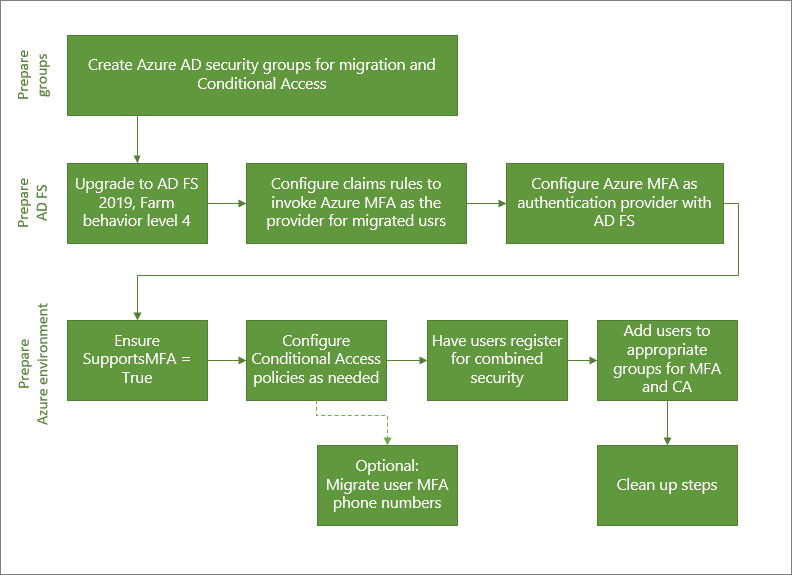

# Migrate to Azure AD MFA with federation

Moving your multi-factor-authentication (MFA) solution to Azure Active Directory (Azure AD) is a great first step in your journey to the cloud. Consider also moving to Azure AD for user authentication in the future. For more information, see the process for migrating to Azure AD MFA with cloud authentication.

To migrate to Azure AD MFA with federation, the Azure MFA authentication provider is installed on AD FS. The Azure AD relying party trust and other relying party trusts are configured to use Azure MFA for migrated users.

The following diagram shows the process of this migration.



## Create migration groups

To create new conditional access policies, you'll need to assign those policies to groups. You can use existing Azure AD security groups or Microsoft 365 Groups for this purpose. You can also create or sync new ones.

You'll also need an Azure AD security group for iteratively migrating users to Azure AD MFA. These groups are used in your claims rules.

Don’t reuse groups that are used for security. If you are using a security group to secure a group of high-value apps via a Conditional Access policy, that should be the only use of that group.

## Prepare AD FS

### Upgrade AD FS server farm to 2019, FBL 4

In AD FS 2019, you can specify additional authentication methods for a relying party, such as an application. You use group membership to determine authentication provider. By specifying an additional authentication method, you can transition to Azure AD MFA while keeping other authentication intact during the transition. For more information, see [Upgrading to AD FS in Windows Server 2016 using a WID database](/windows-server/identity/ad-fs/deployment/upgrading-to-ad-fs-in-windows-server). The article covers both upgrading your farm to AD FS 2019 and upgrading your FBL to 4.

### Configure claims rules to invoke Azure AD MFA

Now that Azure AD MFA is an additional authentication method, you can assign groups of users to use it. You do so by configuring claims rules, also known as relying party trusts. By using groups, you can control which authentication provider is called globally or by application. For example, you can call Azure AD MFA for users who have registered for combined security information or had their phone numbers migrated, while calling MFA Server for those who haven't.

> [!NOTE]
> Claims rules require on-premises security group. Before making changes to claims rules, back them up.


#### Back up existing rules

Before configuring new claims rules, back up your existing rules. You'll need to restore these rules as a part of your cleanup steps. 

Depending on your configuration, you may also need to copy the existing rule and append the new rules being created for the migration.  

To view existing global rules, run:  

```powershell
Get-AdfsAdditionalAuthenticationRule
```

To view existing relying party trusts, run the following command and replace RPTrustName with the name of the relying party trust claims rule: 

```powershell
(Get-AdfsRelyingPartyTrust -Name “RPTrustName”).AdditionalAuthenticationRules 
```

#### Access control policies

> [!NOTE]
> Access control policies can’t be configured so that a specific authentication provider is invoked based on group membership. 

 
To transition from access control policies to additional authentication rules, run the following command for each of your Relying Party Trusts using the MFA Server authentication provider:


```powershell
Set-AdfsRelyingPartyTrust -TargetName AppA -AccessControlPolicyName $Null
```

 

This command will move the logic from your current Access Control Policy into Additional Authentication Rules.


#### Set up the group, and find the SID

You'll need to have a specific group in which you place users for whom you want to invoke Azure AD MFA. You will need the security identifier (SID) for that group.

To find the group SID, use the following command, with your group name

`Get-ADGroup “GroupName”`


#### Setting the claims rules to call Azure MFA

The following PowerShell cmdlets invoke Azure AD MFA for users in the group when not on the corporate network. Replace "YourGroupSid” with the SID found by running the above cmdlet.

Make sure you review the [How to Choose Additional Auth Providers in 2019](/windows-server/identity/ad-fs/overview/whats-new-active-directory-federation-services-windows-server). 

 > [!IMPORTANT]
> Backup your existing claims rules

 

#### Set global claims rule 

Run the following PowerShell cmdlet: 

```powershell
(Get-AdfsRelyingPartyTrust -Name “RPTrustName”).AdditionalAuthenticationRules
```

 

The command returns your current additional authentication rules for your relying party trust. Append the following rules to your current claim rules:

```console
c:[Type == "https://schemas.microsoft.com/ws/2008/06/identity/claims/groupsid", Value == 
"YourGroupSID"] => issue(Type = "https://schemas.microsoft.com/claims/authnmethodsproviders", 
Value = "AzureMfaAuthentication");
not exists([Type == "https://schemas.microsoft.com/ws/2008/06/identity/claims/groupsid", 
Value=="YourGroupSid"]) => issue(Type = 
"https://schemas.microsoft.com/claims/authnmethodsproviders", Value = 
"AzureMfaServerAuthentication");’
```

The following example assumes your current claim rules are configured to prompt for MFA when users connect from outside your network. This example includes the additional rules that you need to append.

```PowerShell
Set-AdfsAdditionalAuthenticationRule -AdditionalAuthenticationRules 'c:[type == 
"https://schemas.microsoft.com/ws/2012/01/insidecorporatenetwork", value == "false"] => issue(type = 
"https://schemas.microsoft.com/ws/2008/06/identity/claims/authenticationmethod", value = 
"https://schemas.microsoft.com/claims/multipleauthn" );
 c:[Type == "https://schemas.microsoft.com/ws/2008/06/identity/claims/groupsid", Value == 
“YourGroupSID"] => issue(Type = "https://schemas.microsoft.com/claims/authnmethodsproviders", 
Value = "AzureMfaAuthentication");
not exists([Type == "https://schemas.microsoft.com/ws/2008/06/identity/claims/groupsid", 
Value==“YourGroupSid"]) => issue(Type = 
"https://schemas.microsoft.com/claims/authnmethodsproviders", Value = 
"AzureMfaServerAuthentication");’
```


#### Set per-application claims rule

This example modifies claim rules on a specific relying party trust (application), and includes the information you must append.

```PowerShell
Set-AdfsRelyingPartyTrust -TargetName AppA -AdditionalAuthenticationRules 'c:[type == 
"https://schemas.microsoft.com/ws/2012/01/insidecorporatenetwork", value == "false"] => issue(type = 
"https://schemas.microsoft.com/ws/2008/06/identity/claims/authenticationmethod", value = 
"https://schemas.microsoft.com/claims/multipleauthn" );
c:[Type == "https://schemas.microsoft.com/ws/2008/06/identity/claims/groupsid", Value == 
“YourGroupSID"] => issue(Type = "https://schemas.microsoft.com/claims/authnmethodsproviders", 
Value = "AzureMfaAuthentication");
not exists([Type == "https://schemas.microsoft.com/ws/2008/06/identity/claims/groupsid", 
Value==“YourGroupSid"]) => issue(Type = 
"https://schemas.microsoft.com/claims/authnmethodsproviders", Value = 
"AzureMfaServerAuthentication");’
```


### Configure Azure AD MFA as an authentication provider in AD FS

To configure Azure AD MFA for AD FS, you must configure each AD FS server. If you have multiple AD FS servers in your farm, you can configure them remotely using Azure AD PowerShell.

For step-by-step directions on this process, see [Configure the AD FS servers](/windows-server/identity/ad-fs/operations/configure-ad-fs-and-azure-mfa) in the article [Configure Azure AD MFA as authentication provider with AD FS](/windows-server/identity/ad-fs/operations/configure-ad-fs-and-azure-mfa).

Once you've configured the servers, you can add Azure AD MFA as an additional authentication method. 


## Prepare Azure AD and implement

### Ensure SupportsMFA is set to True

For federated domains, MFA may be enforced by Azure AD Conditional Access or by the on-premises federation provider. Each federated domain in Azure AD has a SupportsMFA flag. When the SupportsMFA flag is set to True, Azure AD redirects users to MFA on AD FS or another federation providers. For example, if a user is accessing an application for which a Conditional Access policy that requires MFA has been configured, the user will be redirected to AD FS. Adding Azure AD MFA as an authentication method in AD FS, enables Azure AD MFA to be invoked once your configurations are complete.

If the SupportsMFA flag is set to False, you're likely not using Azure MFA; you're probably using claims rules on AD FS relying parties to invoke MFA.

You can check the status of your SupportsMFA flag with the following [Windows PowerShell cmdlet](/powershell/module/msonline/get-msoldomainfederationsettings?view=azureadps-1.0):

```powershell
Get-MsolDomainFederationSettings –DomainName yourdomain.com
```

If the SupportsMFA flag is set to false or is blank for your federated domain, set it to true using the following Windows PowerShell cmdlet:

```powershell
Set-MsolDomainFederationSettings -DomainName contoso.com -SupportsMFA $true
```

This configuration allows the decision to use MFA Server or Azure MFA to be made on AD FS.

### Configure Conditional Access policies if needed

If you use Conditional Access to determine when users are prompted for MFA, you shouldn't need to change your policies.

If your federated domain(s) have SupportsMFA set to false, analyze your claims rules on the Azure AD relying party trust and create Conditional Access policies that support the same security goals.

After creating conditional access policies to enforce the same controls as AD FS, you can back up and remove your claim rules customizations on the Azure AD Relying Party.

For more information, see the following resources:

* [Plan a Conditional Access deployment](../conditional-access/plan-conditional-access.md)

* [Common Conditional Access policies](../conditional-access/concept-conditional-access-policy-common.md)


## Register users for Azure MFA

There are two ways to register users for Azure MFA: 

* Register for combined security (MFA and self-service-password reset) 

* Migrate phone numbers from MFA Server

The Microsoft Authenticator app can be used as in passwordless mode. It can also be used as a second factor for MFA with either registration method.

### Register for combined security registration (recommended)

Have users register for combined security information, which is a single place to register their authentication methods and devices for both MFA and SSPR. While it is possible to migrate data from the MFA Server to Azure AD MFA, it presents the following challenges:

* Only phone numbers can be migrated.

* Authenticator apps will need to be reregistered.

* Stale data can be migrated.

Microsoft provides communication templates that you can provide to your users to guide them through the combined registration process. These include templates for email, posters, table tents, and other assets. Users register their information at [https://aka.ms/mysecurityinfo](https://aka.ms/mysecurityinfo), which takes them to the combined security registration screen. 

We recommend that you [secure the security registration process with Conditional Access](../conditional-access/howto-conditional-access-policy-registration.md) that requires the registration to occur from a trusted device or location.

> [!NOTE]
> Users who MUST register their combined security information from a non-trusted location or device, the user can be issued a Temporary Access Pass or temporarily excluded from the policy.

### Migrate phone numbers from MFA Server

Migrating phone numbers can lead to stale numbers being migrated, and make users more likely to stay on phone-based MFA instead of setting up more secure methods like [passwordless sign-in with the Microsoft Authenticator](howto-authentication-passwordless-phone.md) app. You can't migrate device registrations such as their Microsoft Authenticator app settings. We recommend that you have all users register for [combined security information](howto-registration-mfa-sspr-combined.md). Combined security information also registers users for self-service password reset.

If having users register their combined security information is absolutely not an option, it's possible to export the users and their phone numbers from MFA Server and import the phone numbers into Azure AD.
 

#### Export user phone numbers from MFA Server 

1. Open the Multi-Factor Authentication Server admin console on the MFA Server. 

1. Select **File**, then **Export Users**.

1. **Save** the CSV file. The default name is Multi-Factor Authentication Users.csv

#### Interpret and format the .csv  file

The .csv file contains many fields not necessary for migration. Edit and format it before importing the phone numbers into Azure AD. 

When opening the .csv file, columns of interest include:

* Username
* Primary Phone
* Primary Country Code
* Backup Country Code
* Backup Phone
* Backup Extension

You'll need to interpret, clean, and format the data.

#### Tips to avoid errors during import

* Modify the CSV file before using the Authentication Methods API to import the phone numbers into Azure AD. 

* Simplify the .csv to three columns: UPN, PhoneType, and PhoneNumber. 

* Make sure the exported MFA Server Username matches the Azure AD UserPrincipalName. If it doesn't, update the username in the CSV file to match what is in Azure AD, otherwise the user won't be found.

Users may have already registered phone numbers in Azure AD. When you import the phone numbers using the Authentication Methods API, you must decide whether to overwrite the existing phone number or to add the imported number as an alternate phone number.

The following PowerShell cmdlets takes the CSV file you supply and adds the exported phone numbers as a phone number for each UPN using the Authentication Methods API. Replace "myPhones” with the name of your CSV file.

```powershell

$csv = import-csv myPhones.csv

$csv|% { New-MgUserAuthenticationPhoneMethod -UserId $_.UPN -phoneType $_.PhoneType -phoneNumber $_.PhoneNumber} 

```

### Add users to the appropriate groups

* If you created new conditional access policies, add the appropriate users to those groups. 

* If you created on-premises security groups for claims rules, add the appropriate users to those groups.

We don't recommend that you reuse groups that are used for security. Therefore, if you are using a security group to secure a group of high-value apps via a Conditional Access policy, that should be the only use of that group.

## Monitoring

Azure MFA registration can be monitored using the [Authentication methods usage & insights report](https://portal.azure.com/). This report can be found in Azure AD. Select **Monitoring**, then select **Usage & insights**. 

In Usage & insights, select **Authentication methods**. 

Detailed Azure MFA registration information can be found on the Registration tab. You can drill down to view a list of registered users by selecting the **Users capable of Azure multi-factor authentication** hyperlink.


   

## Clean up steps

Once you have completed migration to Azure MFA and are ready to decommission the MFA Server, do the following three things: 

1. Revert your claim rules on AD FS to their pre-migration configuration and remove the MFA Server authentication provider.

1. Remove MFA server as an authentication provider in AD FS. This will ensure all users use Azure MFA as it will be the only additional authentication method enabled. 

1. Decommission the MFA Server.

### Revert claims rules on AD FS and remove MFA Server authentication provider

Follow the steps under Configure claims rules to invoke Azure AD MFA to revert back to the backed up claims rules and remove any AzureMFAServerAuthentication claims rules. 

For example, remove the following from the rule(s): 

 
```console
c:[Type == "https://schemas.microsoft.com/ws/2008/06/identity/claims/groupsid", Value ==
“**YourGroupSID**"] => issue(Type = "https://schemas.microsoft.com/claims/authnmethodsproviders",
Value = "AzureMfaAuthentication");
not exists([Type == "https://schemas.microsoft.com/ws/2008/06/identity/claims/groupsid",
Value=="YourGroupSid"]) => issue(Type =
"https://schemas.microsoft.com/claims/authnmethodsproviders", Value =
"AzureMfaServerAuthentication");’
```

### Disable MFA Server as an authentication provider in AD FS

This change ensures only Azure MFA is used as an authentication provider.

1. Open the **AD FS management console**.

1. Under **Services**, right-click on **Authentication Methods**, and select **Edit Multi-factor Authentication Methods**. 

1. Uncheck the box next to **Azure Multi-Factor Authentication Server**. 

### Decommission the MFA Server

Follow your enterprise server decommissioning process to remove the MFA Servers in your environment.

Possible considerations when decommissions the MFA Servers include: 

* Review MFA Servers' logs to ensure no users or applications are using it before you remove the server.

* Uninstall Multi-Factor Authentication Server from the Control Panel on the server

* Optionally clean up logs and data directories that are left behind after backing them up first. 

* Uninstall the Multi-Factor Authentication Web Server SDK if applicable, including any files left over in etpub\wwwroot\MultiFactorAuthWebServiceSdk and or MultiFactorAuth directories

* For MFA Server versions prior to 8.0, it may also be necessary to remove the Multi-Factor Auth Phone App Web Service

## Next Steps

- [Deploy password hash synchronization](../hybrid/whatis-phs.md)
- [Learn more about Conditional Access](../conditional-access/overview.md)
- [Migrate applications to Azure AD](../manage-apps/migrate-application-authentication-to-azure-active-directory.md)

 

 

 
