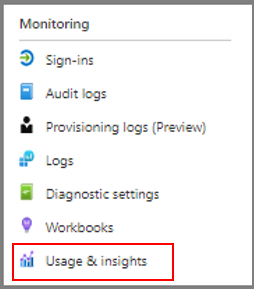
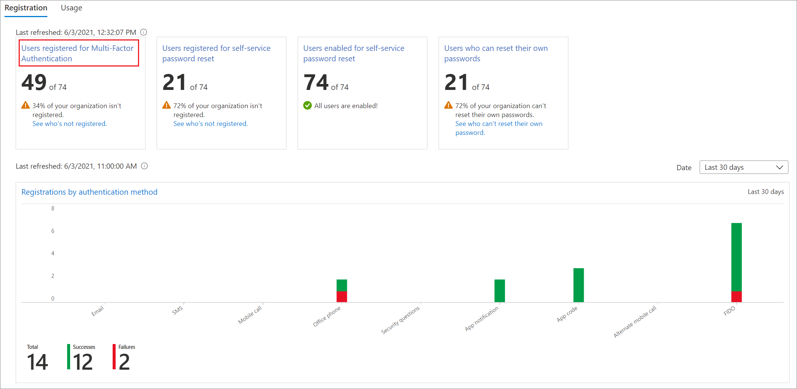

# Migrate to Microsoft Entra multifactor authentication and Microsoft Entra user authentication

Multifactor authentication helps secure your infrastructure and assets from bad actors. Microsoft multifactor authentication Server (MFA Server) is no longer offered for new deployments. Customers who are using MFA Server should move to Microsoft Entra multifactor authentication (Microsoft Entra multifactor authentication). 

There are several options for migrating from MFA Server to Microsoft Entra ID:

* Good: Moving only your [MFA service to Microsoft Entra ID](how-to-migrate-mfa-server-to-azure-mfa.md). 
* Better: Moving your MFA service and user authentication to Microsoft Entra ID, covered in this article.
* Best: Moving all of your applications, your MFA service, and user authentication to Microsoft Entra ID. See the move applications to Microsoft Entra ID section of this article if you plan to move applications, covered in this article. 

To select the appropriate MFA migration option for your organization, see the considerations in [Migrate from MFA Server to Microsoft Entra multifactor authentication](how-to-migrate-mfa-server-to-azure-mfa.md). 

The following diagram shows the process for migrating to Microsoft Entra multifactor authentication and cloud authentication while keeping some of your applications on AD FS. 
This process enables the iterative migration of users from MFA Server to Microsoft Entra multifactor authentication based on group membership.

Each step is explained in the subsequent sections of this article.

>[!NOTE]
>If you're planning on moving any applications to Microsoft Entra ID as a part of this migration, you should do so prior to your MFA migration. If you move all of your apps, you can skip sections of the MFA migration process. See the section on moving applications at the end of this article.

<a name='process-to-migrate-to-azure-ad-and-user-authentication'></a>

## Process to migrate to Microsoft Entra ID and user authentication


## Prepare groups and Conditional Access

Groups are used in three capacities for MFA migration.

* **To iteratively move users to Microsoft Entra multifactor authentication with Staged Rollout.**

  Use a group created in Microsoft Entra ID, also known as a cloud-only group. You can use Microsoft Entra security groups or Microsoft 365 Groups for both moving users to MFA and for Conditional Access policies. 

  >[!IMPORTANT]
  >Nested and dynamic groups aren't supported for Staged Rollout. Don't use these types of groups.

* **Conditional Access policies**. 
  You can use either Microsoft Entra ID or on-premises groups for Conditional Access.

* **To invoke Microsoft Entra multifactor authentication for AD FS applications with claims rules.**
  This step applies only if you use applications with AD FS.
  
  You must use an on-premises Active Directory security group. Once Microsoft Entra multifactor authentication is an additional authentication method, you can designate groups of users to use that method on each relying party trust. For example, you can call Microsoft Entra multifactor authentication for users you already migrated, and MFA Server for users who aren't migrated yet. This strategy is helpful both in testing and during migration. 

>[!NOTE] 
>We don't recommend that you reuse groups that are used for security. Only use the security group to secure a group of high-value apps with a Conditional Access policy.

### Configure Conditional Access policies

If you're already using Conditional Access to determine when users are prompted for MFA, you won't need any changes to your policies. 
As users are migrated to cloud authentication, they'll start using Microsoft Entra multifactor authentication as defined by your Conditional Access policies. 
They won't be redirected to AD FS and MFA Server anymore.

If your federated domains have the **federatedIdpMfaBehavior** set to `enforceMfaByFederatedIdp` or **SupportsMfa** flag set to `$True` (the **federatedIdpMfaBehavior** overrides **SupportsMfa** when both are set), you're likely enforcing MFA on AD FS by using claims rules. 
In this case, you'll need to analyze your claims rules on the Microsoft Entra ID relying party trust and create Conditional Access policies that support the same security goals.

If necessary, configure Conditional Access policies before you enable Staged Rollout. 
For more information, see the following resources:

* [Plan a Conditional Access deployment](../conditional-access/plan-conditional-access.md)
* [Common Conditional Access policies](../conditional-access/concept-conditional-access-policy-common.md)

## Prepare AD FS 

If you don't have any applications in AD FS that require MFA, you can skip this section and go to the section [Prepare Staged Rollout](#prepare-staged-rollout).

### Upgrade AD FS server farm to 2019, FBL 4

In AD FS 2019, Microsoft released new functionality to help specify additional authentication methods for a relying party, such as an application. 
You can specify an additional authentication method by using group membership to determine the authentication provider. 
By specifying an additional authentication method, you can transition to Microsoft Entra multifactor authentication while keeping other authentication intact during the transition. 

For more information, see [Upgrading to AD FS in Windows Server 2016 using a WID database](/windows-server/identity/ad-fs/deployment/upgrading-to-ad-fs-in-windows-server). 
The article covers both upgrading your farm to AD FS 2019 and upgrading your FBL to 4.

<a name='configure-claims-rules-to-invoke-azure-ad-mfa'></a>

### Configure claims rules to invoke Microsoft Entra multifactor authentication

Now that Microsoft Entra multifactor authentication is an additional authentication method, you can assign groups of users to use Microsoft Entra multifactor authentication by configuring claims rules, also known as *relying party trusts*. By using groups, you can control which authentication provider is called either globally or by application. For example, you can call Microsoft Entra multifactor authentication for users who registered for combined security information or had their phone numbers migrated, while calling MFA Server for users whose phone numbers haven't migrated. 

>[!NOTE]
>Claims rules require on-premises security group. 

#### Back up rules 

Before configuring new claims rules, back up your rules. 
You'll need to restore claims rules as a part of your clean-up steps. 

Depending on your configuration, you may also need to copy the existing rule and append the new rules being created for the migration.

To view global rules, run:  

```powershell
Get-AdfsAdditionalAuthenticationRule
```

To view relying party trusts, run the following command and replace RPTrustName with the name of the relying party trust claims rule: 

```powershell
(Get-AdfsRelyingPartyTrust -Name "RPTrustName").AdditionalAuthenticationRules
```

#### Access control policies

>[!NOTE]
>Access control policies can't be configured so that a specific authentication provider is invoked based on group membership. 

To transition from your access control policies to additional authentication rules, run this command for each of your Relying Party Trusts using the MFA Server authentication provider:

```powershell
Set-AdfsRelyingPartyTrust -**TargetName AppA -AccessControlPolicyName $Null**
```

This command will move the logic from your current Access Control Policy into Additional Authentication Rules.

#### Set up the group, and find the SID

You'll need to have a specific group in which you place users for whom you want to invoke Microsoft Entra multifactor authentication. You'll need to find the security identifier (SID) for that group.
To find the group SID, run the following command and replace `GroupName` with your group name:

```powershell
Get-ADGroup GroupName
```


<a name='setting-the-claims-rules-to-call-azure-ad-mfa'></a>

#### Setting the claims rules to call Microsoft Entra multifactor authentication

The following Microsoft Graph PowerShell cmdlets invoke Microsoft Entra multifactor authentication for users in the group when they aren't on the corporate network. 
Replace `"YourGroupSid"` with the SID found by running the preceding cmdlet.

Make sure you review the [How to Choose Additional Auth Providers in 2019](/windows-server/identity/ad-fs/overview/whats-new-active-directory-federation-services-windows-server#how-to-choose-additional-auth-providers-in-2019). 

>[!IMPORTANT] 
>Back up your claims rules before proceeding.

##### Set global claims rule 

Run the following command and replace RPTrustName with the name of the relying party trust claims rule: 

```powershell
(Get-AdfsRelyingPartyTrust -Name "RPTrustName").AdditionalAuthenticationRules
```

The command  returns your current additional authentication rules for your relying party trust.  
You need to append the following rules to your current claim rules:

```console
c:[Type == "https://schemas.microsoft.com/ws/2008/06/identity/claims/groupsid", Value == 
"YourGroupSID"] => issue(Type = "https://schemas.microsoft.com/claims/authnmethodsproviders", 
Value = "AzureMfaAuthentication");
not exists([Type == "https://schemas.microsoft.com/ws/2008/06/identity/claims/groupsid", 
Value=="YourGroupSid"]) => issue(Type = 
"https://schemas.microsoft.com/claims/authnmethodsproviders", Value = 
"AzureMfaServerAuthentication");'
```

The following example assumes your current claim rules are configured to prompt for MFA when users connect from outside your network. 
This example includes the additional rules that you need to append.

```PowerShell
Set-AdfsAdditionalAuthenticationRule -AdditionalAuthenticationRules 'c:[type == 
"https://schemas.microsoft.com/ws/2012/01/insidecorporatenetwork", value == "false"] => issue(type = 
"https://schemas.microsoft.com/ws/2008/06/identity/claims/authenticationmethod", value = 
"https://schemas.microsoft.com/claims/multipleauthn" );
 c:[Type == "https://schemas.microsoft.com/ws/2008/06/identity/claims/groupsid", Value == 
"YourGroupSID"] => issue(Type = "https://schemas.microsoft.com/claims/authnmethodsproviders", 
Value = "AzureMfaAuthentication");
not exists([Type == "https://schemas.microsoft.com/ws/2008/06/identity/claims/groupsid", 
Value=="YourGroupSid"]) => issue(Type = 
"https://schemas.microsoft.com/claims/authnmethodsproviders", Value = 
"AzureMfaServerAuthentication");'
```

##### Set per-application claims rule

This example modifies claim rules on a specific relying party trust (application). It includes the additional rules you need to append.

```PowerShell
Set-AdfsRelyingPartyTrust -TargetName AppA -AdditionalAuthenticationRules 'c:[type == 
"https://schemas.microsoft.com/ws/2012/01/insidecorporatenetwork", value == "false"] => issue(type = 
"https://schemas.microsoft.com/ws/2008/06/identity/claims/authenticationmethod", value = 
"https://schemas.microsoft.com/claims/multipleauthn" );
c:[Type == "https://schemas.microsoft.com/ws/2008/06/identity/claims/groupsid", Value == 
"YourGroupSID"] => issue(Type = "https://schemas.microsoft.com/claims/authnmethodsproviders", 
Value = "AzureMfaAuthentication");
not exists([Type == "https://schemas.microsoft.com/ws/2008/06/identity/claims/groupsid", 
Value=="YourGroupSid"]) => issue(Type = 
"https://schemas.microsoft.com/claims/authnmethodsproviders", Value = 
"AzureMfaServerAuthentication");'
```

<a name='configure-azure-ad-mfa-as-an-authentication-provider-in-ad-fs'></a>

### Configure Microsoft Entra multifactor authentication as an authentication provider in AD FS

In order to configure Microsoft Entra multifactor authentication for AD FS, you must configure each AD FS server. If multiple AD FS servers are in your farm, you can configure them remotely using Microsoft Graph PowerShell.

For step-by-step directions on this process, see [Configure the AD FS servers](/windows-server/identity/ad-fs/operations/configure-ad-fs-and-azure-mfa#configure-the-ad-fs-servers).

After you configure the servers, you can add Microsoft Entra multifactor authentication as an additional authentication method. 


## Prepare Staged Rollout 

Now you're ready to enable [Staged Rollout](../hybrid/connect/how-to-connect-staged-rollout.md). Staged Rollout helps you to iteratively move your users to either PHS or PTA while also migrating their on-premises MFA settings.

* Be sure to review the [supported scenarios](../hybrid/connect/how-to-connect-staged-rollout.md#supported-scenarios). 
* First, you'll need to do either the [prework for PHS](../hybrid/connect/how-to-connect-staged-rollout.md#prework-for-password-hash-sync) or the [prework for PTA](../hybrid/connect/how-to-connect-staged-rollout.md#prework-for-pass-through-authentication). We  recommend PHS. 
* Next, you'll do the [prework for seamless SSO](../hybrid/connect/how-to-connect-staged-rollout.md#prework-for-seamless-sso). 
* [Enable the Staged Rollout of cloud authentication](../hybrid/connect/how-to-connect-staged-rollout.md#enable-a-staged-rollout-of-a-specific-feature-on-your-tenant) for your selected authentication method. 
* Add the group(s) you created for Staged Rollout. Remember that you'll add users to groups iteratively, and that they can't be dynamic groups or nested groups. 

<a name='register-users-for-azure-ad-mfa'></a>

## Register users for Microsoft Entra multifactor authentication

This section covers how users can register for combined security (MFA and self-service-password reset) and how to migrate their MFA settings. Microsoft Authenticator can be used as in passwordless mode. It can also be used as a second factor for MFA with either registration method.

### Register for combined security registration (recommended)

We recommend having your users register for combined security information, which is a single place to register their authentication methods and devices for both MFA and SSPR. 

Microsoft provides communication templates that you can provide to your users to guide them through the combined registration process. 
These include templates for email, posters, table tents, and various other assets. Users register their information at `https://aka.ms/mysecurityinfo`, which takes them to the combined security registration screen. 

We recommend that you [secure the security registration process with Conditional Access](../conditional-access/howto-conditional-access-policy-registration.md) that requires the registration to occur from a trusted device or location. For information on tracking registration statuses, see [Authentication method activity for Microsoft Entra ID](howto-authentication-methods-activity.md).
> [!NOTE]
> Users who MUST register their combined security information from a non-trusted location or device can be issued a Temporary Access Pass or alternatively, temporarily excluded from the policy.

### Migrate MFA settings from MFA Server

You can use the [MFA Server Migration utility](how-to-mfa-server-migration-utility.md) to synchronize registered MFA settings for users from MFA Server to Microsoft Entra ID. 
You can synchronize phone numbers, hardware tokens, and device registrations such as Microsoft Authenticator app settings. 

### Add users to the appropriate groups 

* If you created new Conditional Access policies, add the appropriate users to those groups. 
* If you created on-premises security groups for claims rules, add the appropriate users to those groups. 
* Only after you add users to the appropriate Conditional Access rules, add users to the group that you created for Staged Rollout. Once done, they'll begin to use the Azure authentication method that you selected (PHS or PTA) and Microsoft Entra multifactor authentication when they're required to perform MFA.

> [!IMPORTANT] 
> Nested and dynamic groups aren't supported for Staged Rollout. Do not use these types of groups. 

We don't recommend that you reuse groups that are used for security. If you're using a security group to secure a group of high-value apps with a Conditional Access policy, only use the group for that purpose.

## Monitoring

Many [Azure Monitor workbooks](../reports-monitoring/howto-use-azure-monitor-workbooks.md) and **Usage & Insights** reports are available to monitor your deployment. 
These reports can be found in Microsoft Entra ID in the navigation pane under **Monitoring**. 

### Monitoring Staged Rollout

In the [workbooks](https://portal.azure.com/#blade/Microsoft_AAD_IAM/ActiveDirectoryMenuBlade/Workbooks) section, select **Public Templates**. Under **Hybrid Auth** section select the **Groups, Users and Sign-ins in Staged Rollout** workbook.

This workbook can be used to monitor the following activities: 
* Users and groups added to Staged Rollout.
* Users and groups removed from Staged Rollout.
* Sign-in failures for users in Staged Rollout, and the reasons for failures.

<a name='monitoring-azure-ad-mfa-registration'></a>

### Monitoring Microsoft Entra multifactor authentication registration
Microsoft Entra multifactor authentication registration can be monitored using the [Authentication methods usage & insights report](https://portal.azure.com/#blade/Microsoft_AAD_IAM/AuthenticationMethodsMenuBlade/AuthMethodsActivity/menuId/AuthMethodsActivity). This report can be found in Microsoft Entra ID. Select **Monitoring**, then select **Usage & insights**. 



In Usage & insights, select **Authentication methods**. 

Detailed Microsoft Entra multifactor authentication registration information can be found on the Registration tab. You can drill down to view a list of registered users by selecting the **Users registered for Azure multifactor authentication** hyperlink.



### Monitoring app sign-in health

Monitor applications you moved to Microsoft Entra ID with the App sign-in health workbook or the application activity usage report.

* **App sign-in health workbook**. See [Monitoring application sign-in health for resilience](../architecture/monitor-sign-in-health-for-resilience.md) for detailed guidance on using this workbook.
* **Microsoft Entra application activity usage report**. This [report](https://portal.azure.com/#blade/Microsoft_AAD_IAM/UsageAndInsightsMenuBlade/Azure%20AD%20application%20activity) can be used to view the successful and failed sign-ins for individual applications as well as the ability to drill down and view sign-in activity for a specific application. 

## Clean up tasks

After you move all users to Microsoft Entra cloud authentication and Microsoft Entra multifactor authentication, you're ready to decommission your MFA Server. 
We recommend reviewing MFA Server logs to ensure no users or applications are using it before you remove the server.

### Convert your domains to managed authentication

You should now [convert your federated domains in Microsoft Entra ID to managed](../hybrid/connect/migrate-from-federation-to-cloud-authentication.md#convert-domains-from-federated-to-managed) and remove the Staged Rollout configuration. 
This conversion ensures new users use cloud authentication without being added to the migration groups.

### Revert claims rules on AD FS and remove MFA Server authentication provider

Follow the steps under [Configure claims rules to invoke Microsoft Entra multifactor authentication](#configure-claims-rules-to-invoke-azure-ad-mfa) to revert the claims rules and remove any AzureMFAServerAuthentication claims rules. 

For example, remove the following section from the rule(s): 

```console
c:[Type == "https://schemas.microsoft.com/ws/2008/06/identity/claims/groupsid", Value ==
"**YourGroupSID**"] => issue(Type = "https://schemas.microsoft.com/claims/authnmethodsproviders",
Value = "AzureMfaAuthentication");
not exists([Type == "https://schemas.microsoft.com/ws/2008/06/identity/claims/groupsid",
Value=="YourGroupSid"]) => issue(Type =
"https://schemas.microsoft.com/claims/authnmethodsproviders", Value =
"AzureMfaServerAuthentication");'
```

### Disable MFA Server as an authentication provider in AD FS

This change ensures only Microsoft Entra multifactor authentication is used as an authentication provider.

1. Open the **AD FS management console**.
1. Under **Services**, right-click on **Authentication Methods**, and select **Edit multifactor authentication Methods**. 
1. Clear the **Azure multifactor authentication Server**  checkbox. 

### Decommission the MFA Server

Follow your enterprise server decommissioning process to remove the MFA Servers in your environment.

Possible considerations when decommissions the MFA Server include: 

* We recommend reviewing MFA Server logs to ensure no users or applications are using it before you remove the server.
* Uninstall multifactor authentication Server from the Control Panel on the server.
* Optionally clean up logs and data directories that are left behind after backing them up first. 
* Uninstall the multifactor authentication Web Server SDK, if applicable including any files left over inetpub\wwwroot\MultiFactorAuthWebServiceSdk and/or MultiFactorAuth directories.
* For pre-8.0.x versions of MFA Server, it may also be necessary to remove the multifactor authentication Phone App Web Service.

<a name='move-application-authentication-to-azure-active-directory'></a>

## Move application authentication to Microsoft Entra ID

If you migrate all your application authentication with your MFA and user authentication, you'll be able to remove significant portions of your on-premises infrastructure, reducing costs and risks. 
If you move all application authentication, you can skip the [Prepare AD FS](#prepare-ad-fs) stage and simplify your MFA migration.

The process for moving all application authentication is shown in the following diagram.


If you can't move all your applications before the migration, move as many as possible before you start.
For more information about migrating applications to Azure, see [Resources for migrating applications to Microsoft Entra ID](../manage-apps/migration-resources.md).

## Next steps

- [Migrate from Microsoft MFA Server to Microsoft Entra multifactor authentication (Overview)](how-to-migrate-mfa-server-to-azure-mfa.md)
- [Migrate applications from Windows Active Directory to Microsoft Entra ID](../manage-apps/migrate-adfs-apps-phases-overview.md)
- [Plan your cloud authentication strategy](../architecture/deployment-plans.md)
