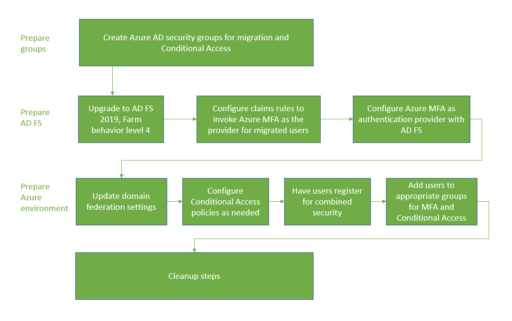
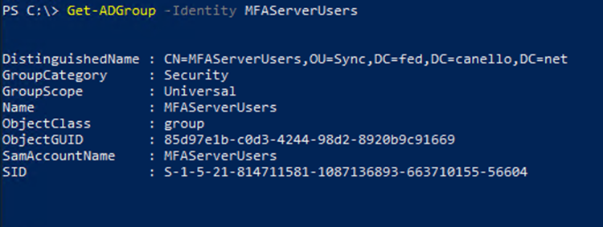
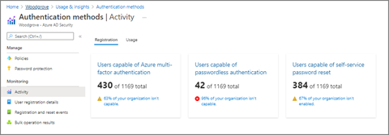

# Migrate to Microsoft Entra multifactor authentication with federation

Moving your multifactor-authentication (MFA) solution to Microsoft Entra ID is a great first step in your journey to the cloud. Consider also moving to Microsoft Entra ID for user authentication in the future. For more information, see the process for migrating to Microsoft Entra multifactor authentication with cloud authentication.

To migrate to Microsoft Entra multifactor authentication with federation, the Microsoft Entra multifactor authentication authentication provider is installed on AD FS. The Microsoft Entra ID relying party trust and other relying party trusts are configured to use Microsoft Entra multifactor authentication for migrated users.

The following diagram shows the migration process.

   

## Create migration groups

To create new Conditional Access policies, you'll need to assign those policies to groups. You can use Microsoft Entra security groups or Microsoft 365 Groups for this purpose. You can also create or sync new ones.

You'll also need a Microsoft Entra security group for iteratively migrating users to Microsoft Entra multifactor authentication. These groups are used in your claims rules.

Don't reuse groups that are used for security. If you're using a security group to secure a group of high-value apps with a Conditional Access policy, only use the group for that purpose.

## Prepare AD FS

### Upgrade AD FS server farm to 2019, FBL 4

In AD FS 2019, you can specify additional authentication methods for a relying party, such as an application. You use group membership to determine authentication provider. By specifying an additional authentication method, you can transition to Microsoft Entra multifactor authentication while keeping other authentication intact during the transition. For more information, see [Upgrading to AD FS in Windows Server 2016 using a WID database](/windows-server/identity/ad-fs/deployment/upgrading-to-ad-fs-in-windows-server). The article covers both upgrading your farm to AD FS 2019 and upgrading your FBL to 4.

<a name='configure-claims-rules-to-invoke-azure-ad-mfa'></a>

### Configure claims rules to invoke Microsoft Entra multifactor authentication

Now that Microsoft Entra multifactor authentication is an additional authentication method, you can assign groups of users to use it. You do so by configuring claims rules, also known as relying party trusts. By using groups, you can control which authentication provider is called globally or by application. For example, you can call Microsoft Entra multifactor authentication for users who have registered for combined security information, while calling MFA Server for those who haven't.

   > [!NOTE]
   > Claims rules require on-premises security group. Before making changes to claims rules, back them up.


#### Back up rules

Before configuring new claims rules, back up your rules. You'll need to restore these rules as a part of your clean-up steps. 

Depending on your configuration, you may also need to copy the rule and append the new rules being created for the migration.  

To view global rules, run:  

```powershell
Get-AdfsAdditionalAuthenticationRule
```

To view relying party trusts, run the following command and replace RPTrustName with the name of the relying party trust claims rule: 

```powershell
(Get-AdfsRelyingPartyTrust -Name "RPTrustName").AdditionalAuthenticationRules 
```

#### Access control policies

> [!NOTE]
> Access control policies can't be configured so that a specific authentication provider is invoked based on group membership. 

 
To transition from access control policies to additional authentication rules, run the following command for each of your Relying Party Trusts using the MFA Server authentication provider:


```powershell
Set-AdfsRelyingPartyTrust -TargetName AppA -AccessControlPolicyName $Null
```

 

This command will move the logic from your current Access Control Policy into Additional Authentication Rules.


#### Set up the group, and find the SID

You'll need to have a specific group in which you place users for whom you want to invoke Microsoft Entra multifactor authentication. You'll need the security identifier (SID) for that group.

To find the group SID, use the following command, with your group name

`Get-ADGroup "GroupName"`

   

<a name='setting-the-claims-rules-to-call-azure-ad-mfa'></a>

#### Setting the claims rules to call Microsoft Entra multifactor authentication

The following PowerShell cmdlets invoke Microsoft Entra multifactor authentication for users in the group when not on the corporate network. Replace "YourGroupSid" with the SID found by running the above cmdlet.

Make sure you review the [How to Choose Additional Auth Providers in 2019](/windows-server/identity/ad-fs/overview/whats-new-active-directory-federation-services-windows-server). 

   > [!IMPORTANT]
   > Back up your claims rules

 

#### Set global claims rule 

Run the following PowerShell cmdlet: 

```powershell
(Get-AdfsRelyingPartyTrust -Name "RPTrustName").AdditionalAuthenticationRules
```

 

The command returns your current additional authentication rules for your relying party trust. Append the following rules to your current claim rules:

```console
c:[Type == "http://schemas.microsoft.com/ws/2008/06/identity/claims/groupsid", Value == 
"YourGroupSID"] => issue(Type = "http://schemas.microsoft.com/claims/authnmethodsproviders", 
Value = "AzureMfaAuthentication");
not exists([Type == "http://schemas.microsoft.com/ws/2008/06/identity/claims/groupsid", 
Value=="YourGroupSid"]) => issue(Type = 
"http://schemas.microsoft.com/claims/authnmethodsproviders", Value = 
"AzureMfaServerAuthentication");'
```

The following example assumes your current claim rules are configured to prompt for MFA when users connect from outside your network. This example includes the additional rules that you need to append.

```PowerShell
Set-AdfsAdditionalAuthenticationRule -AdditionalAuthenticationRules 'c:[type == 
"http://schemas.microsoft.com/ws/2012/01/insidecorporatenetwork", value == "false"] => issue(type = 
"http://schemas.microsoft.com/ws/2008/06/identity/claims/authenticationmethod", value = 
"http://schemas.microsoft.com/claims/multipleauthn" );
 c:[Type == "http://schemas.microsoft.com/ws/2008/06/identity/claims/groupsid", Value == 
"YourGroupSID"] => issue(Type = "http://schemas.microsoft.com/claims/authnmethodsproviders", 
Value = "AzureMfaAuthentication");
not exists([Type == "http://schemas.microsoft.com/ws/2008/06/identity/claims/groupsid", 
Value=="YourGroupSid"]) => issue(Type = 
"http://schemas.microsoft.com/claims/authnmethodsproviders", Value = 
"AzureMfaServerAuthentication");'
```


#### Set per-application claims rule

This example modifies claim rules on a specific relying party trust (application), and includes the information you must append.

```PowerShell
Set-AdfsRelyingPartyTrust -TargetName AppA -AdditionalAuthenticationRules 'c:[type == 
"http://schemas.microsoft.com/ws/2012/01/insidecorporatenetwork", value == "false"] => issue(type = 
"http://schemas.microsoft.com/ws/2008/06/identity/claims/authenticationmethod", value = 
"http://schemas.microsoft.com/claims/multipleauthn" );
c:[Type == "http://schemas.microsoft.com/ws/2008/06/identity/claims/groupsid", Value == 
"YourGroupSID"] => issue(Type = "http://schemas.microsoft.com/claims/authnmethodsproviders", 
Value = "AzureMfaAuthentication");
not exists([Type == "http://schemas.microsoft.com/ws/2008/06/identity/claims/groupsid", 
Value=="YourGroupSid"]) => issue(Type = 
"http://schemas.microsoft.com/claims/authnmethodsproviders", Value = 
"AzureMfaServerAuthentication");'
```


<a name='configure-azure-ad-mfa-as-an-authentication-provider-in-ad-fs'></a>

### Configure Microsoft Entra multifactor authentication as an authentication provider in AD FS

To configure Microsoft Entra multifactor authentication for AD FS, you must configure each AD FS server. If you have multiple AD FS servers in your farm, you can configure them remotely using Azure AD PowerShell.

For step-by-step directions on this process, see [Configure the AD FS servers](/windows-server/identity/ad-fs/operations/configure-ad-fs-and-azure-mfa) in the article [Configure Microsoft Entra multifactor authentication as authentication provider with AD FS](/windows-server/identity/ad-fs/operations/configure-ad-fs-and-azure-mfa).

Once you've configured the servers, you can add Microsoft Entra multifactor authentication as an additional authentication method. 


<a name='prepare-azure-ad-and-implement-migration'></a>

## Prepare Microsoft Entra ID and implement migration

This section covers final steps before migrating user MFA settings. 

### Set federatedIdpMfaBehavior to enforceMfaByFederatedIdp

For federated domains, MFA may be enforced by Microsoft Entra Conditional Access or by the on-premises federation provider. Each federated domain has a Microsoft Graph PowerShell security setting named **federatedIdpMfaBehavior**. You can set **federatedIdpMfaBehavior** to `enforceMfaByFederatedIdp` so Microsoft Entra ID accepts MFA that's performed by the federated identity provider. If the federated identity provider didn't perform MFA, Microsoft Entra ID redirects the request to the federated identity provider to perform MFA. For more information, see [federatedIdpMfaBehavior](/graph/api/resources/internaldomainfederation?view=graph-rest-beta#federatedidpmfabehavior-values&preserve-view=true).

   >[!NOTE]
   > The **federatedIdpMfaBehavior** setting is a new version of the **SupportsMfa** property of the [New-MgDomainFederationConfiguration](/powershell/module/microsoft.graph.identity.directorymanagement/new-mgdomainfederationconfiguration) cmdlet. 

For domains that set the **SupportsMfa** property, these rules determine how **federatedIdpMfaBehavior** and **SupportsMfa** work together:

- Switching between **federatedIdpMfaBehavior** and **SupportsMfa** isn't supported.
- Once **federatedIdpMfaBehavior** property is set, Microsoft Entra ID ignores the **SupportsMfa** setting.
- If the **federatedIdpMfaBehavior** property is never set, Microsoft Entra ID will continue to honor the **SupportsMfa** setting.
- If **federatedIdpMfaBehavior** or **SupportsMfa** isn't set, Microsoft Entra ID will default to `acceptIfMfaDoneByFederatedIdp` behavior.

You can check the status of **federatedIdpMfaBehavior** by using [Get-MgDomainFederationConfiguration](/powershell/module/microsoft.graph.identity.directorymanagement/get-mgdomainfederationconfiguration?view=graph-powershell-beta&preserve-view=true).

```powershell
Get-MgDomainFederationConfiguration –DomainID yourdomain.com
```

You can also check the status of your **SupportsMfa** flag with [Get-MgDomainFederationConfiguration](/powershell/module/microsoft.graph.identity.directorymanagement/get-mgdomainfederationconfiguration):

```powershell
Get-MgDomainFederationConfiguration –DomainName yourdomain.com
```

The following example shows how to set **federatedIdpMfaBehavior** to `enforceMfaByFederatedIdp` by using Graph PowerShell. 

#### Request
<!-- {
  "blockType": "request",
  "name": "update_internaldomainfederation"
}
-->
``` http
PATCH https://graph.microsoft.com/beta/domains/contoso.com/federationConfiguration/6601d14b-d113-8f64-fda2-9b5ddda18ecc
Content-Type: application/json
{
  "federatedIdpMfaBehavior": "enforceMfaByFederatedIdp"
}
```


#### Response
>**Note:** The response object shown here might be shortened for readability.
<!-- {
  "blockType": "response",
  "truncated": true,
  "@odata.type": "microsoft.graph.internalDomainFederation"
}
-->
``` http
HTTP/1.1 200 OK
Content-Type: application/json
{
  "@odata.type": "#microsoft.graph.internalDomainFederation",
  "id": "6601d14b-d113-8f64-fda2-9b5ddda18ecc",
   "issuerUri": "http://contoso.com/adfs/services/trust",
   "metadataExchangeUri": "https://sts.contoso.com/adfs/services/trust/mex",
   "signingCertificate": "MIIE3jCCAsagAwIBAgIQQcyDaZz3MI",
   "passiveSignInUri": "https://sts.contoso.com/adfs/ls",
   "preferredAuthenticationProtocol": "wsFed",
   "activeSignInUri": "https://sts.contoso.com/adfs/services/trust/2005/usernamemixed",
   "signOutUri": "https://sts.contoso.com/adfs/ls",
   "promptLoginBehavior": "nativeSupport",
   "isSignedAuthenticationRequestRequired": true,
   "nextSigningCertificate": "MIIE3jCCAsagAwIBAgIQQcyDaZz3MI",
   "signingCertificateUpdateStatus": {
        "certificateUpdateResult": "Success",
        "lastRunDateTime": "2021-08-25T07:44:46.2616778Z"
    },
   "federatedIdpMfaBehavior": "enforceMfaByFederatedIdp"
}
```


### Configure Conditional Access policies if needed

If you use Conditional Access to determine when users are prompted for MFA, you shouldn't need to change your policies.

If your federated domain(s) have SupportsMfa set to false, analyze your claims rules on the Microsoft Entra ID relying party trust and create Conditional Access policies that support the same security goals.

After creating Conditional Access policies to enforce the same controls as AD FS, you can back up and remove your claim rules customizations on the Microsoft Entra ID Relying Party.

For more information, see the following resources:

* [Plan a Conditional Access deployment](../conditional-access/plan-conditional-access.md)

* [Common Conditional Access policies](../conditional-access/concept-conditional-access-policy-common.md)


<a name='register-users-for-azure-ad-mfa'></a>

## Register users for Microsoft Entra multifactor authentication

This section covers how users can register for combined security (MFA and self-service-password reset) and how to migrate their MFA settings. Microsoft Authenticator can be used as in passwordless mode. It can also be used as a second factor for MFA with either registration method.

### Register for combined security registration (recommended)

We recommend having your users register for combined security information, which is a single place to register their authentication methods and devices for both MFA and SSPR. 

Microsoft provides communication templates that you can provide to your users to guide them through the combined registration process. 
These include templates for email, posters, table tents, and various other assets. Users register their information at `https://aka.ms/mysecurityinfo`, which takes them to the combined security registration screen. 

We recommend that you [secure the security registration process with Conditional Access](../conditional-access/howto-conditional-access-policy-registration.md) that requires the registration to occur from a trusted device or location. For information on tracking registration statuses, see [Authentication method activity for Microsoft Entra ID](howto-authentication-methods-activity.md).

   > [!NOTE]
   > Users who must register their combined security information from a non-trusted location or device can be issued a Temporary Access Pass or alternatively, temporarily excluded from the policy.

### Migrate MFA settings from MFA Server

You can use the [MFA Server Migration utility](how-to-mfa-server-migration-utility.md) to synchronize registered MFA settings for users from MFA Server to Microsoft Entra ID. 
You can synchronize phone numbers, hardware tokens, and device registrations such as Microsoft Authenticator settings. 

### Add users to the appropriate groups

* If you created new Conditional Access policies, add the appropriate users to those groups. 

* If you created on-premises security groups for claims rules, add the appropriate users to those groups.

We don't recommend that you reuse groups that are used for security. If you're using a security group to secure a group of high-value apps with a Conditional Access policy, only use the group for that purpose.

## Monitoring

Microsoft Entra multifactor authentication registration can be monitored using the [Authentication methods usage & insights report](https://portal.azure.com/). This report can be found in Microsoft Entra ID. Select **Monitoring**, then select **Usage & insights**. 

In Usage & insights, select **Authentication methods**. 

Detailed Microsoft Entra multifactor authentication registration information can be found on the Registration tab. You can drill down to view a list of registered users by selecting the **Users capable of Azure multifactor authentication** hyperlink.

   

## Cleanup steps

Once you have completed migration to Microsoft Entra multifactor authentication and are ready to decommission the MFA Server, do the following three things: 

1. Revert your claim rules on AD FS to their pre-migration configuration and remove the MFA Server authentication provider.

1. Remove MFA server as an authentication provider in AD FS. This will ensure all users use Microsoft Entra multifactor authentication as it will be the only additional authentication method enabled. 

1. Decommission the MFA Server.

### Revert claims rules on AD FS and remove MFA Server authentication provider

Follow the steps under Configure claims rules to invoke Microsoft Entra multifactor authentication to revert back to the backed up claims rules and remove any AzureMFAServerAuthentication claims rules. 

For example, remove the following from the rule(s): 

 
```console
c:[Type == "http://schemas.microsoft.com/ws/2008/06/identity/claims/groupsid", Value ==
"**YourGroupSID**"] => issue(Type = "http://schemas.microsoft.com/claims/authnmethodsproviders",
Value = "AzureMfaAuthentication");
not exists([Type == "http://schemas.microsoft.com/ws/2008/06/identity/claims/groupsid",
Value=="YourGroupSid"]) => issue(Type =
"http://schemas.microsoft.com/claims/authnmethodsproviders", Value =
"AzureMfaServerAuthentication");'
```

### Disable MFA Server as an authentication provider in AD FS

This change ensures only Microsoft Entra multifactor authentication is used as an authentication provider.

1. Open the **AD FS management console**.

1. Under **Services**, right-click on **Authentication Methods**, and select **Edit multifactor authentication Methods**. 

1. Uncheck the box next to **Azure multifactor authentication Server**. 

### Decommission the MFA Server

Follow your enterprise server decommissioning process to remove the MFA Servers in your environment.

Possible considerations when decommissions the MFA Servers include: 

* Review MFA Servers' logs to ensure no users or applications are using it before you remove the server.

* Uninstall multifactor authentication Server from the Control Panel on the server

* Optionally clean up logs and data directories that are left behind after backing them up first. 

* Uninstall the multifactor authentication Web Server SDK if applicable, including any files left over in etpub\wwwroot\MultiFactorAuthWebServiceSdk and or MultiFactorAuth directories

* For MFA Server versions prior to 8.0, it may also be necessary to remove the multifactor authentication Phone App Web Service

## Next Steps

- [Deploy password hash synchronization](../hybrid/connect/whatis-phs.md)
- [Learn more about Conditional Access](../conditional-access/overview.md)
- [Migrate applications to Microsoft Entra ID](../manage-apps/migrate-adfs-apps-phases-overview.md)
