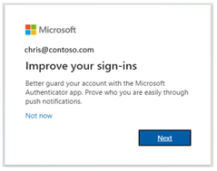
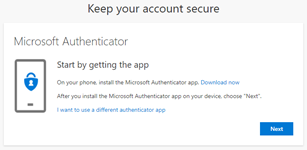
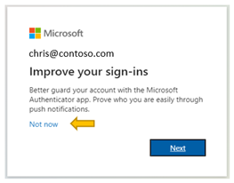
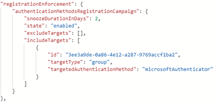

# How to nudge users to set up Microsoft Authenticator (Preview) - Microsoft Authenticator app

You can nudge users to set up Microsoft Authenticator during sign-in. Users will go through their regular sign-in, perform multifactor authentication as usual, and then be prompted to set up Microsoft Authenticator. You can include or exclude users or groups to control who gets nudged to set up the app. This allows targeted campaigns to move users from less secure authentication methods to Microsoft Authenticator.  

In addition to choosing who can be nudged, you can define how many days a user can postpone, or "snooze", the nudge. If a user taps **Not now** to snooze the app setup, they will be nudged again on the next MFA attempt after the snooze duration has elapsed. 

## Prerequisites 

- Your organization must have enabled Azure MFA. 
- User must not have already set up Microsoft Authenticator for push notifications on their account. 
- Admins need to enable users for Microsoft Authenticator using one of these policies:  
  - MFA Registration Policy: Users will need to be enabled for **Notification through mobile app**.  
  - Authentication Methods Policy: Users will need to be enabled for the Microsoft Authenticator and the Authentication mode set to **Any** or **Push**. If the policy is set to **Passwordless**, the user will not be eligible for the nudge. 

## User experience

1. User successfully performs MFA using Azure MFA. 

1. User sees prompt to set up the Microsoft Authenticator app to improve their sign-in experience. Note: Only users who are allowed for the Microsoft Authenticator push notifications and do not have it currently set up will see the prompt. 

   

1. User taps **Next** and steps through Microsoft Authenticator setup. 
   1. First download the app.  

      

   1. See how to set up Microsoft Authenticator. 
   
      

   1. Scan the QR Code. 

      

   1. Approve the test notification.

      

   1. Notification approved.

      

   1. Authenticator app is now successfully set up as the user’s default sign-in method.

      

1. If a user wishes to not install the Authenticator app, they can tap **Not now** to snooze the prompt for a number of days, which can be defined by an admin. 
 
   

## Enable the nudge policy

To enable the nudge, you must use the Authentication Methods Policy using Graph APIs. **Global administrators** and **Authentication Method Policy administrators** can update the policy. 

To configure the policy using Graph Explorer:

1. Sign in to Graph Explorer and ensure you’ve consented to the **Policy.Read.All** and **Policy.ReadWrite.AuthenticationMethod** permissions.

   To open the Permissions panel:

   

1. Retrieve the Authentication methods policy: `GET https://graph.microsoft.com/beta/policies/authenticationmethodspolicy`

1. Update the registrationEnforcement and authenticationMethodsRegistrationCampaign section of the policy to enable the nudge on a user or group.

   

To update the policy, perform a PATCH on the Authentication Methods Policy with only the updated registrationEnforcement section: `PATCH https://graph.microsoft.com/beta/policies/authenticationmethodspolicy`

The following table lists **authenticationMethodsRegistrationCampaign** properties.

| Name | Possible values | Description |
|------|-----------------|-------------|
| state |	"enabled"<br>"disabled"<br>"default" | Allows you to enable or disable the feature.<br>Default value is used when the configuration hasn't been explicitly set and will use Azure AD default value for this setting. Currently maps to disabled.<br>Change states to either enabled or disabled as needed.  |
| snoozeDurationInDays | Range: 0 – 14 | Defines after how many days the user will see the nudge again.<br>If the value is 0, the user is nudged during every MFA attempt.<br>Default: 1 day |
| includeTargets | N/A | Allows you to include different users and groups that you want the feature to target. |
| excludeTargets | N/A | Allows you to exclude different users and groups that you want omitted from the feature. If a user is in a group that is excluded and a group that is included, the user will be excluded from the feature.|

The following table lists **includeTargets** properties.

| Name | Possible values | Description |
|------|-----------------|-------------|
| targetType| "user"<br>"group" | The kind of entity targeted. |
| Id | A guid identifier | The ID of the user or group targeted. |
| targetedAuthenticationMethod | "microsoftAuthenticator" | The authentication method user is prompted to register. The only permissible value is "microsoftAuthenticator". |

The following table lists **excludeTargets** properties.

| Name       | Possible values   | Description                           |
|------------|-------------------|---------------------------------------|
| targetType | "user"<br>"group" | The kind of entity targeted.          |
| Id         | A string          | The ID of the user or group targeted. |

### Examples

Here are a few sample JSONs you can use to get started! 

- Include all users 
  
  If you want to include ALL users in your tenant simply [download this JSON](https://download.microsoft.com/download/1/4/E/14E6151E-C40A-42FB-9F66-D8D374D13B40/All%20Users%20Enabled.json) and paste it in Graph Explorer and run `PATCH` on the endpoint. 

  ```json
  {
  "registrationEnforcement": {
          "authenticationMethodsRegistrationCampaign": {
              "snoozeDurationInDays": 0,
              "state": "enabled",
              "excludeTargets": [],
              "includeTargets": [
                  {
                      "id": "all_users",
                      "targetType": "group",
                      "targetedAuthenticationMethod": "microsoftAuthenticator"
                  }
              ]
          }
      }
  }
  ```

- Include specific users or groups of users

  If you want to include certain users or groups in your tenant, [download this JSON](https://download.microsoft.com/download/1/4/E/14E6151E-C40A-42FB-9F66-D8D374D13B40/Multiple%20Includes.json) and update it with the relevant GUIDs of your users and groups. Then paste the JSON in Graph Explorer and run `PATCH` on the endpoint. 

  ```json
  {
  "registrationEnforcement": {
        "authenticationMethodsRegistrationCampaign": {
            "snoozeDurationInDays": 0,
            "state": "enabled",
            "excludeTargets": [],
            "includeTargets": [
                {
                    "id": "*********PLEASE ENTER GUID***********",
                    "targetType": "group",
                    "targetedAuthenticationMethod": "microsoftAuthenticator"
                },
		{
                    "id": "*********PLEASE ENTER GUID***********",
                    "targetType": "user",
                    "targetedAuthenticationMethod": "microsoftAuthenticator"
                }
            ]
        }
    }
  ```

- Include and exclude specific users/groups of users

  If you want to include AND exclude certain users/groups of users in your tenant, [download this JSON](https://download.microsoft.com/download/1/4/E/14E6151E-C40A-42FB-9F66-D8D374D13B40/Multiple%20Includes%20and%20Excludes.json) and paste it in Graph Explorer and run `PATCH` on the endpoint. Enter the correct GUIDs for your users and groups.

  ```json
  {
  "registrationEnforcement": {
          "authenticationMethodsRegistrationCampaign": {
              "snoozeDurationInDays": 0,
              "state": "enabled",
              "excludeTargets": [
                  {
                      "id": "*********PLEASE ENTER GUID***********",
                      "targetType": "group"
                  },
  		{
                      "id": "*********PLEASE ENTER GUID***********",
                      "targetType": "user"
                  }
              ],
              "includeTargets": [
                  {
                      "id": "*********PLEASE ENTER GUID***********",
                      "targetType": "group",
                      "targetedAuthenticationMethod": "microsoftAuthenticator"
                  },
  		{
                      "id": "*********PLEASE ENTER GUID***********",
                      "targetType": "user",
                      "targetedAuthenticationMethod": "microsoftAuthenticator"
                  }
              ]
          }
      }
  }
  ```

### Identify the GUIDs of users to insert in the JSONs

1. Navigate to the Azure portal.
1. Tap **Azure Active Directory**.
1. In the **Manage** blade, tap **Users**.
1. In the **Users** page, identify the specific user you want to target.
1. When you tap the specific user, you’ll see their **Object ID**, which is the user’s GUID.

   

### Identify the GUIDs of groups to insert in the JSONs

1. Navigate to the Azure portal.
1. Tap **Azure Active Directory**.
1. In the **Manage** blade, tap **Groups**.
1. In the **Groups** page, identify the specific group you want to target.
1. Tap the group and get the **Object ID**.

   

<!---comment out PS until ready>

### PowerShell

1. Install the module.
1. Ensure you pass the right roles:
   
   ```powershell
   Connect-MgGraph -Scopes "User.Read.All","Group.ReadWrite.All"
   ```

1. Select the beta profile.
1. Call `Update-MgPolicyAuthenticationMethod`.

<---->

## Limitations

The nudge will not appear on mobile devices that run Android or iOS.

## Frequently asked questions

**Will this feature be available for MFA Server?** 
No. This feature will be available only for users using Azure MFA. 

**How long will the campaign run for?** 
You can use the APIs to enable the campaign for as long as you like. Whenever you want to be done running the campaign, simply use the APIs to disable the campaign.  
 
**Can each group of users have a different snooze duration?** 
No. The snooze duration for the prompt is a tenant-wide setting and applies to all groups in scope. 

**Can users be nudged to set up passwordless phone sign-in?** 
The feature aims to empower admins to get users set up with MFA using the Authenticator app and not passwordless phone sign-in.  

**Will a user who has a 3rd party authenticator app setup see the nudge?** 
If this user doesn’t have the Microsoft Authenticator app set up for push notifications and are enabled for it by policy, yes, the user will see the nudge. 

**Will a user who has a Microsoft Authenticator app setup only for TOTP codes see the nudge?** Yes. If the Microsoft Authenticator app is not set up for push notifications and the user is enabled for it by policy, yes, the user will see the nudge.

**If a user just went through MFA registration, will they be nudged in the same sign-in session?** 
No. To provide a good user experience, users will not be nudged to set up the Authenticator in the same session that they registered other authentication methods.  

**Can I nudge my users to register another authentication method?** 
No. The feature, for now, aims to nudge users to set up the Microsoft Authenticator app only. 

**Is there a way for me to hide the snooze option and force my users to setup the Authenticator app?**  
There is no way to hide the snooze option on the nudge. You can set the snoozeDuration to 0, which will ensure that users will see the nudge during each MFA attempt.  

**Will I be able to nudge my users if I am not using Azure MFA?** 
No. The nudge will only work for users who are doing MFA using the Azure MFA service. 

**Will Guest/B2B users in my tenant be nudged?** 
Yes. If they have been scoped for the nudge using the policy. 

**What if the user closes the browser?** It's the same as snoozing.


## Next steps

[Enable passwordless sign-in with the Microsoft Authenticator app](howto-authentication-passwordless-phone.md)