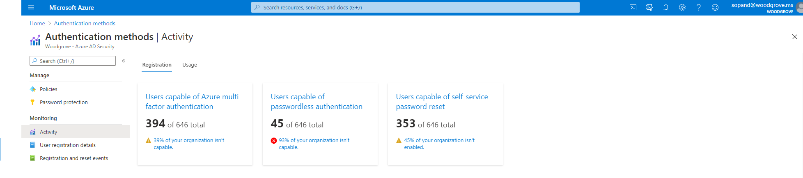
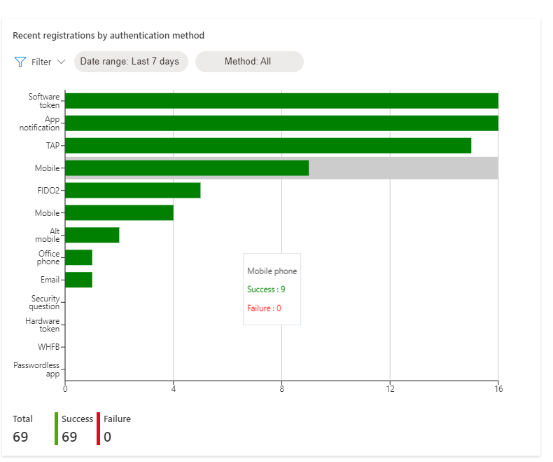
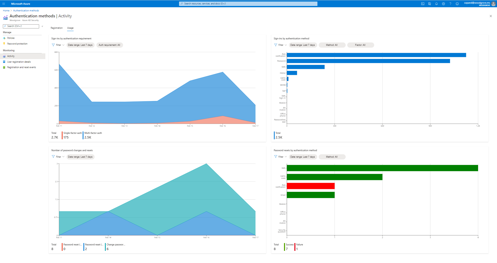
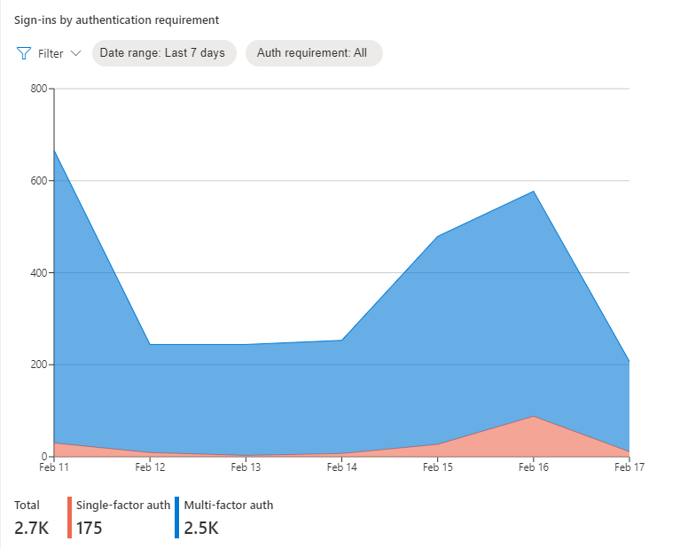
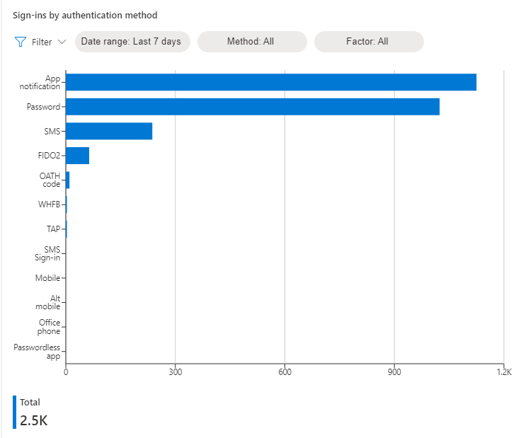
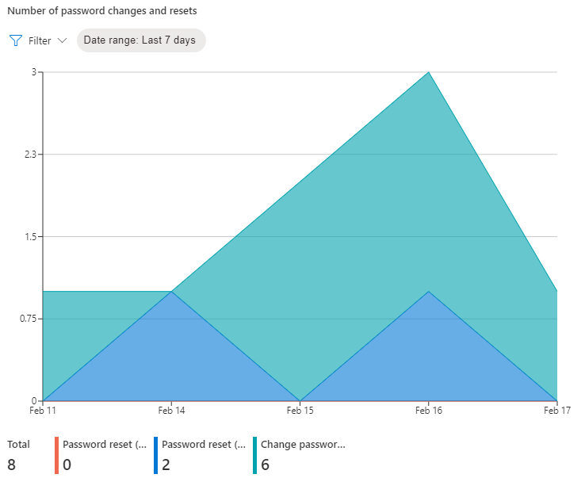
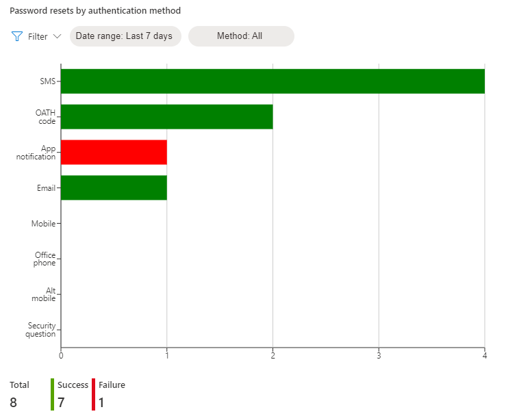
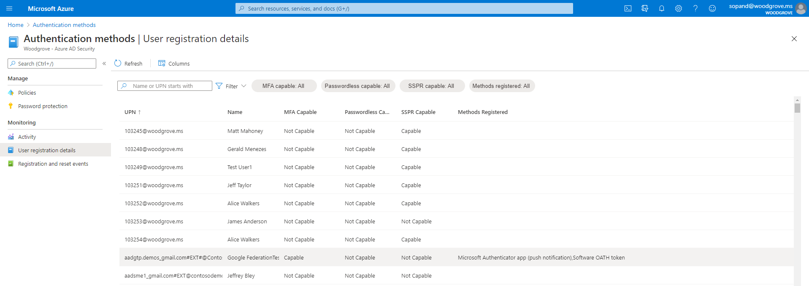
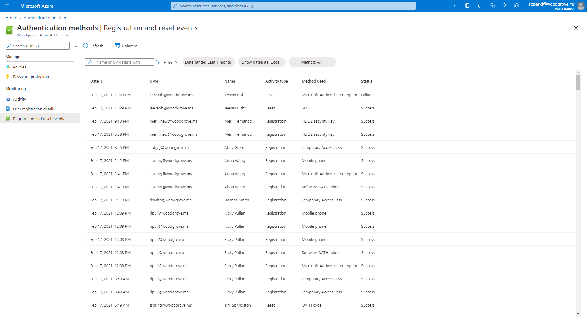

# Authentication Methods Activity 

The new authentication methods activity dashboard enables admins to monitor authentication method registration and usage across their organization. This reporting capability provides your organization with the means to understand what methods are being registered and how they're being used.

[!INCLUDE [GDPR-related guidance](../../../includes/gdpr-dsr-and-stp-note.md)]

## Permissions and licenses

Built-in and custom roles with the following permissions can access the Authentication Methods Activity blade and APIs:

- Microsoft.directory/auditLogs/allProperties/read
- Microsoft.directory/signInReports/allProperties/read

The following roles have the required permissions:

- Reports Reader
- Security Reader
- Global Reader
- Application Administrator
- Cloud Application Administrator
- Security Operator
- Security Administrator
- Global Administrator

 A Microsoft Entra ID P1 or P2 license is required to access usage and insights. Microsoft Entra multifactor authentication and self-service password reset (SSPR) licensing information can be found on the [Microsoft Entra pricing site](https://www.microsoft.com/security/business/identity-access-management/azure-ad-pricing).

## How it works

[!INCLUDE [portal updates](~/articles/active-directory/includes/portal-update.md)]

To access authentication method usage and insights:

1. Sign in to the [Microsoft Entra admin center](https://entra.microsoft.com) as at least an [Authentication Policy Administrator](../roles/permissions-reference.md#authentication-policy-administrator).
1. Browse to **Protection** > **Authentication Methods** > **Activity**.
1. There are two tabs in the report: **Registration** and **Usage**.

   

## Registration details

You can access the **Registration** tab to show the number of users capable of multifactor authentication, passwordless authentication, and self-service password reset. 

Click any of the following options to pre-filter a list of user registration details:

- **Users capable of Azure multifactor authentication** shows the breakdown of users who are both:
  - Registered for a strong authentication method 
  - Enabled by policy to use that method for MFA 
  
  This number doesn't reflect users registered for MFA outside of Microsoft Entra ID. 
- **Users capable of passwordless authentication** shows the breakdown of users who are registered to sign in without a password by using FIDO2, Windows Hello for Business, or passwordless Phone sign-in with the Microsoft Authenticator app. 
- **Users capable of self-service password reset** shows the breakdown of users who can reset their passwords. Users can reset their password if they're both:
  - Registered for enough methods to satisfy their organization's policy for self-service password reset 
  - Enabled to reset their password 

  

**Users registered by authentication method** shows how many users are registered for each authentication method. Click an authentication method to see who is registered for that method.

**Recent registration by authentication method** shows how many registrations succeeded and failed, sorted by authentication method. Click an authentication method to see recent registration events for that method.

## Usage details

The **Usage** report shows which authentication methods are used to sign-in and reset passwords.

**Sign-ins by authentication requirement** shows the number of successful user interactive sign-ins that were required for single-factor versus multifactor authentication in Microsoft Entra ID. Sign-ins where MFA was enforced by a third-party MFA provider are not included.

**Sign-ins by authentication method** shows the number of user interactive sign-ins (success and failure) by authentication method used. It doesn't include sign-ins where the authentication requirement was satisfied by a claim in the token.

**Number of password resets and account unlocks** shows the number of successful password changes and password resets (self-service and by admin) over time.

**Password resets by authentication method** shows the  number of successful and failed authentications during the password reset flow by authentication method.

## User registration details 

Using the controls at the top of the list, you can search for a user and filter the list of users based on the columns shown.

>[!NOTE]
>User accounts that were recently deleted, also known as [soft-deleted users](../fundamentals/users-restore.md), are not listed in user registration details.  

The registration details report shows the following information for each user:

- User principal name
- Name
- MFA Capable (Capable, Not Capable)
- Passwordless Capable (Capable, Not Capable)
- SSPR Registered (Registered, Not Registered)
- SSPR Enabled (Enabled, Not Enabled)
- SSPR Capable (Capable, Not Capable) 
- Methods registered (Alternate Mobile Phone, Certificate-based authentication, Email, FIDO2 security key, Hardware OATH token, Microsoft Authenticator app, Microsoft Passwordless phone sign-in, Mobile phone, Office phone, Security questions, Software OATH token, Temporary Access Pass, Windows Hello for Business)

  

## Registration and reset events 

**Registration and reset events** shows registration and reset events from the last 24 hours, last seven days, or last 30 days including:

- Date
- User name
- User 
- Feature (Registration, Reset)
- Method used (App notification, App code, Phone Call, Office Call, Alternate Mobile Call, SMS, Email, Security questions)
- Status (Success, Failure)
- Reason for failure (explanation)

  

## Limitations

- The data in the report is not updated in real-time and may reflect a latency of up to a few hours.
- The **PhoneAppNotification** or **PhoneAppOTP** methods that a user might have configured are not displayed in the dashboard on **Microsoft Entra authentication methods - Policies**. 

## Next steps

- [Working with the authentication methods usage report API](/graph/api/resources/authenticationmethods-usage-insights-overview)
- [Choosing authentication methods for your organization](concept-authentication-methods.md)
- [Combined registration experience](concept-registration-mfa-sspr-combined.md)
