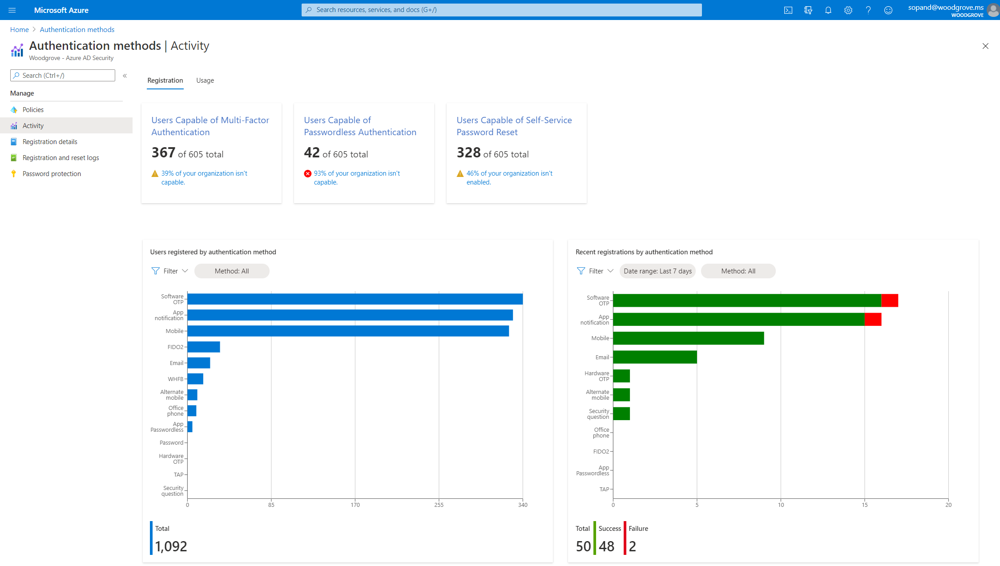
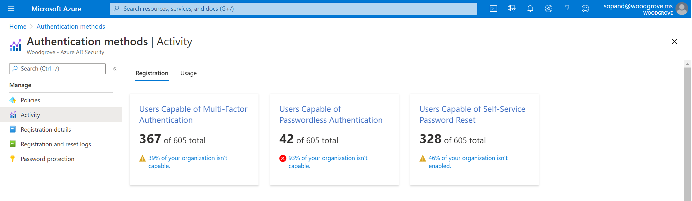
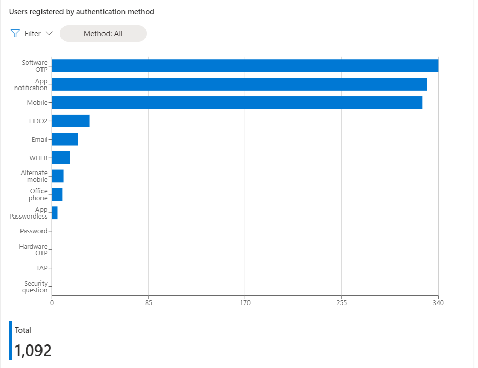
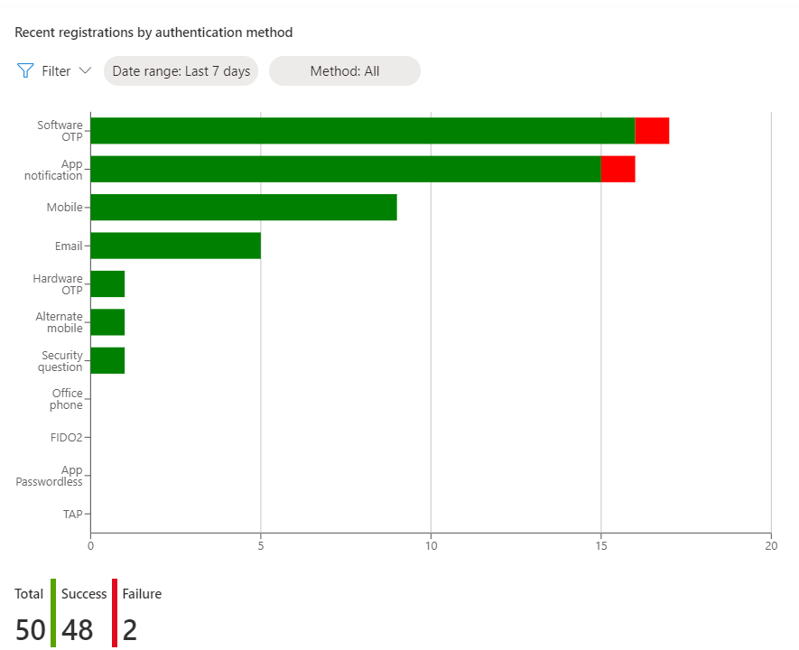
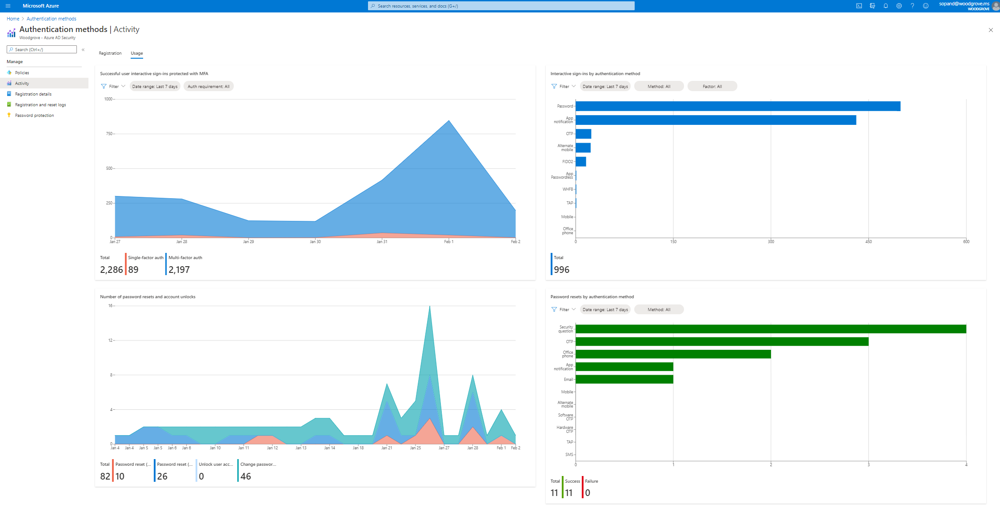
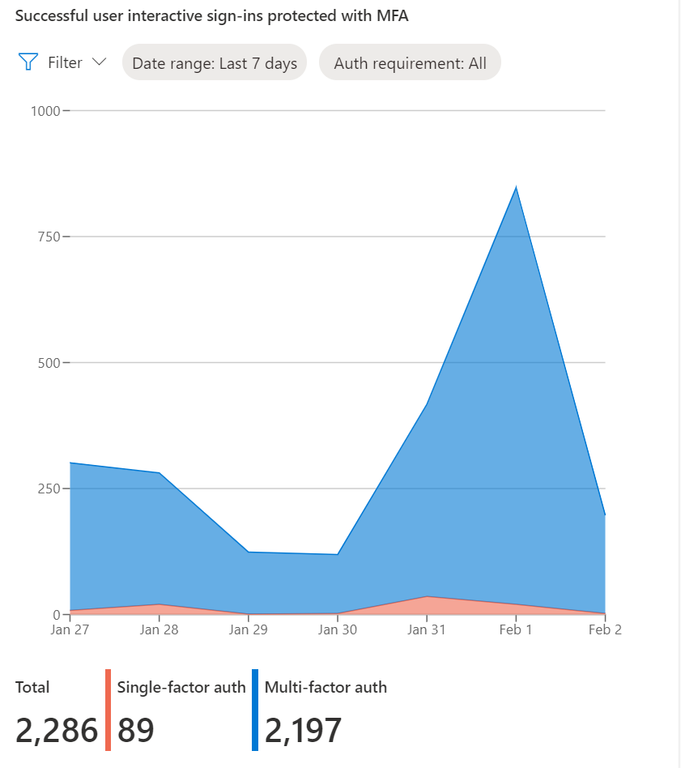
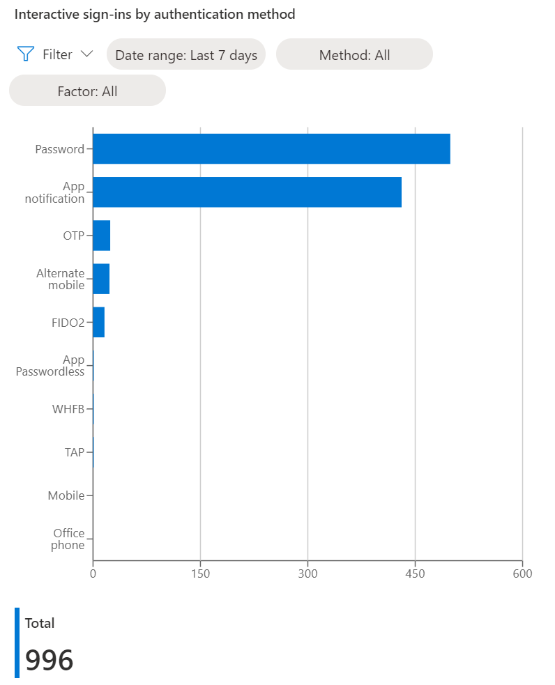
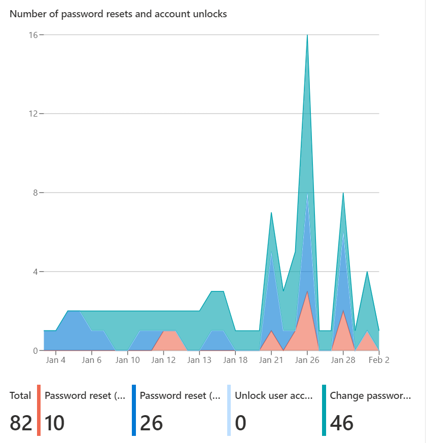
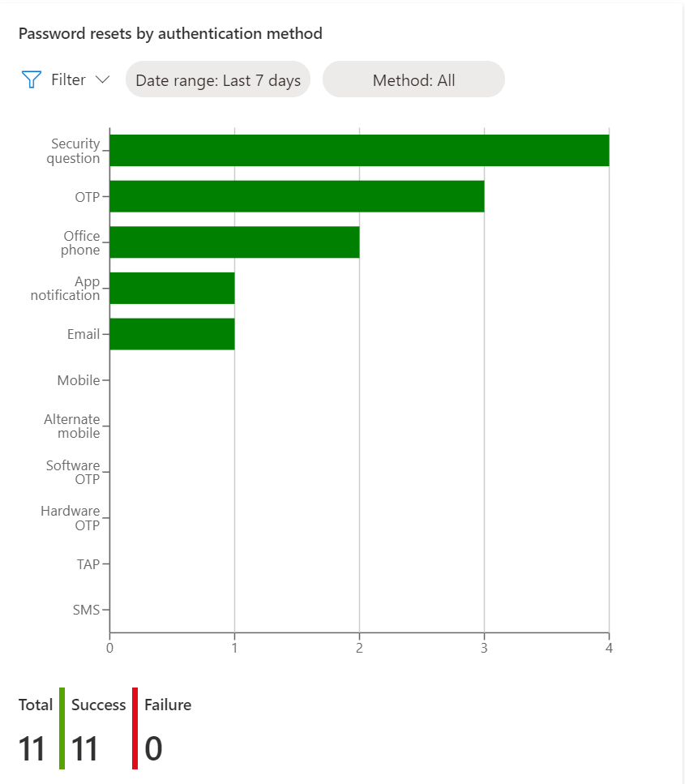
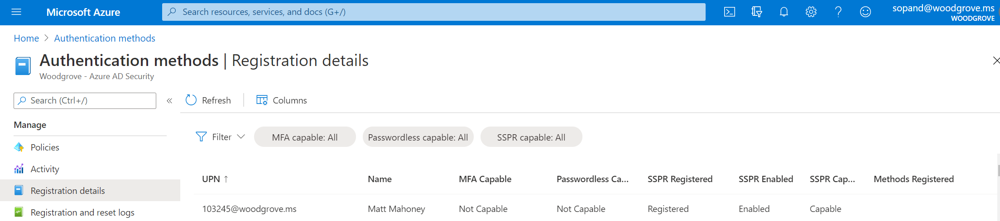

# Authentication Methods Activity 

The new authentication methods activity dashboard enables admins to monitor authentication method registration and usage across their organization. This reporting capability provides your organization with the means to understand what methods are being registered and how they are being used.

## Permissions and licenses

The following roles can access usage and insights:

- Reports Reader
- Security Reader
- Security Administrator
- Global Administrator

 An Azure AD Premium P1 or P2 license is required to access usage and insights. Azure AD Multi-Factor Authentication and self-service password reset (SSPR) licensing information can be found on the [Azure Active Directory pricing site](https://azure.microsoft.com/pricing/details/active-directory/).

## How it works

To access authentication method usage and insights:

1. Sign in to the [Azure portal](https://portal.azure.com).
1. Click **Azure Active Directory** > **Security** > **Authentication Methods** > **Activity**.
1. There are two tabs in the report: **Registration** and **Usage**

## Registration details

You can access the [**Registration tab**](https://portal.azure.com/#blade/Microsoft_AAD_IAM/AuthMethodsOverviewBlade) to show the number of users capable of multi-factor authentication, passowordless authentication, and self-service password reset. 

Click **Users capable of Azure multi-factor authentication**, **Users capable of passwordless authentication**, or **Users capable of self-service password reset**, or insights can pre-filter a list of user registration details.

- **Users capable of Azure multi-factor authentication** shows the breakdown of users capable of MFA in Azure AD. Users are considered capable if they are both registered for a strong authentication method and enabled by policy to use that method to perform MFA. This number does not reflect users registered for MFA outside of Azure AD. 
- **Users capable of passwordless authentication** shows the breakdown of users capable of signing in without a password. This includes users registered for FIDO2, Windows Hello for Business, and Passwordless Phone sign-in with the Microsoft Authenticator app. 
- **Users capable of self-service password reset** shows the breakdown of users capable of self-service password reset. Users are considered capable of SSPR if they are both registered for enough methods to satisfy an organization's SSPR policy and enabled to perform SSPR. 

The **Users Registered by Authentication Method** chart on the **Registration** tab shows how many users are registered for each authentication method. Click an authentication method to see which users are registered for that method. 

The **Recent Registration by Authentication Method** chart on the **Registration** tab shows the number of successful and failed authentication method registrations by authentication method. Click an authentication method to see recent registration events for that method.

## Usage details

The **Usage** tab of the report shows which authentication methods users are using to sign-in and reset their passwords.

The **Sign-ins by authentication requirement** chart on the **Usage** tab shows the number of successful user interactive sign-ins that were required to perform single-factor versus multi-factor authentication in Azure AD. This does not reflect sign-ins where MFA was enforced by a third-party MFA provider.

The **Sign-ins by authentication method** chart on the **Usage** tab shows the number of user interactive sign-ins (success and failure) by authentication method used. It does not include sign-ins where the authentication requirement was satisfied by a claim in the token.

The **Number of password changes and reset** chart on the **Usage** tab shows the number of successful password changes and password resets (self-service and by admin) over time.

The **Password resets by authentication method** chart on the **Usage** tab shows the  number of successful and failed authentications during the password reset flow by authentication method.

## User registration details 

Using the controls at the top of the list, you can search for a user and filter the list of users based on the columns shown.

The registration details report shows the following information for each user:

- User principal name
- Name
- MFA Capable (Capable, Not Capable)
- Passwordless Capable (Capable, Not Capable)
- SSPR Registered (Registered, Not Registered)
- SSPR Enabled (Enabled, Not Enabled)
- SSPR Capable (Capable, Not Capable) 
- Methods Registered (Email, Mobile Phone, Alternative Mobile Phone, Office Phone, Microsoft Authenticator Push, Software One Time Passcode, FIDO2, Security Key, Security questions)

## Registration and Reset Logs 

The Registration and reset logs shows registration and reset events from the last 24 hours, last 7 days or last 30 days including:

- Date
- User Name
- User 
- Feature (Registration, Reset)
- Method Used (App notification, App code, Phone Call, Office Call, Alternate Mobile Call, SMS, Email, Security questions)
- Status (Success, Failure)
- Reason for Failure (explanation)

## Limitations

Temporary Access Pass (TAP) registrations are not reflected in the registration tab of the report because they are only valid for short period of time.

## Next steps

- [Working with the authentication methods usage report API](/graph/api/resources/authenticationmethods-usage-insights-overview?view=graph-rest-beta)
- [Choosing authentication methods for your organization](concept-authentication-methods.md)
- [Combined registration experience](concept-registration-mfa-sspr-combined.md)