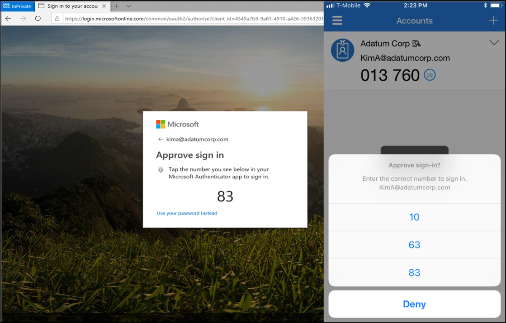

# Plan a passwordless authentication deployment in Azure Active Directory

> [!NOTE]
> To create an offline version of this deployment plan, use your browser's Print to PDF functionality.

Most cyber attacks begin with a compromised user name and password. Organizations try to counter the threat by requiring users to use one of the following approaches:

- Long passwords
- Complex passwords
- Frequent password changes
- Multi-factor authentication (MFA)

Microsoft's [research shows](https://aka.ms/passwordguidance) that these efforts annoy users and drive up support costs. For more information, see [Your Pa$$word doesn't matter](https://techcommunity.microsoft.com/t5/Azure-Active-Directory-Identity/Your-Pa-word-doesn-t-matter/ba-p/731984).

### Benefits of passwordless authentication

- **Increased security**. Reduce the risk of phishing and password spray attacks by removing passwords as an attack surface.
-  **Better user experience**. Give users a convenient way to access data from anywhere. Provide easy access to applications and services such as Outlook, OneDrive, or Office while mobile.
-  **Robust insights**. Gain insights into users passwordless activity with robust logging and auditing.

With passwordless, the password is replaced with something you have plus something you are or something you know. For example, Windows Hello for Business can use a biometric gesture like a face or fingerprint, or a device-specific PIN that isn't transmitted over a network.

## Passwordless authentication methods
Microsoft offers three passwordless authentication options that cover many scenarios. These methods can be used in tandem:

- [Windows Hello for Business](https://docs.microsoft.com/azure/security/fundamentals/ad-passwordless) is best for users on their dedicated Windows computers.
- Security key sign-in with [FIDO2 Security keys](https://docs.microsoft.com/azure/security/fundamentals/ad-passwordless) is especially useful for users who sign in to shared machines like kiosks, in situations where use of phones is restricted, and for highly privileged identities.
- Phone sign in with the [Microsoft Authenticator app](https://docs.microsoft.com/azure/security/fundamentals/ad-passwordless) is useful for providing a passwordless option to users with mobile devices. The Authenticator app turns any iOS or Android phone into a strong, passwordless credential by allowing users to sign into any platform or browser. Users sign in by getting a notification to their phone, matching a number displayed on the screen to the one on their phone, and then using their biometric data or PIN to confirm.

### Passwordless authentication scenarios

Microsoft's passwordless authentication methods enable different scenarios. Consider your organizational needs, prerequisites, and the capabilities of each authentication method to select your passwordless authentication strategy. We recommend that every organization that uses Windows 10 devices use Windows Hello for Business. Then, add either phone sign-in (with the Microsoft Authenticator app) or security keys for additional scenarios.

| Scenario | Phone authentication | Security keys | Windows Hello for Business |
| --- | --- | --- | --- |
| **Computer sign in**:   From assigned Windows 10 device | **No** | **Yes**   With biometric, PIN | **Yes** with biometric recognition and or PIN |
| **Computer sign in**:   From shared Windows 10 device | **No** | **Yes**   With biometric, PIN  | **No** |
| **Web app sign-in**:  ‎ from a user-dedicated computer | **Yes** | **Yes**   Provided single sign-on to apps is enabled by computer sign-in | **Yes**  Provided single sign-on to apps is enabled by computer sign-in |
| **Web app sign-in**:   from a mobile or non-windows device | **Yes** | **No** | **No** |
| **Computer sign in**:   Non-Windows computer | **No** | **No** | **No** |

For information on selecting the best method for your organization, see [Deciding a passwordless method](https://docs.microsoft.com/azure/active-directory/authentication/concept-authentication-passwordless#choose-a-passwordless-method).

## Prerequisites

Organizations must meet the following prerequisites before beginning a passwordless deployment:

| Prerequisite | Authenticator app | FIDO2 Security Keys |
| --- | --- | --- |
| [Combined registration for Azure Multi-factor authentication and self-service password reset (SSPR)](howto-registration-mfa-sspr-combined.md) is enabled | √ | √ |
| [Users can perform Azure Multi-factor authentication](howto-mfa-getstarted.md) | √ | √ |
| [Users have registered for Azure Multi-factor authentication and SSPR](howto-registration-mfa-sspr-combined.md) | √ | √ |
| [Users have registered their mobile devices to Azure Active Directory](../devices/overview.md) | √ |   |
| Windows 10 version 1809 or higher using a supported browser like Microsoft Edge or Mozilla Firefox   (version 67 or higher).   *Microsoft recommends version 1903 or higher for native support*. |   | √ |
| Compatible FIDO2 security keys. Ensure that you're using a [Microsoft-tested and verified](howto-authentication-passwordless-enable.md) FIDO2 security device, or other compatible FIDO2 security device. |   | √ |

### Prerequisites for Windows Hello for Business

The prerequisites for Windows Hello are highly dependent on whether you're deploying in an on-premises, hybrid, or cloud-only configuration. For more information, see the [full listing of prerequisites for Windows Hello for Business](https://docs.microsoft.com/windows/security/identity-protection/hello-for-business/hello-identity-verification).

### Azure Multi-Factor Authentication

Users register their passwordless method as a part of the Azure Multi-factor authentication registration flow. Multi-factor authentication with a username and password along with another registered method can be used as a fallback in case they can't use their phone or security key in some scenarios.

### Licensing 
There is no additional cost for passwordless authentication, although some prerequisites may require a premium subscription. For detailed feature and licensing information in the [Azure Active Directory licensing page](https://azure.microsoft.com/pricing/details/active-directory/). 

## Develop a plan

Consider your business needs and the use cases for each authentication method. Then select the method that best fits your needs.

### Use cases

The following table outlines the use cases to be implemented during this project.

| Area | Description |
| --- | --- |
| **Access** | Passwordless sign-in is available from a corporate or personal device within or outside the corporate network. |
| **Auditing** | Usage data is available to administrators to audit in near real time.   Usage data is downloaded into corporate systems at least every 29 days, or SIEM tool is used. |
| **Governance** | Lifecycle of user assignments to appropriate authentication method and associated groups is defined and monitored. |
| **Security** | Access to appropriate authentication method is controlled via user and group assignments.   Only authorized users can use passwordless sign-in. |
| **Performance** | Access assignment propagation timelines are documented and monitored.   Sign in times is measured for ease of use. |
| **User Experience** | Users are aware of mobile compatibility.   Users can configure the Authenticator app passwordless sign-in. |
| **Support** | Users are aware of how to find support for passwordless sign-in issues. |

### Engage the right stakeholders

When technology projects fail, it's typically because of mismatched expectations on impact, outcomes, and responsibilities. To avoid these pitfalls, [ensure that you're engaging the right stakeholders](../fundamentals/active-directory-deployment-plans.md#include-the-right-stakeholders) and that stakeholder roles in the project are well understood.

### Plan communications

Communication is critical to the success of any new service. Proactively communicate how users' experience will change, when it will change, and how to gain support if they experience issues.

Your communications to end users should include the following information:

- [Enabling the combined security registration experience](howto-authentication-passwordless-phone.md)
- [Downloading the Microsoft Authenticator app](../user-help/user-help-auth-app-download-install.md)
- [Registering in the Microsoft Authenticator app](howto-authentication-passwordless-phone.md)
- [Signing in with your phone](../user-help/user-help-auth-app-sign-in.md)

Microsoft provides Multi-factor authentication [communication templates](https://aka.ms/mfatemplates), Self-Service Password Reset (SSPR) [communication templates](https://www.microsoft.com/download/details.aspx?id=56768), and [end-user documentation](../user-help/security-info-setup-signin.md) to help draft your communications. 
You can send users to [https://myprofile.microsoft.com](https://myprofile.microsoft.com/) to register directly by selecting the **Security Info** links on that page.

### Plan to pilot

When you deploy passwordless authentication, you should first enable one or more pilot groups. You can [create groups](../fundamentals/active-directory-groups-create-azure-portal.md) specifically for this purpose. Add the users who will participate in the pilot to the groups. Then, enable new passwordless authentication methods for the selected groups.

Groups can be synced from an on-premises directory, or from Azure AD. Once you're happy with the results of your pilot, you can switch on the passwordless authentication for all users.

See [Best practices for a pilot](https://aka.ms/deploymentplans) on the deployment plans page.

## Plan passwordless authentication with the Microsoft Authenticator app

The Microsoft Authenticator app is a free download from Google Play or the Apple App Store. [Learn more about downloading the Microsoft Authenticator app](https://www.microsoft.com/p/microsoft-authenticator/9nblgggzmcj6). Have users download the Microsoft Authenticator app. and follow the directions to enable phone sign in. 

It turns any iOS or Android phone into a strong, passwordless credential. Users sign in to any platform or browser by getting a notification to their phone, matching a number displayed on the screen to the one on their phone, and then using biometrics or a PIN to confirm. [See details on how the Microsoft Authenticator app works](https://docs.microsoft.com/azure/active-directory/authentication/concept-authentication-passwordless#microsoft-authenticator-app).

### Technical considerations for the Microsoft Authenticator app

**AD FS Integration** - When a user enables the Microsoft Authenticator passwordless credential, authentication for that user defaults to sending a notification for approval. Users in a hybrid tenant are prevented from being directed to ADFS for sign-in unless they select "Use your password instead." This process also bypasses any on-premises Conditional Access policies, and pass-through authentication flows. However, if a *login_hint* is specified, the user is forwarded to ADFS and bypass the option to use the passwordless credential.

**Azure Multi-factor authentication server** - End users enabled for Multi-factor authentication through an organization's on-premises Azure MFA server can create and use a single passwordless phone sign-in credential. If the user attempts to upgrade multiple installations (5 or more) of the Microsoft Authenticator with the credential, this change may result in an error.

**Device Registration** - To use the Authenticator app for passwordless authentication, the device must be registered in the Azure AD tenant and can't be a shared device. A device can only be registered in a single tenant. This limit means that only one work or school account is supported for phone sign-in using the Authenticator app.

## Plan passwordless authentication with FIDO2 Security keys
There are three types of passwordless sign-in deployments available with security keys:

-    Azure Active Directory web apps on a supported browser
-    Azure Active Directory Joined Windows 10 devices
-    Hybrid Azure Active Directory Joined Windows 10 devices (preview)
     -    Provides access to both cloud-based and on premises resources. For more information about access to on-premises resources, see [SSO to on-premises resources using FIDOP2 keys](https://docs.microsoft.com/azure/active-directory/authentication/howto-authentication-passwordless-security-key-on-premises)

You must enable **Compatible FIDO2 security keys**. Microsoft announced [key partnerships with FIDO2 key vendors](https://techcommunity.microsoft.com/t5/Azure-Active-Directory-Identity/Microsoft-passwordless-partnership-leads-to-innovation-and-great/ba-p/566493).

**For Azure AD web apps and Azure AD Windows joined devices**:

-    Windows 10 version 1809 or higher using a supported browser like Microsoft Edge or Mozilla Firefox (version 67 or higher). 
-    Windows 10 version 1809 supports FIDO2 sign-in and may require software from the FIDO2 key manufacturer to be deployed. We recommend you use version 1903 or later. 

**For Hybrid Azure Active Directory Domain Joined devices**: 
-    Windows 10 Insider build 18945 or later
-    Fully patched domain servers running Windows Server 2016 or 2019.
-    Latest version of Azure AD Connect

For a complete list of requirements, see [Enable passwordless security key sign-in to Windows 10 devices with Azure Active Directory](https://docs.microsoft.com/azure/active-directory/authentication/howto-authentication-passwordless-security-key-windows#requirements).

### Security key life cycle

Security keys enable access to your resources, and you should plan the management of those physical devices.

1. **Key distribution**: Plan how to provision keys to your organization. You may have a centralized provisioning process or allow end users to purchase FIDO 2.0-compatible keys.
1. **Key activation**: End users must self-activate the security key. End users register their security keys at [https://aka.ms/mysecurityinfo](https://aka.ms/mysecurityinfo) and enable the second factor (PIN or biometric) at first use.
1. **Disabling a key**: While security key functionality is in the preview stage, there's no way for an administrator to remove a key from a user account. The user must remove it. If a key is lost or stolen:
   1. Remove the user from any group enabled for passwordless authentication.
   1. Verify they've removed the key as an authentication method.
   1. Issue a new key. **Key replacement**: Users can enable two security keys at the same time. When replacing a security key, ensure the user has also removed the key being replaced.

### Enable Windows 10 support

Enabling Windows 10 sign-in using FIDO2 security keys requires enabling the credential provider functionality in Windows 10. Choose one of the following:

- [Enable credential provider with Intune](howto-authentication-passwordless-security-key-windows.md#enable-with-intune)
   - Intune deployment is the recommended option.
- [Enable credential provider with a provisioning package](howto-authentication-passwordless-security-key-windows.md#enable-with-a-provisioning-package)
   - If Intune deployment isn't possible, administrators must deploy a package on each machine to enable the credential provider functionality. The package installation can be carried out by one of the following options:
      - Group Policy or Configuration Manager
      - Local installation on a Windows 10 machine
- [Enable credential provider with Group Policy](howto-authentication-passwordless-security-key-windows.md#enable-with-group-policy)
   - Only supported for hybrid Azure AD joined devices.

#### Enable on-premises integration

To enable access to on-premises resources, follow the steps to [Enable passwordless security key sign in to on-premises resources (preview)](howto-authentication-passwordless-security-key-on-premises.md).

> [!IMPORTANT]
> These steps must also be completed for any hybrid Azure AD joined devices to utilize FIDO2 security keys for Windows 10 sign in.

### Register security keys

Users must register their security key on each of their Azure Active Directory joined Windows 10 machines.

For more information, see [User registration and management of FIDO2 security keys](howto-authentication-passwordless-security-key.md#user-registration-and-management-of-fido2-security-keys).

## Plan auditing, security, and testing
Planning for auditing that meets your organizational and compliance frameworks is an essential part of your deployment.

### Auditing passwordless

Azure AD has reports that provide technical and business insights. Have your business and technical application owners assume ownership of and consume these reports based on your organization's requirements.

The **Authentication** methods section within the Azure Active Directory portal is where administrators can enable and manage settings for passwordless credentials.

Azure AD adds entries to the audit logs when:

- An admin makes changes in the Authentication methods section.
- A user makes any kind of change to their credentials within Azure Active Directory.

The following table provides some examples of typical reporting scenarios:

|   | Manage risk | Increase productivity | Governance and compliance |
| --- | --- | --- | --- |
| **Report types** | Authentication methods- users registered for combined security registration | Authentication methods – users registered for app notification | Sign-ins: review who is accessing the tenant and how |
| **Potential actions** | Target users not yet registered | Drive adoption of Microsoft Authenticator app or security keys | Revoke access or enforce additional security policies for admins |

**Azure AD keeps most auditing data for 30 days** and makes the data available via Azure Admin portal or API for you to download into your analysis systems. If you require longer retention,export and consume logs in a SIEM tool such as [Azure Sentinel](../../sentinel/connect-azure-active-directory.md), Splunk, or Sumo Logic. [Learn more about viewing your access and usage reports](../reports-monitoring/overview-reports.md).

Users can register and manage their credentials by navigating to [https://aka.ms/mysecurityinfo](https://aka.ms/mysecurityinfo). This link directs users to the end-user credential management experience that was enabled via the combined SSPR/Multi-factor authentication registration experience. Azure AD logs registration of FIDO2 security devices, and changes to authentication methods by a users.

### Plan security
As part of this rollout plan, Microsoft recommends that passwordless authentication be enabled for all privileged admin accounts.

When users enable or disable the account on a security key, or reset the second factor for the security key on their Windows 10 machines, an entry is added to security log and are under the following event IDs: *4670* and *5382*.

### Plan testing

At each stage of your deployment as you test scenarios and adoption, ensure that the results are as expected.

#### Testing the Microsoft Authenticator app

The following are sample test cases for passwordless authentication with the Microsoft Authenticator app:

| Scenario | Expected results |
| --- | --- |
| User can register Microsoft Authenticator app | User can register app from aka.ms/mysecurityinfo |
| User can enable phone sign-in | Phone sign in configured for work account |
| User can access an app with phone sign-in | User goes through phone sign-in flow and reaches application. |
| Test rolling back phone sign-in registration by turning off Microsoft Authenticator passwordless sign-in within the Authentication methods screen in the Azure Active Directory portal | Previously enabled users unable to use passwordless sign-in from Microsoft Authenticator. |
| Removing phone sign-in from Microsoft Authenticator app | Work account no longer available on Microsoft Authenticator |

#### Testing security keys

The following are sample test cases for passwordless authentication with security keys.

**Passwordless FIDO sign-in to Azure Active Directory Joined Windows 10 devices**

| Scenario | Expected results |
| --- | --- |
| The user can register FIDO2 device (1809) | User can register FIDO2 device using at Settings > Accounts > sign in options > Security Key |
| The user can reset FIDO2 device (1809) | User can reset FIDO2 device using manufacturer software |
| The user can sign in with FIDO2 device (1809) | User can select Security Key from the sign-in window, and successfully sign in. |
| The user can register FIDO2 device (1903) | User can register FIDO2 device at Settings > Accounts > sign in options > Security Key |
| The user can reset FIDO2 device (1903) | User can reset FIDO2 device at Settings > Accounts > sign in options > Security Key |
| The user can sign in with FIDO2 device (1903) | User can select Security Key from the sign-in window, and successfully sign in. |

**Passwordless FIDO sign-in to Azure AD web apps**

| Scenario | Expected results |
| --- | --- |
| The user can register FIDO2 device at aka.ms/mysecurityinfo using Microsoft Edge | Registration should succeed |
| The user can register FIDO2 device at aka.ms/mysecurityinfo using Firefox | Registration should succeed |
| The user can sign in to OneDrive online using FIDO2 device using Microsoft Edge | Sign-in should succeed |
| The user can sign in to OneDrive online using FIDO2 device using Firefox | Sign-in should succeed |
| Test rolling back FIDO2 device registration by turning off FIDO2 Security Keys within the Authentication method window in the Azure Active Directory portal | Users will be prompted to sign in using their security key. Users will successfully sign in and an error will be displayed: "Your company policy requires that you use a different method to sign in". Users should then be able to select a different method and successfully sign in. Close the window and sign in again to verify they do not see the same error message. |

### Plan for rollback

Though passwordless authentication is a lightweight feature with minimal impact on end users, it may be necessary to roll back.

Rolling back requires the administrator to sign in to the Azure Active Directory portal, select the desired strong authentication methods, and change the enable option to **No**. This process turns off the passwordless functionality for all users.

Users that have already registered FIDO2 security devices are prompted to use the security device at their next sign-in, and then see the following error:

## Deploy and troubleshoot passwordless authentication

Follow the steps aligned to your chosen method below.

### Required administrative roles

| Azure AD Role | Description |
| --- | --- |
| Global Administrator|Least privileged role able to implement combined registration experience. |
| Authentication Administrator | Least privileged role able to implement and manage authentication methods. |
| User | Least privileged role to configure Authenticator app on device, or to enroll security key device for web or Windows 10 sign-in. |

### Deploy phone sign-in with the Microsoft Authenticator app

Follow the steps in the article, [Enable passwordless sign-in with the Microsoft Authenticator app](howto-authentication-passwordless-phone.md) to enable the Microsoft Authenticator app as a passwordless authentication method in your organization.

### Deploy FIDO2 security key sign-in

Follow the steps in the article, [Enable passwordless security key sign in for Azure AD](howto-authentication-passwordless-security-key.md) to enable FIDO2 security keys as passwordless authentication methods.

### Troubleshoot phone sign-in

| Scenario | Solution |
| --- | --- |
| User cannot perform combined registration. | Ensure [combined registration](concept-registration-mfa-sspr-combined.md) is enabled. |
| User cannot enable phone sign-in authenticator app. | Ensure user is in scope for deployment. |
| User is NOT in scope for passwordless authentication, but is presented with passwordless sign-in option, which they cannot complete. | This scenario occurs when the user has enabled phone sign-in in the application prior to the policy being created.   *To enable sign in*: Add the user to the scope of users enabled for passwordless sign-in.   *To block sign in*: have the user remove their credential from that application. |

### Troubleshoot security key sign-in

| Scenario | Solution |
| --- | --- |
| User can't perform combined registration. | Ensure [combined registration](concept-registration-mfa-sspr-combined.md) is enabled. |
| User can't add a security key in their [security settings](https://aka.ms/mysecurityinfo). | Ensure that [security keys](howto-authentication-passwordless-security-key.md) are enabled. |
| User can't add security key in Windows 10 sign-in options. | [Ensure that security keys for Windows sign in](howto-authentication-passwordless-enable.md) |
| **Error message**: We detected that this browser or OS doesn't support FIDO2 security keys. | Passwordless FIDO2 security devices can only be registered in supported browsers (Microsoft Edge, Firefox version 67) on Windows 10 version 1809 or higher. |
| **Error message**: Your company policy requires that you use a different method to sign in. | Unsure security keys are enabled in the tenant. |
| User unable to manage my security key on Windows 10 version 1809 | Version 1809 requires that you use the security key management software provided by the FIDO2 key vendor. Contact the vendor for support. |
| I think my FIDO2 security key may be defective—how can I test it. | Navigate to [https://webauthntest.azurewebsites.net/](https://webauthntest.azurewebsites.net/), enter credentials for a test account, plug in the suspect security key, select the **+** button at the top right of the screen, click create, and go through the creation process. If this scenario fails, your device may be defective. |

## Next steps

- [Enable passwordless security keys for sign in for Azure AD](howto-authentication-passwordless-security-key.md)
- [Enable passwordless sign-in with the Microsoft Authenticator app](howto-authentication-passwordless-phone.md)
- [Learn more about Authentication methods usage & insights](howto-authentication-methods-usage-insights.md)

