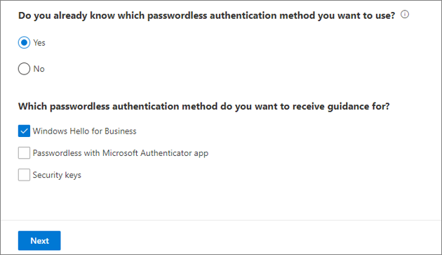
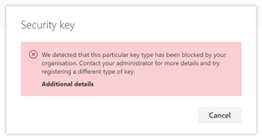
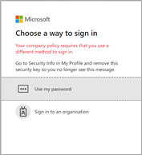
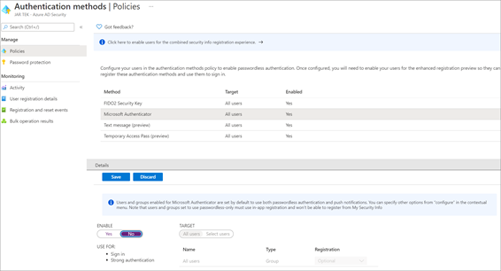
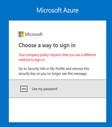
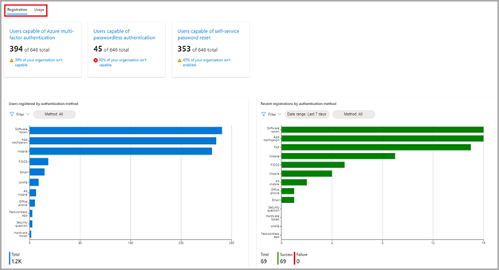
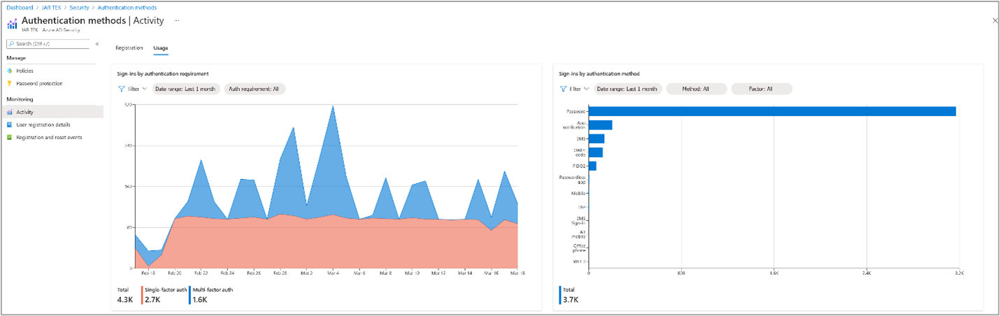
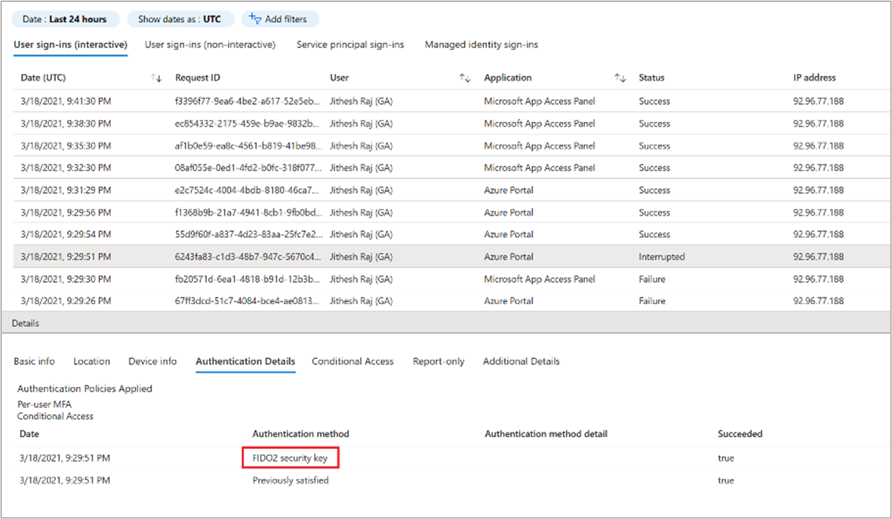

# Plan a passwordless authentication deployment in Microsoft Entra ID

Passwords are a primary attack vector. Bad actors use social engineering, phishing, and spray attacks to compromise passwords. A passwordless authentication strategy mitigates the risk of these attacks.

Microsoft offers the following [three passwordless authentication options](concept-authentication-passwordless.md) that integrate with Microsoft Entra ID:

* [Microsoft Authenticator](./concept-authentication-passwordless.md#microsoft-authenticator) - turns any iOS or Android phone into a strong, passwordless credential by allowing users to sign into any platform or browser.

* [FIDO2-compliant security keys](./concept-authentication-passwordless.md#fido2-security-keys) - useful for users who sign in to shared machines like kiosks, in situations where use of phones is restricted, and for highly privileged identities. 

* [Windows Hello for Business](./concept-authentication-passwordless.md#windows-hello-for-business) - best for users on their dedicated Windows computers. 

> [!NOTE]
> To create an offline version of this plan with all links, use your browsers print to pdf functionality.

## Use the passwordless methods wizard

The [Microsoft Entra admin center](https://entra.microsoft.com) has a passwordless methods wizard that will help you to select the appropriate method for each of your audiences. If you haven't yet determined the appropriate methods, see [https://aka.ms/passwordlesswizard](https://aka.ms/passwordlesswizard), then return to this article to continue planning for your selected methods. **You need administrator rights to access this wizard.**

## Passwordless authentication scenarios

Microsoft's passwordless authentication methods enable many scenarios. Consider your organizational needs, prerequisites, and the capabilities of each authentication method to select your passwordless authentication strategy. 

The following table lists the passwordless authentication methods by device types. Our recommendations are in ***bold italics***.

| Device types| Passwordless authentication method |
| - | - |
| Dedicated non-windows devices| <li> ***Microsoft Authenticator*** <li> Security keys |
| Dedicated Windows 10 computers (version 1703 and later)| <li> ***Windows Hello for Business*** <li> Security keys |
| Dedicated Windows 10 computers (before version 1703)| <li> ***Windows Hello for Business*** <li> Microsoft Authenticator app |
| Shared devices: tablets, and mobile devices| <li> ***Microsoft Authenticator*** <li> One-time password sign-in |
| Kiosks (Legacy)| ***Microsoft Authenticator*** |
| Kiosks and shared computers ‎(Windows 10)| <li> ***Security keys*** <li> Microsoft Authenticator app |

## Prerequisites 

Ensure you meet the prerequisites before starting your passwordless deployment.

### Required roles

Here are the least privileged roles required for this deployment:

| Microsoft Entra role| Description |
| - | -|
| User Administrator or Global Administrator| To implement combined registration experience. |
| Authentication Administrator| To implement and manage authentication methods. |
| User| To configure Authenticator app on device, or to enroll security key device for web or Windows 10 sign-in. |

As part of this deployment plan, we recommend that passwordless authentication be enabled for all [privileged accounts](../privileged-identity-management/pim-configure.md).

### Microsoft Authenticator app and security keys

The prerequisites are determined by your selected passwordless authentication methods.

| Prerequisite| Microsoft Authenticator| FIDO2 Security Keys|
| - | -|-|
| [Combined registration for Microsoft Entra multifactor authentication and self-service password reset (SSPR)](howto-registration-mfa-sspr-combined.md) is enabled| √| √|
| [Users can perform Microsoft Entra multifactor authentication](howto-mfa-getstarted.md)| √| √|
| [Users have registered for Microsoft Entra multifactor authentication and SSPR](howto-registration-mfa-sspr-combined.md)| √| √|
| [Users have registered their mobile devices to Microsoft Entra ID](../devices/overview.md)| √| |
| Windows 10 version 1809 or higher using a supported browser like Microsoft Edge or Mozilla Firefox (version 67 or higher). Microsoft recommends version 1903 or higher for native support.| | √|
| Compatible security keys. Ensure that you're using a [Microsoft-tested and verified FIDO2 security key](concept-authentication-passwordless.md), or other compatible FIDO2 security key.| | √|

### Windows Hello for Business

The prerequisites and deployment paths for Windows Hello for Business are highly dependent on whether you're deploying in an on-premises, hybrid, or cloud-only configuration. It's also dependent on your device join strategy. 

Select Windows Hello for Business and [complete the wizard](https://aka.ms/passwordlesswizard) to determine the prerequisites and deployment appropriate for your organization.

The wizard will use your inputs to craft a step-by-step plan for you to follow.

## Plan the project

When technology projects fail, it's typically because of mismatched expectations on impact, outcomes, and responsibilities. To avoid these pitfalls, [ensure that you're engaging the right stakeholders](../architecture/deployment-plans.md) and that stakeholder roles in the project are well understood.

### Plan a pilot

When you deploy passwordless authentication, you should first enable one or more pilot groups. You can create groups specifically for this purpose. Add the users who will participate in the pilot to the groups. Then, enable new passwordless authentication methods for the selected groups. See [best practices for a pilot](../architecture/deployment-plans.md).

### Plan communications

Your communications to end users should include the following information:

* [Guidance on combined registration for both Microsoft Entra multifactor authentication and SSPR](howto-registration-mfa-sspr-combined.md)

* [Downloading Microsoft Authenticator](https://support.microsoft.com/account-billing/download-and-install-the-microsoft-authenticator-app-351498fc-850a-45da-b7b6-27e523b8702a)

* [Registering in Microsoft Authenticator](howto-authentication-passwordless-phone.md)

* [Signing in with your phone](https://support.microsoft.com/account-billing/sign-in-to-your-accounts-using-the-microsoft-authenticator-app-582bdc07-4566-4c97-a7aa-56058122714c)

Microsoft provides communication templates for end users. Download the [authentication rollout material](https://aka.ms/MFAtemplates) to help draft your communications. The rollout materials include customizable posters and email templates that you can use to inform your users about upcoming passwordless authentication options in your organization.

## Plan user registration

Users register their passwordless method as a part of the **combined security information workflow** at [https://aka.ms/mysecurityinfo](https://aka.ms/mysecurityinfo). Microsoft Entra logs registration of security keys and the Authenticator app, and any other changes to the authentication methods. 

For the first-time user who doesn't have a password, admins can provide a [Temporary Access Passcode](howto-authentication-temporary-access-pass.md) to register their security information in [https://aka.ms/mysecurityinfo](https://aka.ms/mysecurityinfo) . This is a time-limited passcode and satisfies strong authentication requirements. **Temporary Access Pass is a per-user process**.

This method can also be used for easy recovery when the user has lost or forgotten their authentication factor such as security key or the Authenticator app but needs to sign in to **register a new strong authentication method**. 

>[!NOTE] 
> If you can't use the security key or the Authenticator app for some scenarios, multifactor authentication with a username and password along with another registered method can be used as a fallback option.

## Plan for and deploy Microsoft Authenticator

[Microsoft Authenticator](concept-authentication-passwordless.md) turns any iOS or Android phone into a strong, passwordless credential. It's a free download from Google Play or the Apple App Store. Have users [download Microsoft Authenticator](https://support.microsoft.com/account-billing/download-and-install-the-microsoft-authenticator-app-351498fc-850a-45da-b7b6-27e523b8702a) and follow the directions to enable phone sign-in.

### Technical considerations

**Active Directory Federation Services (AD FS) Integration** - When a user enables the Authenticator passwordless credential, authentication for that user defaults to sending a notification for approval. Users in a hybrid tenant are prevented from being directed to AD FS for sign-in unless they select "Use your password instead." This process also bypasses any on-premises Conditional Access policies, and pass-through authentication (PTA) flows. However, if a login_hint is specified, the user is forwarded to AD FS and bypasses the option to use the passwordless credential. For non-Microsoft 365 applications which use AD FS for authentication, Microsoft Entra Conditional Access policies will not be applied and you will need to set up access control policies within AD FS.

**MFA server** - End users enabled for multifactor authentication through an organization's on-premises MFA server can create and use a single passwordless phone sign-in credential. If the user attempts to upgrade multiple installations (5 or more) of the Authenticator app with the credential, this change may result in an error.

> [!IMPORTANT]
> In September 2022, Microsoft announced deprecation of Azure Multi-Factor Authentication Server. Beginning September 30, 2024, Azure Multi-Factor Authentication Server deployments will no longer service multifactor authentication requests, which could cause authentications to fail for your organization. To ensure uninterrupted authentication services and to remain in a supported state, organizations should [migrate their users' authentication data](how-to-migrate-mfa-server-to-mfa-user-authentication.md) to the cloud-based Azure MFA service by using the latest Migration Utility included in the most recent [Azure MFA Server update](https://www.microsoft.com/download/details.aspx?id=55849). For more information, see [Azure MFA Server Migration](how-to-migrate-mfa-server-to-azure-mfa.md).

**Device registration** - To use the Authenticator app for passwordless authentication, the device must be registered in the Microsoft Entra tenant and can't be a shared device. A device can only be registered in a single tenant. This limit means that only one work or school account is supported for phone sign-in using the Authenticator app.

### Deploy phone sign-in with the Authenticator app

Follow the steps in the article, [Enable passwordless sign-in with Microsoft Authenticator](howto-authentication-passwordless-phone.md) to enable the Authenticator app as a passwordless authentication method in your organization.

### Testing Authenticator app

The following are sample test cases for passwordless authentication with the Authenticator app:

| Scenario| Expected results |
| - |-|
| User can register the Authenticator app.| User can register app from https://aka.ms/mysecurityinfo. |
| User can enable phone sign-in| Phone sign-in configured for work account. |
| User can access an app with phone sign-in.| User goes through phone sign-in flow and reaches application. |
| Test rolling back phone sign-in registration by turning off passwordless sign-in in the Authenticator app. Do this within the Authentication methods screen in the [Microsoft Entra admin center](https://entra.microsoft.com)| Previously enabled users unable to use passwordless sign-in from the Authenticator app. |
| Removing phone sign-in from the Authenticator app| Work account no longer available on the Authenticator app. |

### Troubleshoot phone sign-in

| Scenario| Solution |
| - |-|
| User cannot perform combined registration.| Ensure [combined registration](concept-registration-mfa-sspr-combined.md) is enabled. |
| User cannot enable phone sign-in authenticator app.| Ensure user is in scope for deployment. |
| User is NOT in scope for passwordless authentication, but is presented with passwordless sign-in option, which they cannot complete.| Occurs when user has enabled phone sign in in the application prior to the policy being created. To enable sign in, add the user to a group of users enabled for passwordless sign-in. To block sign in: have the user remove their credential from that application. |

## Plan for and deploy FIDO2-compliant security keys

Enable compatible security keys. Here is a list of [FIDO2 security key providers](concept-authentication-passwordless.md) that provide keys known to be compatible with the passwordless experience.

### Plan security key lifecycle

Prepare for and plan the key lifecycle.

**Key distribution**- Plan how to provision keys to your organization. You may have a centralized provisioning process or allow end users to purchase FIDO 2.0-compatible keys.

 **Key activation** - End users must self-activate the security key. End users register their security keys at [https://aka.ms/mysecurityinfo](https://aka.ms/mysecurityinfo) and enable the second factor (PIN or biometric) at first use. For first-time users, they can use TAP to register their security information.

 **Disabling a key** - If an administrator wishes to remove a FIDO2 key associated with a User Account, they can do so by deleting the key from the user's authentication method as shown below. For more information, see [Disable a key](howto-authentication-passwordless-security-key.md#disable-a-key)

 

**Issue a new key**: User can register the new FIDO2 key by going to [https://aka.ms/mysecurityinfo](https://aka.ms/mysecurityinfo) 

### Technical considerations

There are three types of passwordless sign-in deployments available with security keys:

* Microsoft Entra web apps on a supported browser

* Microsoft Entra joined Windows 10 devices

* Microsoft Entra hybrid joined Windows 10 devices 

  * Provides access to both cloud-based and on premises resources. For more information about access to on-premises resources, see [SSO to on-premises resources using FIDO2 keys](howto-authentication-passwordless-security-key-on-premises.md)

**For Microsoft Entra web apps and Microsoft Entra joined Windows devices**, use:

* Windows 10 version 1809 or higher using a supported browser like Microsoft Edge or Mozilla Firefox (version 67 or higher).

* Windows 10 version 1809 supports FIDO2 sign-in and may require software from the FIDO2 key manufacturer to be deployed. We recommend you use version 1903 or later.

**For hybrid Microsoft Entra domain joined devices**, use: 

* Windows 10 version 2004 or later. 

* Fully patched domain servers running Windows Server 2016 or 2019. 

* Latest version of Microsoft Entra Connect.

#### Enable Windows 10 support

Enabling Windows 10 sign-in using FIDO2 security keys requires you to enable the credential provider functionality in Windows 10. Choose one of the following:

* [Enable credential provider with Microsoft Intune](howto-authentication-passwordless-security-key-windows.md)

  * We recommend Microsoft Intune deployment.

* [Enable credential provider with a provisioning package](howto-authentication-passwordless-security-key-windows.md)

  * If Microsoft Intune deployment isn't possible, administrators must deploy a package on each machine to enable the credential provider functionality. The package installation can be carried out by one of the following options:
    * Group Policy or Configuration Manager
    * Local installation on a Windows 10 machine

* [Enable credential provider with Group Policy](howto-authentication-passwordless-security-key-windows.md)

   * Only supported for Microsoft Entra hybrid joined devices.

#### Enable on-premises integration

Follow the steps in the article [Enable passwordless security key sign in to on-premises resources (preview)](howto-authentication-passwordless-security-key-on-premises.md).

> [!IMPORTANT] 
> These steps must also be completed for any Microsoft Entra hybrid joined devices to utilize FIDO2 security keys for Windows 10 sign-in.

### Key restrictions policy

When you deploy the security key, you can optionally restrict the use of FIDO2 keys only to specific manufacturers that have been approved by your organization. Restricting keys requires the Authenticator Attestation GUID (AAGUID). [There are two ways to get your AAGUID](howto-authentication-passwordless-security-key.md#security-key-authenticator-attestation-guid-aaguid).

If the security key is restricted, and the user tries to register the FIDO2 security key, they receive the following error:

If the AAGUID is restricted after the user has registered the security key, they see the following message:

*FIDO2 key blocked by Key Restriction Policy

### Deploy FIDO2 security key sign-in

Follow the steps in the article [Enable passwordless security key sign-in](howto-authentication-passwordless-security-key.md) to enable FIDO2 security key as a passwordless authentication method in your organization. 

### Testing security keys

Here are the sample test cases for passwordless authentication with security keys.

#### Passwordless FIDO sign in to Microsoft Entra joined Windows 10 devices

| Scenario (Windows build)| Expected results |
| - |-|
| The user can register FIDO2 device (1809)| User can register FIDO2 device using at Settings > Accounts > sign in options > Security Key |
| The user can reset FIDO2 device (1809)| User can reset FIDO2 device using manufacturer software |
| The user can sign in with FIDO2 device (1809)| User can select Security Key from the sign-in window, and successfully sign in. |
| The user can register FIDO2 device (1903)| User can register FIDO2 device at Settings > Accounts > sign in options > Security Key |
| The user can reset FIDO2 device (1903)| User can reset FIDO2 device at Settings > Accounts > sign in options > Security Key |
| The user can sign in with FIDO2 device (1903)| User can select Security Key from the sign-in window, and successfully sign in. |

#### Passwordless FIDO sign-in to Microsoft Entra web apps

| Scenario| Expected results |
| - |-|
| The user can register FIDO2 device at aka.ms/mysecurityinfo using Microsoft Edge| Registration should succeed |
| The user can register FIDO2 device at aka.ms/mysecurityinfo using Firefox| Registration should succeed |
| The user can sign in to OneDrive online using FIDO2 device using Microsoft Edge| Sign-in should succeed |
| The user can sign in to OneDrive online using FIDO2 device using Firefox| Sign-in should succeed |
| Test rolling back FIDO2 device registration by turning off FIDO2 Security Keys within the Authentication method window in the [Microsoft Entra admin center](https://entra.microsoft.com)| Users will: <li> be prompted to sign in using their security key <li> successfully sign in and see an error: "Your company policy requires that you use a different method to sign in". <li>be able to select a different method and successfully sign in. Close the window and sign in again to verify they do not see the same error message. |

### Troubleshoot security key sign-in

| Scenario| Solution |
| - | -|
| User can't perform combined registration.| Ensure [combined registration](concept-registration-mfa-sspr-combined.md) is enabled. |
| User can't add a security key in their [security settings](https://aka.ms/mysecurityinfo).| Ensure that [security keys](howto-authentication-passwordless-security-key.md) are enabled. |
| User can't add security key in Windows 10 sign-in options.| [Ensure that security keys for Windows sign in](concept-authentication-passwordless.md) are enabled |
| **Error message**: We detected that this browser or OS doesn't support FIDO2 security keys.| Passwordless FIDO2 security devices can only be registered in supported browsers (Microsoft Edge, Firefox version 67) on Windows 10 version 1809 or higher. |
| **Error message**: Your company policy requires that you use a different method to sign in.| Ensure security keys are enabled in the tenant. |
| User unable to manage my security key on Windows 10 version 1809| Version 1809 requires that you use the security key management software provided by the FIDO2 key vendor. Contact the vendor for support. |
| I think my FIDO2 security key may be defective—how can I test it.| Navigate to [https://webauthntest.azurewebsites.net/](https://webauthntest.azurewebsites.net/), enter credentials for a test account, plug in the suspect security key, select the + button at the top right of the screen, select create, and go through the creation process. If this scenario fails, your device may be defective. |

## Manage passwordless authentication

To manage your user's passwordless authentication methods in the [Microsoft Entra admin center](https://entra.microsoft.com), select your user account, and then select Authentication methods.

### Microsoft Graph APIs 

You can also manage the passwordless authentication methods using the authentication methods API in Microsoft Graph. For example:

* You can retrieve details of a user's FIDO2 Security Key and delete it if the user has lost the key.

* You can retrieve details of a user's Authenticator app registration and delete it if the user has lost the phone.

* Manage your authentication method policies for security keys and the Authenticator app.

For more information on what authentication methods can be managed in Microsoft Graph, see [Microsoft Entra authentication methods API overview](/graph/api/resources/authenticationmethods-overview).

### Rollback

[!INCLUDE [portal updates](~/articles/active-directory/includes/portal-update.md)]

Though passwordless authentication is a lightweight feature with minimal impact on end users, it may be necessary to roll back.

Rolling back requires the administrator to sign in to the [Microsoft Entra admin center](https://entra.microsoft.com), select the desired strong authentication methods, and change the enable option to No. This process turns off the passwordless functionality for all users.

Users who have already registered FIDO2 security devices are prompted to use the security device at their next sign-in, and then see the following error:

### Reporting and monitoring

Microsoft Entra ID has reports that provide technical and business insights. Have your business and technical application owners assume ownership of and consume these reports based on your organization's requirements.

The following table provides some examples of typical reporting scenarios:

| Manage risk| Increase productivity| Governance and compliance| other|
|-|-|-|-|
| Report types| Authentication methods- users registered for combined security registration| Authentication methods – users registered for app notification| Sign-ins: review who is accessing the tenant and how |
| Potential actions| Target users not yet registered| Drive adoption of the Authenticator app or security keys| Revoke access or enforce additional security policies for admins |

#### Track usage and insights

Microsoft Entra ID adds entries to the audit logs when:

* An admin makes changes in the Authentication methods section.

* A user makes any kind of change to their credentials within Microsoft Entra ID.

* A user enables or disables their account on a security key or resets the second factor for the security key on their Win 10 machine. See event IDs: 4670 and 5382.

**Microsoft Entra ID keeps most auditing data for 30 days** and makes the data available by using the [Microsoft Entra admin center](https://entra.microsoft.com) or API for you to download into your analysis systems. If you require longer retention, export and consume logs in a SIEM tool such as [Microsoft Sentinel](/azure/sentinel/connect-azure-active-directory), Splunk, or Sumo Logic. We recommend longer retention for auditing, trend analysis, and other business needs as applicable

There are two tabs in the Authentication methods activity dashboard - Registration and Usage.

The **Registration** tab shows the number of users capable of passwordless authentication as well as other authentication methods. This tab displays two graphs:

* Users registered by authentication method.

* Recent registration by authentication method.

The **Usage** tab shows the sign-ins by authentication method.

For more information, see [track registered authentication methods and usage across the Microsoft Entra organization](howto-authentication-methods-activity.md).

#### Sign-in activity reports

Use the [sign-in activity report](../reports-monitoring/concept-sign-ins.md) to track the authentication methods used to sign in to the various applications. 

Select the user row, and then select the **Authentication Details** tab to view which authentication method was used for which sign-in activity.

## Next steps

* [Learn how passwordless authentication works](concept-authentication-passwordless.md)

* [Deploy other identity features](../architecture/deployment-plans.md)
