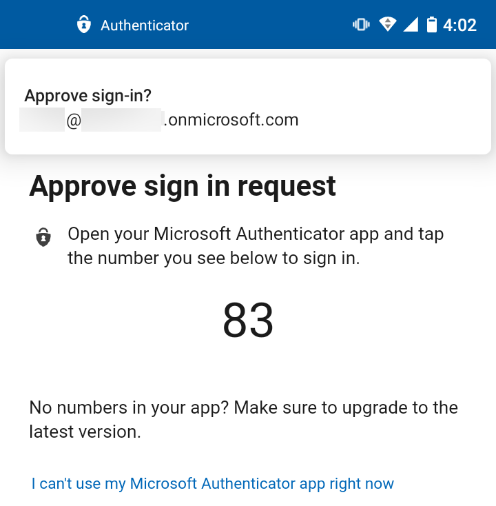

# Enable passwordless sign-in with the Microsoft Authenticator app (preview)

The Microsoft Authenticator app can be used to sign in to any Azure AD account without using a password. Similar to the technology of [Windows Hello for Business](/windows/security/identity-protection/hello-for-business/hello-identity-verification), the Microsoft Authenticator uses key-based authentication to enable a user credential that is tied to a device and uses a biometric or PIN. This authentication method can be used on any device platform, including mobile, and with any app or website that integrates with Microsoft Authentication Libraries.

Instead of seeing a prompt for a password after entering a username, a person who has enabled phone sign in from the Microsoft Authenticator app sees a message that asks them to tap a number in their app. To complete the sign-in process in the app, the user must match the number, choose **Approve**, then provide their PIN or biometric.

## Prerequisites

To use passwordless phone sign-in with the Microsoft Authenticator app, the following prerequisites must be met:

- Azure Multi-Factor Authentication, with push notifications allowed as a verification method.
- Latest version of Microsoft Authenticator installed on devices running iOS 8.0 or greater, or Android 6.0 or greater.

> [!NOTE]
> If you enabled Microsoft Authenticator app passwordless sign-in preview using Azure AD PowerShell, it was enabled for your entire directory. If you enable using this new method, it supercedes the PowerShell policy. We recommend you enable for all users in your tenant via the new *Authentication Methods* menu, otherwise users not in the new policy are no longer be able to sign in without a password.

## Enable passwordless authentication methods

To use passwordless authentication in Azure AD, first enable the combined registration experience, then enable users for the password less method.

### Enable the combined registration experience

Registration features for passwordless authentication methods rely on the combined registration feature. To let users complete the combined registration themselves, follow the steps to [enable combined security information registration](howto-registration-mfa-sspr-combined.md).

### Enable passwordless phone sign-in authentication methods

Azure AD lets you choose which authentication methods can be used during the sign-in process. Users then register for the methods they'd like to use.

To enable the authentication method for passwordless phone sign-in, complete the following steps:

1. Sign in to the [Azure portal](https://portal.azure.com) with a *global administrator* account.
1. Search for and select *Azure Active Directory*, then browse to **Security** > **Authentication methods** > **Authentication method policy (Preview)**
1. Under **Passwordless phone sign-in**, choose the following options:
   1. **Enable** - Yes or No
   1. **Target** - All users or Select users
1. To apply the new policy, select **Save**.

## User registration and management of Microsoft Authenticator app

With the passwordless authentication method available for use in Azure AD, users must now register themselves for the passwordless authentication method using the following steps:

1. Browse to [https://aka.ms/mysecurityinfo](https://aka.ms/mysecurityinfo).
1. Sign in, then add the Authenticator app by selecting **Add method > Authenticator app**, then **Add**.
1. Follow the instructions to install and configure the Microsoft Authenticator app on your device.
1. Select **Done** to complete Authenticator configuration.
1. In **Microsoft Authenticator** app, choose **Enable phone sign-in** from the drop-down menu for the account registered.
1. Follow the instructions in the app to finish registering the account for passwordless phone sign-in.

Organizations can direct their users to [Sign in with your phone, not your password](../user-help/user-help-auth-app-sign-in.md) for further assistance configuring the Microsoft Authenticator app and enabling phone sign-in.

> [!NOTE]
> Users who aren't allowed by policy to use phone sign-in are no longer able to enable it within the Microsoft Authenticator app.  

## Sign in with passwordless credential

A user can start to use passwordless sign-in once an admin has enabled their tenant and the user has updated their Microsoft Authenticator app to enable phone sign-in.

To start using phone sign-in, after typing a username at the sign-in page and selecting **Next**, users may have to select **Other ways to sign in**, then **Approve a request on my Microsoft Authenticator app**. Users are then presented with a number and are prompted in their Microsoft Authenticator app to select the appropriate number to authenticate instead of using their password. Once users have used passwordless phone sign-in, they're prompted to use it again, until they use choose another method.

## Known Issues

The following known issues exist in the current preview experience.

### Not seeing option for passwordless phone sign-in

If a user has an unanswered passwordless phone sign-in verification pending and attempts to sign in again, the user may only see an option to enter a password instead. Open the Microsoft Authenticator and respond to any notification prompts to continue to use passwordless phone sign-in.

### Federated Accounts

When a user has enabled any passwordless credential, Azure AD logins will stop using login_hint to accelerate the user to a federated login location. This logic prevents users in a hybrid tenant from being directed to AD FS for sign-in verification without the user taking an additional step to click "Use your password instead."

### Azure MFA server

End users who are enabled for MFA through an organization's on-premises Azure MFA server can still create and use a single passwordless phone sign-in credential. If the user attempts to upgrade multiple installations (5+) of the Microsoft Authenticator with the credential, this change may result in an error.  

### Device registration

One of the prerequisites to create this new strong credential, is that the device, where the Microsoft Authenticator app is installed, must also be registered within the Azure AD tenant to an individual user. Due to current device registration restrictions, a device can only be registered in a single tenant. This limit means that only one work or school account in the Microsoft Authenticator app can be enabled for phone sign-in.

> [!NOTE]
> Device registration is not the same as device management or "MDM." It only associates a device ID and a user ID together in the Azure AD directory.  

## Next steps

To learn about Azure AD authentication and passwordless methods, see the following articles:

* [Learn how passwordless authentication works](concept-authentication-passwordless.md)
* [Learn about device registration](../devices/overview.md#getting-devices-in-azure-ad)
* [Learn about Azure Multi-Factor Authentication](../authentication/howto-mfa-getstarted.md)
