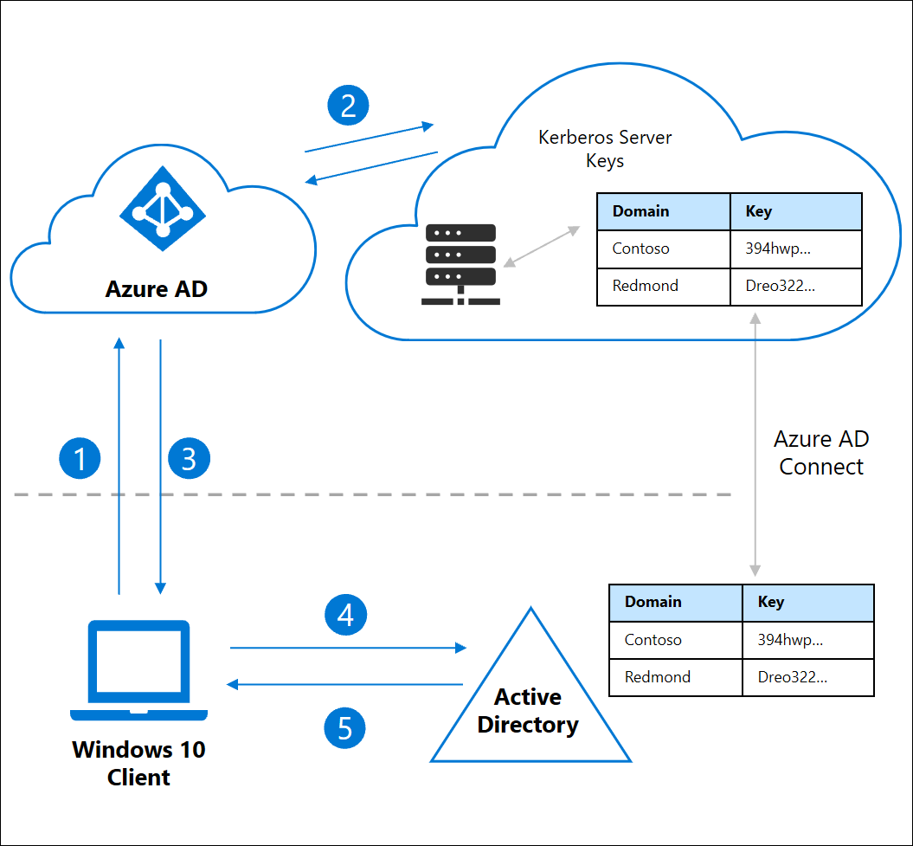

# Enable passwordless security key sign-in to on-premises resources with Azure Active Directory (preview)

This document focuses on enabling passwordless authentication to on-premises resources for environments with both **Azure AD joined** and **hybrid Azure AD joined** Windows 10 devices. This functionality provides seamless single sign-on (SSO) to on-premises resources using Microsoft-compatible security keys.

> [!NOTE]
> FIDO2 security keys are a public preview feature of Azure Active Directory. For more information about previews, see [Supplemental Terms of Use for Microsoft Azure Previews](https://azure.microsoft.com/support/legal/preview-supplemental-terms/).

## SSO to on-premises resources using FIDO2 keys

Azure Active Directory (AD) can issue Kerberos Ticket Granting Tickets (TGTs) for one or more of your Active Directory domains. This functionality allows users to sign into Windows with modern credentials like FIDO2 security keys and access traditional Active Directory based resources. Kerberos Service Tickets and authorization continue to be controlled by your on-premises Active Directory domain controllers.

An Azure AD Kerberos Server object is created in your on-premises Active Directory and then securely published to Azure Active Directory. The object isn't associated with any physical servers. It's simply a resource that can be used by Azure Active Directory to generate Kerberos TGTs for your Active Directory Domain.



1. User signs in to their Windows 10 device with a FIDO2 security key and authenticates to Azure AD.
1. Azure AD checks the directory for a Kerberos server key matching the user's on-premises AD domain.
   1. Azure AD generates a Kerberos TGT for the user's on-premises AD domain. The TGT only includes the user's SID. No authorization data is included in the TGT.
1. The TGT is returned to the client along with their Azure AD Primary Refresh Token (PRT).
1. The client machine contacts an on-premises AD domain controller and trades the partial TGT for a fully formed TGT.
1. The client machine now has an Azure AD PRT and a full Active Directory TGT and can access both cloud and on-premises resources.

## Requirements

Organizations must complete the steps to [Enable passwordless security key sign to Windows 10 devices (preview)](howto-authentication-passwordless-security-key.md) before completing the steps in this article.

Organizations must also meet the following software requirements.

- Devices must be running Windows 10 Insider Build 18945 or newer.
- You must have version 1.4.32.0 or later of [Azure AD Connect](../hybrid/how-to-connect-install-roadmap.md#install-azure-ad-connect).
  - For more information on the available Azure AD hybrid authentication options, see [Choose the right authentication method for your Azure Active Directory hybrid identity solution](../../security/fundamentals/choose-ad-authn.md) and [Select which installation type to use for Azure AD Connect](../hybrid/how-to-connect-install-select-installation.md).
- Your Windows Server domain controllers must have the following patches installed:
    - For Windows Server 2016 - https://support.microsoft.com/help/4534307/windows-10-update-kb4534307
    - For Windows Server 2019 - https://support.microsoft.com/help/4534321/windows-10-update-kb4534321

### Supported scenarios

The scenario supports single sign-on (SSO) in both of the following scenarios:

- For cloud resources like Office 365 and other SAML enabled applications.
- For on-premises resources, and Windows-Integrated authentication to web sites. The resources can include web sites and SharePoint sites that require IIS Authentication, and / or resources that use NTLM authentication.

### Unsupported scenarios

The following scenarios aren't supported:

- Windows Server Active Directory Domain Services (AD DS) domain joined (on-premises only devices) deployment.
- RDP, VDI, and Citrix scenarios using a security key.
- S/MIME using a security key.
- "Run as" using a security key.
- Log in to a server using security key.

## Create Kerberos server object

Administrators use PowerShell tools from their Azure AD Connect server to create an Azure AD Kerberos Server object in their on-premises directory. Run the following steps in each domain and forest in your organization that contain Azure AD users:

1. Upgrade to the latest version of Azure AD Connect. The instructions assume you have already configured Azure AD Connect to support your hybrid environment.
1. On the Azure AD Connect Server, open an elevated PowerShell prompt, and navigate to `C:\Program Files\Microsoft Azure Active Directory Connect\AzureADKerberos\`
1. Run the following PowerShell commands to create a new Azure AD Kerberos server object in both your on-premises Active Directory domain and Azure Active Directory tenant.

> [!NOTE]
> Replace `contoso.corp.com` in the following example with your on-premises Active Directory domain name.

```powerShell
Import-Module ".\AzureAdKerberos.psd1"

# Specify the on-premises Active Directory domain. A new Azure AD
# Kerberos Server object will be created in this Active Directory domain.
$domain = "contoso.corp.com"

# Enter an Azure Active Directory global administrator username and password.
$cloudCred = Get-Credential

# Enter a domain administrator username and password.
$domainCred = Get-Credential

# Create the new Azure AD Kerberos Server object in Active Directory
# and then publish it to Azure Active Directory.
Set-AzureADKerberosServer -Domain $domain -CloudCredential $cloudCred -DomainCredential $domainCred
```

### Viewing and verifying the Azure AD Kerberos Server

You can view and verify the newly created Azure AD Kerberos Server using the following command:

```powerShell
Get-AzureADKerberosServer -Domain $domain -CloudCredential $cloudCred -DomainCredential $domainCred
```

This command outputs the properties of the Azure AD Kerberos Server. You can review the properties to verify that everything is in good order.

| Property | Description |
| --- | --- |
| ID | The unique ID of the AD DS DC object. This ID is sometimes referred to as it's "slot" or it's "branch ID". |
| DomainDnsName | The DNS domain name of the Active Directory Domain. |
| ComputerAccount | The computer account object of the Azure AD Kerberos Server object (the DC). |
| UserAccount | The disabled user account object that holds the Azure AD Kerberos Server TGT encryption key. The DN of this account is `CN=krbtgt_AzureAD,CN=Users,<Domain-DN>` |
| KeyVersion | The key version of the Azure AD Kerberos Server TGT encryption key. The version is assigned when the key is created. The version is then incremented every time the key is rotated. The increments are based on replication meta-data and likely greater than one. For example, the initial *KeyVersion* could be *192272*. The first time the key is rotated, the version could advance to *212621*. The important thing to verify is that the *KeyVersion* for the on-premises object and the *CloudKeyVersion* for the cloud object are the same. |
| KeyUpdatedOn | The date and time that the Azure AD Kerberos Server TGT encryption key was updated or created. |
| KeyUpdatedFrom | The DC where the Azure AD Kerberos Server TGT encryption key was last updated. |
| CloudId | The ID from the Azure AD Object. Must match the ID above. |
| CloudDomainDnsName | The *DomainDnsName* from the Azure AD Object. Must match the *DomainDnsName* above. |
| CloudKeyVersion | The *KeyVersion* from the Azure AD Object. Must match the *KeyVersion* above. |
| CloudKeyUpdatedOn | The *KeyUpdatedOn* from the Azure AD Object. Must match the *KeyUpdatedOn* above. |

### Rotating the Azure AD Kerberos Server key

The Azure AD Kerberos Server encryption krbtgt keys should be rotated on a regular basis. It's recommended that you follow the same schedule you use to rotate all other Active Directory Domain Controller krbtgt keys.

> [!WARNING]
> There are other tools that could rotate the krbtgt keys, however, you must use the tools mentioned in this document to rotate the krbtgt keys of your Azure AD Kerberos Server. This ensures the keys are updated in both on-premises AD and Azure AD.

```powerShell
Set-AzureADKerberosServer -Domain $domain -CloudCredential $cloudCred -DomainCredential $domainCred -RotateServerKey
```

### Removing the Azure AD Kerberos Server

If you'd like to revert the scenario and remove the Azure AD Kerberos Server from both on-premises Active Directory and Azure Active Directory, run the following command:

```powerShell
Remove-AzureADKerberosServer -Domain $domain -CloudCredential $cloudCred -DomainCredential $domainCred
```

### Multi-forest and multi-domain scenarios

The Azure AD Kerberos server object is represented in Azure AD as a *KerberosDomain* object. Each on-premises Active Directory domain is represented as a single *KerberosDomain* object in Azure AD.

For example, your organization has an Active Directory forest with two domains, `contoso.com` and `fabrikam.com`. If you choose to allow Azure AD to issue Kerberos TGTs for the entire forest, there are two *KerberosDomain* objects in Azure AD. One *KerberosDomain* object for `contoso.com`, and one for `fabrikam.com`. If you have multiple Active Directory forests, there is one *KerberosDomain* object for each domain in each forest.

You need to run the steps to [Create Kerberos server object](#create-kerberos-server-object) in each domain and forest in your organization that contain Azure AD users.

## Known behavior

Sign in with FIDO is blocked if your password has expired. The expectation is for user to reset their password before being able to log in using FIDO.

## Troubleshooting and feedback

If you'd like to share feedback or encounter issues while previewing this feature, share via the Windows Feedback Hub app using the following steps:

1. Launch **Feedback Hub** and make sure you're signed in.
1. Submit feedback under the following categorization:
   - Category: Security and Privacy
   - Subcategory: FIDO
1. To capture logs, use the option to **Recreate my Problem**

## Frequently asked questions

### Does this work in my on-premises environment?

This feature doesn't work for a pure on-premises Active Directory Domain Services (AD DS) environment.

### My organization requires two factor authentication to access resources. What can I do to support this requirement?

Security keys come in a variety of form factors. Contact the device manufacturer of interest to discuss how their devices can be enabled with a PIN or biometric as a second factor.

### Can admins set up security keys?

We are working on this capability for general availability (GA) of this feature.

### Where can I go to find compliant Security Keys?

[FIDO2 security keys](concept-authentication-passwordless.md#fido2-security-keys)

### What do I do if I lose my security key?

You can remove keys from the Azure portal by navigating to the **Security info** page and removing the security key.

### I'm not able to use FIDO immediately after I create a hybrid Azure AD joined machine

If clean installing a hybrid Azure AD joined machine, after the domain join and restart process you must sign in with a password and wait for policy to sync before being able to use FIDO to sign in.

- Check your current status by typing `dsregcmd /status` into a command window and check that both *AzureAdJoined* and *DomainJoined* are showing *YES*.
- This delay is a known limitation for domain joined devices and isn't FIDO-specific.

### I'm unable to get SSO to my NTLM network resource after signing in with FIDO and get a credential prompt

Make sure enough domain controllers are patched to respond in time to service your resource request. To check if you can see a domain controller that is running the feature, review the output of `nltest /dsgetdc:contoso /keylist /kdc`.

## Next steps

[Learn more about passwordless](concept-authentication-passwordless.md)
